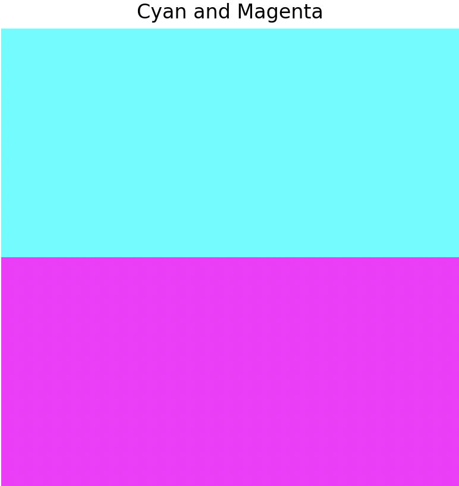

.. _module-1-1-1-color-basics:

=====================================
1.1.1 - Images as Arrays & RGB
=====================================

:Duration: 20-25 minutes
:Level: Beginner

Overview
========

Digital images are arrays of numbers. A single 4K image contains 26 million pixels. Three integers per pixel, each specifying the intensity of the red, green, and blue channels. Manipulating these arrays directly opens every technique from vintage photo filters to training convolutional networks.

**Learning Objectives**

By completing this module, you will:

* Understand that images are 2D arrays of numerical values (grayscale)
* Recognize the relationship between array values (0-255) and brightness
* Extend to 3D NumPy arrays with RGB channels for color images
* Create and manipulate colored images from scratch
* Grasp the additive color model and why computers use RGB

Quick Start: Your First Colorful Image
========================================

Let's start with something visual. Run this code to create a simple image:

.. code-block:: python
   :caption: Create a two-color image in seconds
   :linenos:
   
   import numpy as np
   from PIL import Image

   # Create a 200x200 image with 3 color channels (RGB)
   image = np.zeros((200, 200, 3), dtype=np.uint8)

   # Top half: cyan 
   image[:100, :, 1] = 255  # Green channel
   image[:100, :, 2] = 255  # Blue channel

   # Bottom half: magenta 
   image[100:, :, 0] = 255  # Red channel
   image[100:, :, 2] = 255  # Blue channel

   # Convert to PIL and display
   pil_image = Image.fromarray(image)
   pil_image.show()  # Opens in default image viewer
   pil_image.save('cyan_magenta.png')  # Save as PNG

   
   Cyan (top half) and magenta (bottom half)

.. tip::

    The shape of the image is `(200, 200, 3)`, respectively they are defined as  **(height, width, channels)**. The Channels dimension holds our red, green, and blue values. Height and width are the dimensions of the image, and channels are the number of color channels in the image.

Core Concept 1: Grayscale - The Foundation
==========================================

Before diving into color, let's understand the simplest form of digital images: grayscale.

**A grayscale image is a 2D grid of pixels, where each pixel has a brightness value** [Gonzalez2007]_:

* **0** = black (no light)
* **255** = white (maximum light)
* **128** = medium gray (half intensity)

View any digital photograph in grayscale, and you're looking at a 2D grid...

.. code-block:: python
   :caption: Creating a simple grayscale image

   import numpy as np
   from PIL import Image

   # Create a 200x200 array filled with medium gray
   array = np.zeros((200, 200), dtype=np.uint8)
   array += 128

   # PIL interprets 2D arrays as grayscale automaticall
   image = Image.fromarray(array)  
   image.save('gray.png')

The ``Image.fromarray()`` function from Pillow converts NumPy arrays into displayable images [PillowDocs]_.

.. figure:: /content/Module_00_foundations_definitions/0.3_images_as_data/0.3.1_creating_images/grayscale/lincoln.png
   :width: 700px
   :align: center
   :alt: Diagram showing how array values map to pixel brightness

   Array values directly map to pixel brightness: 0=black, 255=white, intermediate values=grays. Lincoln portrait digitized by Leon Harmon at Bell Labs (1973) [Harmon1973]_.

The ``uint8`` data type
-----------------------

The ``dtype=np.uint8`` parameter is required for image arrays [NumPyDocs]_:

* **u** = unsigned (no negative numbers)
* **int** = integer (whole numbers only)
* **8** = 8 bits per value (range: 0 to 255)

.. code-block:: python

   # Correct: uint8 for standard images
   array = np.zeros((100, 100), dtype=np.uint8)

   # Wrong: without dtype specification
   array = np.zeros((100, 100))   # Defaults to float64—PIL expects uint8 for 0-255 images
   #  PIL may misinterpret or reject float arrays

Array shape and coordinates
---------------------------

NumPy arrays use **[row, column]** indexing [NumPyDocs]_:

* **row** = y-coordinate (vertical position, 0 at top)
* **column** = x-coordinate (horizontal position, 0 at left)
* **Shape**: ``(height, width)`` where height (rows) comes first

.. code-block:: python

   array = np.zeros((200, 300), dtype=np.uint8)  # 200 tall, 300 wide

   # Set pixel at row 50, column 100 to white
   array[50, 100] = 255

   # Set bottom-right corner
   array[199, 299] = 128

.. tip::

   **Remember:** ``array[y, x]`` not ``array[x, y]``. NumPy uses row-major indexing matching mathematical matrix notation, where the first index selects the row and the second selects the column [NumPyDocs]_. This is opposite to the (x, y) convention used in many graphics systems.

Core Concept 2: Understanding Digital Images
=============================================

Now that you understand grayscale, let's extend to color images with RGB channels.

The fundamental insight
------------------------

**An RGB image is a 3D array of numbers.** Each number represents the intensity of light for one color channel at one pixel location. In Python using NumPy, an RGB image has shape `(height, width, 3)`. The three channels represent red, green, and blue intensities [Gonzalez2007]_. 

.. code-block:: python

   # RGB array: height × width × 3 channels
   image = np.zeros((100, 150, 3), dtype=np.uint8)
   # Shape: (height=100, width=150, channels=3)
   
   # Access a specific pixel's RGB values
   pixel = image[50, 75, :]  # Returns [R, G, B]
   
   # Access just the red channel
   red_channel = image[:, :, 0]

.. important::
   
   Array indexing uses `image[y, x, channel]`. Did you notice **y comes first** (row), then x (column)? This follows matrix notation, where the origin (0, 0) is at the **top-left corner**. 

.. admonition:: Technical Note: Display Subpixels

   This RGB encoding mirrors your display's physical structure. Each screen pixel contains three subpixels (red, green, blue) so small that your eye blends their light into perceived color [Wikipedia2024]_

Core Concept 3: The RGB Color Model
------------------------------------

RGB is an **additive color model**, meaning we start with darkness (black) and add colored light: 

* **Red (255, 0, 0)** -> Pure red light
* **Green (0, 255, 0)** -> Pure green light  
* **Blue (0, 0, 255)** -> Pure blue light
* **White (255, 255, 255)** -> All three at maximum
* **Black (0, 0, 0)** -> No light

Each channel stores values from **0 to 255** (8 bits = 256 possible values), giving us **16,777,216 total colors** (256³). This is called "24-bit true color" and exceeds the approximately 10 million colors the human eye can discriminate [Hunt2004]_, [Foley1990]_. 

.. figure:: rgb_additive_mixing_local.png
   :width: 500px
   :align: center
   :alt: Diagram showing RGB additive color mixing

   RGB additive color mixing: overlapping light creates secondary colors. Diagram generated with Claude - Opus 4.5

.. note::
   
   RGB is fundamentally different from mixing paint! Paint uses **subtractive color** (CMYK). You start with white paper and pigments *subtract* wavelengths by absorbing them. That's why mixing red and green **light** creates yellow, but mixing red and green **paint** creates brown [Hunt2004]_.

Common RGB color patterns
--------------------------

Understanding these patterns helps you think in RGB [Foley1990]_:

* **Primary colors**: One channel at 255, others at 0
* **Secondary colors**: Two channels at 255, one at 0
  - Cyan `(0, 255, 255)` = Green + Blue
  - Magenta `(255, 0, 255)` = Red + Blue
  - Yellow `(255, 255, 0)` = Red + Green
* **Grayscale**: All three channels equal `(N, N, N)`
* **Pastels**: High values across all channels (light colors)
* **Dark colors**: Low values across all channels

.. admonition:: Technical Note:
   
   The human eye has three types of cone cells for color vision, but they're NOT actually "red," "green," and "blue" receptors! The L-cones peak around 559nm (yellow-green), M-cones around 530nm (green), and S-cones around 420nm (blue-violet). RGB is a computational convenience that *approximately* matches this trichromatic vision system [Gonzalez2007]_, [Hunt2004]_.

Hands-On Exercises
==================

Now it is time to apply what you've learned with three progressively challenging exercises. Each builds on the previous one using the **Execute → Modify → Create** approach [Sweller1985]_, [Mayer2020]_. 

Exercise 1: Execute and explore
---------------------------------

Run the following code and observe the output. Try to predict what color you'll see before running it.

.. code-block:: python
   :caption: Exercise 1 — Solid color image
   :linenos:
   
   import numpy as np
   from PIL import Image

   # Create a 150x150 image
   image = np.zeros((150, 150, 3), dtype=np.uint8)

   # Set all pixels to the same color
   image[:, :, 0] = 255  # Red channel
   image[:, :, 1] = 128  # Green channel
   image[:, :, 2] = 0    # Blue channel

   # Convert to PIL and display
   pil_image = Image.fromarray(image)
   pil_image.show()
   pil_image.save('exercise1_color.png')

**Reflection questions:**

* What color appears? Why?
* What would happen if you set all three channels to 255?
* What would `(0, 0, 0)` look like?

.. dropdown:: Solution & Explanation
   
   **Answer:** Orange (or orange-red)
   
   **Why:** Red at maximum (255), green at half intensity (128), and blue absent (0) creates an orange hue. The color `(255, 128, 0)` sits between pure red `(255, 0, 0)` and yellow `(255, 255, 0)`. 
   
   * Setting all channels to 255 → **White** (all light)
   * Setting all channels to 0 → **Black** (no light)

Exercise 2: Modify to achieve goals
-------------------------------------

Modify the code from Exercise 1 to create each of these colors. Change only the three channel values.

**Goals:**

1. Create pure cyan (hint: which two colors of light make cyan?)
2. Create a medium gray
3. Create a dark purple

.. dropdown:: Solutions
   
   **1. Pure cyan:**
   
   .. code-block:: python
      
      image[:, :, 0] = 0    # Red: off
      image[:, :, 1] = 255  # Green: full
      image[:, :, 2] = 255  # Blue: full
      # Result: (0, 255, 255)
   
   Cyan is a **secondary color** formed by combining green and blue light.
   
   **2. Medium gray:**
   
   .. code-block:: python
      
      image[:, :, 0] = 128
      image[:, :, 1] = 128
      image[:, :, 2] = 128
      # Result: (128, 128, 128)
   
   Grayscale occurs when **all three channels are equal**. The value determines brightness.
   
   **3. Dark purple:**
   
   .. code-block:: python
      
      image[:, :, 0] = 64   # Red: low
      image[:, :, 1] = 0    # Green: off
      image[:, :, 2] = 96   # Blue: medium-low
      # Result: (64, 0, 96) or similar
   
   Purple combines red and blue. Keep values low for a dark shade. Try `(80, 0, 120)` for a slightly brighter purple.

Exercise 3: Create a gradient pattern
---------------------------------------

Now create something from scratch: a horizontal color gradient that transitions smoothly from one color to another.

**Goal:** Create a 200×200 image that transitions from pure red on the left to pure blue on the right.

**Hints:**

* Use a `for` loop to iterate over columns
* The red channel should decrease from left to right
* The blue channel should increase from left to right
* Calculate values proportionally: `value = column * 255 // width`

.. code-block:: python
   :caption: Exercise 3 starter code
   
   import numpy as np
   from PIL import Image

   # Create image
   height, width = 200, 200
   image = np.zeros((height, width, 3), dtype=np.uint8)

   # Your code here: fill the image with a gradient
   # Loop over columns and set red and blue channels

   # Convert to PIL and display
   pil_image = Image.fromarray(image)
   pil_image.show() 
   pil_image.save('gradient.png')

.. dropdown:: Complete Solution
   
   .. code-block:: python
      :caption: Red-to-blue horizontal gradient
      :linenos:
      :emphasize-lines: 10-12
      
      import numpy as np
      from PIL import Image

      # Create image
      height, width = 200, 200
      image = np.zeros((height, width, 3), dtype=np.uint8)

      # Create gradient from red (left) to blue (right)
      for col in range(width):
          image[:, col, 0] = 255 - (col * 255 // width)  # Red decreases
          image[:, col, 2] = col * 255 // width          # Blue increases
          # Green channel stays 0

      # Convert to PIL and display
      pil_image = Image.fromarray(image)
      pil_image.show() 
      pil_image.save('red_to_blue_gradient.png') 
   
   **How it works:**
   
   * `col * 255 // width` calculates a proportion: when `col=0` (left edge), value is 0; when `col=width-1` (right edge), value is ~255
   * Red channel: `255 - proportion` starts at 255 (left) and decreases to 0 (right)
   * Blue channel: `proportion` starts at 0 (left) and increases to 255 (right)
   * The result is a smooth transition through purples in the middle where red and blue overlap
   
   **Challenge extension:** Try creating a **vertical** gradient, or a gradient from yellow to cyan!

.. dropdown:: Challenge Extension: Diagonal Gradient

   Create a gradient that runs diagonally from **red at top-left** to **blue at bottom-right**.

   **Hints:**

   * You need to consider BOTH the row (y) and column (x) position
   * One approach: calculate a "progress" value based on ``(row + col) / (height + width - 2)``
   * Red should be maximum at (0,0) and minimum at (height-1, width-1)
   * Blue should be the opposite

   This extends the horizontal gradient by requiring you to think in two dimensions simultaneously.

.. figure:: /images/gradient_example.png
   :width: 400px
   :align: center
   :alt: Example red-to-blue gradient output
   
   Expected output: smooth gradient from red to blue

Summary
=======

In just 15-20 minutes, we've covered 3 of the core concepts of digital image representation: grayscale, RGB, and array indexing.

**Key takeaways:**

An RGB image is a 3D NumPy array with shape ``(height, width, 3)``. Each pixel holds three intensity values ranging from 0 to 255, one per color channel, and additive mixing determines the perceived color. The indexing convention ``image[y, x, channel]`` places rows before columns, matching matrix notation rather than typical graphics (x, y) coordinates. When all three channel values are equal, the result is grayscale; unequal values produce colors. You can generate images entirely through array operations, without loading external image files.

**Common pitfalls to avoid:**

* Don't confuse RGB (additive/light) with CMYK (subtractive/paint)
* Remember: `image[row, column]` not `image[x, y]`
* Always use `dtype=np.uint8` for standard 0-255 image data
* Different libraries may use BGR instead of RGB (such as OpenCV!) [OpenCV2024]_ 

References
==========

.. [Foley1990] Foley, J.D., van Dam, A., Feiner, S.K., and Hughes, J.F. (1990). *Computer Graphics: Principles and Practice* (2nd ed.). Addison-Wesley. ISBN: 0-201-12110-7. [Chapters 13 on color models and RGB fundamentals]

.. [Gonzalez2007] Gonzalez, R.C. and Woods, R.E. (2007). *Digital Image Processing* (3rd ed.). Pearson. [Chapter 6 on color image processing and RGB representation]

.. [Hunt2004] Hunt, R.W.G. (2004). *The Reproduction of Colour* (6th ed.). Wiley. ISBN: 0-470-02425-9. [Comprehensive treatment of color science and trichromatic vision]

.. [Mayer2020] Mayer, R.E. (2020). *Multimedia Learning* (3rd ed.). Cambridge University Press. [Visual-first learning and dual coding theory]

.. [Sweller1985] Sweller, J. and Cooper, G. (1985). "The use of worked examples as a substitute for problem solving in learning algebra." *Cognition and Instruction*, 2(1), 59-89. [Cognitive load theory and scaffolded learning]

.. [NumPyDocs] Harris, C.R., et al. (2020). "Array programming with NumPy." *Nature*, 585, 357–362. https://doi.org/10.1038/s41586-020-2649-2

.. [PillowDocs] Clark, A. (2015). *Pillow (PIL Fork) Documentation*. https://pillow.readthedocs.io/ [Image manipulation with Python]

.. [Harmon1973] Harmon, L.D. (1973). "The Recognition of Faces." *Scientific American*, 229(5), 71-82. [Lincoln portrait pixel demonstration - public domain historical image]

.. [OpenCV2024] OpenCV Team. (2024). "Color Space Conversions." *OpenCV Documentation*. https://docs.opencv.org/4.x/d8/d01/group__imgproc__color__conversions.html [BGR color ordering in OpenCV]

.. [Wikipedia2024] Wikipedia contributors. (2024). "Subpixel rendering." *Wikipedia, The Free Encyclopedia*. https://en.wikipedia.org/wiki/Subpixel_rendering [Display subpixel structure and RGB stripe arrangement]