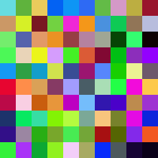

==========================================
1.2.1: Random Pattern Generation
==========================================

:Duration: 12-15 minutes
:Level: Beginner

Overview
========

Random number generation is a fundamental building block of computational art and generative design. In this module, you'll discover how simple random processes can create compelling visual patterns, from abstract color compositions to structured artistic grids inspired by pioneers like Gerhard Richter.

**Learning Objectives**

By completing this exercise, you will:

* Understand how random number generators create visual patterns
* Master the uniform distribution and its properties for image generation
* Use Kronecker products to efficiently scale pixel patterns
* Explore the relationship between randomness and artistic structure
* Create your own variations of algorithmic art techniques

Quick Start: See Randomness In Action
=====================================

Let's begin by creating something visually striking immediately. Run this code to generate a random color tile pattern:

.. code-block:: python
   :caption: Create random color tiles in seconds
   :linenos:

   import numpy as np
   from PIL import Image

   # Set seed for reproducible randomness
   np.random.seed(42)

   # Create 10x10 grid of random RGB colors
   random_colors = np.random.randint(0, 256, size=(10, 10, 3), dtype=np.uint8)

   # Scale each color to a 20x20 pixel tile using Kronecker product
   scaled_image = np.kron(random_colors, np.ones((20, 20, 1), dtype=np.uint8))

   # Save the result
   result = Image.fromarray(scaled_image)
   result.save('quick_random_tiles.png')

   Random color tiles generated using uniform distribution

.. tip::

   Notice how each tile has a completely different color, yet the overall composition feels balanced. This is the power of uniform distribution. There is no color is favored over others.

Core Concepts
=============

Uniform Random Distribution
---------------------------

The **uniform distribution** is the foundation of digital randomness. When we use ``np.random.randint(0, 256)``, every integer from 0 to 255 has an **equal probability** of being selected. This creates what we perceive as "pure randomness".

.. code-block:: python

   # Every RGB value has equal 1/256 probability
   random_rgb = np.random.randint(0, 256, size=(5, 5, 3), dtype=np.uint8)

   # This gives us 256³ = 16,777,216 possible colors per pixel
   total_colors = 256 ** 3
   print(f"Total possible colors: {total_colors:,}")

For generative art, uniform distribution provides:

* **Unpredictability**: No discernible patterns in individual elements
* **Visual balance**: All colors represented equally over large samples
* **Infinite variety**: Each generation produces unique results

.. important::

   Setting ``np.random.seed()`` makes randomness **reproducible**. This is especially useful for debugging and comparing different algorithms on identical random inputs.

Kronecker Product for Scaling
------------------------------

The **Kronecker product** (``np.kron``) is a mathematical operation that efficiently scales images by repeating each pixel into a larger block. Instead of using nested loops, we leverage this linear algebra operation for performance.

.. code-block:: python

   # Original: 2x2 array
   small = np.array([[1, 2], [3, 4]])

   # Scaling matrix: each element becomes 3x3 block
   scale = np.ones((3, 3))

   # Kronecker product result: 6x6 array
   large = np.kron(small, scale)
   # Result: each original value repeated in 3x3 blocks

For images, this transforms a small random grid into pixel-perfect tiles:

.. code-block:: python

   # Small random grid: 5x5x3 (75 total colors)
   small_grid = np.random.randint(0, 256, size=(5, 5, 3), dtype=np.uint8)

   # Scale each color to 40x40 pixel tile
   tile_size = np.ones((40, 40, 1), dtype=np.uint8)
   large_image = np.kron(small_grid, tile_size)
   # Result: 200x200x3 image (40,000 pixels, but only 75 unique colors)

.. note::

   The Kronecker product was named after Leopold Kronecker (1823-1891), though the operation itself appears in much earlier mathematical work. In computer graphics, it's invaluable for creating pixel-perfect scaling without interpolation artifacts.

Color Space Considerations
--------------------------

When generating random colors, the choice of color space dramatically affects the visual result:

* **RGB space**: Uniform in red, green, blue channels independently.
* **Perceptual uniformity**: RGB is NOT perceptually uniformed. Some random colors appear much brighter than others.
* **Gamut coverage**: Random RGB covers the entire digital color palette, including colors that rarely appear in nature.

.. code-block:: python

   # These are all equally "random" in RGB space
   color1 = [255, 255, 255]  # Bright white
   color2 = [128, 128, 128]  # Medium gray
   color3 = [255, 0, 0]      # Pure red
   color4 = [1, 1, 1]        # Nearly black

   # But they have very different perceptual brightness!

This creates visually interesting compositions because the eye perceives some tiles as "popping forward" (bright colors) while others decrease (dark colors) which adds implicit depth to a flat pattern.

Hands-On Exercises
==================

Now apply what you've learned with three progressively challenging exercises. Each builds on the previous one using the **Execute → Modify → Re-code** approach.

Exercise 1: Execute and explore
---------------------------------

**Time estimate:** 3-4 minutes

Run the following code exactly as written and observe the output. This creates a grid of random colored tiles.

.. code-block:: python
   :caption: Exercise 1 — Random color tiles
   :linenos:

   import numpy as np
   from PIL import Image

   # Create a 10x10 grid of random RGB colors
   random_colors = np.random.randint(0, 256, size=(10, 10, 3), dtype=np.uint8)

   # Scale each color to a 20x20 pixel tile using Kronecker product
   scaling_matrix = np.ones((20, 20, 1), dtype=np.uint8)
   image_array = np.kron(random_colors, scaling_matrix)

   # Convert to image and save
   result_image = Image.fromarray(image_array)
   result_image.save('random_tiles.png')

   print(f"Image dimensions: {image_array.shape}")

**Reflection questions:**

* What do you notice about the colors? Are any two tiles exactly the same?
* Why does each tile appear as a solid block rather than individual pixels?
* What role does the Kronecker product play in creating the final image?

.. dropdown:: Solution & Explanation

   **What happened:**

   1. `np.random.randint(0, 256, ...)` creates a 10×10×3 array where each RGB value is randomly chosen from 0-255
   2. `np.kron()` scales each color into a 20×20 pixel block, creating the tile effect
   3. The final image is 200×200 pixels (10 tiles × 20 pixels per tile)

   **Key insights:**

   * Each tile is a different random color due to uniform distribution
   * The Kronecker product efficiently repeats each color value into larger blocks
   * We get 100 unique colors (10×10 tiles) from 16.7 million possible RGB combinations

Exercise 2: Modify parameters
-------------------------------------

**Time estimate:** 3-4 minutes

Modify the code from Exercise 1 to achieve these different effects. Change only the specified parameters.

**Goals:**

1. **Subtle variations**: Change the color range to create muted colors only
2. **Grayscale tiles**: Make all tiles appear in shades of gray
3. **Larger tiles**: Make each tile bigger for a bolder effect

.. dropdown:: Hints

   * For subtle colors, try limiting the range: `np.random.randint(100, 180, ...)`
   * For grayscale, make all RGB channels the same value
   * For larger tiles, increase the scaling matrix size

.. dropdown:: Solutions

   **1. Subtle variations:**

   .. code-block:: python

      # Change this line:
      random_colors = np.random.randint(100, 180, size=(10, 10, 3), dtype=np.uint8)
      # Creates colors only in the 100-179 range (muted/pastel effect)

   **2. Grayscale tiles:**

   .. code-block:: python

      # Generate grayscale values and repeat across RGB channels
      gray_values = np.random.randint(0, 256, size=(10, 10), dtype=np.uint8)
      random_colors = np.stack([gray_values, gray_values, gray_values], axis=2)

   **3. Larger tiles:**

   .. code-block:: python

      # Change this line:
      scaling_matrix = np.ones((40, 40, 1), dtype=np.uint8)
      # Creates 40×40 pixel tiles instead of 20×20

Exercise 3: Re-code with discrete palette
-------------------------------------------

**Time estimate:** 5-6 minutes

Now create something new from scratch: a Gerhard Richter-inspired color grid using only specific color values.

**Goal:** Create random tiles that use only colors divisible by 32 (0, 32, 64, 96, 128, 160, 192, 224).

**Requirements:**
* Use a 16×16 grid of tiles
* Each tile should be 12×12 pixels
* Only use the 8 discrete color values listed above

.. code-block:: python
   :caption: Exercise 3 starter code

   import numpy as np
   from PIL import Image

   # Create discrete color palette (values divisible by 32)
   color_palette = np.array([0, 32, 64, 96, 128, 160, 192, 224])

   # Your code here:
   # 1. Create 16x16 grid of random indices into the palette
   # 2. Map indices to actual color values
   # 3. Scale up to 12x12 pixel tiles
   # 4. Save as 'richter_style.png'

.. dropdown:: Complete Solution

   .. code-block:: python
      :caption: Richter-inspired discrete color grid
      :linenos:
      :emphasize-lines: 6-8, 11-12

      import numpy as np
      from PIL import Image

      # Create discrete color palette (values divisible by 32)
      color_palette = np.array([0, 32, 64, 96, 128, 160, 192, 224])

      # Generate random indices into the palette for 16x16 grid
      random_indices = np.random.randint(0, len(color_palette), size=(16, 16, 3))

      # Map indices to actual color values
      small_array = color_palette[random_indices].astype(np.uint8)

      # Scale each color to 12x12 pixel tiles
      scaling_matrix = np.ones((12, 12, 1), dtype=np.uint8)
      image_array = np.kron(small_array, scaling_matrix)

      # Save result
      result_image = Image.fromarray(image_array)
      result_image.save('richter_style.png')
      print(f"Created {image_array.shape} Richter-style grid!")

   **How it works:**

   * Line 6-8: Creates a limited palette of only 8 color values per channel
   * Line 11: Randomly selects from palette indices (0-7) for each RGB channel
   * Line 12: Maps those indices to actual color values using array indexing
   * The result has the structured, limited-palette aesthetic of Richter's color charts

   **Challenge extension:** Try different palette sizes or create complementary color schemes!

Summary
=======

In this exercise, you learned fundamental techniques for generating random visual patterns:

**Key takeaways:**

* **Uniform distribution** creates unbiased randomness - essential for fair color sampling
* **Kronecker products** provide efficient pixel-perfect scaling without interpolation
* **Color space choice** dramatically affects visual perception of randomness
* **Discrete palettes** can make random compositions more aesthetically pleasing
* **Controlled randomness** balances algorithmic generation with design principles

**Remember**: Random doesn't mean arbitrary. The most successful generative art combines algorithmic unpredictability with careful aesthetic choices about constraints, parameters, and color relationships.

This foundation in random pattern generation prepares you for more sophisticated techniques like cellular automata, noise functions, and emergent behavior systems.

What's Next
===========

Continue to :doc:`../../../1.2_pixel_manipulation_patterns/1.2.2_cellular_automata/README` to learn how simple rules can create complex, evolving patterns through cellular automata.

References
==========

.. [1] Richter, Gerhard. "1024 Colours." 1973. Oil on canvas. *Gerhard Richter: Catalogue Raisonné*, no. 350. Accessed via Gerhard Richter Archive, 2024. https://www.gerhard-richter.com/en/art/paintings/abstracts/colour-charts-12/1024-colours-6083

.. [2] Knuth, Donald E. *The Art of Computer Programming, Volume 2: Seminumerical Algorithms*. 3rd ed. Addison-Wesley, 1997. [Chapter 3 on random number generation theory]

.. [3] NumPy Community. "Random sampling (numpy.random)." *NumPy Documentation*, version 1.24, 2023. https://numpy.org/doc/stable/reference/random/index.html

.. [4] Van Fraassen, Bas C. "Laws and Symmetry." *Oxford University Press*, 1989. [Philosophical foundations of randomness and probability in scientific modeling]

.. dropdown:: Additional Resources

   - `Sol LeWitt Instructions for Wall Drawings <https://www.massmoca.org/sol-lewitt/>`_ - Early examples of algorithmic art instructions
   - `Casey Reas' Process Compendium <https://reas.com/>`_ - Contemporary computational art using systematic processes
   - `Vera Molnár: Algorithmic Art Pioneer <https://www.dam.org/museum/artists_ui/artists/molnar-vera/vera-molnar>`_ - Historical context for computer-generated randomness in art

