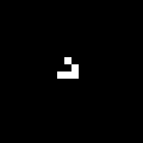
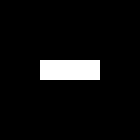
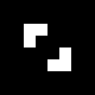
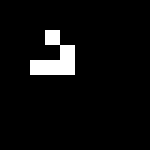
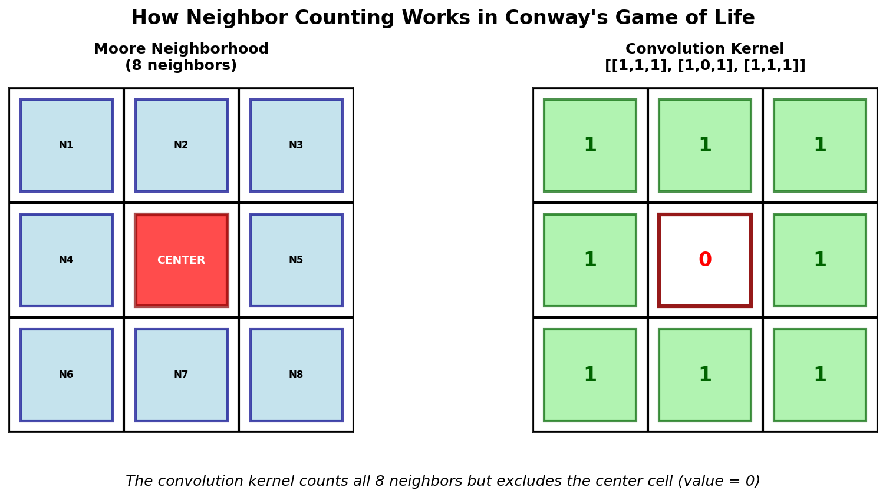
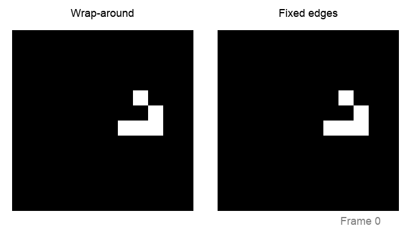

==========================================
1.2.2: Cellular Automata (Game of Life)
==========================================

:Duration: 15-20 minutes
:Level: Beginner

Overview
========

Cellular automata, popularized by Conway's Game of Life [Gardner1970]_, transform simple rules into complex, evolving patterns that seem alive. In this module, you'll discover how Conway's Game of Life creates emergent behavior from just a few mathematical rules, showcasing how complexity arises from simplicity in computational systems [Wolfram2002]_.

**Learning Objectives**

By completing this exercise, you will:

* Understand how cellular automata generate dynamic patterns from simple rules
* Practice Conway's Game of Life rules and their implementation
* Learn neighbor calculation techniques using convolution
* Explore simple but emergent behavior in your computer
* Create evolving visual patterns that change over time

Quick Start: See Life In Action
===============================

Let's begin by creating a simple cellular automaton:

.. code-block:: python
   :caption: Create Conway's Game of Life glider animation
   :linenos:

   import numpy as np
   from PIL import Image
   from scipy.ndimage import convolve
   import imageio

   def grid_to_image(grid, scale=8):
       """Convert binary grid to grayscale image."""
       return np.repeat(np.repeat(grid * 255, scale, axis=0), scale, axis=1).astype(np.uint8)

   # Initialize 20x20 grid with glider pattern
   grid = np.zeros((20, 20), dtype=int)
   grid[8:11, 8:11] = [[0, 1, 0], [0, 0, 1], [1, 1, 1]]

   # Generate 8 frames of glider movement
   frames = []

   # Moore neighborhood kernel: counts all 8 surrounding cells
   # The center (0) is excluded - we don't count the cell itself
   kernel = np.array([[1, 1, 1],   # top-left, top, top-right
                      [1, 0, 1],   # left, [cell], right
                      [1, 1, 1]])  # bottom-left, bottom, bottom-right

   for step in range(8):
       frames.append(grid_to_image(grid))

       # Count neighbors for every cell simultaneously
       neighbor_count = convolve(grid, kernel, mode='wrap')

       # Apply Conway's Game of Life rules (B3/S23):
       # BIRTH: Dead cell with exactly 3 neighbors becomes alive
       # SURVIVAL: Living cell with 2 or 3 neighbors stays alive
       # DEATH: All other cells die (isolation: <2, overcrowding: >3)
       birth = (neighbor_count == 3)
       survival = (grid == 1) & (neighbor_count == 2)
       grid = (birth | survival).astype(int)

   # Save as animated GIF
   imageio.mimsave('glider_animation.gif', frames, fps=2, duration=0.5)

   Various Game of Life patterns: gliders move, blocks stay still, beehives remain stable

.. Note::

   Notice how the "glider" pattern appears to move across the grid! The glider moves one cell diagonally every 4 generations. Yet, the movement was never defined. This pattern emerges from local birth/death rules applied.

Core Concepts
=============

Core Concept 1: Cellular Automata Fundamentals
----------------------------------------------

A **cellular automaton** consists of three essential components [Wolfram2002]_:

1. **Grid**: A regular array of cells, each in one of several states
2. **Rules**: Mathematical conditions that determine state changes
3. **Time**: Discrete steps where all cells update simultaneously

.. code-block:: python

   # Basic CA structure
   grid = np.zeros((height, width), dtype=int)  # 0 = dead, 1 = alive

   for generation in range(num_steps):
       grid = apply_rules(grid)  # All cells update together

This simple framework can generate remarkably diverse behaviors [Wolfram2002]_, from stable patterns to moving structures to chaotic dynamics.

.. important::

   The key insight is **simultaneity**. All cells update at the same time based on the current state, not the partially updated state. This creates predictable, deterministic evolution [Wolfram2002]_.

Conway's Game of Life Rules (B3/S23)
^^^^^^^^^^^^^^^^^^^^^^^^^^^^^^^^^^^^

The **Game of Life** uses four simple rules based on each cell's eight neighbors (the **Moore neighborhood**) [Gardner1970]_:

1. **Birth**: A dead cell with exactly 3 living neighbors becomes alive
2. **Survival**: A living cell with 2 or 3 living neighbors stays alive
3. **Death by isolation**: A living cell with fewer than 2 neighbors dies
4. **Death by overcrowding**: A living cell with more than 3 neighbors dies

.. code-block:: python

   # Game of Life rules in code
   birth = (neighbor_count == 3) & (grid == 0)
   survival = (neighbor_count >= 2) & (neighbor_count <= 3) & (grid == 1)
   new_grid = (birth | survival).astype(int)

These rules create three categories of patterns [Adamatzky2010]_:

* **Still lifes**: Patterns that never change (blocks, beehives)
* **Oscillators**: Patterns that repeat in cycles (blinkers, toads)
* **Spaceships**: Patterns that move across the grid (gliders, lightweight spaceships)

.. note::

   John Conway designed these rules in 1970 [Gardner1970]_ to simplify John von Neumann's 29-state cellular automaton [VonNeumann1966]_. Conway wanted a system where interesting behavior would emerge but not grow indefinitely. The formal treatment of these rules appears in *Winning Ways for Your Mathematical Plays* [BerlekampConwayGuy2004]_, co-authored by Conway himself.

Core Concept 2: Pattern Classification in Game of Life
-------------------------------------------------------

Conway's simple rules create three fundamental categories of patterns [Adamatzky2010]_, each with distinct behaviors that you can learn to recognize:

**Still Lifes: Stable Forever**

These patterns never change once formed. The most common is the **block** [LifeWiki]_:

.. code-block:: text

   Generation 0:    Generation 1:    Generation 2:

   . . . .          . . . .          . . . .
   . ■ ■ .    →     . ■ ■ .    →     . ■ ■ .
   . ■ ■ .          . ■ ■ .          . ■ ■ .
   . . . .          . . . .          . . . .

Each living cell has exactly 3 living neighbors (including diagonals), so they all survive. Each dead cell has fewer than 3 living neighbors, so none are born. Perfect stability!

**Oscillators: Rhythmic Patterns**

These patterns repeat in cycles. The **blinker** alternates every generation:

.. code-block:: text

   Generation 0:    Generation 1:    Generation 2:

   . . . . .        . . ■ . .        . . . . .
   . ■ ■ ■ .   →    . . ■ . .   →    . ■ ■ ■ .
   . . . . .        . . ■ . .        . . . . .

The horizontal line becomes vertical, then back to horizontal — a **period-2 oscillator** [LifeWiki]_.

   Blinker oscillator demonstrating horizontal ↔ vertical transformation (always 3 cells)

The **beacon oscillator** is more complex, alternating between 6 and 8 living cells:

.. code-block:: text

   Generation 0:    Generation 1:    Generation 2:

   ■ ■ . .          ■ ■ . .          ■ ■ . .
   ■ . . .    →     ■ ■ . .    →     ■ . . .
   . . . ■          . . ■ ■          . . . ■
   . . ■ ■          . . ■ ■          . . ■ ■

   Beacon Oscillator animation displaying alternation between 6 & 8 living cells.

**Spaceships: Moving Patterns**

These patterns maintain their shape while traveling across the grid. The **glider** moves diagonally:

.. code-block:: text

   Step 0:          Step 1:          Step 2:          Step 4:

   . ■ . . .        . . . . .        . . . . .        . . . . .
   . . ■ . .   →    ■ . ■ . .   →    . . ■ . .   →    . . . ■ .
   ■ ■ ■ . .        . ■ ■ . .        ■ . ■ . .        . . ■ ■ .
   . . . . .        . ■ . . .        . ■ ■ . .        . . ■ . .

The glider recreates itself one position down and to the right every 4 generations [Gardner1970]_, creating the illusion of movement. Interestingly, the glider was discovered by Richard K. Guy in 1969 while tracking the R-pentomino evolution [Roberts2015]_.

   Glider spaceship demonstrating diagonal movement while maintaining shape

.. important::

   **Pattern Recognition Tip**: Look at the neighbor counts! Still lifes have perfect balance, oscillators have unstable spots that flip-flop, and spaceships have asymmetric neighbor distributions that "push" them forward.

Understanding the Beacon Oscillator
^^^^^^^^^^^^^^^^^^^^^^^^^^^^^^^^^^^^

**The Beacon's Two States:**

*Compact form (6 cells):*
- Each corner block is stable (each cell has exactly 3 neighbors)
- The gap between blocks prevents interaction

*Expanded form (8 cells):*
- The middle cells are born because they suddenly have exactly 3 neighbors
- This happens when the corner blocks "reach toward" each other

   Beacon oscillator demonstrating 6→8→6→8 cell cycle over 4 generations

**Why It Oscillates:**

1. **Generation 0** (compact): Corner cells are stable, middle positions have exactly 3 neighbors → birth
2. **Generation 1** (expanded): Middle cells now exist, but they destabilize the corners → some corner cells die
3. **Generation 2** (compact): Back to original state, cycle repeats

This predictable 6→8→6→8 pattern makes the beacon perfect for demonstrating how Game of Life rules create rhythmic, observable changes.

Core Concept 3: Neighbor Calculation with Convolution
------------------------------------------------------

The most efficient way to count neighbors uses **2D convolution** [SciPyDocs]_ with a kernel that represents the Moore neighborhood:

.. code-block:: python

   # Neighbor counting kernel (excludes center cell)
   kernel = np.array([[1, 1, 1],
                      [1, 0, 1],
                      [1, 1, 1]])

   # Count neighbors for all cells simultaneously
   neighbor_count = convolve(grid, kernel, mode='wrap')

This approach calculates all neighbor counts in parallel, making the algorithm much faster than nested loops. The `mode='wrap'` creates **toroidal boundary conditions** [Wolfram2002]_ where the edges connect to the opposite sides.

   The Moore neighborhood: 8 cells surrounding the center cell, and the corresponding convolution kernel that counts them. Diagram generated with Claude - Opus 4.5

Core Concept 4: Boundary Conditions
------------------------------------

How you handle grid edges dramatically affects pattern behavior [Flake1998]_:

* **Wrap-around (torus)**: `mode='wrap'` -> patterns can move continuously
* **Fixed edges**: `mode='constant'` -> boundaries act as permanent barriers
* **Reflective**: Custom implementation -> patterns bounce off edges

.. code-block:: python

   # Different boundary conditions
   wrap_neighbors = convolve(grid, kernel, mode='wrap')      # Toroidal
   fixed_neighbors = convolve(grid, kernel, mode='constant') # Dead boundary

   # Creates very different evolutionary behaviors!

For artistic applications, wrap-around often produces more visually interesting results [Flake1998]_ because patterns can interact across the entire space.

   Comparison of boundary conditions: wrap-around (left) vs fixed edges (right) with glider pattern

Hands-On Exercises
==================

Now it is time to apply what you've learned with three progressively challenging exercises. Each builds on the previous one using the **Execute → Modify → Create** approach [Sweller1985]_, [Mayer2020]_.

These exercises reinforce the core concepts:

* **Exercise 1 (Execute)**: Practice pattern recognition (Core Concept 2)
* **Exercise 2 (Modify)**: Explore boundary conditions and convolution (Core Concepts 3-4)
* **Exercise 3 (Create)**: Apply B3/S23 rules to build a complex oscillator (Core Concepts 1-2)

Exercise 1: Execute and explore
---------------------------------

Now that you understand what oscillators are, let's start with the simplest example: the **blinker**. Run the following code to see this period-2 oscillator flip between horizontal and vertical orientations.

.. code-block:: python
   :caption: Exercise 1 — Simple blinker oscillator
   :linenos:

   import numpy as np
   from PIL import Image
   from scipy.ndimage import convolve

   def grid_to_image(grid, scale=10):
       """Convert binary grid to RGB image."""
       gray = np.repeat(np.repeat(grid * 255, scale, axis=0), scale, axis=1)
       return np.stack([gray, gray, gray], axis=2).astype(np.uint8)

   def game_of_life_step(grid):
       """Apply one generation of Conway's Game of Life."""
       kernel = np.array([[1, 1, 1], [1, 0, 1], [1, 1, 1]])
       neighbor_count = convolve(grid, kernel, mode='wrap')
       return ((neighbor_count == 3) | ((grid == 1) & (neighbor_count == 2))).astype(int)

   # Initialize with blinker pattern (horizontal line of 3 cells)
   grid = np.zeros((30, 30), dtype=int)
   grid[15, 14:17] = [1, 1, 1]  # Horizontal blinker in center

   # Evolve for 6 generations to see complete cycles
   for generation in range(6):
       grid = game_of_life_step(grid)
       print(f"Generation {generation + 1}: {np.sum(grid)} living cells")

   # Save final state
   Image.fromarray(grid_to_image(grid)).save('exercise1_result.png')

**Reflection questions:**

* Does the living cell count change, or does it stay constant at 3 cells?
* Can you visualize how the horizontal line becomes vertical, then back to horizontal?
* Based on the pattern classification section, what type of pattern is this and why?

.. dropdown:: Solution & Explanation

   **What happened:**

   1. The blinker maintains exactly 3 living cells throughout all generations
   2. Generation 1, 3, 5... = horizontal line (3 cells in a row)
   3. Generation 2, 4, 6... = vertical line (3 cells in a column)
   4. The pattern repeats every 2 generations (period-2 oscillator)

   **Key insights:**
   * This is a **period-2 oscillator** - it repeats every 2 generations
   * The cell count stays constant (always 3), but the *shape* changes
   * The horizontal configuration has each cell with exactly 2 neighbors → survive
   * The end cells die (only 1 neighbor each), middle cell births 2 new cells above/below
   * Unlike still lifes (never change) or spaceships (move), oscillators transform but stay in place

Exercise 2: Modify blinker variations
--------------------------------------

Modify the code from Exercise 1 to explore different blinker configurations and boundary conditions.

**Goals:**

1. **Try different positions**: Place the blinker near the edge of the grid
2. **Change boundaries**: Use fixed edges instead of wrap-around to see edge effects
3. **Multiple blinkers**: Start with several blinkers in different locations

.. dropdown:: Hints

   * Edge blinker: `grid[1, 14:17] = [1, 1, 1]` (place near top edge)
   * Fixed boundaries: Change `mode='wrap'` to `mode='constant'` in the convolve function
   * Multiple blinkers: Add several lines like `grid[10, 5:8] = [1, 1, 1]` and `grid[20, 15:18] = [1, 1, 1]`

.. dropdown:: Solutions

   **1. Edge blinker:**

   .. code-block:: python

      # Replace center blinker with edge placement:
      grid[1, 14:17] = [1, 1, 1]  # Near top edge
      # With wrap-around, works normally; with fixed boundaries, may behave differently

   **2. Fixed boundaries:**

   .. code-block:: python

      # In the game_of_life_step function:
      neighbor_count = convolve(grid, kernel, mode='constant')
      # Edge blinkers may die because they lack sufficient neighbors at boundaries

   **3. Multiple blinkers:**

   .. code-block:: python

      # Add multiple blinkers in different orientations:
      grid[10, 5:8] = [1, 1, 1]      # Horizontal blinker
      grid[20:23, 15] = [1, 1, 1]    # Vertical blinker
      grid[15, 20:23] = [1, 1, 1]    # Another horizontal blinker
      # All blinkers oscillate independently

Exercise 3: Re-code with complex oscillator
--------------------------------------------

Now that you understand simple oscillators (blinker), create a more advanced oscillator: the **beacon**. This pattern shows varying cell counts and more complex behavior.

**Beacon Pattern:**
* Alternates between 6 and 8 living cells
* Has two distinct visual forms: compact and expanded
* Period-2 oscillator like the blinker, but with changing cell counts

**Requirements:**
* Use a 30×30 grid like Exercise 1
* Initialize the beacon pattern correctly
* Run for 10 generations to see cell count changes
* Save the final state as 'exercise3_result.png'

.. code-block:: python
   :caption: Exercise 3 starter code

   import numpy as np
   from PIL import Image
   from scipy.ndimage import convolve

   def grid_to_image(grid, scale=10):
       """Convert binary grid to RGB image."""
       gray = np.repeat(np.repeat(grid * 255, scale, axis=0), scale, axis=1)
       return np.stack([gray, gray, gray], axis=2).astype(np.uint8)

   def game_of_life_step(grid):
       """Apply one generation of Conway's Game of Life."""
       kernel = np.array([[1, 1, 1], [1, 0, 1], [1, 1, 1]])
       neighbor_count = convolve(grid, kernel, mode='wrap')
       return ((neighbor_count == 3) | ((grid == 1) & (neighbor_count == 2))).astype(int)

   # Initialize with beacon oscillator pattern
   grid = np.zeros((30, 30), dtype=int)

   # Your code here:
   # 1. Create the beacon pattern using two 2x2 blocks with a gap
   # 2. Hint: grid[13:15, 13:15] = [[1, 1], [1, 0]] for top-left block
   # 3. Hint: grid[15:17, 15:17] = [[0, 1], [1, 1]] for bottom-right block

   # Your evolution loop here:
   # Run for 10 generations and print cell counts each generation

.. dropdown:: Complete Solution

   .. code-block:: python
      :caption: Beacon oscillator cellular automaton
      :linenos:
      :emphasize-lines: 18-20

      import numpy as np
      from PIL import Image
      from scipy.ndimage import convolve

      def grid_to_image(grid, scale=10):
          """Convert binary grid to RGB image."""
          gray = np.repeat(np.repeat(grid * 255, scale, axis=0), scale, axis=1)
          return np.stack([gray, gray, gray], axis=2).astype(np.uint8)

      def game_of_life_step(grid):
          """Apply one generation of Conway's Game of Life."""
          kernel = np.array([[1, 1, 1], [1, 0, 1], [1, 1, 1]])
          neighbor_count = convolve(grid, kernel, mode='wrap')
          return ((neighbor_count == 3) | ((grid == 1) & (neighbor_count == 2))).astype(int)

      # Initialize with beacon oscillator pattern
      grid = np.zeros((30, 30), dtype=int)
      grid[13:15, 13:15] = [[1, 1], [1, 0]]  # Top-left block
      grid[15:17, 15:17] = [[0, 1], [1, 1]]  # Bottom-right block

      # Evolve for 10 generations and track cell counts
      for generation in range(10):
          grid = game_of_life_step(grid)
          print(f"Generation {generation + 1}: {np.sum(grid)} living cells")

      # Save result using helper function
      Image.fromarray(grid_to_image(grid)).save('exercise3_result.png')
      print("Beacon oscillator evolution completed!")

   **How it works:**

   * Lines 18-20: Creates the beacon pattern with two offset 2x2 blocks that interact
   * The beacon alternates between 6 cells (compact) and 8 cells (expanded) every generation
   * Unlike the simple blinker (constant 3 cells), the beacon shows varying cell counts
   * This demonstrates how more complex oscillators can have both shape AND population changes

   **Challenge extension:** Try creating a "toad" oscillator with 6 cells in a different arrangement!

Summary
=======

In this exercise, you learned fundamental techniques for creating evolving patterns with cellular automata:

**Key takeaways:**

* **Simple rules create diverse behavior** [Wolfram2002]_ — Conway's four rules generate remarkable pattern diversity
* **Convolution enables efficient computation** - neighbor counting scales to large grids
* **Boundary conditions affect evolution** - wrap-around vs fixed edges change pattern dynamics
* **Emergent properties arise** - movement, oscillation, and stability emerge from local interactions
* **Rule variations create different behaviors** - small changes (like HighLife) produce dramatically different results

References
==========

**Primary Sources**

.. [Gardner1970] Gardner, Martin. "Mathematical Games: The fantastic combinations of John Conway's new solitaire game 'life'." *Scientific American*, vol. 223, no. 4, 1970, pp. 120-123. [Original publication introducing Game of Life to the public]

**Foundational Texts**

.. [Wolfram2002] Wolfram, Stephen. *A New Kind of Science*. Wolfram Media, 2002. ISBN: 978-1-57955-008-0. [Comprehensive exploration of cellular automata and computational irreducibility]

.. [Flake1998] Flake, Gary William. *The Computational Beauty of Nature: Computer Explorations of Fractals, Chaos, Complex Systems, and Adaptation*. MIT Press, 1998. ISBN: 978-0-262-56127-3. [Chapter 6 covers cellular automata with artistic applications]

.. [Adamatzky2010] Adamatzky, Andrew, editor. *Game of Life Cellular Automata*. Springer, 2010. ISBN: 978-1-84996-216-2. https://doi.org/10.1007/978-1-84996-217-9 [Research compilation on GoL patterns and applications]

.. [BerlekampConwayGuy2004] Berlekamp, E. R., Conway, J. H., & Guy, R. K. (2004). *Winning ways for your mathematical plays* (2nd ed., Vol. 4, Chapter 25: "What Is Life?"). A K Peters. ISBN: 1-56881-144-6 [Conway's own formal treatment of the Game of Life rules]

.. [Roberts2015] Roberts, S. (2015). *Genius at play: The curious mind of John Horton Conway* (pp. 125-126). Bloomsbury. ISBN: 978-1-62040-593-2 [Confirms the glider was discovered by Richard K. Guy in 1969]

.. [VonNeumann1966] Von Neumann, J. (1966). *Theory of self-reproducing automata* (A. W. Burks, Ed.). University of Illinois Press. [Conway designed GoL to simplify von Neumann's 29-state cellular automaton]

**Technical Documentation**

.. [SciPyDocs] SciPy Developers. (2024). scipy.ndimage.convolve — N-dimensional convolution. *SciPy v1.12.0 Documentation*. https://docs.scipy.org/doc/scipy/reference/generated/scipy.ndimage.convolve.html

.. [NumPyDocs] NumPy Developers. (2024). NumPy array manipulation routines. *NumPy v1.26 Documentation*. https://numpy.org/doc/stable/reference/routines.array-manipulation.html

**Pattern References**

.. [LifeWiki] ConwayLife.com. (2024). LifeWiki — The wiki for Conway's Game of Life. https://conwaylife.com/wiki/Main_Page [Comprehensive database of patterns including block, blinker, beacon, and glider]

**Pedagogical References**

.. [Sweller1985] Sweller, J. (1985). Cognitive load during problem solving: Effects on learning. *Cognitive Science*, 12(2), 257-285. https://doi.org/10.1207/s15516709cog1202_4 [Foundation of cognitive load theory in instructional design]

.. [Mayer2020] Mayer, R. E. (2020). *Multimedia Learning* (3rd ed.). Cambridge University Press. ISBN: 978-1-316-63816-1 [Principles of effective multimedia instruction including worked examples]

.. dropdown:: Additional Resources

   **Simulators**

   - `Golly <http://golly.sourceforge.net/>`_ — Advanced open-source cellular automata simulator

   **Educational**

   - `Elementary Cellular Automata <https://mathworld.wolfram.com/ElementaryCellularAutomaton.html>`_ — Wolfram MathWorld's 1D CA reference
   - `Numberphile: Inventing Game of Life <https://www.youtube.com/watch?v=R9Plq-D1gEk>`_ — John Conway explains his invention (video)
