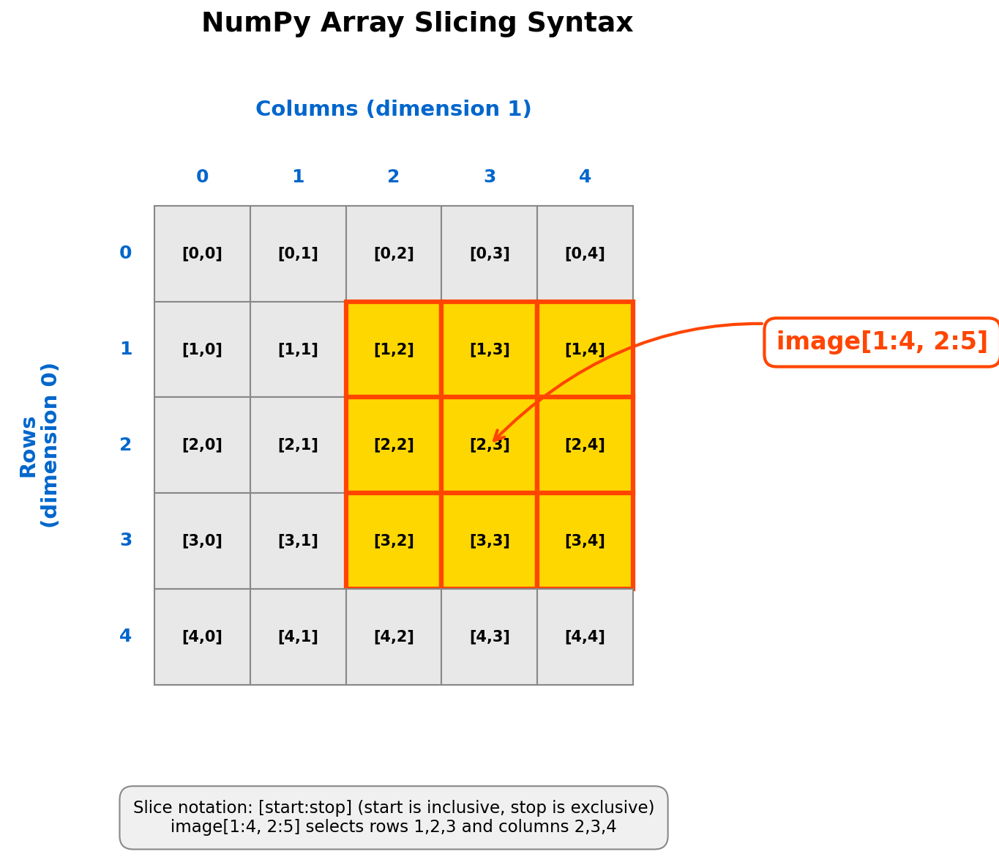
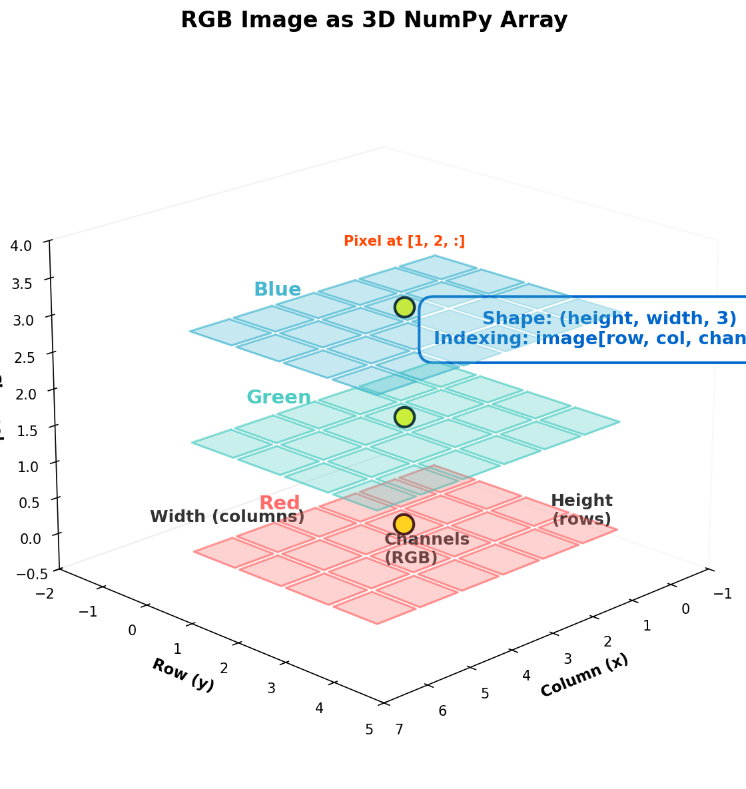

=====================================
1.3.1 - Flags (Array Slicing)
=====================================

:Duration: 20 minutes
:Level: Beginner
:Prerequisites: Module 1.1.1 (RGB Basics)

.. contents:: Contents
   :local:
   :depth: 2

Overview
========

Flags are structured patterns made of rectangular color blocks. Creating flags teaches you one of NumPy's most powerful features: **array slicing**. You will learn to select and modify rectangular regions of images using simple slice notation, building the foundation for complex compositions and transformations.

**Learning Objectives**

By completing this module, you will:

* Use NumPy slice notation `[start:stop]` to select array regions
* Apply multi-dimensional slicing to RGB images `[rows, cols, channels]`
* Create structured compositions by manipulating rectangular regions
* Transfer slicing knowledge to tiling and pattern generation tasks

Quick Start: Create Your First Flag
====================================

Let's create the flag of France using vertical color bands. Run this code:

.. code-block:: python
   :caption: Create the flag of France in 15 lines
   :linenos:

   import numpy as np
   from PIL import Image

   # Create blank canvas (standard 2:3 flag ratio)
   height, width = 300, 450
   flag = np.zeros((height, width, 3), dtype=np.uint8)

   # Blue stripe (left third: columns 0-149)
   flag[:, 0:150, 0] = 0    # Red channel
   flag[:, 0:150, 1] = 85   # Green channel
   flag[:, 0:150, 2] = 164  # Blue channel

   # White stripe (middle third: columns 150-299)
   flag[:, 150:300, :] = 255

   # Red stripe (right third: columns 300-449)
   flag[:, 300:450, 0] = 239
   flag[:, 300:450, 1] = 65
   flag[:, 300:450, 2] = 53

   # Save the flag
   result = Image.fromarray(flag, mode='RGB')
   result.save('france_flag.png')

   The flag of France created using column slicing

**What you just did**: You used NumPy array slicing to select vertical columns. The notation `[:, 0:150]` means "all rows, columns 0 to 149". Notice how the colon `:` selects all rows, while `0:150` specifies which columns to modify.

.. tip::

   The slice notation `[start:stop]` is **inclusive of start, exclusive of stop**. So `[0:150]` selects indices 0, 1, 2, ..., 149 (not 150). This matches Python's `range()` function behavior.

Core Concepts
=============

Array Slicing Syntax
---------------------

**Array slicing** lets you select rectangular regions from arrays using the colon operator. For 2D images, the basic pattern is:

.. code-block:: python

   image[row_start:row_stop, col_start:col_stop]

The fundamental rules:

* **`start` is inclusive, `stop` is exclusive**: `[0:100]` selects indices 0 through 99
* **Omitting values**: `:` alone means "all", `:10` means "0 to 10", `10:` means "10 to end"
* **Negative indices**: `-1` is the last element, `-10:` selects the last 10 elements

.. code-block:: python
   :caption: Basic slicing examples
   :linenos:

   # Create 200x300 image
   img = np.zeros((200, 300, 3), dtype=np.uint8)

   # Top half (rows 0-99)
   img[0:100, :] = [255, 0, 0]  # Red

   # Bottom half (rows 100-199)
   img[100:200, :] = [0, 0, 255]  # Blue

   # Right quarter (all rows, last 75 columns)
   img[:, 225:] = [0, 255, 0]  # Green (overwrites some blue)

   Array slicing notation: `image[1:4, 2:5]` selects rows 1-3 and columns 2-4 (start inclusive, stop exclusive)

.. important::

   Remember the dimension order: `image[ROW, COLUMN]`. Rows come first (vertical position), then columns (horizontal position). This follows matrix notation where the origin (0,0) is at the **top-left corner**.

Multi-Dimensional Slicing
--------------------------

RGB images are **3D arrays** with shape `(height, width, 3)`. The third dimension holds color channels. You can slice across all three dimensions simultaneously:

.. code-block:: python
   :caption: Multi-dimensional slicing patterns
   :linenos:

   # Select a rectangular region, all channels
   img[0:100, 0:100, :] = [255, 0, 0]  # Top-left square, red

   # Select entire red channel only
   red_channel = img[:, :, 0]

   # Select a single row across all channels (horizontal line)
   horizontal_line = img[50, :, :]

   # Select a single column across all channels (vertical line)
   vertical_line = img[:, 100, :]

**Broadcasting shortcut**: NumPy automatically expands (broadcasts) values to match array dimensions:

.. code-block:: python

   # These are equivalent:
   img[0:100, 0:100, 0] = 255
   img[0:100, 0:100, 1] = 0
   img[0:100, 0:100, 2] = 0

   # Can be written as (NumPy broadcasts the list):
   img[0:100, 0:100] = [255, 0, 0]

   RGB images as 3D arrays: `(height, width, channels)`. Each pixel has three values stored in the third dimension.

Hands-On Exercises
==================

Exercise 1: Execute and Explore
--------------------------------

**Time estimate:** 3 minutes

Run the France flag code from the Quick Start section and observe the output. Then answer these reflection questions:

**Reflection Questions:**

1. What does `[:, 0:150]` select? Why does the colon alone select all rows?
2. Why does `flag[:, 150:300, :] = 255` create white instead of requiring three separate channel assignments?
3. How would you modify the code to create **horizontal** stripes instead of vertical ones?

.. dropdown:: Solution & Explanation
   :class: note

   **Answers:**

   1. **`[:, 0:150]` selects all rows, columns 0-149**. The colon `:` without start or stop values means "select all elements in this dimension". It's shorthand for `[0:height]`.

   2. **Broadcasting**: When you assign a single value (255) to a slice that includes all channels (`[:, :, :]`), NumPy automatically broadcasts that value to all three RGB channels, making (255, 255, 255) which is white.

   3. **For horizontal stripes**, switch the dimensions:

      .. code-block:: python

         # Top stripe (rows 0-99)
         flag[0:100, :] = [blue_color]

         # Middle stripe (rows 100-199)
         flag[100:200, :] = [white_color]

         # Bottom stripe (rows 200-299)
         flag[200:300, :] = [red_color]

      The key difference: `[0:100, :]` selects rows 0-99 and all columns (horizontal band), whereas `[:, 0:100]` selects all rows and columns 0-99 (vertical band).

Exercise 2: Modify to Achieve Goals
------------------------------------

**Time estimate:** 4 minutes

Modify the France flag code to create the **flag of Germany** (horizontal stripes: black on top, red in middle, gold on bottom).

**Your goals:**

* Change from vertical to horizontal stripes
* Use three equal horizontal bands
* Apply these colors:

  * Black: `[0, 0, 0]`
  * Red: `[221, 0, 0]`
  * Gold: `[255, 206, 0]`

**Hints:**

.. dropdown:: Hint 1: Switching from columns to rows
   :class: tip

   Column slicing uses `[:, start:stop]` (all rows, specific columns).
   Row slicing uses `[start:stop, :]` (specific rows, all columns).

.. dropdown:: Hint 2: Calculating stripe positions
   :class: tip

   Divide the height into thirds:

   * First third: rows 0 to `height // 3`
   * Second third: rows `height // 3` to `2 * height // 3`
   * Third third: rows `2 * height // 3` to `height`

   For height=300: 0-100, 100-200, 200-300

.. dropdown:: Solution
   :class: note

   .. code-block:: python
      :caption: Germany flag solution
      :linenos:

      import numpy as np
      from PIL import Image

      # Create blank canvas
      height, width = 300, 450
      flag = np.zeros((height, width, 3), dtype=np.uint8)

      # Black stripe (top third: rows 0-99)
      flag[0:100, :, :] = [0, 0, 0]

      # Red stripe (middle third: rows 100-199)
      flag[100:200, :, :] = [221, 0, 0]

      # Gold stripe (bottom third: rows 200-299)
      flag[200:300, :, :] = [255, 206, 0]

      # Save the flag
      result = Image.fromarray(flag, mode='RGB')
      result.save('germany_flag.png')

.. dropdown:: Extension Challenge
   :class: tip

   Try creating the **flag of the Netherlands** (horizontal stripes: red, white, blue). Use official colors: Red `[174, 28, 40]`, White `[255, 255, 255]`, Blue `[33, 70, 139]`.

Exercise 3: Create a Complex Flag
----------------------------------

**Time estimate:** 5 minutes

Create the **flag of Switzerland** (red field with white cross) from scratch. This requires combining both horizontal and vertical slicing.

**Requirements:**

* Square format: 300×300 pixels
* Red background: `[255, 0, 0]`
* White cross: `[255, 255, 255]`
* Cross proportions: bars are 1/5 of the flag dimension, centered

**Starter code:**

.. code-block:: python
   :caption: Starter code for Switzerland flag
   :linenos:

   import numpy as np
   from PIL import Image

   # Create square flag
   size = 300
   flag = np.zeros((size, size, 3), dtype=np.uint8)

   # TODO Step 1: Fill entire background with red
   # Hint: Use flag[:, :] = [255, 0, 0]

   # TODO Step 2: Create vertical bar of cross (centered, white)
   # The bar width should be size // 5 (60 pixels)
   # Calculate left and right positions to center it
   # Hint: left = (size - bar_width) // 2

   # TODO Step 3: Create horizontal bar of cross (centered, white)
   # Same proportions as vertical bar

   # Save
   result = Image.fromarray(flag, mode='RGB')
   result.save('switzerland_flag.png')

.. dropdown:: Hint 1: Red background
   :class: tip

   To fill the entire array with red, use:

   .. code-block:: python

      flag[:, :] = [255, 0, 0]

   This selects all rows and all columns, then broadcasts the RGB value.

.. dropdown:: Hint 2: Centering calculations
   :class: tip

   For a bar with width `bar_width` centered in dimension `size`:

   .. code-block:: python

      bar_width = size // 5  # 60 pixels for size=300
      left = (size - bar_width) // 2  # (300 - 60) // 2 = 120
      right = left + bar_width  # 120 + 60 = 180

   So the vertical bar occupies columns 120-179 (centered).

.. dropdown:: Complete Solution
   :class: note

   .. code-block:: python
      :caption: Switzerland flag complete solution
      :linenos:

      import numpy as np
      from PIL import Image

      # Create square flag
      size = 300
      flag = np.zeros((size, size, 3), dtype=np.uint8)

      # Step 1: Fill background with red
      flag[:, :] = [255, 0, 0]

      # Step 2: Create white vertical bar (centered)
      bar_width = size // 5  # 60 pixels
      left = (size - bar_width) // 2  # 120
      right = left + bar_width  # 180
      flag[:, left:right, :] = 255  # White vertical bar

      # Step 3: Create white horizontal bar (centered)
      bar_height = size // 5  # 60 pixels
      top = (size - bar_height) // 2  # 120
      bottom = top + bar_height  # 180
      flag[top:bottom, :, :] = 255  # White horizontal bar

      # Save
      result = Image.fromarray(flag, mode='RGB')
      result.save('switzerland_flag.png')

   **Key insight**: The cross is formed by two overlapping rectangles. Where they overlap, both set the same white color, so the result is a perfect cross.

Challenge Extension
===================

Create the **flag of the United Kingdom**. This challenging project requires diagonal lines, which you can create using loops and individual pixel manipulation.

.. dropdown:: Advanced Challenge Hints
   :class: warning

   The Union Jack contains diagonal red and white stripes. Here's a strategy:

   1. **Start with a blue background**: `flag[:, :] = [0, 33, 71]` (UK blue)
   2. **Add white diagonals**: Use loops to set pixels along diagonal lines
   3. **Add red cross**: Vertical and horizontal bars (like Switzerland)
   4. **Add red diagonals**: Thinner diagonal lines on top of white

   **Diagonal line template**:

   .. code-block:: python

      # Diagonal from top-left to bottom-right
      for i in range(min(height, width)):
          flag[i, i, :] = [255, 255, 255]  # White

      # Diagonal from top-right to bottom-left
      for i in range(min(height, width)):
          flag[i, width - i - 1, :] = [255, 255, 255]

   Experiment with line thickness and colors to match the official Union Jack design.

Summary
=======

**Key Takeaways:**

* Array slicing uses `[start:stop]` notation where **start is inclusive, stop is exclusive**
* For 2D images: `image[rows, columns]` - remember the dimension order
* The colon `:` selects all elements in a dimension
* For RGB images: `image[rows, cols, channels]` - slice across 3 dimensions
* NumPy broadcasting lets you assign single values or lists to multi-dimensional slices
* Complex patterns emerge from overlapping simple rectangular slices

**Common Pitfalls:**

* **Confusing row and column order**: Remember `[row, col]` not `[x, y]`. Rows are vertical position, columns are horizontal.
* **Off-by-one errors**: `[0:100]` selects 100 elements (0-99), not 101. The stop index is **exclusive**.
* **Forgetting the channel dimension**: `img[0:100, 0:100]` modifies all channels. Use `img[0:100, 0:100, 0]` for red channel only.

**Connection to Future Learning:**

The rectangular slicing you learned here is the foundation for:

* **Module 1.3.2 (Repeat)**: Tiling patterns using slicing to place repeated elements
* **Module 1.3.3-1.3.4**: Truchet and Wang tiles (complex tiling systems)
* **Module 3**: Image transformations and masking (selecting regions for effects)
* **Module 7**: Image segmentation (dividing images into regions)

Next Steps
==========

Continue to :doc:`../../1.3.2_repeat/repeat/README` to learn about creating tiling patterns by repeating sliced elements across an image.

References
==========

.. [Harris2020] Harris, C. R., Millman, K. J., van der Walt, S. J., Gommers, R., Virtanen, P., Cournapeau, D., Wieser, E., Taylor, J., Berg, S., Smith, N. J., Kern, R., Picus, M., Hoyer, S., van Kerkwijk, M. H., Brett, M., Haldane, A., del R'ıo, J. F., Wiebe, M., Peterson, P., ... Oliphant, T. E. (2020). Array programming with NumPy. *Nature*, 585(7825), 357–362. https://doi.org/10.1038/s41586-020-2649-2 [Foundational paper on NumPy array operations and slicing mechanisms]

.. [VanRossum2009] Van Rossum, G., & Drake, F. L. (2009). *Python 3 Reference Manual*. CreateSpace. ISBN: 978-1-4414-1269-0 [Official documentation of Python slice notation and indexing conventions]

.. [NumPyDocs2024] NumPy Developers. (2024). Indexing on ndarrays. *NumPy Documentation*. Retrieved January 30, 2025, from https://numpy.org/doc/stable/user/basics.indexing.html [Comprehensive guide to NumPy array indexing and slicing patterns]

.. [Paas2020] Paas, F., & van Merriënboer, J. J. G. (2020). Cognitive-Load Theory: Methods to Manage Working Memory Load in the Learning of Complex Tasks. *Current Directions in Psychological Science*, 29(4), 394–398. https://doi.org/10.1177/0963721420922183 [Cognitive load management through scaffolding and worked examples]

.. [Sweller2019] Sweller, J., van Merriënboer, J. J. G., & Paas, F. (2019). Cognitive Architecture and Instructional Design: 20 Years Later. *Educational Psychology Review*, 31(2), 261–292. https://doi.org/10.1007/s10648-019-09465-5 [Cognitive architecture principles for instructional design in technical domains]

.. [Mayer2021] Mayer, R. E. (2021). *Multimedia Learning* (3rd ed.). Cambridge University Press. ISBN: 978-1-108-89485-3 [Visual-first pedagogy and dual coding theory for educational materials]

.. [Liang2024] Liang, Y., Beidler, A., Chen, Y., & Morrison, B. (2024). Comparing Cognitive Load Among Undergraduate Students Programming in Python and the Visual Language Algot. In *Proceedings of the 55th ACM Technical Symposium on Computer Science Education V. 1* (pp. 842–848). Association for Computing Machinery. https://doi.org/10.1145/3626252.3630808 [Empirical evidence for visual approaches reducing cognitive load in Python education]

.. [Gonzalez2007] Gonzalez, R. C., & Woods, R. E. (2007). *Digital Image Processing* (3rd ed.). Pearson. ISBN: 978-0-13-168728-8 [Chapter 2: Array-based image representation and pixel manipulation fundamentals]

.. [Reas2014] Reas, C., & Fry, B. (2014). *Getting Started with Processing: A Hands-On Introduction to Making Interactive Graphics* (2nd ed.). Maker Media. ISBN: 978-1-4571-8707-4 [Visual programming pedagogy and immediate feedback loops in creative coding]

.. [Chen2025] Chen, S., Wang, T., Li, S., Cao, Y., Xu, M., Li, C., & Zeng, R. (2025). PyChatAI: Enhancing Python Programming Skills—An Empirical Study of a Smart Learning System. *Computers*, 14(5), 158. https://doi.org/10.3390/computers14050158 [Scaffolding model for Python learning based on Zone of Proximal Development principles]
