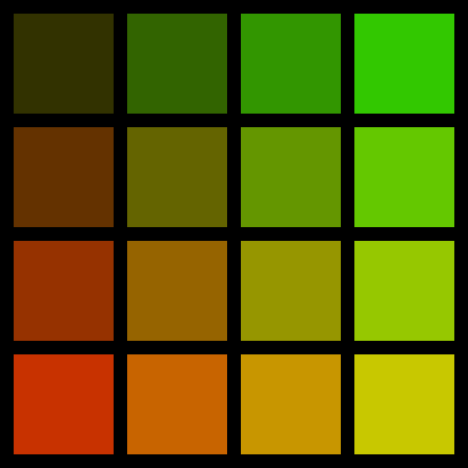
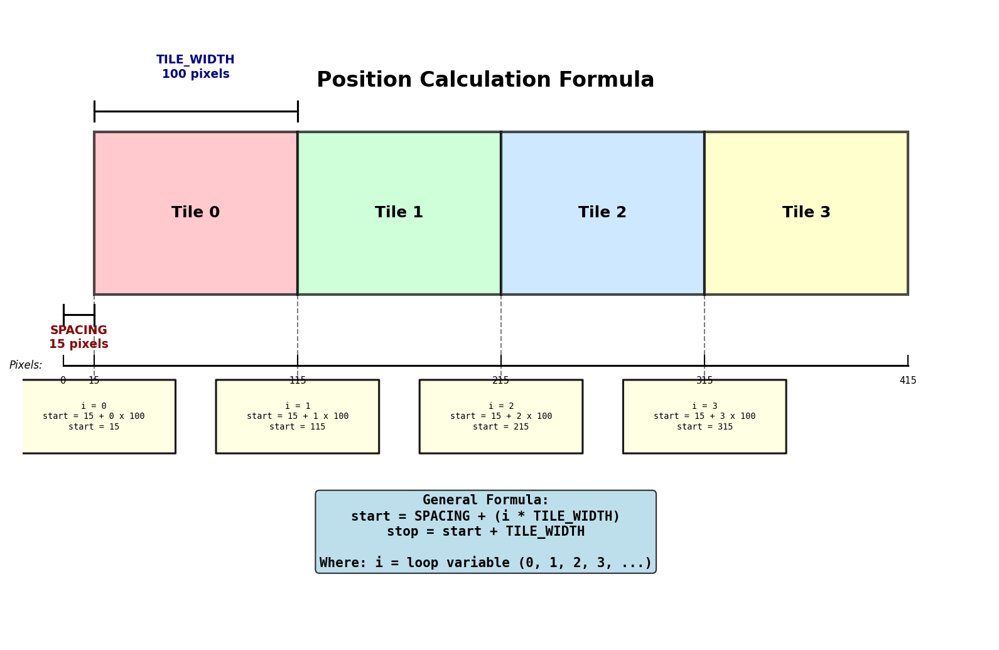
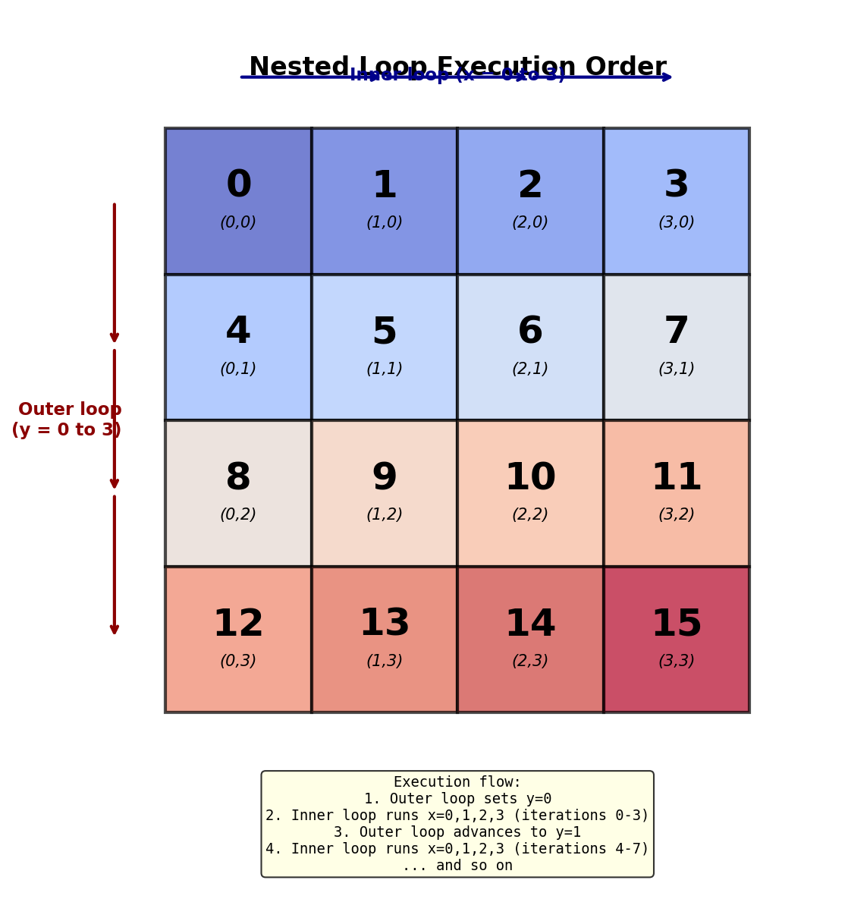
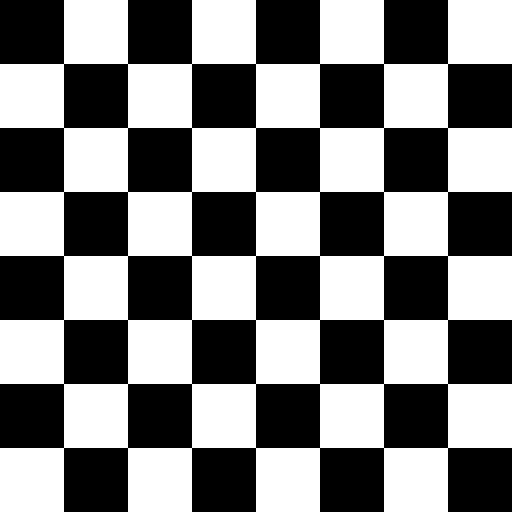
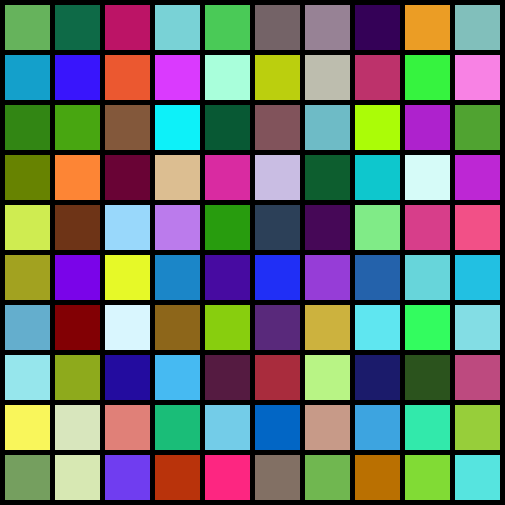

=====================================
1.3.2 - Repeat (Tiling Patterns)
=====================================

:Duration: 18 minutes
:Level: Beginner
:Prerequisites: Module 1.3.1 (Flags - Array Slicing)

.. contents:: Contents
   :local:
   :depth: 2

Overview
========

Tiling patterns are the bridge between manual array slicing and procedural generation. In Module 1.3.1, you learned to select and modify rectangular regions using hardcoded slice positions like ``[0:150]``. Now you will use **nested loops** to algorithmically calculate positions and create repeating grid patterns which is the the foundation of generative art.

This module introduces the concept of **parametric variation**: using formulas to create systematic changes across repeated elements. You will discover how a simple loop with a color formula can generate gradients, checkerboards, and infinitely varying patterns.

**Learning Objectives**

By completing this module, you will:

* Use nested loops to iterate through 2D grid positions
* Calculate array slice positions algorithmically using formulas
* Create parametric color variations based on position coordinates
* Understand the relationship between loop variables and pixel positions

Quick Start: Create a Tiling Pattern
=====================================

Let's start by running a script that creates a 4×4 grid of colored tiles. Each tile has a different color based on its position, creating a gradient effect:

.. code-block:: python
   :caption: Create a gradient tiling pattern
   :linenos:

   import numpy as np
   from PIL import Image

   # Configuration parameters
   N_TILES = 4          # Number of tiles per row/column
   TILE_WIDTH = 125     # Width of each tile in pixels
   SPACING = 15         # Gap between tiles
   SIZE = TILE_WIDTH * N_TILES + SPACING

   # Create blank canvas
   canvas = np.zeros((SIZE, SIZE, 3), dtype=np.uint8)

   # Nested loops to place tiles
   for y in range(N_TILES):
       for x in range(N_TILES):
           # Calculate color based on position
           color = (50 * y + 50, 50 * x + 50, 0)

           # Calculate slice positions algorithmically
           row_start = SPACING + y * TILE_WIDTH
           row_stop = (y + 1) * TILE_WIDTH
           col_start = SPACING + x * TILE_WIDTH
           col_stop = (x + 1) * TILE_WIDTH

           # Place tile
           canvas[row_start:row_stop, col_start:col_stop] = color

   # Save result
   result = Image.fromarray(canvas, mode='RGB')
   result.save('repeat.png')

   A 4×4 tiling pattern with color gradient. Red increases downward, green increases rightward.

**What you just created**: A systematic pattern where each tile's color is determined by its position. The formula ``color = (50 * y + 50, 50 * x + 50, 0)`` creates a gradient: red values increase as you move down (higher ``y``), and green values increase as you move right (higher ``x``). This is **parametric variation** using mathematical formulas to generate visual patterns.

.. tip::

   Notice how the inner loop completes all 4 iterations (x=0,1,2,3) before the outer loop advances to the next row. This execution order is crucial for understanding nested loops.

Core Concepts
=============

Algorithmic Position Calculation
---------------------------------

In Module 1.3.1, you wrote slice positions manually: ``flag[:, 0:150]`` for a specific column range. But what if you need to place 10, 50, or 100 rectangles? Writing each position by hand becomes impractical.

**The solution**: Use a formula to calculate positions based on a loop variable.

The general formula for positioning tiles in a grid is:

.. code-block:: python

   start = spacing + (i * tile_width)
   stop = start + tile_width

Where ``i`` is the loop variable (0, 1, 2, 3, ...). This formula ensures:

* **Even spacing**: Each tile starts at a consistent offset from the previous one
* **Correct positioning**: The ``spacing`` parameter creates gaps between tiles
* **Scalability**: Works for any number of tiles (just change the loop range)

   Position calculation formula visualized. Each tile's start position is computed as ``spacing + (i * tile_width)``.

**Example calculation** for the second tile (i=1):

.. code-block:: python

   SPACING = 15
   TILE_WIDTH = 125
   i = 1

   start = 15 + (1 * 125) = 140
   stop = 140 + 125 = 265

   # Therefore: canvas[:, 140:265] selects the second tile's column range

This transforms static, manual slicing into dynamic, algorithmic positioning (Code.org, 2024). The same pattern extends to Truchet tiles, fractals, and procedural texture generation.

.. important::

   The formula ``start = spacing + (i * tile_width)`` is the foundation of grid-based procedural generation. You will encounter variations of this pattern throughout Modules 4-6 (fractals, simulations, noise functions).

Nested Loops for 2D Grid Iteration
------------------------------------

A **nested loop** is a loop inside another loop. For 2D grids, the outer loop controls rows (y-axis) and the inner loop controls columns (x-axis).

**Basic structure**:

.. code-block:: python

   for y in range(N_TILES):      # Outer loop: rows
       for x in range(N_TILES):  # Inner loop: columns
           # Process tile at position (x, y)

**Execution order**: The inner loop completes *all* its iterations before the outer loop advances. For a 4×4 grid:

1. Outer loop sets ``y=0``
2. Inner loop runs ``x=0, 1, 2, 3`` (tiles 0-3)
3. Outer loop advances to ``y=1``
4. Inner loop runs ``x=0, 1, 2, 3`` (tiles 4-7)
5. ... and so on until all 16 tiles are placed

   Nested loop execution order. Numbers show when each tile is processed. Notice the inner loop completes (0→3) before the outer loop advances.

This execution pattern is critical for understanding how loops traverse 2D structures (OpenStax, 2024). Students often confuse the order, expecting tiles to be processed diagonally or in some other pattern. Visualizing the iteration sequence demystifies nested loops and builds intuition for more complex algorithms.

.. note::

   **Common pitfall**: Confusing the loop variable meanings. Convention: ``x`` represents columns (horizontal position), ``y`` represents rows (vertical position). This matches Cartesian coordinates and image array indexing ``image[row, col]``.

Parametric Variation Within Patterns
-------------------------------------

**Parametric variation** means using formulas to create systematic changes across elements. Instead of manually assigning colors, you calculate them based on position:

.. code-block:: python

   color = (50 * y + 50, 50 * x + 50, 0)

This formula creates:

* **Red channel**: Increases from 50 to 200 as ``y`` goes from 0 to 3
* **Green channel**: Increases from 50 to 200 as ``x`` goes from 0 to 3
* **Blue channel**: Constant at 0

The result is a **two-dimensional gradient** (Galanter, 2016). By changing the formula, you create entirely different patterns:

**Checkerboard alternation**:

.. code-block:: python

   if (x + y) % 2 == 0:
       color = [0, 0, 0]  # Black
   else:
       color = [255, 255, 255]  # White

**Diagonal gradient**:

.. code-block:: python

   color = (0, 0, 30 * (x + y) + 50)  # Blue increases diagonally

**Random variation**:

.. code-block:: python

   color = (np.random.randint(0, 256),
            np.random.randint(0, 256),
            np.random.randint(0, 256))

The concept of **algorithms + parameters = infinite variations** is the essence of generative art (Pearson, 2011). The same loop structure creates vastly different outputs by changing the color formula. This principle extends to texture synthesis, terrain generation, and procedural content in games.

.. admonition:: Did You Know?

   Artist Ellsworth Kelly used chance operations to assign colors in grid paintings during the 1950s. His work "Spectrum Colors Arranged by Chance" (1951) employed algorithmic principles decades before computers became accessible to artists (Creative Pinellas, 2024).

Hands-On Exercises
==================

Exercise 1: Execute and Explore
--------------------------------

**Time estimate:** 3 minutes

Run the tiling pattern script from the Quick Start section and observe the output. Then answer these reflection questions:

**Reflection Questions**:

1. How many times does the inner loop execute in total for a 4×4 grid? How do you know?
2. What color appears in the bottom-right tile? Why does it have that color?
3. If you set ``SPACING = 0``, what happens to the visual appearance? Try it!

.. dropdown:: Solution & Explanation
   :class: note

   **Answers:**

   1. **The inner loop executes 16 times total** (4 iterations × 4 outer loop cycles). For each ``y`` value (0,1,2,3), the inner loop runs through all ``x`` values (0,1,2,3), giving 4 × 4 = 16 executions.

   2. **The bottom-right tile is yellow** (RGB: [200, 200, 0]). Position ``(x=3, y=3)`` produces ``color = (50*3+50, 50*3+50, 0) = (200, 200, 0)``. High red + high green + no blue creates yellow in the RGB color space.

   3. **With SPACING = 0, tiles touch seamlessly** with no gaps. The visual effect changes from separated squares to a continuous gradient grid. This preview of seamless tiling is essential for Truchet tiles (Module 1.3.3), where patterns must flow across tile boundaries.

Exercise 2: Modify to Achieve Goals
------------------------------------

**Time estimate:** 4 minutes

Modify the tiling pattern code to create different visual effects. Complete at least two of these tasks:

**Task A: Create a denser grid**

Change ``N_TILES`` to 6 to create a 6×6 grid. Adjust ``TILE_WIDTH`` to fit the tiles in a 512×512 canvas.

.. dropdown:: Hint: Canvas size calculation
   :class: tip

   If you want a 512×512 canvas with 6 tiles and spacing, calculate:

   .. code-block:: python

      TILE_WIDTH = (512 - SPACING) // N_TILES
      # For SPACING=15 and N_TILES=6: (512-15)//6 = 82 pixels

**Task B: Experiment with spacing**

Try these spacing values and observe how they affect the pattern:

* ``SPACING = 0`` (seamless, tiles touch)
* ``SPACING = 30`` (wide gaps between tiles)
* ``SPACING = 5`` (narrow gaps)

**Task C: Create a blue gradient**

Modify the color formula to create a diagonal blue gradient. Replace:

.. code-block:: python

   color = (50 * y + 50, 50 * x + 50, 0)

with a formula that increases blue intensity diagonally.

.. dropdown:: Hint: Diagonal direction
   :class: tip

   Use ``(x + y)`` to increase diagonally from top-left to bottom-right:

   .. code-block:: python

      color = (0, 0, min(255, 30 * (x + y) + 50))

   The ``min(255, ...)`` ensures the value never exceeds 255.

.. dropdown:: Solutions
   :class: note

   **Task A: Dense 6×6 grid**

   .. code-block:: python

      N_TILES = 6
      TILE_WIDTH = (512 - SPACING) // N_TILES  # 82 pixels for SPACING=15
      SIZE = TILE_WIDTH * N_TILES + SPACING

   This creates more tiles in the same canvas size, producing a denser pattern.

   **Task B: Spacing effects**

   * ``SPACING = 0``: Creates a continuous gradient with no visual separation between tiles
   * ``SPACING = 30``: Creates prominent black gaps, emphasizing individual tiles
   * ``SPACING = 5``: Subtle separation, balancing continuity with tile definition

   **Task C: Blue diagonal gradient**

   .. code-block:: python

      color = (0, 0, min(255, 30 * (x + y) + 50))

   This produces a gradient from dark blue (top-left, x+y=0) to bright blue (bottom-right, x+y=6).

.. figure:: tiling_variations.png
   :width: 600px
   :align: center
   :alt: Three tiling patterns showing dense grid, seamless tiles, and blue gradient

   Parameter exploration results: (left) 6×6 dense grid, (center) seamless tiles with spacing=0, (right) blue diagonal gradient.

Exercise 3: Create a Checkerboard from Scratch
-----------------------------------------------

**Time estimate:** 5 minutes

Create a classic 8×8 checkerboard pattern with alternating black and white squares. This exercise tests your understanding of nested loops, position calculation, and alternation logic.

**Requirements:**

* 8×8 grid (standard chess/checkers board)
* No spacing between tiles (seamless)
* 64×64 pixel tiles (creates 512×512 canvas)
* Alternating black [0,0,0] and white [255,255,255] squares

**Starter code:**

.. code-block:: python
   :caption: Checkerboard starter template
   :linenos:

   import numpy as np
   from PIL import Image

   # TODO: Define parameters
   N_TILES = 8
   TILE_SIZE = 64   # 512 / 8 = 64 pixels per tile
   SIZE = N_TILES * TILE_SIZE

   # Define colors
   BLACK = np.array([0, 0, 0], dtype=np.uint8)
   WHITE = np.array([255, 255, 255], dtype=np.uint8)

   # Create canvas
   canvas = np.zeros((SIZE, SIZE, 3), dtype=np.uint8)

   # TODO: Nested loops to place tiles
   for y in range(N_TILES):
       for x in range(N_TILES):
           # TODO: Determine color using alternation logic
           # Hint: Use (x + y) % 2 to alternate

           # TODO: Calculate position (no spacing)
           # Hint: row_start = y * TILE_SIZE

           # TODO: Place tile
           # canvas[row_start:row_stop, col_start:col_stop] = color

   # Save result
   result = Image.fromarray(canvas, mode='RGB')
   result.save('my_checkerboard.png')

.. dropdown:: Hint 1: Alternation logic
   :class: tip

   The modulo operator ``%`` gives the remainder after division. For alternation:

   * ``(x + y) % 2 == 0`` → even sum → use BLACK
   * ``(x + y) % 2 == 1`` → odd sum → use WHITE

   This creates a checkerboard because adjacent tiles always have different sums (e.g., (0,0)=0, (1,0)=1, (0,1)=1, (1,1)=2).

.. dropdown:: Hint 2: Position calculation without spacing
   :class: tip

   When ``spacing = 0``, the formula simplifies:

   .. code-block:: python

      row_start = y * TILE_SIZE
      row_stop = (y + 1) * TILE_SIZE
      col_start = x * TILE_SIZE
      col_stop = (x + 1) * TILE_SIZE

   No spacing offset needed!

.. dropdown:: Complete Solution
   :class: note

   .. code-block:: python
      :caption: Checkerboard complete solution
      :linenos:
      :emphasize-lines: 15-20

      import numpy as np
      from PIL import Image

      N_TILES = 8
      TILE_SIZE = 64
      SIZE = N_TILES * TILE_SIZE

      BLACK = np.array([0, 0, 0], dtype=np.uint8)
      WHITE = np.array([255, 255, 255], dtype=np.uint8)

      canvas = np.zeros((SIZE, SIZE, 3), dtype=np.uint8)

      for y in range(N_TILES):
          for x in range(N_TILES):
              # Alternation logic using modulo
              if (x + y) % 2 == 0:
                  color = BLACK
              else:
                  color = WHITE

              # Position calculation (no spacing)
              row_start = y * TILE_SIZE
              row_stop = (y + 1) * TILE_SIZE
              col_start = x * TILE_SIZE
              col_stop = (x + 1) * TILE_SIZE

              # Place tile
              canvas[row_start:row_stop, col_start:col_stop] = color

      result = Image.fromarray(canvas, mode='RGB')
      result.save('checkerboard.png')

   **Key insights:**

   * **Lines 15-18**: The alternation logic uses ``(x + y) % 2`` to determine color. This works because adjacent tiles always have opposite parity (even/odd).
   * **Lines 21-24**: Position calculation without spacing offset—the formula simplifies when tiles are seamless.
   * **Line 27**: NumPy broadcasting automatically expands the color array to fill the entire tile region.

   The completed 8×8 checkerboard. Classic alternating pattern created using nested loops and modulo logic.

Challenge Extension
===================

Create a 10×10 grid with **random colors** for each tile. This introduces randomness into tiling patterns and demonstrates how simple changes create dramatically different visual effects.

**Requirements:**

* 10×10 grid (100 tiles total)
* Each tile has a randomly generated RGB color
* Use ``np.random.randint(0, 256)`` to generate color values
* Small spacing (5-10 pixels) to emphasize individual tiles

**Starter hint:**

.. code-block:: python

   import numpy as np
   from PIL import Image

   N_TILES = 10
   TILE_WIDTH = 50
   SPACING = 5

   canvas = np.zeros((SIZE, SIZE, 3), dtype=np.uint8)

   for y in range(N_TILES):
       for x in range(N_TILES):
           # Generate random RGB values
           red = np.random.randint(0, 256)
           green = np.random.randint(0, 256)
           blue = np.random.randint(0, 256)
           color = (red, green, blue)

           # Rest of the code follows the same pattern...

.. dropdown:: Complete Challenge Solution
   :class: note

   Run the provided ``random_colors_challenge.py`` script to see the complete implementation. The output demonstrates how introducing randomness transforms systematic patterns into chaotic, visually dynamic compositions.

   Random color grid challenge output. Each of the 100 tiles has independently generated RGB values.

**Extension ideas:**

* **Color themes**: Restrict color ranges to create cohesive palettes (e.g., ``np.random.randint(100, 200)`` for muted colors)
* **Partial randomness**: Alternate between random and calculated colors to create patterns within chaos
* **Larger grids**: Try 20×20 or 30×30 to create mosaic-like effects
* **Gradient + noise**: Combine the gradient formula with random offsets for organic variation

Summary
=======

**Key Takeaways:**

* **Nested loops enable 2D grid iteration**: Outer loop controls rows, inner loop controls columns, creating systematic traversal of 2D space
* **Algorithmic position calculation** transforms manual slicing into procedural generation using the formula ``start = spacing + (i * tile_width)``
* **Parametric variation** uses mathematical formulas to create systematic color/property changes across repeated elements
* **The same loop structure** creates vastly different outputs by changing the color formula—this is the foundation of generative art

**Common Pitfalls:**

* **Confusing loop execution order**: Remember the inner loop completes *all* iterations before the outer loop advances. Iteration count for an N×N grid is N² (not 2N).
* **Color value overflow**: Formulas like ``50 * x + 50`` can exceed 255 for large ``x`` values. Use ``min(255, value)`` to cap values or adjust the formula coefficients.
* **Spacing calculation errors**: When ``spacing ≠ 0``, use ``spacing + (i * tile_width)`` for the start position. When ``spacing = 0``, simplify to ``i * tile_width``.
* **Variable naming confusion**: Convention is ``x`` for columns (horizontal), ``y`` for rows (vertical). This matches ``canvas[y, x]`` array indexing.

**Connection to Future Learning:**

The tiling patterns you created here are the foundation for:

* **Module 1.3.3 (Truchet Tiles)**: Use the same nested loop structure but vary tile *patterns* (rotated curves) instead of colors to create mazes and organic textures
* **Module 1.3.4 (Wang Tiles)**: Extend grid logic with edge-matching constraints for non-repeating procedural textures
* **Module 4 (Fractals)**: Replace fixed loops with recursive subdivision using the same position calculation principles
* **Module 6 (Noise & Procedural Generation)**: Replace gradient formulas with Perlin noise sampling to create natural-looking terrain and textures

Next Steps
==========

Continue to Module 1.3.3 (Truchet Tiles) to learn how the same nested loop structure creates infinitely varying mazes and patterns by rotating simple tile designs. You will discover how seamless tiling (spacing=0) enables continuous patterns that flow across tile boundaries.

References
==========

.. [CodeOrg2024] Code.org. (2024). Artist: Nested Loops. *Code.org Curriculum Course 2*. Retrieved January 30, 2025, from https://code.org/curriculum/course2/19/Teacher [Visual scaffolding approach for teaching nested loops with immediate feedback—reduces cognitive load through pattern drawing exercises]

.. [OpenStax2024] OpenStax. (2024). 5.3 Nested loops. *Introduction to Python Programming*. Retrieved January 30, 2025, from https://openstax.org/books/introduction-python-programming/pages/5-3-nested-loops [Educational scaffolding for nested loops: formal definition with beginner-friendly examples and execution order visualization]

.. [Dummies2024] Dummies.com. (2024). How to Teach Kids to Code Nesting Loops. *For Dummies Technology*. Retrieved January 30, 2025, from https://www.dummies.com/article/technology/programming-web-design/coding/teach-kids-code-nesting-loops-253808/ [Pedagogical insight: nested loops seem complicated but are fundamentally "a loop within a loop"—iterative refinement approach]

.. [CreativePinellas2024] Creative Pinellas. (2024). Grids in Nature, Design and Generative Art. *Creative Pinellas Magazine*. Retrieved January 30, 2025, from https://creativepinellas.org/magazine/grids-in-nature-design-and-generative-art/ [Historical context: Artist Ellsworth Kelly used chance operations for grid color assignment—foundational to algorithmic art]

.. [MediumGenArt2024] Ibbotson, T. (2024). A gentle introduction to coding by making generative art. *Medium*. Retrieved January 30, 2025, from https://theibbster.medium.com/a-gentle-introduction-to-coding-by-making-generative-art-c7f0a7b744a6 [Generative art tutorials don't assume programming knowledge—use visual-first learning pedagogy]

.. [Brookings2024] Brookings Institution. (2024). Creative patterns in the age of AI: Securing America's education edge. *Brookings Articles*. Retrieved January 30, 2025, from https://www.brookings.edu/articles/creative-patterns-in-the-age-of-ai-securing-americas-education-edge/ [Distinction between algorithmic patterns (procedural) and creative patterns (emergent)—relevant to generative art education]

.. [Harris2020] Harris, C. R., Millman, K. J., van der Walt, S. J., Gommers, R., Virtanen, P., Cournapeau, D., Wieser, E., Taylor, J., Berg, S., Smith, N. J., Kern, R., Picus, M., Hoyer, S., van Kerkwijk, M. H., Brett, M., Haldane, A., del Río, J. F., Wiebe, M., Peterson, P., ... Oliphant, T. E. (2020). Array programming with NumPy. *Nature*, 585(7825), 357–362. https://doi.org/10.1038/s41586-020-2649-2 [Foundational paper on NumPy array operations used in nested loop array slicing]

.. [NumPyDocs2024] NumPy Developers. (2024). Indexing on ndarrays. *NumPy Documentation*. Retrieved January 30, 2025, from https://numpy.org/doc/stable/user/basics.indexing.html [Technical reference for array indexing in loop contexts—comprehensive guide to slice notation]

.. [Paas2020] Paas, F., & van Merriënboer, J. J. G. (2020). Cognitive-Load Theory: Methods to Manage Working Memory Load in the Learning of Complex Tasks. *Current Directions in Psychological Science*, 29(4), 394–398. https://doi.org/10.1177/0963721420922183 [Cognitive load management through scaffolding Execute → Modify → Re-code progression]

.. [Galanter2016] Galanter, P. (2016). Generative art theory. In C. Paul (Ed.), *A Companion to Digital Art* (pp. 146-180). Wiley-Blackwell. https://doi.org/10.1002/9781118475249.ch8 [Theoretical foundation for parametric variation and algorithmic art generation]

.. [Pearson2011] Pearson, M. (2011). *Generative Art: A Practical Guide Using Processing*. Manning Publications. ISBN: 978-1-935182-62-3 [Comprehensive guide to algorithmic pattern generation—"algorithms + parameters = infinite variations" principle]
