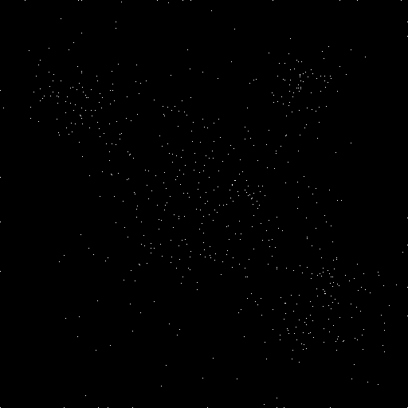
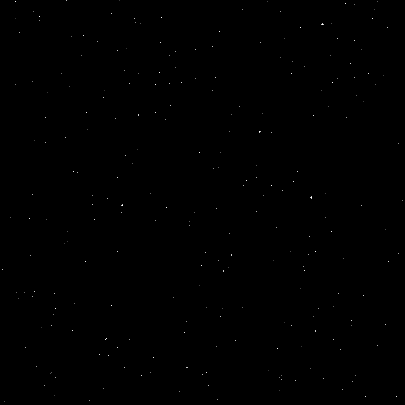

.. _module_2.1.4:

==============================================
2.1.4 - Creating Star Fields
==============================================

:Duration: 18 minutes
:Level: Beginner
:Prerequisites: :ref:`Module 1.1.1 <module_1.1.1>` (RGB Basics), Module 2.1.3 (Circles)

.. contents:: Table of Contents
   :local:
   :depth: 2

Overview
========

In this exercise, you will learn how to create star fields and point patterns
using NumPy's integer array indexing, also known as "fancy indexing." Unlike
the boolean masking technique used for circles, integer array indexing allows
you to place individual pixels at arbitrary locations specified by coordinate
arrays.

This technique is fundamental for particle systems, scatter plots, and
procedural point cloud generation. By controlling the distribution of
random coordinates, you can create effects ranging from uniform star fields
to clustered galaxies.

**Learning Objectives:**

1. Use integer array indexing to place individual pixels at arbitrary locations
2. Generate random point distributions using NumPy's random functions
3. Compare uniform vs. Gaussian distributions for different visual effects
4. Create multi-cluster star fields for galaxy-like patterns

Quick Start
===========

Let's create a simple star field. Run this script to see the result:

.. code-block:: python
   :caption: simple_star.py - Creating a star field with integer array indexing
   :linenos:

   import numpy as np
   from PIL import Image

   # Configuration
   CANVAS_SIZE = 400       # Width and height in pixels
   NUM_STARS = 150         # Number of stars to place
   BACKGROUND = 0          # Black background (grayscale value)
   STAR_BRIGHTNESS = 255   # White stars (grayscale value)

   # Step 1: Create a black canvas (grayscale image)
   canvas = np.full((CANVAS_SIZE, CANVAS_SIZE), BACKGROUND, dtype=np.uint8)

   # Step 2: Generate random coordinates for star positions
   # np.random.randint generates integers in range [low, high)
   x_coords = np.random.randint(0, CANVAS_SIZE, size=NUM_STARS)
   y_coords = np.random.randint(0, CANVAS_SIZE, size=NUM_STARS)

   # Step 3: Place stars using integer array indexing
   # Note: NumPy uses [row, column] order, which is [y, x] in image coordinates
   canvas[y_coords, x_coords] = STAR_BRIGHTNESS

   # Step 4: Save the result
   image = Image.fromarray(canvas, mode='L')  # 'L' for grayscale
   image.save('simple_star.png')

.. figure:: simple_star.png
   :width: 400px
   :align: center
   :alt: White dots randomly scattered on a black background representing stars

   Output: A star field with 150 randomly placed white pixels on a 400x400
   black canvas. Each star occupies exactly one pixel.

.. tip::

   **What you just did:** You used integer array indexing to place 150 pixels
   at once. The key line ``canvas[y_coords, x_coords] = 255`` assigns the
   brightness value to every position specified by the coordinate arrays.
   This is far more efficient than looping through each star individually.

Core Concepts
=============

Concept 1: Integer Array Indexing (Fancy Indexing)
--------------------------------------------------

NumPy supports several ways to select and modify array elements. In Module 2.1.3
(Circles), you used **boolean masking** where a True/False array determines
which pixels to modify. Here, we use **integer array indexing**, where arrays
of integers specify the exact row and column positions [Harris2020]_.

When you write:

.. code-block:: python

   canvas[y_coords, x_coords] = value

NumPy interprets this as: "For each pair ``(y_coords[i], x_coords[i])``, set
that pixel to ``value``." The coordinate arrays must have the same shape.

.. important::

   **Row-Column Order:** NumPy arrays use ``[row, column]`` indexing, which
   corresponds to ``[y, x]`` in image coordinates. This is the opposite of
   mathematical ``(x, y)`` notation. Always remember: **rows are vertical (y),
   columns are horizontal (x)**.

   .. code-block:: python

      # To place a pixel at image position (x=100, y=50):
      canvas[50, 100] = 255  # [row, column] = [y, x]

The table below compares the three main indexing techniques:

.. list-table:: NumPy Indexing Techniques Comparison
   :header-rows: 1
   :widths: 25 35 40

   * - Technique
     - When to Use
     - Example
   * - **Slicing**
     - Rectangular regions
     - ``canvas[0:100, 0:200] = 255``
   * - **Boolean Masking**
     - Shape-based selection (circles, complex regions)
     - ``canvas[distance < radius] = color``
   * - **Integer Indexing**
     - Individual points at arbitrary locations
     - ``canvas[y_coords, x_coords] = 255``

Concept 2: Random Point Distributions
-------------------------------------

The visual appearance of a star field depends heavily on how you generate
the random coordinates. NumPy provides several distribution functions
[NumPyRandom2024]_:

**Uniform Distribution** (``np.random.randint``):

Every position is equally likely. Stars are scattered evenly across the canvas
with no clustering. This creates a "white noise" pattern.

.. code-block:: python

   # Every pixel has equal probability of receiving a star
   x = np.random.randint(0, CANVAS_SIZE, size=NUM_STARS)
   y = np.random.randint(0, CANVAS_SIZE, size=NUM_STARS)

**Gaussian (Normal) Distribution** (``np.random.normal``):

Points cluster around a center point with a bell-curve falloff. The ``spread``
parameter (standard deviation) controls how tightly stars cluster [Ross2014]_.

.. code-block:: python

   # Stars cluster around (CENTER_X, CENTER_Y) with spread=60
   x = np.random.normal(CENTER_X, spread, size=NUM_STARS)
   y = np.random.normal(CENTER_Y, spread, size=NUM_STARS)

   # Clip to canvas bounds (Gaussian can produce out-of-range values)
   x = np.clip(x, 0, CANVAS_SIZE - 1).astype(int)
   y = np.clip(y, 0, CANVAS_SIZE - 1).astype(int)

.. figure:: distribution_comparison.png
   :width: 600px
   :align: center
   :alt: Side-by-side comparison of uniform and Gaussian star distributions

   Left: Uniform distribution creates evenly scattered stars. Right: Gaussian
   distribution creates a cluster with density decreasing from the center.

.. admonition:: Did You Know?

   Real star distributions in galaxies follow neither perfectly uniform nor
   simple Gaussian patterns. Astronomers use complex models like the
   Plummer profile and King models to describe stellar density in globular
   clusters. However, Gaussian distributions provide a good approximation
   for educational and artistic purposes [Binney2008]_.

Concept 3: Star Fields in Generative Art
----------------------------------------

Star fields have been a staple of computer graphics since the earliest days
of video games. The original *Star Raiders* (1979) and *Elite* (1984) used
simple random point placement to create immersive space environments with
minimal computational resources [Maher2012]_.

Modern generative artists use layered star fields to create depth:

1. **Background layer:** Many dim stars (low brightness values)
2. **Midground layer:** Fewer medium-brightness stars
3. **Foreground layer:** Few bright stars, possibly larger (multi-pixel)

This layering creates parallax effects when animated, enhancing the sense
of three-dimensional space.

.. code-block:: python

   # Creating depth with varying brightness
   brightness = np.random.randint(50, 256, size=NUM_STARS)
   for x, y, b in zip(x_coords, y_coords, brightness):
       canvas[y, x] = b

.. figure:: gaussian_cluster.png
   :width: 400px
   :align: center
   :alt: A Gaussian star cluster centered on the canvas

   A star cluster using Gaussian distribution. Notice how star density
   decreases naturally from the center, mimicking real stellar clusters.

Hands-On Exercises
==================

Exercise 1: Execute and Explore
-------------------------------------------

Run the ``simple_star.py`` script from the Quick Start section and observe
the output. Then answer these reflection questions:

**Reflection Questions:**

1. Why do we use ``canvas[y_coords, x_coords]`` instead of ``canvas[x_coords, y_coords]``?
2. What happens if a coordinate exceeds the canvas size (e.g., 500 on a 400-pixel canvas)?
3. How would you create more stars? Fewer stars?

.. dropdown:: Answers

   1. **Y before X:** NumPy uses row-major order where the first index is the
      row (vertical position, y) and the second is the column (horizontal
      position, x). This matches how 2D arrays are stored in memory but is
      opposite to mathematical (x, y) notation.

   2. **Out-of-bounds coordinates:** NumPy will raise an ``IndexError`` if
      any coordinate is outside the array bounds. Always use ``np.clip()``
      or ensure your random range matches the canvas size.

   3. **Changing star count:** Modify the ``NUM_STARS`` parameter. For example,
      ``NUM_STARS = 500`` creates more stars, ``NUM_STARS = 50`` creates fewer.

Exercise 2: Modify to Achieve Goals
-----------------------------------------------

Starting with the Quick Start code, complete these modification tasks:

**Task A: Create a Gaussian star cluster**

Modify the code to use Gaussian distribution instead of uniform distribution.
Center the cluster at position (200, 200) with a spread of 60 pixels.

.. dropdown:: Hint

   Replace ``np.random.randint()`` with ``np.random.normal()``:

   .. code-block:: python

      x_coords = np.random.normal(200, 60, size=NUM_STARS)
      y_coords = np.random.normal(200, 60, size=NUM_STARS)

   Remember to clip and convert to integers afterward.

.. dropdown:: Solution

   .. code-block:: python

      import numpy as np
      from PIL import Image

      CANVAS_SIZE = 400
      NUM_STARS = 200
      CENTER_X, CENTER_Y = 200, 200
      SPREAD = 60

      canvas = np.full((CANVAS_SIZE, CANVAS_SIZE), 0, dtype=np.uint8)

      x_coords = np.random.normal(CENTER_X, SPREAD, size=NUM_STARS)
      y_coords = np.random.normal(CENTER_Y, SPREAD, size=NUM_STARS)

      x_coords = np.clip(x_coords, 0, CANVAS_SIZE - 1).astype(int)
      y_coords = np.clip(y_coords, 0, CANVAS_SIZE - 1).astype(int)

      canvas[y_coords, x_coords] = 255

      Image.fromarray(canvas, mode='L').save('cluster.png')

**Task B: Add a second cluster**

After creating the first cluster, add a second cluster at position (100, 300)
with 80 stars and a tighter spread of 30 pixels.

.. dropdown:: Hint

   Generate a second set of coordinates and place them on the same canvas:

   .. code-block:: python

      # Second cluster
      x2 = np.random.normal(100, 30, size=80)
      y2 = np.random.normal(300, 30, size=80)
      x2 = np.clip(x2, 0, CANVAS_SIZE - 1).astype(int)
      y2 = np.clip(y2, 0, CANVAS_SIZE - 1).astype(int)
      canvas[y2, x2] = 255

.. dropdown:: Solution

   .. code-block:: python

      import numpy as np
      from PIL import Image

      CANVAS_SIZE = 400
      canvas = np.full((CANVAS_SIZE, CANVAS_SIZE), 0, dtype=np.uint8)

      # Cluster 1: Large central cluster
      x1 = np.random.normal(200, 60, size=200)
      y1 = np.random.normal(200, 60, size=200)
      x1 = np.clip(x1, 0, CANVAS_SIZE - 1).astype(int)
      y1 = np.clip(y1, 0, CANVAS_SIZE - 1).astype(int)
      canvas[y1, x1] = 255

      # Cluster 2: Smaller tight cluster
      x2 = np.random.normal(100, 30, size=80)
      y2 = np.random.normal(300, 30, size=80)
      x2 = np.clip(x2, 0, CANVAS_SIZE - 1).astype(int)
      y2 = np.clip(y2, 0, CANVAS_SIZE - 1).astype(int)
      canvas[y2, x2] = 255

      Image.fromarray(canvas, mode='L').save('two_clusters.png')

Exercise 3: Create from Scratch - Multi-Cluster Galaxy 
------------------------------------------------------------------

Create a **galaxy-like image** with multiple star clusters. Each cluster
should have different positions, sizes (number of stars), and spreads.

**Requirements:**

* Canvas size: 512x512 pixels
* At least 3 distinct star clusters
* Vary the number of stars per cluster (50-300 stars)
* Vary the spread per cluster (20-100 pixels)
* Add sparse background stars across the entire canvas

**Starter code:**

.. code-block:: python
   :caption: multi_cluster_starter.py

   import numpy as np
   from PIL import Image

   CANVAS_SIZE = 512
   canvas = np.full((CANVAS_SIZE, CANVAS_SIZE), 0, dtype=np.uint8)

   def add_cluster(canvas, center_x, center_y, num_stars, spread):
       """Add a star cluster to the canvas using Gaussian distribution."""
       # TODO: Generate Gaussian-distributed x coordinates
       x_coords = None  # Replace with your code

       # TODO: Generate Gaussian-distributed y coordinates
       y_coords = None  # Replace with your code

       # TODO: Clip coordinates to canvas bounds
       x_coords = None  # Replace with your code
       y_coords = None  # Replace with your code

       # TODO: Place stars on canvas
       pass  # Replace with your code

   # TODO: Add at least 3 clusters with different parameters

   Image.fromarray(canvas, mode='L').save('multi_cluster.png')

.. dropdown:: Hint 1: Implementing add_cluster

   Use ``np.random.normal()`` for both x and y coordinates:

   .. code-block:: python

      x_coords = np.random.normal(center_x, spread, size=num_stars)
      y_coords = np.random.normal(center_y, spread, size=num_stars)
      x_coords = np.clip(x_coords, 0, canvas.shape[1] - 1).astype(int)
      y_coords = np.clip(y_coords, 0, canvas.shape[0] - 1).astype(int)
      canvas[y_coords, x_coords] = 255

.. dropdown:: Hint 2: Adding background stars

   Add a cluster with a very large spread to scatter stars across the canvas:

   .. code-block:: python

      # Sparse background stars
      add_cluster(canvas, 256, 256, num_stars=100, spread=200)

.. dropdown:: Complete Solution

   .. code-block:: python
      :linenos:

      import numpy as np
      from PIL import Image

      CANVAS_SIZE = 512
      canvas = np.full((CANVAS_SIZE, CANVAS_SIZE), 0, dtype=np.uint8)

      def add_cluster(canvas, center_x, center_y, num_stars, spread):
          """Add a star cluster to the canvas using Gaussian distribution."""
          x_coords = np.random.normal(center_x, spread, size=num_stars)
          y_coords = np.random.normal(center_y, spread, size=num_stars)

          x_coords = np.clip(x_coords, 0, canvas.shape[1] - 1).astype(int)
          y_coords = np.clip(y_coords, 0, canvas.shape[0] - 1).astype(int)

          canvas[y_coords, x_coords] = 255

      # Cluster 1: Large central cluster (main galaxy core)
      add_cluster(canvas, center_x=256, center_y=256, num_stars=300, spread=80)

      # Cluster 2: Smaller cluster to the upper-left
      add_cluster(canvas, center_x=100, center_y=120, num_stars=80, spread=30)

      # Cluster 3: Medium cluster to the lower-right
      add_cluster(canvas, center_x=400, center_y=380, num_stars=120, spread=45)

      # Cluster 4: Small tight cluster (globular cluster style)
      add_cluster(canvas, center_x=380, center_y=100, num_stars=60, spread=20)

      # Cluster 5: Sparse background stars
      add_cluster(canvas, center_x=256, center_y=256, num_stars=100, spread=200)

      Image.fromarray(canvas, mode='L').save('multi_cluster.png')
      print("Created multi-cluster galaxy!")

   Expected output: A galaxy-like pattern with multiple clusters of varying
   density. The central cluster is largest, with smaller satellite clusters
   and sparse background stars.

Challenge Extension
===================

Ready for an advanced challenge? Try creating a star field with depth simulation:

**Brightness Variation for Depth Effect**

Create a star field where each star has a different brightness level,
simulating distance. Brighter stars appear closer, dimmer stars appear
farther away.

**Requirements:**

* 400 stars with random positions
* Random brightness values from 50 (dim) to 255 (bright)
* Add 10 "foreground" stars that are larger (3x3 pixel crosses)

.. dropdown:: Hint: Assigning individual brightness values

   When each star has a unique brightness, you need to use a loop:

   .. code-block:: python

      brightness = np.random.randint(50, 256, size=NUM_STARS)

      for x, y, b in zip(x_coords, y_coords, brightness):
          canvas[y, x] = b

.. dropdown:: Hint: Creating larger foreground stars

   Draw a small cross pattern for bright stars:

   .. code-block:: python

      for x, y in zip(x_bright, y_bright):
          canvas[y, x] = 255      # Center
          canvas[y-1, x] = 200    # Top
          canvas[y+1, x] = 200    # Bottom
          canvas[y, x-1] = 200    # Left
          canvas[y, x+1] = 200    # Right

   Brightness variation creates depth. Dim stars recede into the background
   while bright stars and cross-shaped foreground stars pop forward.

Summary
=======

**Key Takeaways:**

1. **Integer array indexing** places pixels at specific coordinates:
   ``canvas[y_coords, x_coords] = value`` modifies all specified positions at once.

2. **Row-column order:** NumPy uses ``[row, column]`` which is ``[y, x]`` in
   image coordinates. Always put y before x.

3. **Distribution matters:** Uniform random creates scattered patterns;
   Gaussian creates natural-looking clusters with density falloff.

4. **np.clip() prevents errors:** Always clip coordinates to canvas bounds
   before indexing, especially with Gaussian distributions.

5. **Layering creates depth:** Multiple star layers with varying brightness
   and density simulate 3D space on a 2D canvas.

**Common Pitfalls:**

.. warning::

   - **Wrong coordinate order:** Writing ``canvas[x, y]`` instead of
     ``canvas[y, x]`` will place stars in transposed positions.

   - **Forgetting to clip Gaussian coordinates:** ``np.random.normal()`` can
     return values outside the canvas bounds, causing ``IndexError``.

   - **Integer conversion:** Gaussian coordinates are floats. Forgetting
     ``.astype(int)`` after clipping will cause a TypeError.

   - **Duplicate positions:** If two stars land on the same pixel, only
     the last brightness value is kept. For dense fields, this is usually
     acceptable.

Next Steps
==========

You have now learned three fundamental shape techniques:

- **Lines** (Module 2.1.1): Parametric interpolation
- **Circles** (Module 2.1.3): Distance formula with boolean masking
- **Stars** (Module 2.1.4): Integer array indexing with random distributions

Continue to **Module 2.2 (Coordinate Systems)** to learn how polar coordinates
and coordinate transformations enable more complex patterns like spirals,
radial grids, and rotational symmetry.

References
==========

.. [Harris2020] Harris, C. R., et al. (2020). Array programming with NumPy.
   *Nature*, 585(7825), 357-362. https://doi.org/10.1038/s41586-020-2649-2
   [Foundational paper on NumPy's array operations and indexing mechanisms]

.. [NumPyRandom2024] NumPy Developers. (2024). Random sampling (numpy.random).
   *NumPy Reference*. Retrieved January 30, 2025, from
   https://numpy.org/doc/stable/reference/random/index.html
   [Official documentation for NumPy's random number generation functions]

.. [Ross2014] Ross, S. M. (2014). *Introduction to Probability and Statistics
   for Engineers and Scientists* (5th ed.). Academic Press. ISBN: 978-0-12-394811-3
   [Standard reference on probability distributions including Gaussian/normal]

.. [Binney2008] Binney, J., & Tremaine, S. (2008). *Galactic Dynamics* (2nd ed.).
   Princeton University Press. ISBN: 978-0-691-13026-2
   [Advanced reference on stellar distributions in galaxies and star clusters]

.. [Maher2012] Maher, J. (2012). *The Future Was Here: The Commodore Amiga*.
   MIT Press. ISBN: 978-0-262-01720-6
   [Historical context on early computer graphics including star field rendering]

.. [Pearson2011] Pearson, M. (2011). *Generative Art: A Practical Guide Using
   Processing*. Manning Publications. ISBN: 978-1-935182-62-5
   [Practical introduction to generative art techniques including particle systems]

.. [PillowDocs2024] Clark, A., et al. (2024). Pillow (PIL Fork) Documentation.
   Retrieved January 30, 2025, from https://pillow.readthedocs.io/
   [Official documentation for Python Imaging Library used for image saving]
