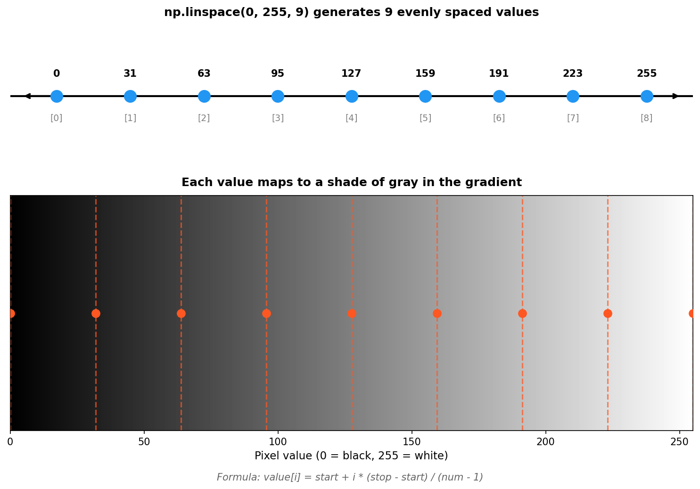

.. _module-2-2-1-gradient:

=====================================
2.2.1 - Gradient
=====================================

:Duration: 20 minutes
:Level: Beginner

Overview
========

Gradients are smooth transitions between values, forming a fundamental building block in digital imaging [Galanter2016]_. In this exercise, you will learn how NumPy's ``np.linspace()`` function generates evenly spaced values for creating smooth visual transitions.

This concept of mapping mathematical values to pixel coordinates is foundational to coordinate-based generative art techniques, from simple backgrounds to complex procedural textures.

**Learning Objectives**

By completing this module, you will:

* Understand how ``np.linspace()`` generates evenly spaced values for smooth transitions
* Map mathematical values to pixel coordinates for gradient creation
* Apply array operations for horizontal and vertical gradients
* Combine techniques to create multi-directional gradients

Quick Start: Your First Gradient
================================

Let's create something visual right away. Run this code to generate a horizontal grayscale gradient:

.. code-block:: python
   :caption: simple_gradient.py - Creating a horizontal gradient
   :linenos:

   import numpy as np
   from PIL import Image

   # Define image dimensions (rectangular to show gradient direction)
   height = 300
   width = 800

   # Create evenly spaced values from 0 (black) to 255 (white)
   gradient_values = np.linspace(0, 255, width, dtype=np.uint8)

   # Create full 2D image by repeating the gradient for each row
   gradient_image = np.tile(gradient_values, (height, 1))

   # Save the gradient image
   output = Image.fromarray(gradient_image, mode='L')
   output.save('simple_gradient.png')

.. figure:: simple_gradient.png
   :width: 600px
   :align: center
   :alt: A horizontal grayscale gradient transitioning from black on the left to white on the right

   A horizontal gradient from black (left) to white (right). The transition is perfectly smooth with no visible banding.

.. tip::

   The key to smooth gradients is ``np.linspace()``, which generates exactly the number of values you need, evenly distributed between your start and end points. This mathematical precision is what makes NumPy ideal for generative art.

Linear Interpolation with np.linspace()
=======================================

Understanding the Function
--------------------------

The function ``np.linspace(start, stop, num)`` is your primary tool for creating gradients [NumPyDocs]_. It generates ``num`` evenly spaced values between ``start`` and ``stop`` (inclusive).

.. code-block:: python

   import numpy as np

   # Generate 5 values from 0 to 100
   values = np.linspace(0, 100, 5)
   print(values)  # Output: [  0.  25.  50.  75. 100.]

   # For image data, specify dtype=np.uint8
   pixel_values = np.linspace(0, 255, 5, dtype=np.uint8)
   print(pixel_values)  # Output: [  0  63 127 191 255]

The mathematical formula behind ``linspace`` is straightforward [Harris2020]_:

.. math::

   value[i] = start + i \times \frac{stop - start}{num - 1}

This linear interpolation ensures perfectly even spacing between all generated values.

   Visual representation of np.linspace(0, 255, 9). Each generated value maps directly to a shade of gray in the gradient. Diagram generated with Claude Code.

.. important::

   Always use ``dtype=np.uint8`` when creating values for image data. Standard images use 8-bit values (0-255), and using floating-point numbers without conversion can cause display issues.

.. admonition:: Did You Know?

   Linear interpolation (often abbreviated as "lerp") is one of the most fundamental operations in computer graphics. It's used not just for gradients, but also for animation, texture mapping, and smooth transitions of all kinds [Gonzalez2018]_.

Mapping Values to Coordinates
=============================

Horizontal vs. Vertical Gradients
---------------------------------

The direction of a gradient depends on which axis the values change along:

- **Horizontal gradient**: Values change across columns (x-axis)
- **Vertical gradient**: Values change across rows (y-axis)

.. code-block:: python

   import numpy as np
   from PIL import Image

   size = 200

   # Horizontal: values vary by column
   horizontal = np.tile(np.linspace(0, 255, size, dtype=np.uint8), (size, 1))

   # Vertical: values vary by row
   vertical = np.tile(
       np.linspace(0, 255, size, dtype=np.uint8).reshape(-1, 1),
       (1, size)
   )

The ``np.tile()`` function repeats an array to fill the desired shape. For horizontal gradients, we repeat a row of values vertically. For vertical gradients, we create a column of values and repeat it horizontally.

Broadcasting and Array Operations
---------------------------------

NumPy's broadcasting allows us to combine 1D arrays to create 2D results. This is how we create diagonal gradients:

.. code-block:: python

   # Horizontal component: shape (size,)
   h = np.linspace(0, 255, size)

   # Vertical component: shape (size, 1)
   v = np.linspace(0, 255, size).reshape(-1, 1)

   # Broadcasting creates shape (size, size)
   diagonal = (h + v) / 2

When adding arrays of shapes ``(size,)`` and ``(size, 1)``, NumPy broadcasts them to create a ``(size, size)`` result where each position ``(y, x)`` contains the value ``(h[x] + v[y]) / 2``.

.. figure:: gradient_variations.png
   :width: 600px
   :align: center
   :alt: Four gradient variations showing horizontal, vertical, diagonal, and reverse diagonal gradients

   Different gradient directions achieved by varying which axis the values change along. The diagonal gradients combine horizontal and vertical components.

.. note::

   The ``reshape(-1, 1)`` operation converts a 1D array into a column vector. The ``-1`` tells NumPy to automatically calculate that dimension based on the array size.

Hands-On Exercises
==================

These exercises follow a progressive pattern: first observe, then modify, then create from scratch. This scaffolded approach aligns with cognitive load theory principles for effective learning [Sweller2020]_.

Exercise 1: Execute and Explore
-------------------------------

Run the :download:`simple_gradient.py` script and observe the output carefully.

.. code-block:: python
   :caption: Exercise 1 - Run and observe
   :linenos:

   import numpy as np
   from PIL import Image

   height = 300
   width = 800
   gradient_values = np.linspace(0, 255, width, dtype=np.uint8)
   gradient_image = np.tile(gradient_values, (height, 1))

   output = Image.fromarray(gradient_image, mode='L')
   output.save('simple_gradient.png')

   # Explore the values
   print(f"First 5 values: {gradient_values[:5]}")
   print(f"Last 5 values: {gradient_values[-5:]}")
   print(f"Middle value: {gradient_values[width//2]}")

**Reflection questions:**

* What value appears at the leftmost edge of the image? Why?
* What value appears at the rightmost edge? Is it exactly 255?
* What would happen if you changed ``np.linspace(0, 255, width)`` to ``np.linspace(128, 255, width)``?

.. dropdown:: Solution and Explanation

   **Answers:**

   1. The leftmost edge has value **0** (black) because that's the ``start`` parameter of ``linspace``.

   2. The rightmost edge has value **255** (white) because that's the ``stop`` parameter. Yes, it's exactly 255 because ``linspace`` includes both endpoints.

   3. Changing to ``np.linspace(128, 255, width)`` would create a gradient from **mid-gray to white** instead of black to white. The gradient would appear "lighter" overall.

   **Key insight:** The ``start`` and ``stop`` parameters directly control the brightness range of your gradient.

Exercise 2: Modify to Achieve Goals
-----------------------------------

Starting with the basic gradient code, modify it to achieve each goal:

**Goals:**

1. Create a **vertical** grayscale gradient (dark at top, light at bottom)
2. Create a gradient from **mid-gray (128) to white (255)**
3. Create a **reversed** gradient (white on left, black on right)

.. dropdown:: Hints

   * **Goal 1:** You need to make values change across rows instead of columns. Consider using ``reshape(-1, 1)`` to create a column vector.

   * **Goal 2:** Simply change the ``start`` parameter of ``linspace`` from 0 to 128.

   * **Goal 3:** Either swap the start and stop values in ``linspace``, or use array slicing with ``[::-1]`` to reverse the array.

.. dropdown:: Solutions

   **1. Vertical gradient:**

   .. code-block:: python

      height, width = 300, 800
      # Create column vector of values
      vertical_values = np.linspace(0, 255, height, dtype=np.uint8).reshape(-1, 1)
      # Tile horizontally to fill width
      gradient_image = np.tile(vertical_values, (1, width))
      Image.fromarray(gradient_image, mode='L').save('vertical_gradient.png')

   The ``reshape(-1, 1)`` creates a column vector, and ``tile(..., (1, width))`` repeats it across the width.

   **2. Mid-gray to white:**

   .. code-block:: python

      gradient_values = np.linspace(128, 255, width, dtype=np.uint8)
      gradient_image = np.tile(gradient_values, (height, 1))

   Simply changing the start value from 0 to 128 shifts the entire gradient range.

   **3. Reversed gradient:**

   .. code-block:: python

      # Method 1: Swap start and stop
      gradient_values = np.linspace(255, 0, width, dtype=np.uint8)

      # Method 2: Reverse the array
      gradient_values = np.linspace(0, 255, width, dtype=np.uint8)[::-1]

   Both methods produce identical results. Method 1 is more readable; Method 2 is useful when you need to reverse an existing array.

Exercise 3: Create a Diagonal Gradient
--------------------------------------

Create a 400x400 grayscale image with a diagonal gradient that transitions from black in the top-left corner to white in the bottom-right corner.

**Goal:** Combine horizontal and vertical gradients to create a smooth diagonal transition.

**Requirements:**

* Image size: 400x400 pixels
* Top-left corner should be black (value 0)
* Bottom-right corner should be white (value 255)
* The center should be mid-gray (approximately 127)

**Hints:**

* A diagonal gradient is the average of horizontal and vertical components
* Use broadcasting: add a row vector and a column vector
* Remember to convert to ``uint8`` after averaging

.. code-block:: python
   :caption: Exercise 3 starter code

   import numpy as np
   from PIL import Image

   size = 400

   # TODO: Create horizontal component (values 0-255 across width)
   horizontal = None  # Your code here

   # TODO: Create vertical component (values 0-255 down height)
   vertical = None  # Your code here

   # TODO: Combine components (average them)
   diagonal = None  # Your code here

   # TODO: Convert to uint8 and save
   gradient_image = None  # Your code here

   output = Image.fromarray(gradient_image, mode='L')
   output.save('my_diagonal_gradient.png')

.. dropdown:: Complete Solution

   .. code-block:: python
      :caption: diagonal_gradient_solution.py
      :linenos:
      :emphasize-lines: 8-9,12-13,17-18

      import numpy as np
      from PIL import Image

      size = 400

      # Create horizontal gradient values (0 to 255 across width)
      # This creates a 1D array of shape (size,)
      horizontal = np.linspace(0, 255, size)

      # Create vertical gradient values (0 to 255 down height)
      # reshape(-1, 1) creates a column vector of shape (size, 1)
      vertical = np.linspace(0, 255, size).reshape(-1, 1)

      # Combine: broadcasting creates (size, size) array
      # Each position (y, x) = (horizontal[x] + vertical[y]) / 2
      diagonal = (horizontal + vertical) / 2

      # Convert to uint8 for image format
      gradient_image = diagonal.astype(np.uint8)

      output = Image.fromarray(gradient_image, mode='L')
      output.save('diagonal_gradient.png')

   **How it works:**

   * **Line 8:** Creates a 1D array ``[0, 0.64, 1.28, ..., 255]`` with 400 values
   * **Line 12:** Creates a column vector of the same values
   * **Line 17:** Broadcasting adds every row value to every column value, creating a 2D grid where corner values are: top-left=0, top-right=127.5, bottom-left=127.5, bottom-right=255
   * **Line 20:** Converts floating-point values to integers for proper image display

   Expected output: A diagonal gradient with smooth transition from corner to corner.

**Challenge extension:** Try creating a gradient that goes from the top-right corner to the bottom-left corner. What changes do you need to make?

Summary
=======

In this exercise, you learned the fundamentals of gradient creation:

**Key takeaways:**

* ``np.linspace(start, stop, num)`` generates evenly spaced values for smooth transitions
* Horizontal gradients: values change across columns (x-axis)
* Vertical gradients: values change across rows (use ``reshape(-1, 1)``)
* Diagonal gradients: combine horizontal and vertical components through averaging
* Always use ``dtype=np.uint8`` for standard 8-bit image data

**Common pitfalls to avoid:**

* Forgetting ``dtype=np.uint8`` can cause display issues with floating-point arrays
* Remember: image arrays are ``[row, column]`` not ``[x, y]``
* When combining gradients, divide by the number of components to keep values in range

This foundational knowledge of coordinate-based value mapping prepares you for more advanced techniques like spirals, vector fields, and distance fields in upcoming modules.

References
==========

.. [Harris2020] Harris, C. R., Millman, K. J., van der Walt, S. J., et al. (2020). Array programming with NumPy. *Nature*, 585(7825), 357-362. https://doi.org/10.1038/s41586-020-2649-2 [Foundational paper on NumPy array operations]

.. [Gonzalez2018] Gonzalez, R. C., & Woods, R. E. (2018). *Digital Image Processing* (4th ed.). Pearson. ISBN: 978-0-13-335672-4 [Standard reference for image processing fundamentals including interpolation]

.. [Pearson2011] Pearson, M. (2011). *Generative Art: A Practical Guide Using Processing*. Manning Publications. ISBN: 978-1-935182-62-5 [Practical guide to generative art techniques]

.. [NumPyDocs] NumPy Developers. (2024). numpy.linspace documentation. *NumPy v1.26 Manual*. https://numpy.org/doc/stable/reference/generated/numpy.linspace.html [Official documentation for np.linspace]

.. [PillowDocs] Clark, A., et al. (2024). Pillow (PIL Fork) Documentation. https://pillow.readthedocs.io/en/stable/ [Official Pillow documentation for image handling]

.. [Sweller2020] Sweller, J., van Merriënboer, J. J. G., & Paas, F. (2020). Cognitive architecture and instructional design: 20 years later. *Educational Psychology Review*, 31(2), 261-292. [Cognitive load theory informing exercise scaffolding]

.. [Galanter2016] Galanter, P. (2016). Generative art theory. In C. Paul (Ed.), *A Companion to Digital Art* (pp. 146-180). Wiley-Blackwell. https://doi.org/10.1002/9781118475249.ch8 [Theoretical foundations of generative art]
