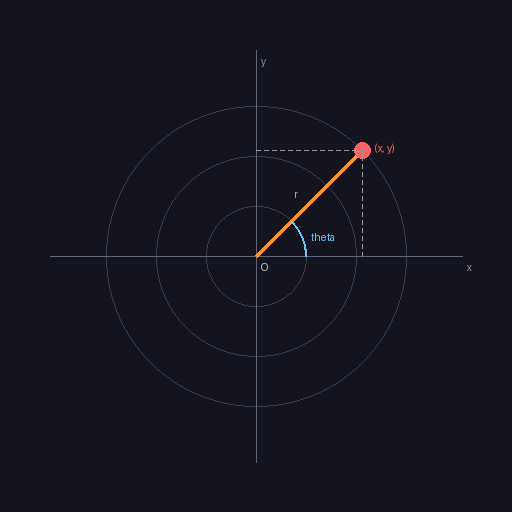

.. _module-2-2-2-spiral:

==================
2.2.2 - Spiral
==================

:Duration: 20 minutes
:Level: Beginner

Overview
========

Spirals are among the most captivating patterns in both nature and art. From the nautilus shell to galaxy arms, from ancient Celtic symbols to modern generative art, the spiral represents growth, evolution, and infinite possibility. In this exercise, you will learn to create spirals programmatically using polar coordinates and Python generators.

**Learning Objectives**

By the end of this exercise, you will be able to:

* Convert between polar coordinates (angle, radius) and Cartesian coordinates (x, y)
* Implement the Archimedean spiral equation: r = a + b * theta
* Use Python generators to create potentially infinite sequences of points
* Modify spiral parameters to create variations in tightness, direction, and density

Quick Start
===========

Let's create a spiral. Download and run the complete script:

:download:`Download simple_spiral.py <simple_spiral.py>`

.. code-block:: bash

   python simple_spiral.py

.. figure:: simple_spiral.png
   :width: 400px
   :align: center
   :alt: A white Archimedean spiral on black background, starting from center and expanding outward

   An Archimedean spiral created with the Archimedean spiral equation. The spiral makes approximately 8 complete rotations.

**How it works:**

The script uses a **generator function** to produce spiral coordinates one at a time:

.. code-block:: python
   :caption: Core algorithm from simple_spiral.py

   def spiral_generator(start_radius=10, growth_rate=4.0, num_points=500):
       """Generate points along an Archimedean spiral."""
       for i in range(num_points):
           angle = i * 0.1  # Angle increases with each point
           radius = start_radius + growth_rate * angle  # r = a + b * theta

           # Convert polar to Cartesian coordinates
           x = int(center_x + radius * np.cos(angle))
           y = int(center_y + radius * np.sin(angle))
           yield x, y

The drawing loop connects consecutive points with lines:

.. code-block:: python
   :caption: Drawing loop from simple_spiral.py

   spiral = spiral_generator(start_radius=10, growth_rate=4.0, num_points=500)
   prev_x, prev_y = next(spiral)

   for x, y in spiral:
       draw_line(image, prev_x, prev_y, x, y, white)
       prev_x, prev_y = x, y

.. tip::

   The spiral starts at the center and grows outward. Each point is calculated using polar coordinates (angle, radius), then converted to pixel positions using cosine and sine functions.

Core Concepts
=============

Concept 1: Polar Coordinates
----------------------------

In Cartesian coordinates, we describe a point using horizontal (x) and vertical (y) distances from the origin. **Polar coordinates** offer an alternative: describe a point using an **angle** (theta) and a **distance** (radius) from the center.

   Polar coordinates define a point by angle (theta) and radius (r). The orange line shows the radius, the blue arc shows the angle. Diagram generated with Claude Code.

**Conversion Formulas**

To convert from polar (r, theta) to Cartesian (x, y):

.. math::

   x = r \cdot \cos(\theta)

   y = r \cdot \sin(\theta)

.. code-block:: python
   :caption: Polar to Cartesian conversion

   import numpy as np

   # Point in polar coordinates
   angle = np.radians(45)  # Convert degrees to radians
   radius = 100

   # Convert to Cartesian (relative to center)
   x = radius * np.cos(angle)  # x = 70.7
   y = radius * np.sin(angle)  # y = 70.7

.. important::

   NumPy's trigonometric functions (``np.cos``, ``np.sin``) expect angles in **radians**, not degrees. Use ``np.radians()`` to convert, or work directly in radians where one full rotation equals 2 * pi (approximately 6.28).

.. admonition:: Did You Know?

   Polar coordinates were introduced by Isaac Newton and Jacob Bernoulli in the 17th century. They are particularly useful for describing circular and spiral patterns, where the relationship between angle and distance is more intuitive than x-y positions [Coolidge1952]_.

Concept 2: The Archimedean Spiral
---------------------------------

The **Archimedean spiral** is defined by a simple equation:

.. math::

   r = a + b \cdot \theta

Where:

* **r** is the radius (distance from center)
* **a** is the starting radius (distance from center at theta=0)
* **b** is the growth rate (how much the radius increases per radian)
* **theta** is the angle (in radians)

This creates a spiral where the distance between successive turns remains **constant**. Contrast this with logarithmic spirals found in nature, where spacing grows exponentially.

.. code-block:: python
   :caption: Archimedean spiral calculation

   # Parameters
   start_radius = 5    # 'a' in the equation
   growth_rate = 0.5   # 'b' in the equation

   for i in range(500):
       angle = i * 0.1  # Angle increases with each point
       radius = start_radius + growth_rate * angle

       # At i=0: angle=0, radius=5 (starting point)
       # At i=100: angle=10, radius=10 (halfway out)
       # At i=500: angle=50, radius=30 (outer edge)

**Parameter Effects**

.. figure:: spiral_variations.png
   :width: 500px
   :align: center
   :alt: 2x2 grid showing four spirals with different parameters - tight, loose, dense, and sparse

   Four variations showing how parameters affect spiral appearance. Top-left: tight (growth=0.3). Top-right: loose (growth=1.0). Bottom-left: dense (step=0.05). Bottom-right: sparse (step=0.3).

* **growth_rate** controls how quickly the spiral expands. Smaller values create tighter spirals with more turns; larger values create looser spirals.
* **angle_step** controls the density of points. Smaller steps create smoother curves; larger steps create more angular spirals.

.. note::

   The Archimedean spiral is named after the ancient Greek mathematician Archimedes, who described it in his work "On Spirals" around 225 BCE [Heath1897]_.

Concept 3: Python Generators for Parametric Drawing
---------------------------------------------------

A **generator function** in Python uses ``yield`` instead of ``return``. It produces values one at a time, making it ideal for sequences that could be infinite - like a spiral that theoretically never ends.

.. code-block:: python
   :caption: Generator pattern for spiral points

   def spiral_generator(start_radius, growth_rate, num_points):
       """Generate spiral points one at a time using yield."""
       for i in range(num_points):
           angle = i * 0.1
           radius = start_radius + growth_rate * angle

           x = int(center_x + radius * np.cos(angle))
           y = int(center_y + radius * np.sin(angle))

           yield x, y  # Return this point, pause, then continue

   # Usage: iterate through points without storing them all in memory
   for x, y in spiral_generator(5, 0.5, 1000):
       # Draw each point as it's generated
       pass

**Why Use Generators?**

1. **Memory Efficiency**: Points are calculated on-demand, not stored in a list
2. **Conceptual Match**: Spirals are theoretically infinite; generators model this naturally
3. **Flexibility**: Can stop iteration at any point without calculating unnecessary values

.. tip::

   Generators are a powerful Python feature that appears throughout generative art. They enable lazy evaluation, which means work is done only when needed. This concept transfers to animation (generating frames) and procedural content (generating terrain or textures).

Hands-On Exercises
==================

Exercise 1: Execute and Explore
-------------------------------

Run the ``simple_spiral.py`` script and observe the output.

.. code-block:: bash

   python simple_spiral.py

**Reflection Questions**

1. Where does the spiral begin drawing - at the center or the edge?
2. Approximately how many complete rotations does the spiral make?
3. What color is the spiral, and how would you change it?

.. dropdown:: Answers

   1. **Center**: The spiral starts at the center (where radius is smallest) and expands outward. The starting point is at ``start_radius=5`` pixels from center.

   2. **About 8 rotations**: With ``num_points=500`` and ``angle_step=0.1``, the total angle covered is ``500 * 0.1 = 50 radians``. Since one full rotation is ``2*pi`` (about 6.28 radians), we get approximately ``50 / 6.28 = 7.96`` rotations.

   3. **White [255, 255, 255]**: To change the color, modify the ``color`` variable in the ``draw_line`` function call. For example, ``[255, 0, 0]`` for red or ``[0, 255, 0]`` for green.

Exercise 2: Modify Parameters
-----------------------------

Modify the parameters in ``simple_spiral.py`` to achieve these goals:

**Goals**

1. Create a **tighter spiral** with more rotations in the same space
2. Create a **looser spiral** with fewer rotations
3. Create a spiral that starts from the **outer edge** and goes inward

.. dropdown:: Hint 1: Tighter spiral

   Decrease the ``growth_rate`` parameter. A smaller growth rate means the radius increases more slowly, creating more turns before reaching the edge.

.. dropdown:: Hint 2: Looser spiral

   Increase the ``growth_rate`` parameter. Try values like 1.0 or 1.5 - the spiral will expand quickly with fewer rotations.

.. dropdown:: Hint 3: Inward spiral

   Start with a large radius and use a **negative** growth rate. For example: ``start_radius=200, growth_rate=-0.4``.

.. dropdown:: Solution

   .. code-block:: python

      # Tighter spiral (more rotations)
      spiral = spiral_generator(start_radius=5, growth_rate=0.3, num_points=600)

      # Looser spiral (fewer rotations)
      spiral = spiral_generator(start_radius=5, growth_rate=1.0, num_points=300)

      # Inward spiral (starts from edge)
      spiral = spiral_generator(start_radius=200, growth_rate=-0.4, num_points=500)

   The key insight is that ``growth_rate`` controls how quickly the spiral expands (positive) or contracts (negative), while ``num_points`` and ``angle_step`` together determine how many rotations occur.

Exercise 3: Create a Color Gradient Spiral
------------------------------------------

Create a spiral where the color changes from **red at the center** to **blue at the outer edge**. This requires modifying the generator to track progress and interpolating between colors.

**Requirements**

* Spiral starts red (RGB: 255, 50, 50) at center
* Spiral ends blue (RGB: 50, 50, 255) at edge
* Color transitions smoothly along the path
* Use the generator pattern learned in Core Concepts

.. dropdown:: Starter Code

   .. code-block:: python

      # In spiral_generator, calculate progress:
      progress = i / (num_points - 1)  # 0.0 to 1.0

      yield x, y, progress  # Include progress in output

      # For color interpolation:
      def interpolate_color(color1, color2, t):
          # Linear interpolation: result = color1 * (1-t) + color2 * t
          # TODO: Implement this
          pass

.. dropdown:: Hint: Color Interpolation

   Linear interpolation blends two values based on a parameter ``t`` (0 to 1):

   .. code-block:: python

      # When t=0: returns color1
      # When t=1: returns color2
      # When t=0.5: returns midpoint
      blended = color1 * (1 - t) + color2 * t

.. dropdown:: Complete Solution

   .. code-block:: python
      :linenos:
      :emphasize-lines: 12,18-20

      import numpy as np
      from PIL import Image

      width, height = 512, 512
      center_x, center_y = width // 2, height // 2
      image = np.zeros((height, width, 3), dtype=np.uint8)

      start_color = np.array([255, 50, 50])   # Red
      end_color = np.array([50, 50, 255])     # Blue

      def spiral_generator(start_radius, growth_rate, num_points):
          for i in range(num_points):
              angle = i * 0.1
              radius = start_radius + growth_rate * angle
              x = int(center_x + radius * np.cos(angle))
              y = int(center_y + radius * np.sin(angle))
              progress = i / (num_points - 1) if num_points > 1 else 0
              yield x, y, progress

      def interpolate_color(color1, color2, t):
          t = max(0, min(1, t))  # Clamp to [0, 1]
          return (color1 * (1 - t) + color2 * t).astype(np.uint8)

      # Draw with gradient color
      spiral = spiral_generator(5, 0.5, 500)
      prev_x, prev_y, prev_progress = next(spiral)
      for x, y, progress in spiral:
          color = interpolate_color(start_color, end_color, progress)
          draw_line(image, prev_x, prev_y, x, y, color)
          prev_x, prev_y = x, y

   **Key insights:**

   * Line 12: ``progress`` tracks how far along the spiral we are (0 at center, 1 at edge)
   * Lines 18-20: ``interpolate_color`` blends between two colors based on progress
   * The ``t`` value determines the blend: 0 = all start_color, 1 = all end_color

.. figure:: color_spiral.png
   :width: 400px
   :align: center
   :alt: A spiral transitioning from red at center to blue at outer edge

   The completed color gradient spiral, showing smooth transition from red to blue.

Challenge Extension
-------------------

Ready for more? Try these advanced variations:

**A. Rainbow Spiral**: Cycle through all hues (red, orange, yellow, green, blue, violet) as the spiral expands. Hint: Use HSV color space and convert to RGB.

**B. Dotted Spiral**: Instead of a continuous line, draw individual dots at each point. Vary the dot size based on position.

**C. Double Spiral**: Create two interleaved spirals, 180 degrees apart (like a galaxy's arms). Use different colors for each arm.

**D. Animated Spiral**: Create a GIF where the spiral appears to grow outward from the center over multiple frames.

Summary
=======

In this exercise, you learned to create Archimedean spirals using polar coordinates and Python generators.

**Key Takeaways**

* **Polar coordinates** (angle, radius) are more natural than Cartesian (x, y) for circular patterns
* Convert using: ``x = r * cos(theta)``, ``y = r * sin(theta)``
* The **Archimedean spiral** follows ``r = a + b * theta`` where spacing between turns is constant
* **Generators** produce values on-demand, modeling infinite sequences efficiently
* **Parameter tuning** (growth_rate, angle_step) dramatically changes visual appearance

**Common Pitfalls**

* **Forgetting radians**: NumPy trig functions expect radians. Use ``np.radians(degrees)`` or work in radians directly.
* **Integer truncation**: Always use ``int()`` when converting calculated coordinates to pixel positions, but be aware this rounds toward zero.
* **Off-center spirals**: Ensure you add ``center_x`` and ``center_y`` to your calculated x and y values.
* **Invisible spirals**: If ``growth_rate`` is too large or ``num_points`` too small, the spiral may exit the image bounds quickly.

References
==========

.. [Archimedes225BCE] Archimedes. (c. 225 BCE). On Spirals. Syracuse. [Original work on spiral mathematics, describing the Archimedean spiral]

.. [Coolidge1952] Coolidge, J. L. (1952). The Origin of Polar Coordinates. *The American Mathematical Monthly*, 59(2), 78-85. [Historical overview of polar coordinate development]

.. [Heath1897] Heath, T. L. (1897). *The Works of Archimedes*. Cambridge University Press. [English translation of Archimedes' mathematical works including spiral theory]

.. [NumPyTrig] NumPy Developers. (2024). NumPy Trigonometric Functions. *NumPy Documentation*. Retrieved November 30, 2025, from https://numpy.org/doc/stable/reference/routines.math.html [Official documentation for cos, sin, radians functions]

.. [PythonGenerators] Python Software Foundation. (2024). Generator Expressions. *Python Documentation*. Retrieved November 30, 2025, from https://docs.python.org/3/howto/functional.html#generators [Official Python documentation on generators]

.. [Thompson1917] Thompson, D. W. (1917). *On Growth and Form*. Cambridge University Press. [Classic work on mathematical patterns in nature, including spiral growth]

.. [PearsonSpirals] Pearson, M. (2011). *Generative Art: A Practical Guide Using Processing*. Manning Publications. ISBN: 978-1-935182-62-5 [Modern generative art techniques including spiral variations]

.. [Sweller2011] Sweller, J., Ayres, P., & Kalyuga, S. (2011). *Cognitive Load Theory*. Springer. ISBN: 978-1-4419-8125-7 [Theoretical framework for managing complexity in learning]
