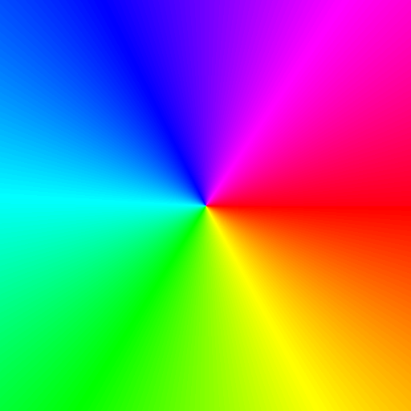
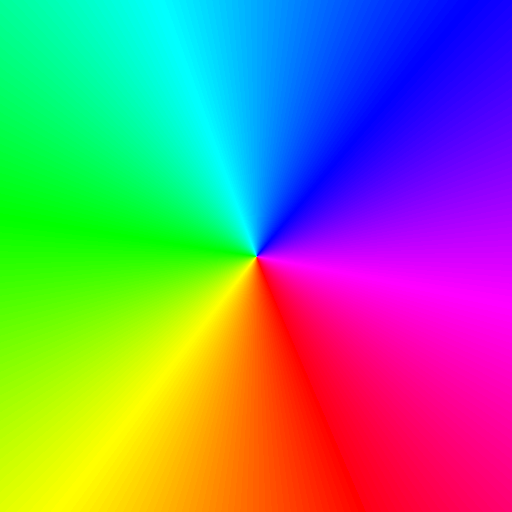

.. _module-2-2-3-vector-fields:

=============================
2.2.3 - Vector Fields
=============================

:Duration: 20 minutes
:Level: Beginner

Overview
========

Vector fields are everywhere in our world, from wind patterns swirling across weather maps to magnetic forces guiding compass needles, and water currents flowing through rivers. In this exercise, you will learn to visualize these invisible forces as colorful patterns by mapping direction to color.

A **vector field** assigns a direction and magnitude to every point in space. While we cannot see magnetic fields or wind directly, we can represent them visually. By the end of this exercise, you will be able to create stunning visualizations that reveal the hidden structure of these mathematical objects.

**Learning Objectives**

By completing this module, you will:

* Understand what vector fields are and how they assign direction to every point
* Create visual representations using color-coded pixels where hue represents direction
* Apply ``np.arctan2`` to convert direction vectors into angles
* Combine different field types (radial and rotational) to create complex patterns

Quick Start: See the Flow
=========================

Let's visualize a vector field. Download and run the complete script:

:download:`Download simple_vector_field.py <simple_vector_field.py>`

.. code-block:: bash

   python simple_vector_field.py

   Each pixel's color represents the direction pointing toward the center. Red points right, cyan points left, and the full rainbow represents all 360 degrees.

**How it works:**

The script creates a radial vector field where each pixel points toward the center. The key steps are:

.. code-block:: python
   :caption: Core algorithm from simple_vector_field.py

   # Create coordinate grids and calculate vectors pointing toward center
   y_coords, x_coords = np.ogrid[:height, :width]
   dx = center_x - x_coords  # Vector x component
   dy = center_y - y_coords  # Vector y component

   # Convert direction vector to angle using arctan2
   angle = np.arctan2(dy, dx)

   # Map angle to hue (0-255 range for full color spectrum)
   hue = ((angle + np.pi) / (2 * np.pi) * 255).astype(np.uint8)

The script then converts hue values to RGB colors using a segment-based color wheel, creating the rainbow effect you see in the output.

.. tip::

   Think of this image as a map of invisible arrows. Each color represents a direction, and together they show where the "flow" would go if something followed the field.

What is a Vector Field?
=======================

The Mathematics of Direction
----------------------------

A **vector field** is a mathematical function that assigns a vector (a direction and magnitude) to every point in space. We write this as:

.. math::

   \vec{F}(x, y) = (dx, dy)

This means at every coordinate (x, y), there is a vector pointing in direction (dx, dy). In our visualization, we focus on the direction and use color to represent it.

**Key insight**: The function ``np.arctan2(dy, dx)`` converts a direction vector into an angle. This is the inverse of what sine and cosine do - they convert angles into x and y components [NumPyTrig]_.

.. code-block:: python

   # Example: Direction vector (1, 1) points diagonally up-right
   dx, dy = 1, 1
   angle = np.arctan2(dy, dx)  # Returns 0.785 radians (45 degrees)

.. important::

   Unlike ``np.arctan(dy/dx)``, the ``arctan2`` function handles all four quadrants correctly and avoids division-by-zero errors. Always use ``arctan2`` for direction calculations.

.. admonition:: Did You Know?

   Vector fields were first formalized by James Clerk Maxwell in the 1860s to describe electromagnetic phenomena. His equations, which describe electric and magnetic fields, are still the foundation of all electrical engineering today [Maxwell1865]_.

.. figure:: vector_field_diagram.png
   :width: 600px
   :align: center
   :alt: Side-by-side comparison showing color-coded vector field on left and same field with arrows overlaid on right, demonstrating how each pixel represents a direction vector

   Left: Color-coded field where hue represents direction. Right: Same field with arrows showing the actual vectors. Each pixel contains an invisible arrow pointing toward the center. Diagram generated with Claude Code.

Mapping Direction to Color
==========================

The Color Wheel Connection
--------------------------

To visualize direction, we map the angle (0 to 360 degrees, or 0 to 2 pi radians) to hue on the color wheel. This creates an intuitive mapping where:

* **Red (0 degrees)**: Points right (+x direction)
* **Yellow (60 degrees)**: Points up-right
* **Green (120 degrees)**: Points up-left
* **Cyan (180 degrees)**: Points left (-x direction)
* **Blue (240 degrees)**: Points down-left
* **Magenta (300 degrees)**: Points down-right

.. code-block:: python

   # Convert angle from [-pi, pi] to [0, 255] for color mapping
   # arctan2 returns values from -pi to pi
   angle = np.arctan2(dy, dx)

   # Shift and scale to 0-255 range
   hue = ((angle + np.pi) / (2 * np.pi) * 255).astype(np.uint8)

This technique is widely used in flow visualization for scientific computing, where researchers need to see patterns in fluid dynamics, weather systems, and other physical phenomena [Laidlaw2005]_.

.. note::

   The color wheel is circular, just like angles. This makes it a natural choice for representing direction, where 0 degrees and 360 degrees should look the same.

Common Field Patterns
=====================

Building Blocks of Flow
-----------------------

There are several fundamental vector field patterns that appear throughout nature and mathematics. Understanding these building blocks allows you to create more complex fields by combining them.

.. figure:: vector_field_variations.png
   :width: 600px
   :align: center
   :alt: Four-panel comparison showing radial inward field, radial outward field, rotational circular field, and uniform diagonal field

   Four fundamental vector field types: Radial Inward (like gravity), Radial Outward (like explosion), Rotational (like whirlpool edges), and Uniform (like wind).

**1. Radial Fields** point toward or away from a center point:

.. code-block:: python

   # Inward (toward center) - like gravity or attraction
   dx = center_x - x_coords
   dy = center_y - y_coords

   # Outward (away from center) - like explosion or repulsion
   dx = x_coords - center_x
   dy = y_coords - center_y

**2. Rotational Fields** are perpendicular to radial, creating circular flow:

.. code-block:: python

   # Counterclockwise rotation - swap and negate
   dx = -(y_coords - center_y)  # dx = -dy_radial
   dy = (x_coords - center_x)   # dy = dx_radial

**3. Uniform Fields** have the same direction everywhere:

.. code-block:: python

   # Constant diagonal direction (northeast)
   dx = np.ones_like(x_coords)
   dy = np.ones_like(y_coords)

.. admonition:: Did You Know?

   The perpendicular relationship between radial and rotational fields is the key to understanding vortices. In a whirlpool or hurricane, the circular flow (rotational) combines with the inward pull (radial) to create the characteristic spiral pattern [Acheson1990]_.

Hands-On Exercises
==================

These exercises follow the Execute, Modify, Re-code progression to build your understanding step by step.

Exercise 1: Execute and Explore
-------------------------------

Run the ``simple_vector_field.py`` script and observe the output carefully.

.. code-block:: bash

   python simple_vector_field.py

**Reflection questions:**

1. What color appears at the top of the image? Why does this color represent that direction?
2. What happens at the exact center of the image? Why might this point be special?
3. If you trace a circle around the center, how do the colors change? What pattern do you see?

.. dropdown:: Solutions & Explanation

   **1. Top of image**: The top shows **cyan** (or light blue) because vectors at the top point downward toward the center. Cyan represents the direction pointing left/down on the color wheel, which corresponds to the "toward center" direction from the top.

   **2. Center point**: At the exact center, the vector (dx, dy) = (0, 0) has undefined direction. The ``arctan2`` function returns 0 for this case, so it appears red. This is a **singularity** - a point where the field is not well-defined.

   **3. Circle around center**: Tracing a circle shows all colors of the rainbow in order. This happens because each point on the circle has a different angle toward the center, and these angles cover the full 360 degrees, mapping to the complete color wheel.

Exercise 2: Modify to Achieve Goals
-----------------------------------

Starting with the ``simple_vector_field.py`` code, modify it to achieve these goals:

**Goals:**

1. **Reverse the field**: Make vectors point outward (away from center) instead of inward
2. **Create rotation**: Make vectors flow in a circle around the center (counterclockwise)
3. **Combine fields**: Create a spiral by adding rotational and radial components

.. dropdown:: Hints

   * **Goal 1**: The inward field uses ``center - coords``. For outward, reverse the subtraction.
   * **Goal 2**: To get perpendicular vectors, swap x and y components and negate one: ``dx = -rel_y, dy = rel_x``
   * **Goal 3**: Simply add the components: ``dx = dx_radial + dx_rotation``

.. dropdown:: Solutions

   **1. Outward field:**

   .. code-block:: python

      # Change from (center - coords) to (coords - center)
      dx = x_coords - center_x  # Points away from center
      dy = y_coords - center_y

   The colors should appear rotated 180 degrees from the original - opposite direction.

   **2. Rotational field:**

   .. code-block:: python

      # Get relative coordinates first
      rel_x = x_coords - center_x
      rel_y = y_coords - center_y

      # Perpendicular: swap and negate for counterclockwise
      dx = -rel_y
      dy = rel_x

   This creates a field where colors form concentric bands around the center.

   **3. Combined spiral:**

   .. code-block:: python

      rel_x = x_coords - center_x
      rel_y = y_coords - center_y

      # Rotational component
      dx_rot = -rel_y
      dy_rot = rel_x

      # Inward radial component
      dx_rad = -rel_x
      dy_rad = -rel_y

      # Combine them
      dx = dx_rot + dx_rad
      dy = dy_rot + dy_rad

   This creates a spiral pattern where the colors twist as they approach the center.

Exercise 3: Create a Vortex Field
---------------------------------

Create a vortex (whirlpool) pattern that spirals inward with weighted components.

**Goal:** Create a swirling vortex that combines strong circular rotation with a pull toward the center.

**Requirements:**

* Combine rotational and radial components using weights
* Use 70% rotation for the swirling effect
* Use 30% radial for the inward pull
* The result should look like water draining or a hurricane from above

.. dropdown:: Starter Code

   .. code-block:: python
      :caption: vortex_field_starter.py

      import numpy as np
      from PIL import Image

      height, width = 512, 512
      center_x, center_y = width // 2, height // 2

      y_coords, x_coords = np.ogrid[:height, :width]
      rel_x = x_coords - center_x
      rel_y = y_coords - center_y

      distance = np.sqrt(rel_x**2 + rel_y**2)
      distance[distance == 0] = 1  # Avoid division by zero

      # TODO: Calculate rotational component (dx_rotation, dy_rotation)
      # TODO: Calculate radial inward component (dx_radial, dy_radial)
      # TODO: Combine with 70% rotation, 30% radial

      angle = np.arctan2(dy_combined, dx_combined)
      # ... continue with color mapping

.. dropdown:: Complete Solution

   .. code-block:: python
      :caption: vortex_field_solution.py
      :linenos:
      :emphasize-lines: 14-16,18-20,22-26

      import numpy as np
      from PIL import Image

      height, width = 512, 512
      center_x, center_y = width // 2, height // 2

      y_coords, x_coords = np.ogrid[:height, :width]
      rel_x = x_coords - center_x
      rel_y = y_coords - center_y

      distance = np.sqrt(rel_x**2 + rel_y**2)
      distance[distance == 0] = 1

      # Rotational component (counterclockwise)
      dx_rotation = -rel_y
      dy_rotation = rel_x

      # Radial inward component (normalized)
      dx_radial = -rel_x / distance
      dy_radial = -rel_y / distance

      # Combine with weights
      rotation_weight = 0.7
      radial_weight = 0.3
      dx_combined = rotation_weight * dx_rotation + radial_weight * dx_radial * distance
      dy_combined = rotation_weight * dy_rotation + radial_weight * dy_radial * distance

      angle = np.arctan2(dy_combined, dx_combined)

   **How it works:**

   * **Lines 14-16**: Rotational component creates the swirling motion
   * **Lines 18-20**: Radial component is normalized (divided by distance) so the inward pull is consistent
   * **Lines 22-26**: Weights control the balance - 70% swirl gives the vortex character, 30% inward creates the "drain" effect
   * Multiplying radial by distance in the combination prevents the center from being too chaotic

   The completed vortex field: notice how the spiral arms curve inward, combining circular rotation with radial attraction.

**Challenge extension:** Try adjusting the weights to see different effects. What happens with 90% rotation and 10% radial? What about 50/50?

Summary
=======

In this exercise, you have learned to visualize invisible forces as colorful patterns:

**Key takeaways:**

* Vector fields assign a direction (dx, dy) to every point in space
* ``np.arctan2(dy, dx)`` converts direction vectors to angles, handling all quadrants correctly
* The color wheel provides a natural mapping for direction visualization (0-360 degrees to hue)
* Complex patterns like vortices emerge from combining simple field types (radial + rotational)

**Common pitfalls to avoid:**

* Using ``np.arctan(dy/dx)`` instead of ``np.arctan2(dy, dx)`` - the former fails at 90 degrees and in certain quadrants
* Forgetting to handle the center point (0, 0) where direction is undefined
* Not normalizing vectors when you want consistent magnitude (divide by distance)

These vector field techniques are fundamental to many advanced topics: fluid simulation, particle systems, gradient descent in machine learning, and procedural texture generation [Bridson2015]_.

References
==========

.. [Acheson1990] Acheson, D. J. (1990). *Elementary Fluid Dynamics*. Oxford University Press. ISBN: 978-0-19-859679-0. [Classic text explaining vortex dynamics and fluid flow patterns]

.. [Bridson2015] Bridson, R. (2015). *Fluid Simulation for Computer Graphics* (2nd ed.). CRC Press. ISBN: 978-1-4822-3283-7. [Comprehensive guide to simulating vector fields for visual effects]

.. [Galanter2016] Galanter, P. (2016). Generative art theory. In C. Paul (Ed.), *A Companion to Digital Art* (pp. 146-180). Wiley-Blackwell. https://doi.org/10.1002/9781118475249.ch8 [Context for vector fields in generative art]

.. [Harris2020] Harris, C. R., et al. (2020). Array programming with NumPy. *Nature*, 585(7825), 357-362. https://doi.org/10.1038/s41586-020-2649-2 [NumPy fundamentals for array operations]

.. [Laidlaw2005] Laidlaw, D. H., & Weickert, J. (Eds.). (2005). *Visualization and Processing of Tensor Fields*. Springer. ISBN: 978-3-540-25032-6. [Scientific visualization techniques for vector and tensor data]

.. [Maxwell1865] Maxwell, J. C. (1865). A dynamical theory of the electromagnetic field. *Philosophical Transactions of the Royal Society of London*, 155, 459-512. [Historical foundation of field theory in physics]

.. [NumPyTrig] NumPy Developers. (2024). NumPy Trigonometric Functions. *NumPy Documentation*. Retrieved November 30, 2025, from https://numpy.org/doc/stable/reference/routines.math.html [Official documentation for arctan2 and related functions]
