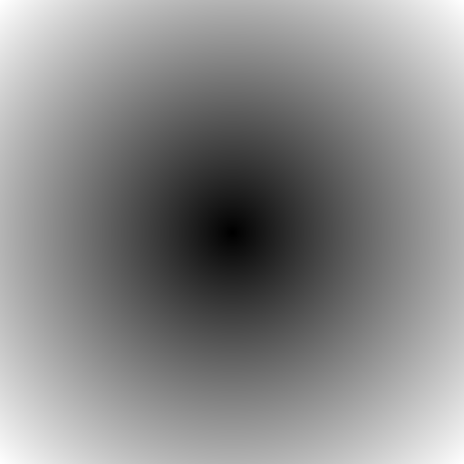
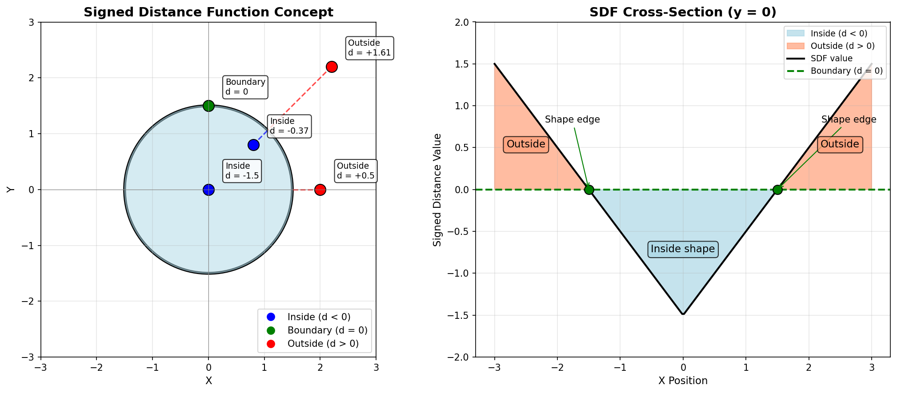
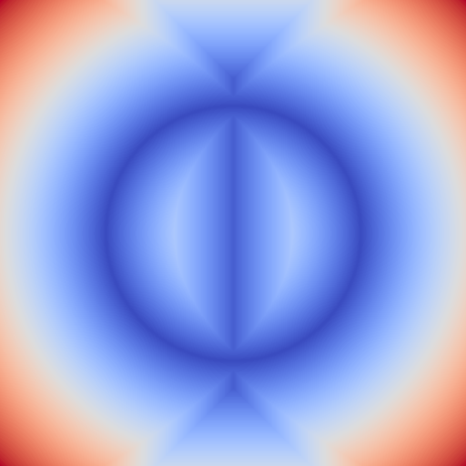

.. _module-2-2-4-distance-fields:

================================
2.2.4 - Distance Fields
================================

:Duration: 20 minutes
:Level: Beginner-Intermediate

Overview
========

In Module 2.1.3, you learned to draw circles by checking whether each pixel's distance from the center is less than the radius. That approach gives a binary answer: inside or outside. But what if we kept the actual distance values instead of discarding them?

A **distance field** stores the distance from every pixel to the nearest point on a shape. This seemingly simple idea unlocks powerful techniques used throughout modern computer graphics, from smooth shape rendering to collision detection in video games.

**Learning Objectives**

By the end of this exercise, you will be able to:

- Understand what a distance field represents and why it is useful
- Calculate and visualize distance values for every pixel in an image
- Distinguish between signed and unsigned distance functions
- Combine multiple shapes using SDF boolean operations (union, intersection, subtraction)

Quick Start
===========

Let us create a simple distance field that shows the distance from every pixel to a center point. Run this code to see the result:

.. code-block:: python
   :linenos:

   import numpy as np
   from PIL import Image

   # Configuration
   SIZE = 512
   CENTER_X, CENTER_Y = 256, 256

   # Create coordinate grids
   Y, X = np.ogrid[0:SIZE, 0:SIZE]

   # Calculate distance from each pixel to center
   distance_field = np.sqrt((X - CENTER_X)**2 + (Y - CENTER_Y)**2)

   # Normalize to 0-255 for visualization
   normalized = (distance_field / distance_field.max() * 255).astype(np.uint8)

   # Save result
   Image.fromarray(normalized, mode='L').save('simple_distance_field.png')

   A distance field visualized as a grayscale image. Dark pixels are close to the center (distance = 0), while bright pixels are far away (maximum distance at corners).

.. tip::

   Notice how the gradient appears circular even though the image is square. This is because we are measuring Euclidean distance, and all points equidistant from the center form a circle.

Core Concepts
=============

Concept 1: What is a Distance Field?
------------------------------------

A distance field is a 2D array where each element stores the distance from that position to the nearest point on a reference shape (or point). Unlike the circle-drawing code from Module 2.1.3, which produces a binary mask (inside/outside), a distance field preserves continuous distance information.

**From Binary Mask to Distance Field**

Recall the circle code from Module 2.1.3:

.. code-block:: python

   # Binary mask approach (Module 2.1.3)
   inside_circle = square_distance < RADIUS ** 2  # True/False only

   # Distance field approach (this module)
   distance_field = np.sqrt(square_distance)      # Actual distance values

The key difference is that distance fields give us a smooth gradient of values rather than a hard boundary. This enables:

- **Soft edges**: Create anti-aliased shapes by smoothly transitioning at boundaries
- **Collision detection**: Know not just if objects overlap, but how far apart they are
- **Procedural effects**: Use distance values to drive colors, textures, or animations

.. admonition:: Did You Know?

   Distance fields are the foundation of modern font rendering in games and applications. The technique, popularized by Valve in 2007 [Green2007]_, allows text to be scaled to any size while remaining crisp and smooth, using a single small texture.

Concept 2: Signed Distance Functions (SDFs)
-------------------------------------------

A **Signed Distance Function** (SDF) extends the distance field concept by adding a sign to indicate whether a point is inside or outside a shape:

- **Negative values**: Inside the shape
- **Zero**: On the shape boundary
- **Positive values**: Outside the shape

   The sign convention for SDFs. Points inside the shape have negative distance, points on the boundary have zero distance, and points outside have positive distance. Diagram generated with Claude Code.

**SDF Formula for a Circle**

For a circle with center (cx, cy) and radius r:

.. math::

   SDF(x, y) = \sqrt{(x - cx)^2 + (y - cy)^2} - r

The subtraction of the radius is what creates the sign:

- When distance < radius: result is negative (inside)
- When distance = radius: result is zero (on boundary)
- When distance > radius: result is positive (outside)

.. code-block:: python

   # Unsigned distance (always positive)
   distance = np.sqrt((X - CENTER)**2 + (Y - CENTER)**2)

   # Signed distance (negative inside, positive outside)
   circle_sdf = distance - RADIUS

.. important::

   The sign convention (negative inside, positive outside) is standard in computer graphics. Some domains use the opposite convention, so always check the documentation when using SDF libraries.

Concept 3: Combining Shapes with Boolean Operations
---------------------------------------------------

One of the most powerful features of SDFs is that shapes can be combined using simple mathematical operations [Quilez2008]_:

**Union (OR)**: Combine two shapes into one

.. code-block:: python

   union_sdf = np.minimum(sdf1, sdf2)

**Intersection (AND)**: Keep only where shapes overlap

.. code-block:: python

   intersection_sdf = np.maximum(sdf1, sdf2)

**Subtraction**: Cut one shape from another

.. code-block:: python

   subtraction_sdf = np.maximum(sdf1, -sdf2)

.. figure:: sdf_shapes.png
   :width: 600px
   :align: center
   :alt: 2x2 grid showing circle SDF, rectangle SDF, union, and intersection

   SDFs for basic shapes and their combinations. The black contour line shows where SDF = 0 (the shape boundary). Blue regions have negative distance (inside), red regions have positive distance (outside).

These operations work because:

- **Minimum** selects whichever SDF is more negative, keeping points that are inside *either* shape
- **Maximum** selects whichever SDF is less negative, keeping only points inside *both* shapes
- **Negating** an SDF swaps inside and outside, enabling subtraction

Hands-On Exercises
==================

Exercise 1: Execute and Explore
-------------------------------

:download:`Download simple_distance_field.py <simple_distance_field.py>`

Run the script and observe the output.

.. code-block:: bash

   python simple_distance_field.py

**Reflection Questions**

1. What happens to pixel values as you move away from the center?
2. Why does the gradient appear circular when the canvas is square?
3. What is the maximum distance value, and where does it occur?

.. dropdown:: Answers
   :class: note

   1. Pixel values increase linearly with distance from the center. The grayscale brightness directly corresponds to the Euclidean distance.

   2. The gradient appears circular because Euclidean distance measures "as the crow flies" - all points equidistant from the center form a circle, regardless of the canvas shape.

   3. The maximum distance occurs at the corners of the image. For a 512x512 image with center at (256, 256), the maximum distance is approximately 362 pixels (the diagonal from center to corner: sqrt(256^2 + 256^2)).

Exercise 2: Modify Parameters
-----------------------------

:download:`Download simple_distance_field.py <simple_distance_field.py>`

Using this script as a starting point, achieve these goals:

**Goal 1**: Move the center to the top-left corner (position 50, 50)

**Goal 2**: Create an elliptical distance field by scaling X and Y differently

**Goal 3**: Invert the gradient so the center is bright and edges are dark

.. dropdown:: Hint for Goal 1
   :class: tip

   Change the ``CENTER_X`` and ``CENTER_Y`` values at the top of the script.

.. dropdown:: Hint for Goal 2
   :class: tip

   Multiply one of the distance components by a scaling factor. For example, ``(X - CENTER_X) * 0.5`` will stretch the field horizontally.

.. dropdown:: Hint for Goal 3
   :class: tip

   After calculating the normalized values, subtract them from 255: ``normalized = 255 - normalized``

.. dropdown:: Complete Solutions
   :class: note

   **Goal 1 Solution**:

   .. code-block:: python

      CENTER_X = 50
      CENTER_Y = 50

   **Goal 2 Solution** (elliptical field):

   .. code-block:: python

      # Scale Y by 2 to create vertical ellipse
      distance_field = np.sqrt((X - CENTER_X)**2 + ((Y - CENTER_Y) * 2)**2)

   **Goal 3 Solution** (inverted):

   .. code-block:: python

      normalized = 255 - (distance_field / distance_field.max() * 255).astype(np.uint8)

Exercise 3: Create from Scratch
-------------------------------

:download:`Download sdf_combination_starter.py <sdf_combination_starter.py>`

Create an SDF composition that combines multiple shapes. Your composition should:

1. Include at least two shapes (circles and/or rectangles)
2. Use at least one boolean operation (union, intersection, or subtraction)
3. Produce a visually interesting result

Use the starter code in ``sdf_combination_starter.py`` to begin.

.. dropdown:: Starter Code
   :class: tip

   .. code-block:: python
      :linenos:

      import numpy as np
      from PIL import Image

      SIZE = 512
      CENTER = SIZE // 2

      Y, X = np.ogrid[0:SIZE, 0:SIZE]
      x = X - CENTER
      y = Y - CENTER

      # TODO 1: Create first shape (circle)
      circle_sdf = None  # Replace with: np.sqrt(x**2 + y**2) - 100

      # TODO 2: Create second shape
      second_shape_sdf = None

      # TODO 3: Combine shapes
      combined_sdf = None

      # Visualization
      if combined_sdf is not None:
          normalized = np.clip(combined_sdf, -150, 150)
          normalized = ((normalized + 150) / 300 * 255).astype(np.uint8)
          Image.fromarray(normalized, mode='L').save('my_composition.png')

.. dropdown:: Hint 1: Shape Formulas
   :class: tip

   - Circle: ``np.sqrt(x**2 + y**2) - radius``
   - Rectangle: ``np.maximum(np.abs(x) - half_width, np.abs(y) - half_height)``

.. dropdown:: Hint 2: Creating a Ring
   :class: tip

   A ring is an outer circle minus an inner circle:

   .. code-block:: python

      outer = np.sqrt(x**2 + y**2) - 180
      inner = np.sqrt(x**2 + y**2) - 100
      ring = np.maximum(outer, -inner)

.. dropdown:: Complete Solution
   :class: note

   .. code-block:: python
      :linenos:
      :emphasize-lines: 13-14, 19-20, 25-26

      import numpy as np
      from PIL import Image

      SIZE = 512
      CENTER = SIZE // 2

      Y, X = np.ogrid[0:SIZE, 0:SIZE]
      x = X - CENTER
      y = Y - CENTER

      # Create ring (outer circle minus inner circle)
      outer_circle_sdf = np.sqrt(x**2 + y**2) - 180
      inner_circle_sdf = np.sqrt(x**2 + y**2) - 100
      ring_sdf = np.maximum(outer_circle_sdf, -inner_circle_sdf)

      # Create vertical rectangle
      rect_sdf = np.maximum(np.abs(x) - 30, np.abs(y) - 200)

      # Union: combine ring and rectangle
      combined_sdf = np.minimum(ring_sdf, rect_sdf)

      # Visualize
      normalized = np.clip(combined_sdf, -150, 150)
      normalized = ((normalized + 150) / 300 * 255).astype(np.uint8)
      Image.fromarray(normalized, mode='L').save('sdf_combination_solution.png')

   .. figure:: sdf_combination_solution.png
      :width: 400px
      :align: center
      :alt: Ring with vertical bar composition

      The solution creates a ring (circle with hole) combined with a vertical rectangle using union.

Challenge Extension
-------------------

Try these advanced variations to deepen your understanding:

**Challenge A: Color Mapping**

Apply a colormap to your SDF visualization using matplotlib:

.. code-block:: python

   import matplotlib.pyplot as plt
   plt.imsave('colored_sdf.png', combined_sdf, cmap='coolwarm')

   The coolwarm colormap creates a heat-map effect where blue indicates inside regions and red indicates outside regions.

**Challenge B: Concentric Rings**

Create a pattern of concentric rings using the modulo operator:

.. code-block:: python

   rings = np.sin(distance_field / 20) * 127 + 128

.. figure:: challenge_rings.png
   :width: 400px
   :align: center
   :alt: Concentric rings pattern created by applying sine function to distance field

   Using sine with distance creates hypnotic concentric rings. The divisor (20) controls ring spacing.

**Challenge C: Multiple Sources**

Create a distance field with multiple reference points and visualize the Voronoi-like regions where each point is nearest.

Summary
=======

**Key Takeaways**

- A **distance field** stores the distance from every pixel to the nearest point on a shape
- **Signed Distance Functions (SDFs)** use negative values for inside, positive for outside, and zero on the boundary
- The circle SDF formula is: ``sqrt((x-cx)^2 + (y-cy)^2) - radius``
- Shapes can be combined using: **union** (min), **intersection** (max), and **subtraction** (max with negation)

**Common Pitfalls**

- Forgetting to subtract the radius when converting distance to SDF (results in unsigned distance)
- Using the wrong boolean operation (min vs max) when combining shapes
- Not normalizing values properly for visualization (values may exceed 0-255 range)

SDFs are a fundamental technique in computer graphics with applications in rendering, collision detection, and procedural generation. The concepts you learned here form the foundation for more advanced topics like ray marching and shader programming.

References
==========

.. [Hart1996] Hart, J. C. (1996). Sphere tracing: A geometric method for the antialiased ray tracing of implicit surfaces. *The Visual Computer*, 12(10), 527-545. https://doi.org/10.1007/s003710050084 [Foundational paper on SDF rendering techniques]

.. [Quilez2008] Quilez, I. (2008). Distance functions. *Inigo Quilez Articles*. https://iquilezles.org/articles/distfunctions/ [Comprehensive reference for SDF formulas for various shapes]

.. [Green2007] Green, C. (2007). Improved alpha-tested magnification for vector textures and special effects. *ACM SIGGRAPH 2007 Courses*, Article 9. https://doi.org/10.1145/1281500.1281665 [SDF technique for scalable text rendering]

.. [Harris2020] Harris, C. R., Millman, K. J., van der Walt, S. J., et al. (2020). Array programming with NumPy. *Nature*, 585(7825), 357-362. https://doi.org/10.1038/s41586-020-2649-2 [NumPy vectorized operations foundation]

.. [Gonzalez2018] Gonzalez, R. C., & Woods, R. E. (2018). *Digital Image Processing* (4th ed.). Pearson. ISBN: 978-0133356724 [Distance transforms in image processing]

.. [Pearson2011] Pearson, M. (2011). *Generative Art: A Practical Guide Using Processing*. Manning Publications. ISBN: 978-1935182627 [Creative coding applications of mathematical fields]

.. [NumPyDocs] NumPy Developers. (2024). NumPy documentation: ogrid and coordinate arrays. *NumPy Documentation*. https://numpy.org/doc/stable/reference/generated/numpy.ogrid.html [Reference for np.ogrid coordinate generation]
