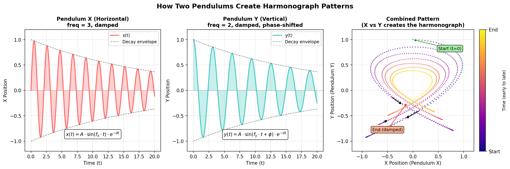

.. _module-2-3-3-harmonograph-simulation:

================================
2.3.3 - Harmonograph Simulation
================================

:Duration: 20 minutes
:Level: Beginner-Intermediate

Overview
========

A harmonograph is a mechanical device that uses pendulum motion to draw beautiful, intricate patterns. Invented in the mid-19th century, these machines became popular parlor entertainment and produced drawings that were considered "automatic art." In this exercise, you will simulate a two-pendulum harmonograph digitally, discovering how the interplay of two oscillating motions creates complex, elegant curves.

The key insight is that **combining two simple periodic motions produces surprisingly complex patterns**. This same principle underlies many phenomena in physics, music, and nature - from the interference patterns of waves to the orbital resonances of moons.

**Learning Objectives**

By the end of this exercise, you will be able to:

* Understand how two independent pendulum oscillations combine to create patterns
* Implement damped sinusoidal equations that model real pendulum physics
* Predict pattern characteristics from frequency ratios
* Create color-coded visualizations that reveal the dynamics of pendulum motion

Quick Start
===========

Let us create a harmonograph pattern immediately:

.. code-block:: python
   :caption: simple_harmonograph.py
   :linenos:

   import numpy as np
   from PIL import Image, ImageDraw
   from pathlib import Path

   SCRIPT_DIR = Path(__file__).parent
   CANVAS_SIZE = 512
   CENTER = CANVAS_SIZE // 2

   # Pendulum X parameters
   FREQ_X, AMP_X, PHASE_X = 3, 200, 0
   # Pendulum Y parameters
   FREQ_Y, AMP_Y, PHASE_Y = 2, 200, np.pi / 2

   DAMPING = 0.002
   t = np.linspace(0, 100, 5000)
   decay = np.exp(-DAMPING * t)

   # Calculate damped oscillations
   x = CENTER + AMP_X * np.sin(FREQ_X * t + PHASE_X) * decay
   y = CENTER + AMP_Y * np.sin(FREQ_Y * t + PHASE_Y) * decay

   image = Image.new('RGB', (CANVAS_SIZE, CANVAS_SIZE), (10, 10, 20))
   draw = ImageDraw.Draw(image)
   points = list(zip(x.astype(int), y.astype(int)))
   draw.line(points, fill=(100, 200, 255), width=1)
   image.save(SCRIPT_DIR / 'simple_harmonograph.png')

:download:`Download simple_harmonograph.py <simple_harmonograph.py>` and run it to generate:

   A harmonograph with 3:2 frequency ratio. The pattern shows how the two pendulums interact - one swinging faster than the other - while both gradually lose energy to damping.

.. tip::

   The frequency ratio (3:2 in this example) determines the fundamental character of the pattern. Try different ratios to discover the variety of patterns a harmonograph can create!

Core Concepts
=============

Concept 1: Two Pendulums, One Pattern
-------------------------------------

A harmonograph uses two pendulums swinging at right angles to each other. One pendulum controls the horizontal (x) position, the other controls the vertical (y) position. The pen traces out a curve as both pendulums swing simultaneously.

   The harmonograph principle: Two independent oscillations (X and Y) combine to create a complex pattern. The damping causes both oscillations to decay over time, which is why the pattern spirals inward. Diagram generated with Claude - Opus 4.5.

**The Mathematical Model**

Each pendulum's motion is described by a damped sinusoid:

.. math::

   x(t) = A_x \cdot \sin(f_x \cdot t + \phi_x) \cdot e^{-d \cdot t}

   y(t) = A_y \cdot \sin(f_y \cdot t + \phi_y) \cdot e^{-d \cdot t}

Where:

* **A** is amplitude (how far the pendulum swings)
* **f** is frequency (how fast the pendulum swings)
* **phi** is phase (where in its swing the pendulum starts)
* **d** is damping (how quickly the swing decays due to friction)
* **t** is time

.. code-block:: python
   :caption: Implementing the equations in NumPy

   import numpy as np

   # Time array
   t = np.linspace(0, 100, 5000)

   # Damping factor (exponential decay)
   damping = 0.002
   decay = np.exp(-damping * t)

   # X and Y positions (damped oscillations)
   x = amplitude_x * np.sin(freq_x * t + phase_x) * decay
   y = amplitude_y * np.sin(freq_y * t + phase_y) * decay

.. admonition:: Did You Know?

   The harmonograph was invented by Scottish mathematician Hugh Blackburn around 1844. By the 1890s, harmonographs were popular drawing toys. Some elaborate versions used three or four pendulums to create even more complex patterns [Ashton2003]_.

Concept 2: Frequency Ratios and Pattern Character
-------------------------------------------------

The **ratio between the X and Y frequencies** is the most important parameter. Simple ratios like 1:1, 2:1, or 3:2 produce closed, recognizable patterns. More complex ratios create intricate designs that take longer to repeat.

.. figure:: harmonograph_variations.png
   :width: 600px
   :align: center
   :alt: 2x3 grid showing harmonograph patterns for frequency ratios 1:1 (circle), 2:1 (figure-8), 3:2, 3:4, 5:4, and 7:5

   Effect of frequency ratios on harmonograph patterns. Simple ratios (1:1, 2:1) create simple shapes; complex ratios (5:4, 7:5) create more intricate patterns. Diagram generated with Claude - Opus 4.5.

**Common Frequency Ratios**

.. list-table::
   :widths: 20 30 50
   :header-rows: 1

   * - Ratio
     - Pattern Type
     - Musical Analogy
   * - 1:1
     - Circle or ellipse
     - Unison
   * - 2:1
     - Figure-8
     - Octave
   * - 3:2
     - Three-lobed pattern
     - Perfect fifth
   * - 4:3
     - Four-lobed pattern
     - Perfect fourth
   * - 5:4
     - Five-lobed pattern
     - Major third

.. important::

   The frequency ratios used in harmonographs correspond exactly to the frequency ratios that define musical intervals! A 3:2 ratio sounds like a perfect fifth on a piano. This connection between visual patterns and musical harmony was recognized by early harmonograph enthusiasts [Ashton2003]_.

Concept 3: Damping and Energy Decay
-----------------------------------

Real pendulums lose energy over time due to friction and air resistance. This **damping** causes the amplitude to decrease exponentially, making the pattern spiral inward toward the center. The damping factor controls how quickly this happens.

.. code-block:: python
   :caption: The exponential decay function

   import numpy as np

   damping = 0.002  # Small value = slow decay
   t = np.linspace(0, 100, 5000)

   # Decay factor starts at 1.0 and decreases toward 0
   decay = np.exp(-damping * t)

   # At t=0: decay = 1.0 (full amplitude)
   # At t=50: decay ≈ 0.90 (90% amplitude)
   # At t=100: decay ≈ 0.82 (82% amplitude)

**Effects of different damping values:**

* **Low damping (0.001)**: Slow decay, many loops before pattern fades
* **Medium damping (0.005)**: Balanced decay, clear spiral inward
* **High damping (0.01)**: Fast decay, pattern quickly converges to center

.. note::

   Without damping, a harmonograph would trace the same path forever. The damping creates the characteristic "fading" effect that makes each drawing unique - like a signature of the pendulum's energy dissipation.

Hands-On Exercises
==================

Exercise 1: Execute and Explore
--------------------------------

Run the ``simple_harmonograph.py`` script and observe the output.

.. code-block:: bash

   python simple_harmonograph.py

**Reflection Questions**

1. What frequency ratio is used? How does it relate to the pattern shape?
2. Where does the pattern start (at t=0) and where does it end?
3. What role does the phase difference (PHASE_Y = pi/2) play?

.. dropdown:: Answers

   1. **3:2 ratio**: The X pendulum completes 3 full cycles for every 2 cycles of the Y pendulum. This creates a pattern with interlocking loops characteristic of this ratio.

   2. **Start and end**: The pattern starts at the outer edge (when decay = 1.0) and spirals inward toward the center as the decay factor approaches 0. At the end, both oscillations have nearly zero amplitude.

   3. **Phase difference**: The pi/2 (90-degree) phase shift means the Y pendulum starts at its maximum position when X is at zero. Without this phase shift, the pattern would collapse to a diagonal line. Phase shifts create the "openness" of the pattern.

Exercise 2: Modify Parameters
------------------------------

Using ``simple_harmonograph.py`` as a starting point, achieve these goals:

**Goal 1**: Create a **figure-8 pattern** (what frequency ratio?)

**Goal 2**: Create a **more complex pattern** with 5 lobes

**Goal 3**: Make the pattern **decay faster** (reach center sooner)

.. dropdown:: Hint for Goal 1

   A figure-8 is created by a 2:1 frequency ratio. Change ``FREQ_X = 2`` and ``FREQ_Y = 1``.

.. dropdown:: Hint for Goal 2

   Try a 5:4 ratio (``FREQ_X = 5``, ``FREQ_Y = 4``) or a 5:3 ratio for different 5-lobed patterns.

.. dropdown:: Hint for Goal 3

   Increase the ``DAMPING`` value. Try ``DAMPING = 0.01`` for fast decay, or ``0.005`` for moderate.

.. dropdown:: Complete Solutions

   .. code-block:: python

      # Goal 1: Figure-8 pattern
      FREQ_X = 2
      FREQ_Y = 1

      # Goal 2: Five-lobed pattern
      FREQ_X = 5
      FREQ_Y = 4

      # Goal 3: Faster decay
      DAMPING = 0.01  # Increased from 0.002

Exercise 3: Create a Color-Fading Harmonograph
-----------------------------------------------

Create a harmonograph where the color fades from bright to dark as the pendulum loses energy. This visualizes the energy dissipation!

**Requirements**

* Start with a bright color (cyan, magenta, or your choice)
* Fade to a darker shade as time progresses
* Use the decay factor to drive the color change

.. dropdown:: Starter Code

   .. code-block:: python
      :linenos:

      import numpy as np
      from PIL import Image, ImageDraw
      from pathlib import Path

      SCRIPT_DIR = Path(__file__).parent
      CANVAS_SIZE = 512
      CENTER = CANVAS_SIZE // 2
      BASE_COLOR = (100, 255, 255)  # Bright cyan

      # Generate oscillations with decay
      t = np.linspace(0, 100, 5000)
      decay = np.exp(-0.003 * t)
      x = CENTER + 200 * np.sin(5 * t) * decay
      y = CENTER + 200 * np.sin(4 * t + np.pi/2) * decay

      image = Image.new('RGB', (CANVAS_SIZE, CANVAS_SIZE), (10, 10, 20))
      draw = ImageDraw.Draw(image)

      for i in range(1, len(t)):
          # TODO: Calculate faded color based on decay[i]
          color = BASE_COLOR  # Replace with fading calculation

          draw.line([(int(x[i-1]), int(y[i-1])), (int(x[i]), int(y[i]))],
                   fill=color, width=1)

      image.save(SCRIPT_DIR / 'my_colored_harmonograph.png')

.. dropdown:: Hint 1: Simple Color Fading

   Multiply each color component by the decay value:

   .. code-block:: python

      color = tuple(int(c * decay[i]) for c in BASE_COLOR)

.. dropdown:: Hint 2: Color Interpolation

   For a smoother transition between two colors:

   .. code-block:: python

      START_COLOR = (100, 255, 255)  # Cyan
      END_COLOR = (20, 40, 80)       # Dark blue

      def get_faded_color(decay_value):
          r = int(START_COLOR[0] * decay_value + END_COLOR[0] * (1 - decay_value))
          g = int(START_COLOR[1] * decay_value + END_COLOR[1] * (1 - decay_value))
          b = int(START_COLOR[2] * decay_value + END_COLOR[2] * (1 - decay_value))
          return (r, g, b)

.. dropdown:: Complete Solution

   .. code-block:: python
      :linenos:
      :emphasize-lines: 14-20, 29

      import numpy as np
      from PIL import Image, ImageDraw
      from pathlib import Path

      SCRIPT_DIR = Path(__file__).parent
      CANVAS_SIZE = 512
      CENTER = CANVAS_SIZE // 2

      # Color gradient: bright -> dark
      START_COLOR = (100, 255, 255)
      END_COLOR = (20, 40, 80)

      def get_faded_color(decay_value):
          """Interpolate between START and END colors based on decay."""
          r = int(START_COLOR[0] * decay_value + END_COLOR[0] * (1 - decay_value))
          g = int(START_COLOR[1] * decay_value + END_COLOR[1] * (1 - decay_value))
          b = int(START_COLOR[2] * decay_value + END_COLOR[2] * (1 - decay_value))
          return (r, g, b)

      t = np.linspace(0, 100, 5000)
      decay = np.exp(-0.003 * t)
      x = CENTER + 200 * np.sin(5 * t) * decay
      y = CENTER + 200 * np.sin(4 * t + np.pi/2) * decay

      image = Image.new('RGB', (CANVAS_SIZE, CANVAS_SIZE), (10, 10, 20))
      draw = ImageDraw.Draw(image)

      for i in range(1, len(t)):
          color = get_faded_color(decay[i])
          draw.line([(int(x[i-1]), int(y[i-1])), (int(x[i]), int(y[i]))],
                   fill=color, width=1)

      image.save(SCRIPT_DIR / 'colored_harmonograph_solution.png')

.. figure:: colored_harmonograph_solution.png
   :width: 400px
   :align: center
   :alt: A harmonograph pattern that fades from bright cyan to dark blue as it spirals inward

   The color-fading harmonograph shows energy dissipation visually. Bright cyan (high energy) fades to dark blue (low energy) as the pendulum decays.

Challenge Extension
-------------------

**A. Animated Harmonograph**: Create a GIF showing the harmonograph being drawn over time, as if watching a real pendulum at work.

**B. Three-Pendulum Harmonograph**: Add a third pendulum that modulates the x or y position, creating even more complex patterns.

**C. Musical Harmonograph**: Create a series of patterns using frequency ratios that correspond to musical intervals (octave, fifth, fourth, third).

**D. Interactive Explorer**: Build a script that accepts command-line arguments for frequency ratios and damping, allowing quick exploration of parameter space.

Summary
=======

**Key Takeaways**

* A **harmonograph** combines two damped sinusoidal oscillations to create complex patterns
* The **frequency ratio** (fx:fy) determines the basic character of the pattern
* **Damping** causes the pattern to spiral inward as energy dissipates
* **Phase difference** prevents the pattern from collapsing to a line
* These concepts connect to physics (pendulums, waves), music (harmonic ratios), and art (generative patterns)

**Common Pitfalls**

* **Zero phase difference**: If both pendulums start at the same phase, the pattern degenerates to a line. Always include a phase offset.
* **Too much damping**: High damping values cause the pattern to collapse too quickly. Start with small values (0.001-0.005).
* **Equal frequencies**: A 1:1 ratio with the same phase produces a circle or ellipse - interesting but simple.
* **Not enough points**: Too few points (NUM_POINTS) creates a jagged curve. Use 3000+ for smooth results.

References
==========

.. [Ashton2003] Ashton, A. (2003). *Harmonograph: A Visual Guide to the Mathematics of Music* (2nd ed.). Walker & Company. ISBN: 978-0802714091 [Comprehensive guide to harmonograph history, construction, and mathematical principles]

.. [Cundy1961] Cundy, H. M., & Rollett, A. P. (1961). *Mathematical Models* (2nd ed.). Oxford University Press. [Classic reference on mathematical curves including harmonograph patterns]

.. [Weisstein_Lissajous] Weisstein, E. W. (2024). Lissajous Curve. *MathWorld - A Wolfram Web Resource*. Retrieved November 30, 2025, from https://mathworld.wolfram.com/LissajousCurve.html [Mathematical foundation for parametric curves]

.. [NumPyLinspace] NumPy Developers. (2024). numpy.linspace documentation. *NumPy v1.26 Manual*. Retrieved November 30, 2025, from https://numpy.org/doc/stable/reference/generated/numpy.linspace.html [Official documentation for generating evenly spaced arrays]

.. [NumPyExp] NumPy Developers. (2024). numpy.exp documentation. *NumPy v1.26 Manual*. Retrieved November 30, 2025, from https://numpy.org/doc/stable/reference/generated/numpy.exp.html [Exponential function for damping calculations]

.. [PillowDocs] Clark, A., et al. (2024). *Pillow: Python Imaging Library* (Version 10.2.0) [Computer software]. Python Software Foundation. https://python-pillow.org/ [Image processing library used for drawing]

.. [Pearson2011] Pearson, M. (2011). *Generative Art: A Practical Guide Using Processing*. Manning Publications. ISBN: 978-1-935182-62-5 [Modern generative art techniques including parametric curves]

.. [Klemens2010] Klemens, B. (2010). The Harmonograph. *Make Magazine*, 23, 124-127. [Practical guide to building physical harmonographs]
