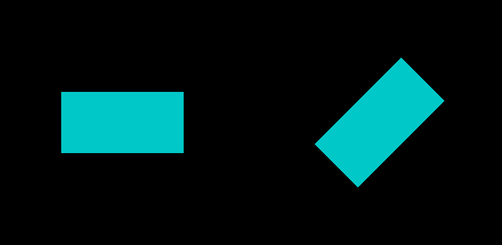
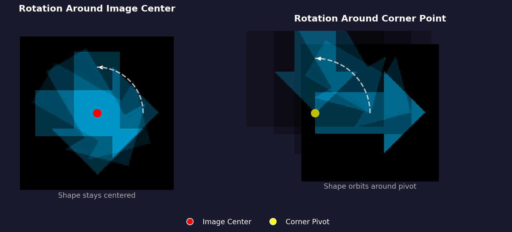
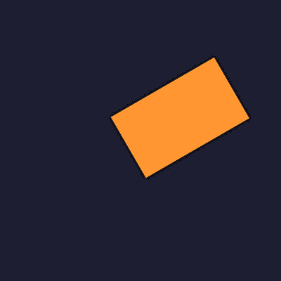

.. _module-3-1-1-rotation:

=====================================
3.1.1 - Rotation
=====================================

:Duration: 20 minutes
:Level: Beginner

Overview
========

Rotation is one of the fundamental geometric transformations in image processing
and generative art. In this exercise, you will discover how to rotate images and
shapes using NumPy arrays and the SciPy library. By understanding rotation, you
unlock the ability to create dynamic compositions, radial patterns, and
animations that bring static images to life.

**Learning Objectives**

By the end of this exercise, you will be able to:

- Rotate images and shapes by any angle using ``scipy.ndimage.rotate()``
- Understand how the center of rotation affects the transformation result
- Apply interpolation concepts to handle pixel resampling during rotation
- Create artistic patterns by combining multiple rotated copies of a shape

Quick Start
===========

Let us begin by seeing rotation in action. Run the following code to create
a simple shape and rotate it by 45 degrees:

.. code-block:: python
   :caption: simple_rotation.py
   :linenos:

   import numpy as np
   from scipy import ndimage
   from PIL import Image

   # Step 1: Create a simple colored rectangle on a dark background
   canvas_size = 400
   image = np.zeros((canvas_size, canvas_size, 3), dtype=np.uint8)

   # Draw a cyan rectangle in the center
   rect_top, rect_bottom = 150, 250
   rect_left, rect_right = 100, 300
   image[rect_top:rect_bottom, rect_left:rect_right] = [0, 200, 200]

   # Step 2: Rotate the image by 45 degrees
   rotation_angle = 45
   rotated_image = ndimage.rotate(image, rotation_angle, reshape=False, mode='constant', cval=0)

   # Step 3: Create side-by-side comparison
   comparison = np.zeros((canvas_size, canvas_size * 2 + 20, 3), dtype=np.uint8)
   comparison[:, :canvas_size] = image
   comparison[:, canvas_size + 20:] = rotated_image

   # Step 4: Save the result
   output = Image.fromarray(comparison, mode='RGB')
   output.save('simple_rotation.png')

   Left: Original rectangle. Right: The same rectangle rotated 45 degrees around the image center.

Notice how the rectangle appears tilted in the rotated version. The rotation
happens around the center of the image, and pixels that would fall outside the
canvas boundaries are clipped.

Core Concepts
=============

Understanding Image Rotation
----------------------------

When we rotate an image, each pixel moves to a new location based on a
mathematical transformation. The rotation preserves the distances between
pixels (it is a rigid transformation) but changes their angular positions
relative to a center point.

The key parameters that control rotation are:

1. **Angle**: How many degrees to rotate (positive = counter-clockwise)
2. **Center**: The pivot point around which rotation occurs
3. **Interpolation**: How to handle pixels that land between grid positions
4. **Output size**: Whether to expand the canvas to fit the rotated content

.. important::

   In NumPy and SciPy, **positive angles rotate counter-clockwise**, following
   the mathematical convention. This matches the behavior you learned in
   Module 2 with coordinate systems.

The Rotation Matrix
-------------------

Behind the scenes, rotation is performed using a 2D rotation matrix. For an
angle :math:`\theta`, the rotation matrix is:

.. math::

   R(\theta) = \begin{bmatrix}
   \cos\theta & -\sin\theta \\
   \sin\theta & \cos\theta
   \end{bmatrix}

Each pixel at position :math:`(x, y)` is transformed to a new position
:math:`(x', y')` by multiplying with this matrix. You do not need to implement
this yourself - ``scipy.ndimage.rotate()`` handles it automatically.

.. admonition:: Did You Know?

   The rotation matrix is an example of an *orthogonal matrix*, meaning its
   inverse equals its transpose. This mathematical property ensures that
   rotations preserve lengths and angles - your shapes will not become
   distorted when rotated [Gonzalez2018]_.

Center of Rotation and Interpolation
------------------------------------

The center of rotation (pivot point) determines where the rotation occurs.
By default, ``scipy.ndimage.rotate()`` uses the image center as the pivot.

   Left: Rotation around the image center keeps the shape in place.
   Right: Rotation around a corner causes the shape to orbit around the pivot.
   Diagram generated with Claude - Opus 4.5.

When pixels are rotated to non-integer positions (which happens for most angles),
**interpolation** is used to compute the new pixel values. The ``order``
parameter controls interpolation quality:

- ``order=0``: Nearest neighbor (fast but blocky)
- ``order=1``: Bilinear interpolation (default, good balance)
- ``order=3``: Cubic interpolation (smoother but slower)

The ``reshape`` parameter is also important:

- ``reshape=True``: Expands output to contain all rotated pixels (may change image size)
- ``reshape=False``: Keeps original size (clips pixels that fall outside)

.. code-block:: python
   :caption: Comparing reshape options

   # Reshape=False: same size output, content may be clipped
   rotated_clip = ndimage.rotate(image, 45, reshape=False)
   print(rotated_clip.shape)  # Same as original

   # Reshape=True: larger output to fit all content
   rotated_full = ndimage.rotate(image, 45, reshape=True)
   print(rotated_full.shape)  # Larger than original

Hands-On Exercises
==================

Exercise 1: Execute and Explore
-------------------------------

:download:`Download rotation_pattern.py <rotation_pattern.py>` and run it to see how multiple rotations create generative art:

.. code-block:: bash

   python rotation_pattern.py

.. figure:: rotation_pattern.png
   :width: 450px
   :align: center
   :alt: Circular pattern created by overlapping 18 rotated rectangles with additive blending

   A fan-like pattern created by rotating a rectangle 18 times and overlaying
   the results with additive blending.

**Reflection Questions**

.. admonition:: Question 1

   What visual effect is created when the rotated shapes overlap?

   .. dropdown:: Answer

      The overlapping regions become brighter due to **additive blending**.
      Each rotation adds its color values to the canvas, so areas where
      multiple rotations overlap accumulate higher values (up to 255).

.. admonition:: Question 2

   How does the number of rotations affect the pattern density?

   .. dropdown:: Answer

      More rotations create a denser, more filled pattern. With 18 rotations
      spread across 180 degrees, each step is 10 degrees apart. Using 36
      rotations would make it 5 degrees apart, creating a smoother fan.

.. admonition:: Question 3

   Why does the pattern form a circular/radial shape?

   .. dropdown:: Answer

      The rotation happens around the image center. Since the rectangle is
      offset from center, it sweeps a circular arc as it rotates, creating
      the radial fan pattern.

Exercise 2: Modify Parameters
-----------------------------

Open ``rotation_pattern.py`` and make the following modifications:

**Goal 1**: Change the pattern to use only 6 rotations (more sparse)

.. dropdown:: Hint

   Change ``number_of_rotations = 18`` to ``number_of_rotations = 6``.
   This will create wider gaps between each rotated copy.

**Goal 2**: Create a warm color palette (oranges and reds instead of cyan)

.. dropdown:: Hint

   Find the line where the shape color is set to ``[0, 180, 220]`` (cyan)
   and change it to ``[255, 120, 50]`` for an orange color.

**Goal 3**: Make the pattern fill a full 360 degrees instead of 180

.. dropdown:: Hint

   Change ``angle_step = 180 / number_of_rotations`` to
   ``angle_step = 360 / number_of_rotations`` to spread rotations
   across the full circle.

.. dropdown:: Complete Solution

   .. code-block:: python
      :linenos:

      import numpy as np
      from scipy import ndimage
      from PIL import Image

      canvas_size = 500
      number_of_rotations = 6  # Changed from 18
      angle_step = 360 / number_of_rotations  # Changed to full circle

      canvas = np.zeros((canvas_size, canvas_size, 3), dtype=np.uint8)

      shape = np.zeros((canvas_size, canvas_size, 3), dtype=np.uint8)
      rect_top, rect_bottom = 200, 300
      rect_left, rect_right = 250, 450
      shape[rect_top:rect_bottom, rect_left:rect_right] = [255, 120, 50]  # Orange

      for i in range(number_of_rotations):
          rotation_angle = i * angle_step
          rotated_shape = ndimage.rotate(shape, rotation_angle, reshape=False, mode='constant', cval=0)
          contribution = (rotated_shape * 0.4).astype(np.uint8)
          canvas = np.clip(canvas.astype(np.int16) + contribution.astype(np.int16), 0, 255).astype(np.uint8)

      output = Image.fromarray(canvas, mode='RGB')
      output.save('modified_pattern.png')

.. figure:: modified_pattern.png
   :width: 450px
   :align: center
   :alt: Orange rotation pattern with 6 rotations spread across 360 degrees

   The modified pattern with 6 rotations, orange color, and full 360-degree spread.

Exercise 3: Build Your Own Rotation Tool
----------------------------------------

Create a rotation tool from scratch that rotates a shape onto a colored
background. Your tool should:

1. Create a canvas filled with a background color
2. Draw a colored shape on a separate layer
3. Rotate the shape by a specified angle
4. Composite the rotated shape onto the background

**Requirements**

- Use a dark blue background: ``[30, 30, 50]``
- Create an orange rectangle: ``[255, 150, 50]``
- Rotate by 30 degrees
- Save as ``my_rotation.png``

**Starter Code**

:download:`Download rotation_starter.py <rotation_starter.py>` and use it as your starting point. Fill in the TODO sections.

.. dropdown:: Hint 1: Filling the background

   To fill the entire canvas with a background color, use array broadcasting:

   .. code-block:: python

      canvas[:, :] = background_color

.. dropdown:: Hint 2: Creating a mask for compositing

   After rotating, you need to overlay non-black pixels onto the background.
   Create a mask that identifies where the rotated shape has color:

   .. code-block:: python

      mask = np.any(rotated_shape > 0, axis=2)
      canvas[mask] = rotated_shape[mask]

.. dropdown:: Complete Solution

   .. literalinclude:: rotation_solution.py
      :language: python
      :linenos:
      :lines: 8-

   The completed rotation tool output: an orange rectangle rotated 30 degrees
   on a dark blue background.

**Challenge Extension**

Extend your rotation tool to create an animated GIF that shows the shape
rotating through 360 degrees. Use the ``imageio`` library to save multiple
frames as an animation.

Summary
=======

**Key Takeaways**

- Rotation transforms pixel positions around a center point (pivot)
- ``scipy.ndimage.rotate()`` handles the rotation matrix math automatically
- Positive angles rotate counter-clockwise (mathematical convention)
- The ``reshape`` parameter controls whether output expands to fit content
- Interpolation smooths out pixels that land between grid positions
- Multiple rotations with blending create artistic radial patterns

**Common Pitfalls**

.. warning::

   **Clipped content**: When using ``reshape=False``, parts of your rotated
   image may be cut off. Use ``reshape=True`` if you need to preserve all
   content.

.. warning::

   **Jagged edges**: For smooth rotation edges, use higher interpolation
   orders (``order=1`` or ``order=3``). The default bilinear interpolation
   usually provides a good balance.

.. warning::

   **Unexpected center**: The rotation always happens around the image center,
   not the shape center. If your shape is not centered, it will orbit around
   the image center rather than spinning in place.

References
==========

.. [Gonzalez2018] Gonzalez, R. C., & Woods, R. E. (2018). *Digital Image Processing* (4th ed.). Pearson. ISBN: 978-0-13-335672-4. Chapter 2 covers geometric transformations including rotation.

.. [Foley1996] Foley, J. D., van Dam, A., Feiner, S. K., & Hughes, J. F. (1996). *Computer Graphics: Principles and Practice* (2nd ed.). Addison-Wesley. Chapter 5 provides mathematical foundations for 2D transformations.

.. [SciPyDocs] SciPy Community. (2024). scipy.ndimage.rotate. *SciPy Documentation*. https://docs.scipy.org/doc/scipy/reference/generated/scipy.ndimage.rotate.html

.. [NumPyDocs] Harris, C. R., et al. (2020). Array programming with NumPy. *Nature*, 585, 357-362. https://doi.org/10.1038/s41586-020-2649-2

.. [Szeliski2022] Szeliski, R. (2022). *Computer Vision: Algorithms and Applications* (2nd ed.). Springer. Chapter 2 covers image transformations and warping.

.. [Burger2016] Burger, W., & Burge, M. J. (2016). *Digital Image Processing: An Algorithmic Introduction Using Java* (2nd ed.). Springer. Chapter 22 discusses geometric operations.

.. [PillowDocs] Clark, A., et al. (2024). *Pillow (PIL Fork) Documentation*. https://pillow.readthedocs.io/
