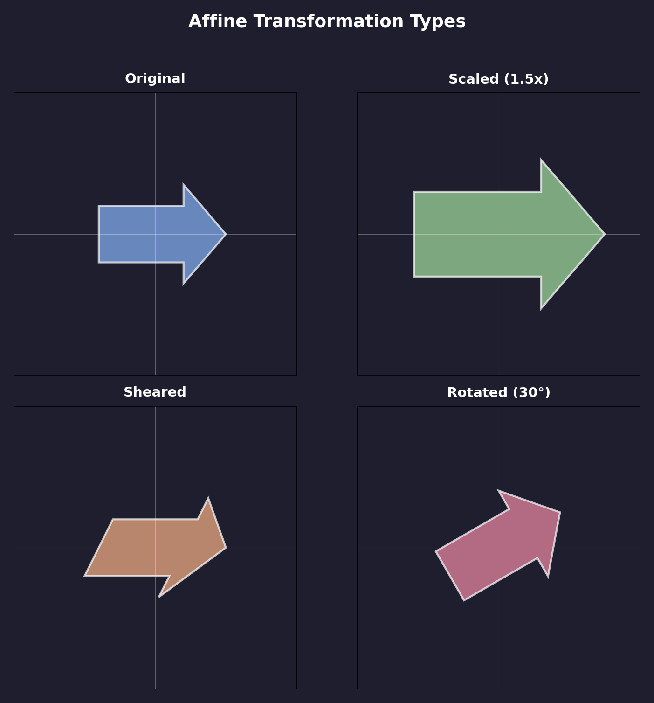

.. _affine-transformations:

=====================================
3.1.2 - Affine Transformations
=====================================

:Duration: 20 minutes
:Level: Beginner-Intermediate
:Prerequisites: Module 2.1 (Basic Shapes), Module 1.1.1 (RGB Color Basics)

Overview
========

Every time you resize an image, rotate a shape, or move an object across the screen, you are performing an **affine transformation**. These fundamental operations form the backbone of computer graphics, from simple 2D drawings to complex 3D animations.

An affine transformation is any transformation that preserves lines and parallelism. If you draw parallel lines on a piece of paper and then stretch, rotate, or skew the paper, those lines remain parallel. This property makes affine transformations predictable and mathematically elegant.

In this exercise, you will learn how affine transformations work by implementing them with NumPy matrices. You will discover that scaling, rotation, shearing, and translation can all be expressed as matrix operations, and you will see how combining these simple transformations creates complex effects.

**Learning Objectives**

By completing this exercise, you will:

* Understand the mathematical structure of 2D affine transformation matrices
* Implement translation, scaling, rotation, and shearing using matrix operations
* Combine multiple transformations through matrix multiplication
* Recognize that transformation order affects the final result

Quick Start: Transform a Shape
==============================

Let's see an affine transformation in action. This code applies a scaling and translation to a colored square:

.. code-block:: python
   :caption: simple_affine.py - Apply scale and translate transformations
   :linenos:
   :emphasize-lines: 18-22,28-30

   import numpy as np
   from PIL import Image, ImageDraw

   # Create a blank canvas
   canvas_size = 400
   canvas = np.zeros((canvas_size, canvas_size, 3), dtype=np.uint8)
   canvas[:] = [30, 30, 40]  # Dark background

   # Define a square centered at origin
   square_points = np.array([
       [-50, -50], [50, -50], [50, 50], [-50, 50]
   ], dtype=np.float64)

   # Position for the original square (left side)
   original_offset = np.array([100, 200])
   original_points = square_points + original_offset

   # Define the affine transformation
   scale_factor = 1.5
   translate_x = 200
   translate_y = 0
   affine_matrix = np.array([
       [scale_factor, 0, translate_x],
       [0, scale_factor, translate_y]
   ])

   # Apply transformation using homogeneous coordinates
   ones = np.ones((square_points.shape[0], 1))
   homogeneous = np.hstack([square_points, ones])
   transformed = (affine_matrix @ homogeneous.T).T + original_offset

   # Draw both squares using PIL
   pil_image = Image.fromarray(canvas)
   draw = ImageDraw.Draw(pil_image)
   draw.polygon([tuple(p) for p in original_points.astype(int)],
                fill=(70, 130, 200))  # Blue original
   draw.polygon([tuple(p) for p in transformed.astype(int)],
                fill=(230, 150, 50))  # Orange transformed

   Image.fromarray(np.array(pil_image)).save('simple_affine.png')

   The blue square (original) is transformed into the larger orange square through scaling (1.5x) and translation (moved right). Notice how the shape's proportions are preserved.

.. tip::

   The key insight: affine transformations can be expressed as matrix multiplication. This makes them computationally efficient and mathematically composable.

Core Concept 1: The Affine Transformation Matrix
=================================================

What Makes a Transformation "Affine"?
--------------------------------------

An **affine transformation** is any transformation that:

1. Maps straight lines to straight lines
2. Preserves parallelism (parallel lines remain parallel)
3. May not preserve distances or angles

This definition includes **translation** (moving), **scaling** (resizing), **rotation** (spinning), and **shearing** (slanting). Circles may become ellipses, and squares may become parallelograms, but straight edges stay straight.

The 3x3 Transformation Matrix
------------------------------

In 2D, we represent affine transformations using a 3x3 matrix. Why 3x3 for 2D points? The answer lies in **homogeneous coordinates**.

A 2D point (x, y) becomes a 3D homogeneous point (x, y, 1). This extra dimension allows us to include translation in matrix multiplication:

.. figure:: affine_matrix_diagram.png
   :width: 500px
   :align: center
   :alt: Diagram showing the structure of a 3x3 affine transformation matrix with labeled components

   The 3x3 affine matrix structure. The top-left 2x2 block handles linear transformations (scale, rotate, shear), while the right column handles translation. The bottom row is always [0, 0, 1] for 2D affine transforms. Diagram generated with Claude - Opus 4.5.

The transformation equations are:

* ``x' = a * x + b * y + tx``
* ``y' = c * x + d * y + ty``

Where (a, b, c, d) control linear transformation and (tx, ty) control translation.

.. important::

   The bottom row [0, 0, 1] must remain fixed for affine transformations. If these values change, the transformation becomes **projective** (perspective), which is a different class of transformation [FoleyEtAl1995]_.

.. code-block:: python

   # Creating transformation matrices in NumPy
   import numpy as np

   # Identity matrix (no transformation)
   identity = np.array([
       [1, 0, 0],
       [0, 1, 0],
       [0, 0, 1]
   ])

   # Translation matrix (move by tx, ty)
   def make_translation(tx, ty):
       return np.array([
           [1, 0, tx],
           [0, 1, ty],
           [0, 0, 1]
       ])

Core Concept 2: The Four Building Blocks
=========================================

All affine transformations can be built from four fundamental operations. Understanding each one helps you construct complex transformations.

Translation
-----------

**Translation** moves every point by the same offset. It is the only affine transformation that cannot be achieved with a 2x2 matrix alone, which is why we need homogeneous coordinates.

.. code-block:: python

   # Translation matrix: move 50 pixels right and 30 down
   translation = np.array([
       [1, 0, 50],   # x' = x + 50
       [0, 1, 30],   # y' = y + 30
       [0, 0, 1]
   ])

Scaling
-------

**Scaling** resizes objects relative to the origin. Uniform scaling uses the same factor for both axes; non-uniform scaling uses different factors.

.. code-block:: python

   # Uniform scaling: double the size
   scale_uniform = np.array([
       [2, 0, 0],
       [0, 2, 0],
       [0, 0, 1]
   ])

   # Non-uniform scaling: stretch horizontally
   scale_stretch = np.array([
       [2, 0, 0],   # Double width
       [0, 1, 0],   # Keep height
       [0, 0, 1]
   ])

Rotation
--------

**Rotation** spins objects around the origin by an angle theta. The rotation matrix uses sine and cosine:

.. code-block:: python

   import numpy as np

   def make_rotation(angle_degrees):
       theta = np.radians(angle_degrees)
       return np.array([
           [np.cos(theta), -np.sin(theta), 0],
           [np.sin(theta),  np.cos(theta), 0],
           [0, 0, 1]
       ])

   # Rotate 45 degrees counter-clockwise
   rotate_45 = make_rotation(45)

.. note::

   Rotation is always around the origin (0, 0) by default. To rotate around a different point, you must translate to the origin, rotate, then translate back [HearnBaker2011]_.

Shearing
--------

**Shearing** (or skewing) slants objects along one axis. It transforms rectangles into parallelograms.

.. code-block:: python

   # Horizontal shear: slant to the right
   shear_horizontal = np.array([
       [1, 0.5, 0],   # x' = x + 0.5*y
       [0, 1, 0],     # y' = y (unchanged)
       [0, 0, 1]
   ])

   # Vertical shear: slant upward
   shear_vertical = np.array([
       [1, 0, 0],
       [0.5, 1, 0],   # y' = 0.5*x + y
       [0, 0, 1]
   ])

   Visual comparison of the four fundamental transformations applied to an arrow shape. Each transformation preserves the straight edges while altering the shape differently. Diagram generated with Claude - Opus 4.5.

.. admonition:: Did You Know?

   The order of transformations matters because matrix multiplication is not commutative. Rotating then translating gives different results than translating then rotating [ShirleyMarschner2015]_.

Core Concept 3: Composing Transformations
==========================================

The Power of Matrix Multiplication
-----------------------------------

One of the most powerful properties of matrix representation is **composition**: you can combine multiple transformations into a single matrix by multiplying them together.

If you want to apply transformation A, then B, then C, you compute:

``Combined = C @ B @ A``

Note the order: matrices are applied right-to-left. The rightmost matrix is applied first.

.. code-block:: python

   import numpy as np

   def combine_transforms(*matrices):
       """Combine multiple transformation matrices."""
       result = np.eye(3)
       for matrix in matrices:
           result = result @ matrix
       return result

   # Example: Rotate 30 degrees, then scale 1.5x, then translate
   rotation = make_rotation(30)
   scaling = np.array([[1.5, 0, 0], [0, 1.5, 0], [0, 0, 1]])
   translation = np.array([[1, 0, 100], [0, 1, 50], [0, 0, 1]])

   # Apply in order: rotation first, then scale, then translate
   combined = translation @ scaling @ rotation

   # Now you can apply this single matrix to any point
   # point' = combined @ point

Why Composition Matters
------------------------

Composing transformations offers two major advantages:

1. **Efficiency**: Instead of applying three separate transformations (3 matrix multiplications per point), you compute one combined matrix once, then apply it (1 multiplication per point).

2. **Flexibility**: Complex animations can be built by interpolating between transformation matrices, enabling smooth motion [Gonzalez2018]_.

.. code-block:: python

   # Applying the combined transformation to multiple points
   points = np.array([
       [0, 0, 1],
       [100, 0, 1],
       [100, 100, 1],
       [0, 100, 1]
   ])

   # Transform all points at once
   transformed_points = (combined @ points.T).T

.. important::

   When combining transformations, remember: **read right to left**. The expression ``C @ B @ A`` means "apply A first, then B, then C."

Hands-On Exercises
==================

These exercises follow the Execute, Modify, Re-code progression to build your understanding of affine transformations.

Exercise 1: Execute and Explore
--------------------------------

Run the transformation comparison script to observe how different transformations affect the same shape:

.. code-block:: python
   :caption: Exercise 1 - Observe transformation effects
   :linenos:

   import numpy as np
   from PIL import Image, ImageDraw

   def create_triangle():
       """Create a triangle centered at origin."""
       return np.array([
           [0, -40],    # Top
           [-35, 30],   # Bottom-left
           [35, 30]     # Bottom-right
       ], dtype=np.float64)

   def apply_transform(points, matrix):
       """Apply 2x3 affine matrix to points."""
       ones = np.ones((points.shape[0], 1))
       homogeneous = np.hstack([points, ones])
       return (matrix @ homogeneous.T).T

   # Create canvas
   canvas = np.zeros((300, 300, 3), dtype=np.uint8)
   canvas[:] = [30, 30, 40]

   # Original triangle at center
   triangle = create_triangle()
   center = np.array([150, 150])

   # Define transformations
   identity = np.array([[1, 0, 0], [0, 1, 0]])  # No change
   scale_up = np.array([[1.5, 0, 0], [0, 1.5, 0]])  # 1.5x larger

   # Apply and draw
   pil = Image.fromarray(canvas)
   draw = ImageDraw.Draw(pil)

   original = triangle + center
   scaled = apply_transform(triangle, scale_up) + center

   draw.polygon([tuple(p) for p in original.astype(int)],
                fill=(70, 130, 200), outline=(255, 255, 255))
   draw.polygon([tuple(p) for p in scaled.astype(int)],
                fill=(230, 150, 50), outline=(255, 255, 255))

   pil.save('exercise1_output.png')
   print("Observe: The orange triangle is 1.5x larger than the blue one")

**Reflection questions:**

* What happens to the triangle's position when you apply only a scaling transformation?
* Why does scaling appear to happen "from the center" when the shape is already centered at the origin?
* What would happen if the shape was not centered at the origin before scaling?

.. dropdown:: Solution & Explanation

   **Answer:** When applying only scaling to a shape centered at the origin, the shape grows outward uniformly from its center. The position of the centroid does not change.

   **Why:** Scaling multiplies each coordinate by the scale factor. For a point at the origin (0, 0), scaling has no effect on position. Points away from the origin move proportionally farther away.

   **Key insights:**

   * Scaling around a point other than the origin requires: translate to origin, scale, translate back
   * This is why we often center shapes at the origin before transforming
   * The transformation matrix encodes the origin as the "anchor point"

Exercise 2: Modify to Achieve Goals
------------------------------------

Starting with this code, modify the transformation matrix to achieve each goal:

.. code-block:: python
   :caption: Exercise 2 - Modify transformation parameters
   :linenos:

   import numpy as np
   from PIL import Image, ImageDraw

   # Create a square
   square = np.array([[-40, -40], [40, -40], [40, 40], [-40, 40]], dtype=np.float64)
   center = np.array([150, 150])

   # YOUR TASK: Modify this matrix to achieve each goal
   transform = np.array([
       [1, 0, 0],    # Modify these values
       [0, 1, 0]
   ])

   # Apply transformation
   ones = np.ones((4, 1))
   transformed = (transform @ np.hstack([square, ones]).T).T + center

   # Draw result
   canvas = np.zeros((300, 300, 3), dtype=np.uint8) + 30
   pil = Image.fromarray(canvas)
   draw = ImageDraw.Draw(pil)
   draw.polygon([tuple(p) for p in transformed.astype(int)], fill=(230, 150, 50))
   pil.save('exercise2_output.png')

**Goals:**

1. Scale the square to half its original size
2. Shear the square horizontally by a factor of 0.5 (create a parallelogram)
3. Rotate the square by 45 degrees

.. dropdown:: Hints

   * **Goal 1:** For uniform scaling, set both diagonal values (positions [0,0] and [1,1]) to the same scale factor.
   * **Goal 2:** For horizontal shear, modify position [0,1] in the matrix. This adds a portion of y to the x coordinate.
   * **Goal 3:** Use ``np.cos()`` and ``np.sin()`` with ``np.radians(45)``. Remember the rotation matrix pattern from Core Concept 2.

.. dropdown:: Solutions

   **1. Scale to half size:**

   .. code-block:: python

      transform = np.array([
          [0.5, 0, 0],
          [0, 0.5, 0]
      ])

   The diagonal values control scaling. Setting both to 0.5 reduces the shape to half size uniformly.

   **2. Horizontal shear by 0.5:**

   .. code-block:: python

      transform = np.array([
          [1, 0.5, 0],   # x' = x + 0.5*y
          [0, 1, 0]
      ])

   The value at [0,1] adds a fraction of y to x, causing horizontal shearing.

   **3. Rotate 45 degrees:**

   .. code-block:: python

      angle = np.radians(45)
      transform = np.array([
          [np.cos(angle), -np.sin(angle), 0],
          [np.sin(angle),  np.cos(angle), 0]
      ])

   The standard 2D rotation matrix uses cosine and sine of the angle.

Exercise 3: Create a Transformation Pattern
--------------------------------------------

Create a spiral pattern by applying multiple chained transformations. The pattern should show shapes that progressively rotate and shrink as they spiral outward.

**Goal:** Create an image with at least 20 shapes arranged in a spiral, using combined rotation, scaling, and translation transformations.

**Requirements:**

* Use matrix composition to combine transformations
* Each shape should be rotated progressively more
* Shapes should gradually decrease in size
* Use a color gradient for visual appeal

.. code-block:: python
   :caption: Exercise 3 starter code
   :linenos:

   import numpy as np
   from PIL import Image, ImageDraw

   def make_rotation(angle_deg):
       theta = np.radians(angle_deg)
       return np.array([
           [np.cos(theta), -np.sin(theta), 0],
           [np.sin(theta),  np.cos(theta), 0],
           [0, 0, 1]
       ])

   def make_scale(factor):
       return np.array([
           [factor, 0, 0],
           [0, factor, 0],
           [0, 0, 1]
       ])

   def make_translation(tx, ty):
       return np.array([
           [1, 0, tx],
           [0, 1, ty],
           [0, 0, 1]
       ])

   # Create canvas
   size = 500
   canvas = np.zeros((size, size, 3), dtype=np.uint8) + 20

   # Base shape (small square)
   square = np.array([[-15, -15], [15, -15], [15, 15], [-15, 15]], dtype=np.float64)

   # YOUR CODE HERE:
   # 1. Loop through 20+ iterations
   # 2. For each iteration, calculate rotation angle and scale factor
   # 3. Combine transformations and apply to the square
   # 4. Draw each transformed shape with a color from a gradient

   pil = Image.fromarray(canvas)
   draw = ImageDraw.Draw(pil)

   # Your drawing code here...

   pil.save('exercise3_spiral.png')

.. dropdown:: Complete Solution

   .. code-block:: python
      :caption: Spiral pattern with combined transformations
      :linenos:
      :emphasize-lines: 38-43

      import numpy as np
      from PIL import Image, ImageDraw

      def make_rotation(angle_deg):
          theta = np.radians(angle_deg)
          return np.array([
              [np.cos(theta), -np.sin(theta), 0],
              [np.sin(theta),  np.cos(theta), 0],
              [0, 0, 1]
          ])

      def make_scale(factor):
          return np.array([[factor, 0, 0], [0, factor, 0], [0, 0, 1]])

      def make_translation(tx, ty):
          return np.array([[1, 0, tx], [0, 1, ty], [0, 0, 1]])

      def apply_transform(points, matrix):
          ones = np.ones((points.shape[0], 1))
          homogeneous = np.hstack([points, ones])
          return (matrix @ homogeneous.T).T[:, :2]

      # Canvas setup
      size = 500
      center = size // 2
      canvas = np.zeros((size, size, 3), dtype=np.uint8) + 20
      pil = Image.fromarray(canvas)
      draw = ImageDraw.Draw(pil)

      # Base shape
      square = np.array([[-15, -15], [15, -15], [15, 15], [-15, 15]], dtype=np.float64)

      # Create spiral pattern
      num_shapes = 24
      for i in range(num_shapes):
          angle = i * 15
          scale = max(1.0 - i * 0.025, 0.3)
          distance = 50 + i * 6

          # Calculate spiral position
          spiral_angle = angle * 2
          tx = center + distance * np.cos(np.radians(spiral_angle))
          ty = center + distance * np.sin(np.radians(spiral_angle))

          # Combine: translate @ scale @ rotate
          combined = make_translation(tx, ty) @ make_scale(scale) @ make_rotation(angle)
          transformed = apply_transform(square, combined)

          # Color gradient
          t = i / (num_shapes - 1)
          color = (int(70 + t*180), int(130 - t*50), int(200 - t*150))

          draw.polygon([tuple(p) for p in transformed.astype(int)],
                      fill=color, outline=(255, 255, 255))

      pil.save('exercise3_spiral.png')

   **How it works:**

   * Each iteration increases the rotation angle and spiral distance
   * The scale factor decreases gradually, making outer shapes smaller
   * Matrix composition combines all three transformations into one
   * The color gradient transitions from blue to orange

   **Challenge extension:** Try creating different spiral patterns by changing the angle increment, or use different base shapes like triangles or pentagons.

.. figure:: combined_transform_output.png
   :width: 400px
   :align: center
   :alt: Spiral pattern of colored squares created through combined affine transformations

   Example output: A spiral of 24 squares, each progressively rotated, scaled, and positioned using combined affine transformations. The color gradient from blue to orange adds visual depth.

Summary
=======

In just 18 minutes, you have learned the fundamentals of affine transformations:

**Key takeaways:**

* Affine transformations preserve straight lines and parallelism
* The 3x3 transformation matrix uses homogeneous coordinates to include translation
* Four building blocks: translation, scaling, rotation, and shearing
* Transformations can be composed through matrix multiplication (read right-to-left)

**Common pitfalls to avoid:**

* Forgetting that transformation order matters: ``A @ B != B @ A``
* Scaling or rotating around the wrong point (default is origin)
* Using integer matrices for transformations (always use floats for precision)

Understanding affine transformations prepares you for more advanced topics like non-linear distortions and perspective projection, which you will encounter in upcoming modules [RogersAdams1990]_.

References
==========

.. [FoleyEtAl1995] Foley, J. D., van Dam, A., Feiner, S. K., & Hughes, J. F. (1995). *Computer Graphics: Principles and Practice* (2nd ed.). Addison-Wesley. ISBN: 978-0201848403. [Definitive reference for transformation matrices and homogeneous coordinates]

.. [HearnBaker2011] Hearn, D., & Baker, M. P. (2011). *Computer Graphics with OpenGL* (4th ed.). Pearson. ISBN: 978-0136053583. [Comprehensive coverage of 2D and 3D transformations]

.. [ShirleyMarschner2015] Shirley, P., & Marschner, S. (2015). *Fundamentals of Computer Graphics* (4th ed.). CRC Press. ISBN: 978-1482229394. [Modern approach to transformation composition]

.. [Gonzalez2018] Gonzalez, R. C., & Woods, R. E. (2018). *Digital Image Processing* (4th ed.). Pearson. ISBN: 978-0133356724. [Image transformation and interpolation methods]

.. [NumPyDocs] NumPy Developers. (2024). NumPy array operations. *NumPy Documentation*. https://numpy.org/doc/stable/reference/routines.array-manipulation.html [Matrix multiplication and array operations]

.. [PillowDocs] Clark, A., et al. (2024). *Pillow: Python Imaging Library* (Version 10.x). https://pillow.readthedocs.io/ [Image manipulation and polygon drawing]

.. [RogersAdams1990] Rogers, D. F., & Adams, J. A. (1990). *Mathematical Elements for Computer Graphics* (2nd ed.). McGraw-Hill. ISBN: 978-0070535305. [Mathematical foundations of geometric transformations]
