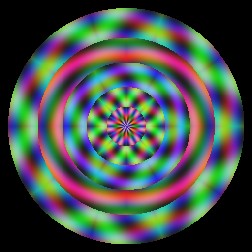

.. _kaleidoscope:

=====================================
3.1.4 - Kaleidoscope Effects
=====================================

:Duration: 20 minutes
:Level: Intermediate

Overview
========

Kaleidoscopes transform ordinary patterns into mesmerizing displays of symmetry. Invented in 1816 by Scottish physicist David Brewster, the kaleidoscope uses mirrors to create repeating patterns through reflection and rotation. In this exercise, you will learn how to recreate this optical effect using NumPy, transforming simple color gradients into intricate symmetric designs.

The mathematics behind kaleidoscopes combines two fundamental concepts: **reflection symmetry** (mirroring) and **rotational symmetry** (repeating around a center). By understanding these principles, you will be able to generate infinite variations of kaleidoscope patterns, from classic 6-fold designs to complex mandalas with multiple concentric rings.

**Learning Objectives**

By completing this exercise, you will:

* Understand reflection symmetry and how to implement mirror transformations with NumPy arrays
* Create N-fold rotational symmetry using polar coordinates and angle mapping
* Combine reflection and rotation to generate kaleidoscope patterns algorithmically
* Design mandala-like patterns through iterative geometric transformations

Quick Start: Create Your First Kaleidoscope
===========================================

Let's start by creating a 6-fold kaleidoscope pattern. Download and run the complete script:

:download:`Download simple_kaleidoscope.py <simple_kaleidoscope.py>`

.. code-block:: bash

   python simple_kaleidoscope.py

.. figure:: simple_kaleidoscope.png
   :width: 450px
   :align: center
   :alt: A 6-fold symmetric kaleidoscope pattern with colorful gradients

   A 6-fold kaleidoscope pattern generated from procedural color gradients. Notice how the pattern repeats six times around the center, with each segment mirrored from its neighbors.

**How it works:**

The script demonstrates the core kaleidoscope algorithm: mapping every pixel to a single "wedge" through angle folding. The key steps are:

.. code-block:: python
   :caption: Core algorithm from simple_kaleidoscope.py

   # Define kaleidoscope parameters
   num_folds = 6
   wedge_angle = 2 * np.pi / num_folds

   # Map all angles to a single wedge
   angle_positive = angle + np.pi
   wedge_index = (angle_positive / wedge_angle).astype(int)
   angle_in_wedge = angle_positive - wedge_index * wedge_angle

   # Mirror odd-numbered wedges for reflection symmetry
   is_odd_wedge = wedge_index % 2 == 1
   angle_mirrored = np.where(is_odd_wedge, wedge_angle - angle_in_wedge, angle_in_wedge)

The script creates a procedural source pattern, then samples colors from the mirrored wedge coordinates to create the symmetric effect.

.. tip::

   The key insight: Every pixel's color is determined by mapping its angle to a single "wedge" of the full circle. The wedge is then reflected and rotated to fill the entire image.

Core Concept 1: Reflection Symmetry
===================================

The Mathematics of Mirroring
----------------------------

Reflection symmetry occurs when one half of an object is a mirror image of the other. In 2D images, we can reflect across horizontal, vertical, or diagonal axes. NumPy provides simple functions to perform these reflections [NumPyFlip]_:

.. code-block:: python

   # Horizontal flip (mirror across vertical axis)
   mirrored_horizontal = np.fliplr(image)

   # Vertical flip (mirror across horizontal axis)
   mirrored_vertical = np.flipud(image)

   # Both (180-degree rotation equivalent)
   mirrored_both = np.flip(image)

In a kaleidoscope, reflection happens **within** the wedge itself. We do not flip entire arrays; instead, we map pixel coordinates to their mirrored equivalents.

Polar Coordinate Reflection
---------------------------

When working with radial patterns, reflecting across an angle is more useful than Cartesian flipping. Given an angle :math:`\theta` within a wedge of size :math:`w`, its reflection is:

.. math::

   \theta_{reflected} = w - \theta

This formula "bounces" the angle off the wedge boundary, creating the mirror effect.

.. code-block:: python

   # If angle is in odd-numbered wedge, reflect it
   is_odd_wedge = wedge_index % 2 == 1
   angle_mirrored = np.where(is_odd_wedge, wedge_angle - angle_in_wedge, angle_in_wedge)

.. important::

   **Reflection doubles the apparent pattern size.** A single 30-degree wedge becomes a 60-degree "kite" shape when reflected. This is why kaleidoscopes with mirrors create more complex patterns than simple rotation alone.

Core Concept 2: Rotational Symmetry (N-fold)
============================================

Understanding N-fold Symmetry
-----------------------------

N-fold rotational symmetry means a pattern looks identical after rotating by :math:`360°/N`. Common examples:

* **2-fold**: Looks the same after 180° rotation (like a rectangle)
* **4-fold**: Looks the same after 90° rotation (like a square)
* **6-fold**: Looks the same after 60° rotation (classic kaleidoscope, snowflakes)
* **8-fold**: Looks the same after 45° rotation (octagonal patterns)

In kaleidoscopes, N-fold symmetry is achieved by dividing the full circle into N equal wedges. While rotation can be performed using ``scipy.ndimage.rotate`` [SciPyRotate]_, our approach maps angles directly without explicit rotation:

.. math::

   \text{wedge angle} = \frac{2\pi}{N} \text{ radians} = \frac{360°}{N}

.. code-block:: python

   num_folds = 6
   wedge_angle = 2 * np.pi / num_folds  # 60 degrees = 1.047 radians

.. admonition:: Did You Know?

   David Brewster, who invented the kaleidoscope in 1816, originally designed it as a scientific instrument for studying light polarization. He later patented it as a toy, but poor patent enforcement meant he made little money despite its enormous popularity [Brewster1858]_.

The Wedge Mapping Algorithm
---------------------------

To create N-fold symmetry, every pixel must be mapped to the same reference wedge:

1. **Calculate the angle** from the center to each pixel
2. **Determine which wedge** the pixel falls into (integer division)
3. **Extract the angle within that wedge** (modulo operation)
4. **Apply reflection** for alternating wedges

.. code-block:: python

   # Map all angles to a single wedge
   angle_positive = angle + np.pi  # Shift from [-pi, pi] to [0, 2*pi]
   wedge_index = (angle_positive / wedge_angle).astype(int)
   angle_in_wedge = angle_positive - wedge_index * wedge_angle

.. figure:: kaleidoscope_variations.png
   :width: 550px
   :align: center
   :alt: Four kaleidoscope patterns showing 4-fold, 6-fold, 8-fold, and 12-fold symmetry

   Comparison of different fold counts: 4-fold (top-left), 6-fold (top-right), 8-fold (bottom-left), and 12-fold (bottom-right). Higher fold counts create more intricate, detailed patterns. Diagram generated with Claude - Opus 4.5.

Core Concept 3: Creating Kaleidoscope Patterns
==============================================

The Wedge-and-Replicate Algorithm
---------------------------------

Real kaleidoscopes use physical mirrors to create their patterns. In code, we simulate this by:

1. **Creating a source pattern** - Any image or procedural texture
2. **Defining a wedge** - A triangular slice of the full circle
3. **Mapping all pixels** to that single wedge (with reflection)
4. **Sampling colors** based on the mapped coordinates

.. figure:: wedge_reflection.png
   :width: 600px
   :align: center
   :alt: Three panels showing progression from single wedge to reflected wedge to full kaleidoscope

   The kaleidoscope construction process: (1) A single 60-degree wedge, (2) the wedge with its reflection creating a "kite" shape, (3) the complete 6-fold pattern from rotating the kite. Diagram generated with Claude - Opus 4.5.

From Simple to Complex
----------------------

The power of the kaleidoscope algorithm is its composability. Once you understand the basic wedge mapping, you can:

* **Vary the source pattern**: Gradients, noise, geometric shapes
* **Change fold count**: Different N values create different aesthetics
* **Add concentric rings**: Each ring can have its own fold count and colors
* **Animate parameters**: Slowly changing angles or colors creates hypnotic motion

.. code-block:: python

   # Create different visual effects by varying the source pattern

   # Radial gradient
   gradient = (radius / center * 255).astype(np.uint8)

   # Spiral pattern
   spiral = ((angle * 3 + radius * 0.1) % (2 * np.pi) / (2 * np.pi) * 255).astype(np.uint8)

   # Concentric rings
   rings = ((radius % 50) / 50 * 255).astype(np.uint8)

Historical and Artistic Context
-------------------------------

Kaleidoscope patterns appear throughout art history and across cultures:

* **Islamic geometric art**: Complex tessellations based on rotational symmetry [Hargittai2009]_
* **Mandalas**: Hindu and Buddhist spiritual symbols with radial symmetry [Weyl1952]_
* **Art Nouveau**: Designers like Alphonse Mucha used kaleidoscopic compositions
* **Digital art**: Modern generative artists create infinite variations algorithmically

The underlying mathematics connects all these traditions: the study of **symmetry groups** and **transformations** that preserve structure [Weyl1952]_.

Hands-On Exercises
==================

Exercise 1: Execute and Explore
-------------------------------

:download:`Download simple_kaleidoscope.py <simple_kaleidoscope.py>` and run it to observe the 6-fold symmetric pattern.

**Reflection Questions:**

* Why does changing ``num_folds`` affect the pattern's complexity?
* What happens if you set ``num_folds = 3``? What about ``num_folds = 1``?
* Why do we need to handle "odd" and "even" wedges differently?

.. dropdown:: Solution & Explanation

   **Answer to Question 1:** Changing ``num_folds`` changes the wedge angle (:math:`2\pi/N`). Smaller wedges (higher N) mean each segment is narrower, creating more intricate, detailed patterns. The same source pattern is divided into more pieces.

   **Answer to Question 2:**

   * ``num_folds = 3``: Creates 3-fold symmetry (like a triangle). Each wedge is 120 degrees.
   * ``num_folds = 1``: Creates no symmetry at all - the entire image is just the source pattern without folding. This is technically valid but defeats the purpose of a kaleidoscope.

   **Answer to Question 3:** We handle odd and even wedges differently to create **reflection symmetry**. Without this, we would only have rotational symmetry. The reflection makes adjacent wedges mirror images of each other, which is how real kaleidoscopes with mirrors work. If we did not reflect, the pattern would look like simple rotation (pinwheel effect) rather than a true kaleidoscope.

Exercise 2: Modify Parameters
-----------------------------

Modify the downloaded ``simple_kaleidoscope.py`` to achieve these goals:

**Goals:**

1. Create an 8-fold kaleidoscope pattern
2. Change the source pattern to use blue and purple tones (reduce red, increase blue)
3. Create a 12-fold pattern with a smaller radius (center the pattern with more black border)

.. dropdown:: Hints

   **Hint for Goal 1:** Change the ``num_folds`` variable from 6 to 8.

   **Hint for Goal 2:** Modify the color channel calculations. Reduce the multiplier for red and increase for blue.

   **Hint for Goal 3:** Combine changing ``num_folds`` to 12 with reducing the mask radius (change ``center - 10`` to a smaller value like ``center - 100``).

.. dropdown:: Solutions

   **1. Eight-fold Kaleidoscope:**

   .. code-block:: python

      num_folds = 8  # Changed from 6
      wedge_angle = 2 * np.pi / num_folds

   This creates 8 symmetry segments, each 45 degrees wide.

   **2. Blue and Purple Tones:**

   .. code-block:: python

      # Reduce red, increase blue for purple effect
      red_channel = ((np.sin(angle * 3 + radius * 0.05) + 1) * 60).astype(np.uint8)
      green_channel = ((np.cos(angle * 2 + radius * 0.03) + 1) * 50).astype(np.uint8)
      blue_channel = ((np.sin(radius * 0.08) + 1) * 127 + 60).astype(np.uint8)

   By reducing red and green multipliers while increasing blue, the overall palette shifts to purple/blue tones.

   **3. Compact 12-fold Pattern:**

   .. code-block:: python

      num_folds = 12
      # In the mask line:
      mask = radius <= center - 100  # Smaller circle, more border

   This creates a smaller, more centered kaleidoscope with 12-fold symmetry.

Exercise 3: Create a Mandala Pattern
------------------------------------

Create a mandala-like pattern with multiple concentric kaleidoscope rings, each with different fold counts and colors.

**Goal:** Build a mandala with at least 3 rings, where each ring has a different symmetry (e.g., inner ring with 12-fold, middle with 6-fold, outer with 4-fold).

**Requirements:**

* Canvas size: 512 x 512 pixels
* At least 3 concentric rings
* Each ring should have a different ``num_folds`` value
* Different color schemes for each ring

**Starter Code:**

.. code-block:: python
   :caption: mandala_starter.py - Skeleton for mandala creation

   import numpy as np
   from PIL import Image

   def create_mandala_ring(size, inner_radius, outer_radius, num_folds, color_scheme):
       """Create a single kaleidoscope ring."""
       center = size // 2
       ring = np.zeros((size, size, 3), dtype=np.uint8)

       y, x = np.ogrid[:size, :size]
       x_centered = x - center
       y_centered = y - center
       angle = np.arctan2(y_centered, x_centered)
       radius = np.sqrt(x_centered**2 + y_centered**2)

       # TODO 1: Calculate wedge_angle based on num_folds
       wedge_angle = 0  # Your code here

       # TODO 2: Create the ring mask (pixels within inner and outer radius)
       in_ring = False  # Your code here

       # TODO 3: Calculate colors using angle, radius, and color_scheme
       # ...

       return ring, in_ring

   # TODO 4: Define ring specifications and create mandala

.. dropdown:: Hint 1: Wedge Angle Calculation

   The wedge angle for N-fold symmetry is:

   .. code-block:: python

      wedge_angle = 2 * np.pi / num_folds

.. dropdown:: Hint 2: Ring Mask

   To select pixels within a ring:

   .. code-block:: python

      in_ring = (radius >= inner_radius) & (radius < outer_radius)

.. dropdown:: Complete Solution

   .. code-block:: python
      :caption: mandala_solution.py - Complete mandala implementation
      :linenos:
      :emphasize-lines: 25,29,35-37

      import numpy as np
      from PIL import Image

      def create_mandala_ring(size, inner_radius, outer_radius, num_folds, color_scheme):
          center = size // 2
          ring = np.zeros((size, size, 3), dtype=np.uint8)

          y, x = np.ogrid[:size, :size]
          x_centered = x - center
          y_centered = y - center
          angle = np.arctan2(y_centered, x_centered)
          radius = np.sqrt(x_centered**2 + y_centered**2)

          # Calculate wedge angle for N-fold symmetry
          wedge_angle = 2 * np.pi / num_folds

          # Map angles to single wedge with reflection
          angle_positive = angle + np.pi
          wedge_index = (angle_positive / wedge_angle).astype(int)
          angle_in_wedge = angle_positive - wedge_index * wedge_angle
          is_odd = wedge_index % 2 == 1
          angle_mirrored = np.where(is_odd, wedge_angle - angle_in_wedge, angle_in_wedge)

          # Ring mask
          in_ring = (radius >= inner_radius) & (radius < outer_radius)

          # Colors based on color_scheme multipliers
          r_mult, g_mult, b_mult = color_scheme
          ring_pos = (radius - inner_radius) / max(outer_radius - inner_radius, 1)

          red = ((np.sin(angle_mirrored * num_folds + ring_pos * np.pi * 2) + 1) * 100 * r_mult + 30).astype(np.uint8)
          green = ((np.cos(angle_mirrored * (num_folds + 2)) + 1) * 100 * g_mult + 30).astype(np.uint8)
          blue = ((np.sin(ring_pos * np.pi * 3) + 1) * 100 * b_mult + 30).astype(np.uint8)

          ring[in_ring, 0] = red[in_ring]
          ring[in_ring, 1] = green[in_ring]
          ring[in_ring, 2] = blue[in_ring]

          return ring, in_ring

      # Create mandala
      size = 512
      canvas = np.zeros((size, size, 3), dtype=np.uint8)

      ring_specs = [
          (0, 40, 12, (1.0, 0.6, 0.8)),    # Center: 12-fold, pink
          (40, 80, 8, (0.7, 1.0, 0.5)),    # Inner: 8-fold, green
          (80, 130, 6, (0.5, 0.8, 1.0)),   # Middle: 6-fold, blue
          (130, 180, 4, (1.0, 0.5, 0.6)),  # Outer: 4-fold, coral
          (180, 240, 10, (0.6, 0.9, 0.7)), # Edge: 10-fold, teal
      ]

      for inner_r, outer_r, folds, colors in ring_specs:
          ring, mask = create_mandala_ring(size, inner_r, outer_r, folds, colors)
          canvas[mask] = ring[mask]

      Image.fromarray(canvas, mode='RGB').save('mandala_pattern.png')

   **How it works:**

   * **Line 25**: The wedge angle divides the circle into N equal parts
   * **Line 29**: The ring mask selects only pixels within the donut-shaped region
   * **Lines 35-37**: Color calculations use the ring position for smooth gradients

   **Challenge extension:** Try animating the mandala by slowly rotating each ring at different speeds, or by varying the colors over time.

   Example mandala output with 5 concentric rings. Each ring has different fold counts (12, 8, 6, 4, 10) creating visual complexity through layered symmetry.

Summary
=======

In this module, you have learned the mathematical foundations of kaleidoscope effects and implemented them in NumPy.

**Key Takeaways:**

* Kaleidoscopes combine **reflection symmetry** (mirroring) with **rotational symmetry** (N-fold repetition)
* The core algorithm maps every pixel to a single "wedge" using polar coordinates and angle folding
* Reflection is achieved by mirroring angles in alternating wedges: :math:`\theta_{reflected} = w - \theta`
* Higher fold counts (N) create more intricate patterns; lower counts create bolder segments
* **Concentric rings with varying parameters** create mandala-like compositions

**Common Pitfalls to Avoid:**

* **Forgetting to shift angles:** Angles from ``arctan2`` range from :math:`-\pi` to :math:`\pi`. Add :math:`\pi` to get positive values before wedge calculations.
* **Integer division issues:** Use ``astype(int)`` carefully. The wedge index must be an integer for proper modulo behavior.
* **Confusing rotation and reflection:** Rotation alone creates pinwheel patterns. You need to mirror alternating wedges to get true kaleidoscope symmetry.
* **Edge artifacts:** Always apply a circular mask to avoid sharp rectangular edges.

This knowledge of symmetry transformations prepares you for more advanced topics including fractals, tessellations, and procedural texture generation. The principles of rotational and reflection symmetry appear throughout computer graphics and generative art.

References
==========

.. [Brewster1858] Brewster, D. (1858). *The Kaleidoscope: Its History, Theory, and Construction with Its Application to the Fine and Useful Arts* (2nd ed.). John Murray. [The original treatise on kaleidoscopes by their inventor, covering optical principles and artistic applications]

.. [Weyl1952] Weyl, H. (1952). *Symmetry*. Princeton University Press. ISBN: 978-0691023748 [Classic mathematical text on symmetry groups and their appearance in nature and art]

.. [Hargittai2009] Hargittai, I., & Hargittai, M. (2009). *Visual Symmetry*. World Scientific Publishing. ISBN: 978-9812835314 [Comprehensive survey of symmetry in art, science, and nature with extensive visual examples]

.. [GonzalezWoods2018] Gonzalez, R. C., & Woods, R. E. (2018). *Digital Image Processing* (4th ed.). Pearson. ISBN: 978-0133356724 [Standard textbook covering geometric transformations and image manipulation]

.. [NumPyFlip] NumPy Developers. (2024). numpy.flip. *NumPy Documentation*. Retrieved December 2, 2025, from https://numpy.org/doc/stable/reference/generated/numpy.flip.html [Official documentation for array flipping functions]

.. [SciPyRotate] SciPy Developers. (2024). scipy.ndimage.rotate. *SciPy Documentation*. Retrieved December 2, 2025, from https://docs.scipy.org/doc/scipy/reference/generated/scipy.ndimage.rotate.html [Documentation for image rotation functions]

.. [Molnar1974] Molnar, V. (1974). Toward aesthetic guidelines for paintings with the aid of a computer. *Leonardo*, 7(3), 185-189. https://doi.org/10.2307/1572906 [Pioneer of computer-generated art discussing systematic exploration of symmetry and visual parameters]
