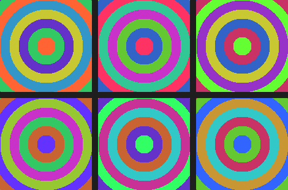
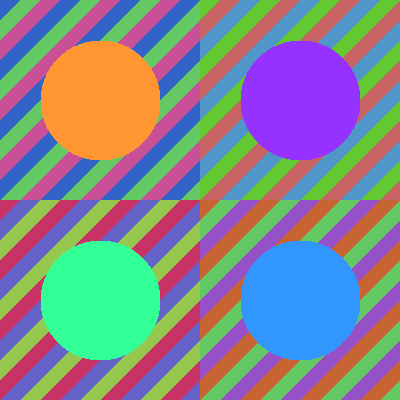

======================================
3.3.1 - Warhol Pop Art Effect
======================================

:Duration: 18 minutes
:Level: Beginner
:Prerequisites: Module 1.1.1 (RGB Basics), Module 1.3 (Array Slicing)

Overview
========

In this exercise, you will create pop art inspired by Andy Warhol's iconic screen printing technique. By rotating and swapping RGB color channels, you can transform a single image into multiple dramatic color variations, just as Warhol created his famous repetitive portraits with striking color shifts.

This technique demonstrates how simple array indexing operations in NumPy can produce visually powerful artistic effects. The same principle Warhol applied manually with silkscreen prints, we can achieve programmatically in just a few lines of code.

**Learning Objectives**

By the end of this exercise, you will be able to:

- Understand how RGB channel rotation creates distinct color variations
- Apply NumPy advanced indexing to swap and reorder color channels
- Create 2x2 grid compositions using array slicing and concatenation
- Appreciate the connection between computational techniques and pop art aesthetics

Quick Start
===========

Let us begin by seeing the Warhol effect in action. Run this code to create your first pop art piece:

.. code-block:: python
   :caption: Create a Warhol-style 2x2 grid with color variations
   :linenos:

   import numpy as np
   from PIL import Image

   # Create a colorful gradient source image
   height, width = 200, 200
   image = np.zeros((height, width, 3), dtype=np.uint8)

   for y in range(height):
       for x in range(width):
           cx, cy = width // 2, height // 2
           distance = np.sqrt((x - cx)**2 + (y - cy)**2)
           image[y, x, 0] = int(128 + 127 * np.sin(distance * 0.1))
           image[y, x, 1] = int(128 + 127 * np.sin(distance * 0.1 + 2))
           image[y, x, 2] = int(128 + 127 * np.sin(distance * 0.1 + 4))

   # Create 2x2 canvas and place four color variations
   canvas = np.zeros((height * 2, width * 2, 3), dtype=np.uint8)
   canvas[0:height, 0:width] = image[:, :, [0, 1, 2]]        # Original
   canvas[0:height, width:] = image[:, :, [1, 2, 0]]         # Rotate channels
   canvas[height:, 0:width] = image[:, :, [2, 0, 1]]         # Rotate other way
   canvas[height:, width:] = image[:, :, [0, 2, 1]]          # Swap G and B

   output = Image.fromarray(canvas, mode='RGB')
   output.save('simple_warhol.png')

.. figure:: simple_warhol.png
   :width: 400px
   :align: center
   :alt: A 2x2 grid showing four color variations of a radial gradient pattern, demonstrating the Warhol pop art effect

   Your first Warhol-style pop art: four color variations from a single source image.

.. tip::

   Notice how each quadrant shows the same pattern but with dramatically different colors. This is achieved simply by reordering which channel appears as Red, Green, or Blue.

Core Concepts
=============

Concept 1: Andy Warhol and Pop Art
----------------------------------

Andy Warhol (1928-1987) was a leading figure in the pop art movement. His most famous works, including the *Marilyn Diptych* (1962) and *Campbell's Soup Cans* (1962), featured repetitive images with bold color variations [Warhol1975]_.

Warhol's technique involved creating multiple silkscreen prints of the same image, each with different color combinations. This approach challenged traditional notions of artistic uniqueness and embraced mass reproduction as an aesthetic choice [Foster2012]_.

.. admonition:: Did You Know?

   Warhol's *Marilyn Diptych* contains 50 images of Marilyn Monroe, with the left panel in vivid colors and the right panel in black and white. He created these variations by adjusting ink colors during the screen printing process, similar to how we manipulate RGB channels in code [MoMA2024]_.

Our digital approach mirrors Warhol's philosophy: starting with a single source and creating multiple variations through systematic color transformations. Where Warhol used different ink colors, we use channel permutations.

Concept 2: RGB Channel Manipulation
-----------------------------------

In digital images, each pixel contains three values: Red, Green, and Blue. NumPy allows us to access and reorder these channels using advanced indexing [NumPyDocs]_.

The key insight is that ``image[:, :, [2, 0, 1]]`` does not change the pixel values themselves; rather, it changes *which channel each value is displayed as*:

- Original: ``[R, G, B]`` - Red stays red, green stays green, blue stays blue
- Rotation: ``[G, B, R]`` - Green becomes red, blue becomes green, red becomes blue
- Swap: ``[R, B, G]`` - Red stays red, but green and blue switch places

.. figure:: channel_rotation_diagram.png
   :width: 500px
   :align: center
   :alt: Diagram showing the six possible RGB channel permutations applied to a color gradient bar

   All six possible arrangements of RGB channels create distinct color palettes.

Understanding how these color relationships work connects directly to color theory research on how humans perceive color interactions [Albers2013]_.

There are exactly **6 permutations** of three channels (3! = 6):

.. code-block:: python
   :caption: The six RGB channel permutations

   [0, 1, 2]  # Original: R, G, B
   [0, 2, 1]  # Swap G-B: R, B, G
   [1, 0, 2]  # Swap R-G: G, R, B
   [1, 2, 0]  # Rotate left: G, B, R
   [2, 0, 1]  # Rotate right: B, R, G
   [2, 1, 0]  # Swap R-B: B, G, R

.. important::

   The syntax ``image[:, :, [1, 2, 0]]`` means: for every row and column, take the channels in order [1, 2, 0]. This effectively maps Green to position 0 (Red), Blue to position 1 (Green), and Red to position 2 (Blue).

Concept 3: Grid Composition Techniques
--------------------------------------

To create a Warhol-style grid, we need to place multiple image variations onto a single canvas. There are two main approaches:

**Method 1: Pre-allocated Canvas with Slicing**

Create a canvas large enough to hold all variations, then use array slicing to place each image:

.. code-block:: python
   :caption: Building a grid using pre-allocated canvas

   # Canvas twice the height and width of source
   canvas = np.zeros((height * 2, width * 2, 3), dtype=np.uint8)

   # Place images using slicing
   canvas[0:height, 0:width] = image_variant_1
   canvas[0:height, width:] = image_variant_2
   canvas[height:, 0:width] = image_variant_3
   canvas[height:, width:] = image_variant_4

**Method 2: Concatenation with vstack/hstack**

Alternatively, stack images using NumPy's concatenation functions:

.. code-block:: python
   :caption: Building a grid using concatenation

   # Create rows first
   top_row = np.hstack([image_variant_1, image_variant_2])
   bottom_row = np.hstack([image_variant_3, image_variant_4])

   # Stack rows vertically
   canvas = np.vstack([top_row, bottom_row])

Both methods produce identical results. Method 1 is often clearer for beginners, while Method 2 is more concise [Gonzalez2018]_.

.. note::

   When using slicing, ensure your index ranges match the image dimensions exactly. A common error is using ``width`` where ``height`` is needed, or forgetting that the second slice endpoint is exclusive (``0:height`` includes pixels 0 through height-1).

Hands-On Exercises
==================

Exercise 1: Execute and Explore (3-4 minutes)
---------------------------------------------

Run the ``warhol_variations.py`` script to see all six channel permutations applied to a colorful source image:

.. code-block:: python
   :caption: warhol_variations.py - Exploring all permutations
   :linenos:

   import numpy as np
   from PIL import Image

   # Create a colorful source with concentric rings
   height, width = 150, 150
   source = np.zeros((height, width, 3), dtype=np.uint8)

   cx, cy = width // 2, height // 2
   for y in range(height):
       for x in range(width):
           dist = np.sqrt((x - cx)**2 + (y - cy)**2)
           ring = int(dist / 15) % 5
           colors = [[255, 100, 50], [50, 200, 100], [100, 50, 200],
                     [200, 200, 50], [50, 150, 200]]
           source[y, x] = colors[ring]

   # All 6 permutations
   permutations = [[0, 1, 2], [0, 2, 1], [1, 0, 2],
                   [1, 2, 0], [2, 0, 1], [2, 1, 0]]

   # Create 2x3 grid
   canvas = np.ones((height * 2 + 10, width * 3 + 20, 3), dtype=np.uint8) * 30

   for idx, perm in enumerate(permutations):
       row, col = idx // 3, idx % 3
       x_start = col * (width + 10)
       y_start = row * (height + 10)
       canvas[y_start:y_start + height, x_start:x_start + width] = source[:, :, perm]

   Image.fromarray(canvas, mode='RGB').save('warhol_variations.png')

   All six channel permutations create distinct color palettes from the same source.

**Reflection Questions:**

1. Which permutation creates the most dramatic color shift from the original?
2. Why do some permutations look more similar to each other than others?
3. Which variation would you choose for a classic "pop art" look?

.. dropdown:: Solution and Explanation

   **Answers:**

   1. ``[2, 1, 0]`` (swap R-B) often creates the most dramatic shift because it completely inverts the warm-cool color relationship. Orange becomes blue, and blue becomes orange.

   2. Permutations that only swap two channels (like ``[0, 2, 1]``) produce more subtle changes than rotations (like ``[1, 2, 0]``) because they preserve one channel's position.

   3. The "classic pop art" look often uses ``[1, 2, 0]`` or ``[2, 0, 1]`` because they create bold, unexpected color combinations that still feel harmonious.

Exercise 2: Modify to Achieve Goals (4-5 minutes)
-------------------------------------------------

Starting with the Quick Start code, modify it to achieve these goals:

**Goals:**

1. Change the top-right quadrant to use the ``[2, 1, 0]`` permutation (swap Red and Blue)
2. Change the bottom-left quadrant to use ``[1, 0, 2]`` (swap Red and Green)
3. Add a 5-pixel black border between the quadrants

.. dropdown:: Hint 1: Changing Permutations

   Replace the channel list in the array indexing. For example, change:

   .. code-block:: python

      canvas[0:height, width:] = image[:, :, [1, 2, 0]]

   To:

   .. code-block:: python

      canvas[0:height, width:] = image[:, :, [2, 1, 0]]

.. dropdown:: Hint 2: Adding Borders

   To add borders, increase the canvas size and adjust the placement positions:

   .. code-block:: python

      gap = 5
      canvas = np.zeros((height * 2 + gap, width * 2 + gap, 3), dtype=np.uint8)
      # Top-left stays at [0:height, 0:width]
      # Top-right shifts to [0:height, width + gap:]

.. dropdown:: Complete Solution

   .. code-block:: python
      :linenos:

      import numpy as np
      from PIL import Image

      height, width = 200, 200
      image = np.zeros((height, width, 3), dtype=np.uint8)

      for y in range(height):
          for x in range(width):
              cx, cy = width // 2, height // 2
              distance = np.sqrt((x - cx)**2 + (y - cy)**2)
              image[y, x, 0] = int(128 + 127 * np.sin(distance * 0.1))
              image[y, x, 1] = int(128 + 127 * np.sin(distance * 0.1 + 2))
              image[y, x, 2] = int(128 + 127 * np.sin(distance * 0.1 + 4))

      gap = 5
      canvas = np.zeros((height * 2 + gap, width * 2 + gap, 3), dtype=np.uint8)

      canvas[0:height, 0:width] = image[:, :, [0, 1, 2]]
      canvas[0:height, width + gap:] = image[:, :, [2, 1, 0]]      # Goal 1
      canvas[height + gap:, 0:width] = image[:, :, [1, 0, 2]]      # Goal 2
      canvas[height + gap:, width + gap:] = image[:, :, [0, 2, 1]]

      Image.fromarray(canvas, mode='RGB').save('modified_warhol.png')

Exercise 3: Create from Scratch (5-6 minutes)
---------------------------------------------

Now create your own Warhol-style pop art from scratch. Use the starter code below and fill in the missing parts.

**Requirements:**

- Create a 2x2 grid of color variations
- Use at least 3 different channel permutations (one quadrant can be the original)
- The source image should have at least two distinct colors

**Starter Code:**

.. code-block:: text
   :caption: warhol_starter.py - Fill in the TODOs

   import numpy as np
   from PIL import Image

   # Source image is provided for you
   height, width = 200, 200
   source = np.zeros((height, width, 3), dtype=np.uint8)

   cx, cy = width // 2, height // 2
   radius = 60

   for y in range(height):
       for x in range(width):
           dist_from_center = np.sqrt((x - cx)**2 + (y - cy)**2)
           if dist_from_center < radius:
               source[y, x] = [255, 150, 50]  # Orange circle
           else:
               stripe = (x + y) // 20 % 3
               if stripe == 0:
                   source[y, x] = [50, 100, 200]
               elif stripe == 1:
                   source[y, x] = [100, 200, 100]
               else:
                   source[y, x] = [200, 80, 150]

   # TODO: Calculate canvas dimensions for 2x2 grid
   grid_height = ???
   grid_width = ???

   canvas = np.zeros((grid_height, grid_width, 3), dtype=np.uint8)

   # Top-left: Original
   canvas[0:height, 0:width] = source[:, :, [0, 1, 2]]

   # TODO: Top-right - choose a channel permutation
   canvas[0:height, width:grid_width] = source[:, :, [?, ?, ?]]

   # TODO: Bottom-left - choose another permutation
   canvas[height:grid_height, 0:width] = source[:, :, [?, ?, ?]]

   # TODO: Bottom-right - choose your final permutation
   canvas[height:grid_height, width:grid_width] = source[:, :, [?, ?, ?]]

   Image.fromarray(canvas, mode='RGB').save('my_warhol.png')

.. dropdown:: Hint: Canvas Dimensions

   For a 2x2 grid without gaps:

   .. code-block:: python

      grid_height = height * 2
      grid_width = width * 2

.. dropdown:: Complete Solution

   .. code-block:: python
      :linenos:

      import numpy as np
      from PIL import Image

      height, width = 200, 200
      source = np.zeros((height, width, 3), dtype=np.uint8)

      cx, cy = width // 2, height // 2
      radius = 60

      for y in range(height):
          for x in range(width):
              dist_from_center = np.sqrt((x - cx)**2 + (y - cy)**2)
              if dist_from_center < radius:
                  source[y, x] = [255, 150, 50]
              else:
                  stripe = (x + y) // 20 % 3
                  if stripe == 0:
                      source[y, x] = [50, 100, 200]
                  elif stripe == 1:
                      source[y, x] = [100, 200, 100]
                  else:
                      source[y, x] = [200, 80, 150]

      grid_height = height * 2
      grid_width = width * 2

      canvas = np.zeros((grid_height, grid_width, 3), dtype=np.uint8)

      canvas[0:height, 0:width] = source[:, :, [0, 1, 2]]
      canvas[0:height, width:grid_width] = source[:, :, [1, 2, 0]]
      canvas[height:grid_height, 0:width] = source[:, :, [2, 0, 1]]
      canvas[height:grid_height, width:grid_width] = source[:, :, [2, 1, 0]]

      Image.fromarray(canvas, mode='RGB').save('my_warhol.png')

   Example solution showing four distinct color variations.

**Challenge Extension:**

Create a 3x3 grid that includes all six permutations plus three "inverted" versions where you also flip the image horizontally or vertically. This creates 9 unique variations in the spirit of Warhol's larger serial works.

Summary
=======

In approximately 18 minutes, you have learned to create Warhol-style pop art using NumPy array operations.

**Key Takeaways:**

- RGB channel permutation creates color variations without changing pixel values
- ``image[:, :, [2, 0, 1]]`` reorders channels: what was Blue becomes Red, Red becomes Green, Green becomes Blue
- There are exactly 6 possible arrangements of 3 channels (3! = 6)
- Grid compositions can be created using either pre-allocated canvases with slicing or ``np.vstack``/``np.hstack``

**Common Pitfalls:**

- Confusing ``height`` and ``width`` when calculating canvas dimensions (remember: shape is ``(height, width, channels)``)
- Using the wrong slice endpoints (``0:height`` goes from 0 to height-1, not height)
- Forgetting that channel indices are 0, 1, 2 (not 1, 2, 3)

This exercise connects classical pop art techniques to computational creativity. Warhol's systematic approach to color variation anticipated the algorithmic art we create today.

References
==========

.. [Warhol1975] Warhol, A. (1975). *The Philosophy of Andy Warhol (From A to B and Back Again)*. Harcourt Brace Jovanovich. ISBN: 978-0-15-671720-3

.. [Foster2012] Foster, H. (2012). *The First Pop Age: Painting and Subjectivity in the Art of Hamilton, Lichtenstein, Warhol, Richter, and Ruscha*. Princeton University Press. ISBN: 978-0-691-15138-4

.. [MoMA2024] Museum of Modern Art. (2024). Andy Warhol: Collection highlights. *MoMA Collection*. Retrieved December 2, 2024, from https://www.moma.org/artists/6246

.. [NumPyDocs] NumPy Developers. (2024). Array indexing. *NumPy Documentation*. Retrieved December 2, 2024, from https://numpy.org/doc/stable/user/basics.indexing.html

.. [PillowDocs] Clark, A., et al. (2024). *Pillow: Python Imaging Library* (Version 10.x). Python Software Foundation. https://pillow.readthedocs.io/

.. [Gonzalez2018] Gonzalez, R. C., & Woods, R. E. (2018). *Digital Image Processing* (4th ed.). Pearson. ISBN: 978-0-13-335672-4

.. [Albers2013] Albers, J. (2013). *Interaction of Color* (50th Anniversary ed.). Yale University Press. ISBN: 978-0-300-17935-4 [Classic text on color perception and relationships]
