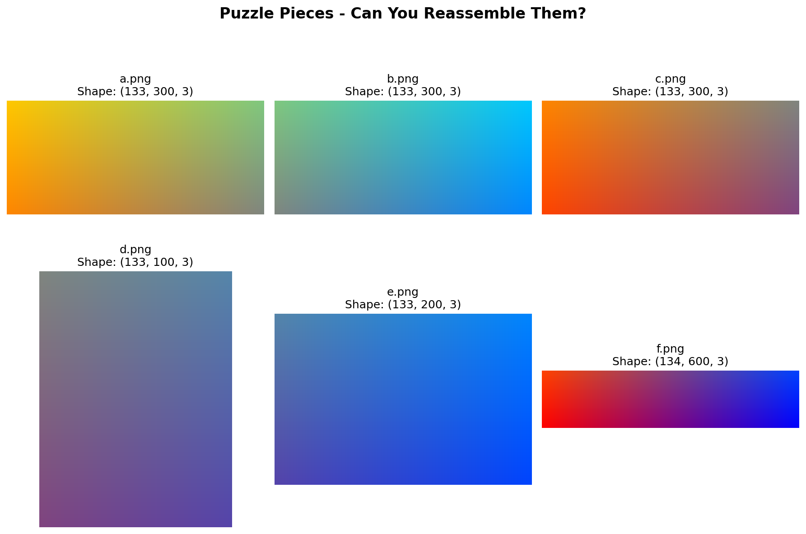

=====================================
3.3.2 - Puzzle (Array Concatenation)
=====================================

:Duration: 18 minutes
:Level: Beginner
:Prerequisites: Module 1.3 (Array Slicing), Module 2.1 (Array Basics)

Overview
========

Have you ever solved a jigsaw puzzle? In this exercise, you will learn to assemble
image fragments using NumPy's array concatenation functions. Just like fitting puzzle
pieces together, ``np.vstack`` and ``np.hstack`` allow you to combine arrays vertically
and horizontally to reconstruct complete images.

Array concatenation is a fundamental operation in image processing, used for creating
panoramas, combining processed image regions, and building complex visualizations from
simpler components [Harris2020]_. We use the Pillow library [Pillow2024]_ for loading
and saving images.

**Learning Objectives**

By completing this module, you will:

* Understand vertical stacking (``np.vstack``) and horizontal stacking (``np.hstack``)
* Identify shape compatibility requirements for successful concatenation
* Assemble image fragments into complete pictures using strategic combinations
* Create custom puzzles by slicing images and reassembling them

Quick Start: Assembling Your First Pieces
=========================================

Let's start by combining two puzzle pieces. First, look at the puzzle pieces we will
work with:

   The six puzzle pieces with their array shapes. Notice how pieces A, B, and C share
   the same height (133 pixels), making them compatible for horizontal stacking.

Now run this code to combine pieces A and B horizontally:

.. code-block:: python
   :caption: Quick Start - Combining two pieces with hstack
   :linenos:

   import numpy as np
   from PIL import Image

   # Load two puzzle pieces
   piece_a = np.array(Image.open('a.png'))
   piece_b = np.array(Image.open('b.png'))

   # Check the shapes - both should have the same height for hstack
   print(f"Piece A shape: {piece_a.shape}")
   print(f"Piece B shape: {piece_b.shape}")

   # Stack pieces horizontally (side by side)
   top_row = np.hstack([piece_a, piece_b])
   print(f"Top row shape: {top_row.shape}")

   # Save the result
   Image.fromarray(top_row).save('quick_start_output.png')

   Result of combining pieces A and B horizontally. The combined width equals 300 + 300 = 600 pixels.

.. tip::

   Notice how the output shape ``(133, 600, 3)`` has the same height (133) as the inputs,
   but the width doubled from 300 to 600. This is because ``hstack`` places arrays
   **side by side**, adding their widths together.

Vertical Stacking with np.vstack
================================

The ``np.vstack`` function stacks arrays **vertically** (top to bottom). Think of it as
placing one image below another, like stacking pancakes [NumPyVstack]_.

.. figure:: concatenation_diagram.png
   :width: 600px
   :align: center
   :alt: Diagram showing how vstack combines arrays vertically and hstack combines horizontally

   Visual comparison of vstack and hstack operations with dimension requirements highlighted.

For ``vstack`` to work, all arrays must have the **same width** (number of columns):

.. code-block:: python
   :caption: Vertical stacking example
   :linenos:

   import numpy as np
   from PIL import Image

   # Load pieces with matching widths
   piece_a = np.array(Image.open('a.png'))  # Shape: (133, 300, 3)
   piece_c = np.array(Image.open('c.png'))  # Shape: (133, 300, 3)

   # Stack vertically - heights add up
   column = np.vstack([piece_a, piece_c])
   print(f"Column shape: {column.shape}")  # (266, 300, 3)

   Image.fromarray(column).save('column_ac.png')

.. important::

   **Dimension Rule for vstack**: All arrays must have the same **width** (second dimension).
   The resulting height equals the sum of all input heights.

   - Input A: (133, 300, 3) + Input C: (133, 300, 3)
   - Output: (266, 300, 3) - widths match (300), heights add (133 + 133 = 266)

Horizontal Stacking with np.hstack
==================================

The ``np.hstack`` function stacks arrays **horizontally** (left to right). This is like
placing images side by side in a row [NumPyHstack]_.

For ``hstack`` to work, all arrays must have the **same height** (number of rows):

.. code-block:: python
   :caption: Horizontal stacking example
   :linenos:

   import numpy as np
   from PIL import Image

   # Load pieces with matching heights
   piece_d = np.array(Image.open('d.png'))  # Shape: (133, 100, 3)
   piece_e = np.array(Image.open('e.png'))  # Shape: (133, 200, 3)

   # Stack horizontally - widths add up
   row = np.hstack([piece_d, piece_e])
   print(f"Row shape: {row.shape}")  # (133, 300, 3)

   Image.fromarray(row).save('row_de.png')

.. important::

   **Dimension Rule for hstack**: All arrays must have the same **height** (first dimension).
   The resulting width equals the sum of all input widths.

   - Input D: (133, 100, 3) + Input E: (133, 200, 3)
   - Output: (133, 300, 3) - heights match (133), widths add (100 + 200 = 300)

Building Complex Arrangements
=============================

To create complex puzzle assemblies, you can combine ``vstack`` and ``hstack`` in
multiple steps. The key strategy is:

1. **Build rows first** using ``hstack`` (pieces must have matching heights)
2. **Stack rows vertically** using ``vstack`` (rows must have matching widths)

.. code-block:: python
   :caption: Building a 2x2 grid step by step
   :linenos:

   import numpy as np
   from PIL import Image

   # Load all pieces
   a = np.array(Image.open('a.png'))
   b = np.array(Image.open('b.png'))
   c = np.array(Image.open('c.png'))
   d = np.array(Image.open('d.png'))
   e = np.array(Image.open('e.png'))

   # Step 1: Build top row (A + B)
   top_row = np.hstack([a, b])  # (133, 600, 3)

   # Step 2: Build bottom row (C + D + E)
   # Note: C is 300px wide, D+E together are 300px wide
   bottom_row = np.hstack([c, d, e])  # (133, 600, 3)

   # Step 3: Stack rows vertically
   grid = np.vstack([top_row, bottom_row])  # (266, 600, 3)

   Image.fromarray(grid).save('partial_puzzle.png')

.. figure:: exercise2_grid.png
   :width: 400px
   :align: center
   :alt: A 2x2 grid assembled from puzzle pieces showing gradient colors

   Result of combining multiple pieces into a grid arrangement.

.. admonition:: Did You Know?

   The same concatenation techniques are used in professional image stitching software
   to create panoramic photographs. Programs like Hugin and Adobe Photoshop use array
   concatenation after aligning overlapping regions [Szeliski2006]_.

Hands-On Exercises
==================

Exercise 1: Execute and Explore
-------------------------------

**Time estimate:** 3-4 minutes

Run the following code to observe how ``vstack`` and ``hstack`` affect array shapes:

.. code-block:: python
   :caption: exercise1_two_pieces.py
   :linenos:

   import numpy as np
   from PIL import Image

   # Load two puzzle pieces with matching dimensions
   piece_a = np.array(Image.open('a.png'))
   piece_c = np.array(Image.open('c.png'))

   print("=== Array Shapes ===")
   print(f"Piece A: {piece_a.shape}")
   print(f"Piece C: {piece_c.shape}")

   # Stack vertically
   vertical_result = np.vstack([piece_a, piece_c])
   print(f"After vstack: {vertical_result.shape}")
   Image.fromarray(vertical_result).save('exercise1_vstack.png')

   # Stack horizontally
   horizontal_result = np.hstack([piece_a, piece_c])
   print(f"After hstack: {horizontal_result.shape}")
   Image.fromarray(horizontal_result).save('exercise1_hstack.png')

**Reflection questions:**

1. What changed in the shape after ``vstack``? Which dimension increased?
2. What changed in the shape after ``hstack``? Which dimension increased?
3. Both operations worked with pieces A and C. What property do they share that made this possible?

.. dropdown:: Solution & Explanation

   **Answers:**

   1. After ``vstack``, the **first dimension (height)** increased from 133 to 266.
      The width (300) stayed the same.

   2. After ``hstack``, the **second dimension (width)** increased from 300 to 600.
      The height (133) stayed the same.

   3. Pieces A and C share **both the same height AND the same width** (133, 300, 3).
      This is why both operations work:

      - ``vstack`` needs matching widths (both are 300)
      - ``hstack`` needs matching heights (both are 133)

   **Key insight**: When arrays have identical shapes, both stacking operations are valid.

Exercise 2: Modify to Achieve Goals
-----------------------------------

**Time estimate:** 4 minutes

Starting with the concepts from Exercise 1, achieve these goals:

**Goals:**

1. Create a horizontal row combining pieces D and E
2. Create a vertical column combining pieces A and C
3. Create a 2x2 grid by combining the top row (A+B) with the bottom row (C+D+E)

.. dropdown:: Hints

   * First print all piece shapes to understand dimensions
   * D and E both have height 133, so ``hstack`` will work
   * A and C both have width 300, so ``vstack`` will work
   * For the grid: build each row first, then verify they have the same width before using ``vstack``

.. dropdown:: Solutions

   **Goal 1: Horizontal row from D and E**

   .. code-block:: python

      row_de = np.hstack([piece_d, piece_e])  # (133, 300, 3)

   **Goal 2: Vertical column from A and C**

   .. code-block:: python

      column_ac = np.vstack([piece_a, piece_c])  # (266, 300, 3)

   **Goal 3: 2x2 grid**

   .. code-block:: python

      # Build rows
      top_row = np.hstack([piece_a, piece_b])      # (133, 600, 3)
      bottom_row = np.hstack([piece_c, piece_d, piece_e])  # (133, 600, 3)

      # Stack rows
      grid = np.vstack([top_row, bottom_row])      # (266, 600, 3)

   Note: The bottom row combines C (300px) with D+E (100+200=300px) to match the top row width of 600px.

Exercise 3: Create from Scratch
-------------------------------

**Time estimate:** 5-6 minutes

Create your own puzzle from any image of your choice.

**Goal:** Slice an image into 4 pieces (2x2 grid) and reassemble them correctly.

**Requirements:**

* Load any image (you can use ``source_image.png`` or your own)
* Slice it into 4 quadrants using array indexing
* Reassemble the pieces using ``hstack`` and ``vstack``
* Verify the reassembled image matches the original

**Starter Code:**

.. code-block:: python
   :caption: exercise3_create_puzzle_starter.py
   :linenos:

   import numpy as np
   from PIL import Image

   # Load any image
   image = np.array(Image.open('source_image.png'))
   height, width = image.shape[0], image.shape[1]

   # Calculate midpoints
   mid_y = height // 2
   mid_x = width // 2

   # TODO: Slice into 4 quadrants
   top_left = image[0:mid_y, 0:mid_x]
   top_right = # Fill in the slicing
   bottom_left = # Fill in the slicing
   bottom_right = # Fill in the slicing

   # TODO: Reassemble
   top_row = # Use hstack
   bottom_row = # Use hstack
   reassembled = # Use vstack

   # Verify
   if np.array_equal(image, reassembled):
       print("SUCCESS! Images match!")

.. dropdown:: Complete Solution

   .. code-block:: python

      import numpy as np
      from PIL import Image

      # Load image
      image = np.array(Image.open('source_image.png'))
      height, width = image.shape[0], image.shape[1]
      mid_y, mid_x = height // 2, width // 2

      # Slice into 4 quadrants
      top_left = image[0:mid_y, 0:mid_x]
      top_right = image[0:mid_y, mid_x:width]
      bottom_left = image[mid_y:height, 0:mid_x]
      bottom_right = image[mid_y:height, mid_x:width]

      # Reassemble
      top_row = np.hstack([top_left, top_right])
      bottom_row = np.hstack([bottom_left, bottom_right])
      reassembled = np.vstack([top_row, bottom_row])

      # Verify
      if np.array_equal(image, reassembled):
          print("SUCCESS! Images match!")

   **How it works:**

   * Slicing uses ``[y_start:y_end, x_start:x_end]`` (rows first, columns second)
   * ``hstack`` combines quadrants left-to-right within each row
   * ``vstack`` combines the two rows top-to-bottom
   * The order of operations matters for correct reconstruction

.. figure:: exercise3_comparison.png
   :width: 600px
   :align: center
   :alt: Three images showing original, correctly reassembled, and shuffled versions

   Comparison of original image, correctly reassembled version, and an artistic shuffled variation.

**Challenge Extension:** Create an abstract art piece by intentionally reassembling
pieces in the wrong order. What interesting patterns emerge?

Summary
=======

**Key Takeaways:**

* ``np.vstack`` stacks arrays **vertically** (top to bottom) - heights add, widths must match
* ``np.hstack`` stacks arrays **horizontally** (left to right) - widths add, heights must match
* Build complex arrangements by combining operations: rows first with ``hstack``, then stack with ``vstack``
* Array shapes follow the pattern ``(height, width, channels)`` for color images
* Use ``print(array.shape)`` frequently to verify dimensions before concatenation

**Common Pitfalls:**

* **Dimension mismatch errors**: Always check shapes before concatenating. If ``vstack`` fails,
  widths don't match. If ``hstack`` fails, heights don't match.
* **Forgetting the list**: Both functions take a **list** of arrays: ``np.vstack([a, b])`` not ``np.vstack(a, b)`` [NumPyConcatenate]_
* **Row/column confusion**: Remember that array indexing is ``[row, column]`` or ``[y, x]``,
  which is the opposite of typical ``(x, y)`` coordinate notation.

References
==========

.. [Harris2020] Harris, C. R., Millman, K. J., van der Walt, S. J., et al. (2020).
   Array programming with NumPy. *Nature*, 585(7825), 357-362.
   https://doi.org/10.1038/s41586-020-2649-2
   [Foundational paper on NumPy array operations]

.. [NumPyVstack] NumPy Developers. (2024). numpy.vstack documentation.
   *NumPy Documentation*. https://numpy.org/doc/stable/reference/generated/numpy.vstack.html
   [Official reference for vertical stacking]

.. [NumPyHstack] NumPy Developers. (2024). numpy.hstack documentation.
   *NumPy Documentation*. https://numpy.org/doc/stable/reference/generated/numpy.hstack.html
   [Official reference for horizontal stacking]

.. [NumPyConcatenate] NumPy Developers. (2024). numpy.concatenate documentation.
   *NumPy Documentation*. https://numpy.org/doc/stable/reference/generated/numpy.concatenate.html
   [General concatenation function underlying vstack and hstack]

.. [Gonzalez2018] Gonzalez, R. C., & Woods, R. E. (2018). *Digital Image Processing*
   (4th ed.). Pearson. ISBN: 978-0133356724
   [Textbook covering image composition techniques]

.. [Szeliski2006] Szeliski, R. (2006). Image alignment and stitching: A tutorial.
   *Foundations and Trends in Computer Graphics and Vision*, 2(1), 1-104.
   https://doi.org/10.1561/0600000009
   [Comprehensive tutorial on image stitching techniques]

.. [Pillow2024] Clark, A., et al. (2024). *Pillow: Python Imaging Library*
   (Version 10.x) [Computer software]. https://python-pillow.org/
   [Library used for loading and saving images]
