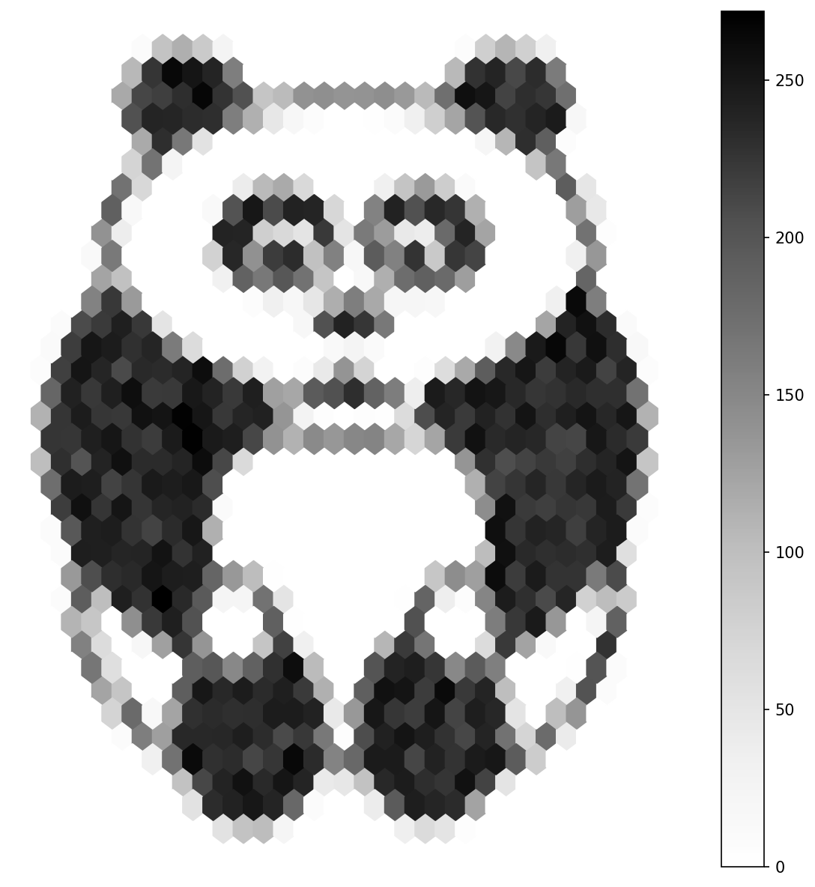

.. _module-3-3-3-hexpanda:

=====================================
3.3.3 - Hexpanda: Hexbin Art Filter
=====================================

:Duration: 15-18 minutes
:Level: Intermediate
:Prerequisites: Module 1.1.1 (RGB Basics), Module 3.1 (Transformations), pandas basics

Overview
========

What if you could transform any image into a mosaic of hexagonal tiles, revealing hidden patterns through density aggregation? In this exercise, you will learn how to use **hexagonal binning** (hexbin) to create striking artistic visualizations from ordinary images.

Hexbin visualization is a powerful data aggregation technique borrowed from scientific visualization. Instead of plotting individual points, hexbin groups nearby points into hexagonal cells and colors them by density. When applied to image pixels, this creates a unique artistic effect that abstracts fine details while preserving overall structure.

**Learning Objectives**

By completing this module, you will:

* Understand hexbin visualization as a data aggregation technique for artistic effects
* Transform image pixels into tabular data using pandas DataFrames
* Apply sampling strategies to create artistic density variations
* Control visualization parameters (grid size, colormap) for different artistic styles

Quick Start: Your First Hexbin Image
=====================================

Let's start with something visual. Run this code to transform a panda image into hexagonal art:

.. code-block:: python
   :caption: Transform an image into hexbin art in seconds
   :linenos:

   import pandas as pd
   import matplotlib.pyplot as plt
   import numpy as np
   from PIL import Image

   # Load and convert to grayscale
   panda_image = Image.open('panda.png')
   pixel_array = np.array(panda_image.convert('L'))

   # Invert and convert to DataFrame
   inverted = 255 - pixel_array
   df = pd.DataFrame(inverted).unstack()
   df = df[df > 0].reset_index()
   df.columns = ['x', 'y', 'intensity']
   df['y'] = -df['y']  # Fix orientation

   # Sample and plot hexbin
   sampled = df.sample(len(df) // 4)
   sampled.plot.hexbin(x='x', y='y', gridsize=30, cmap='Greys')
   plt.axis('off')
   plt.savefig('hexpanda.png')

   The panda transformed into hexagonal mosaic art. Notice how the hexagons preserve the overall shape while creating an abstract, artistic effect.

.. tip::

   **Hexbin aggregates points into hexagonal bins** and colors each bin by how many points fall within it. Dark areas in the original image become high-density hexagons, creating a natural mapping between image intensity and visualization density.

Hexbin Visualization
====================

What is Hexagonal Binning?
--------------------------

**Hexagonal binning** is a technique that divides a 2D space into a grid of hexagons and counts how many data points fall into each cell. The resulting visualization colors each hexagon based on its count, creating a density map.

Originally developed for scientific visualization to handle large point datasets [Carr1987]_, hexbin has found new life as an artistic filter. When applied to image pixels, it creates a distinctive mosaic effect.

.. code-block:: python

   # Basic hexbin syntax
   data.plot.hexbin(x='x_column', y='y_column', gridsize=30, cmap='colormap')

The ``gridsize`` parameter controls how many hexagons span the x-axis. Smaller values create larger hexagons (more abstract), while larger values create smaller hexagons (more detail).

.. important::

   **Why hexagons instead of squares?** Hexagons are better approximations of circles than squares. They have no directional bias (each hexagon has 6 equidistant neighbors), which creates more natural-looking visualizations. This principle is used in everything from board games to computer graphics [Birch2007]_.

.. admonition:: Did You Know?

   Bees build honeycombs with hexagonal cells because hexagons are the most efficient way to tile a plane while minimizing perimeter [Hales2001]_. This same efficiency makes hexagonal binning ideal for data visualization.

Image-to-Data Pipeline
======================

Converting Pixels to Coordinates
--------------------------------

To use hexbin on an image, we must first convert the 2D pixel array into a format suitable for scatter plotting [NumPyDocs]_. This involves extracting the (x, y) coordinates of each pixel along with its intensity value.

.. code-block:: python

   # Step 1: Image to array
   pixel_array = np.array(image.convert('L'))

   # Step 2: Array to DataFrame
   df = pd.DataFrame(pixel_array)

   # Step 3: Unstack to get (x, y, value)
   # This converts the 2D grid into a Series with MultiIndex
   series = df.unstack()

   # Step 4: Reset index to get columns
   data = series.reset_index()
   data.columns = ['x', 'y', 'intensity']

The ``unstack()`` operation is the key transformation [McKinney2010]_. It converts a 2D DataFrame into a 1D Series where the index contains both the column (x) and row (y) coordinates.

Coordinate System Considerations
--------------------------------

When working with images and matplotlib, you must account for different coordinate conventions:

* **Image coordinates**: Origin (0,0) at top-left, y increases downward
* **Matplotlib coordinates**: Origin at bottom-left, y increases upward

To fix this mismatch, we negate the y-coordinates:

.. code-block:: python

   # Fix orientation: negate y so image appears right-side up
   data['y'] = -data['y']

.. note::

   We also **invert the pixel values** (``255 - pixel_array``) before processing. This makes dark pixels in the original image become high values, which translate to high-density regions in the hexbin plot. Without this, the panda would appear as a negative image.

Artistic Parameter Control
==========================

Grid Size Effects
-----------------

The ``gridsize`` parameter dramatically affects the final appearance. It controls the trade-off between abstract art and recognizable imagery.

.. figure:: hexbin_comparison.png
   :width: 600px
   :align: center
   :alt: Comparison of four different grid sizes showing trade-off between abstraction and detail

   Grid size comparison: Lower values create bold, abstract shapes; higher values preserve more detail. Choose based on your artistic intent.

* **Low grid size (15-20)**: Large hexagons, highly abstract, impressionistic
* **Medium grid size (30-40)**: Balanced abstraction and recognition
* **High grid size (50+)**: Smaller hexagons, more detail, closer to original

Colormap Selection
------------------

Colormaps transform the density values into colors. Different colormaps evoke different moods:

.. figure:: colormap_variations.png
   :width: 600px
   :align: center
   :alt: Four different colormaps applied to the same hexbin visualization

   Colormap variations: Same data, different artistic moods. Greys is classic, Viridis is modern and colorblind-friendly, Plasma is warm and energetic, Blues is cool and calm.

.. code-block:: python

   # Examples of different colormaps
   cmap='Greys'    # Classic grayscale
   cmap='viridis'  # Modern, perceptually uniform
   cmap='plasma'   # Warm, high contrast
   cmap='Blues'    # Cool, subtle

Matplotlib provides dozens of colormaps [Hunter2007]_. For artistic work, perceptually uniform colormaps (viridis, plasma, inferno) often produce the best results.

Hands-On Exercises
==================

Apply what you have learned through these progressive exercises. Each builds on the previous, taking you from observation to creation.

Exercise 1: Execute and Explore
-------------------------------

**Time estimate:** 3-4 minutes

Run the main ``hexpanda.py`` script and observe the output carefully.

.. code-block:: python
   :caption: Exercise 1 — Run the hexpanda script
   :linenos:

   import pandas as pd
   import matplotlib.pyplot as plt
   import numpy as np
   from PIL import Image

   grid_size = 30
   panda_image = Image.open('panda.png')
   panda_grayscale = panda_image.convert('L')
   pixel_array = np.array(panda_grayscale)

   inverted_pixels = 255 - pixel_array
   pixel_dataframe = pd.DataFrame(inverted_pixels)
   pixel_series = pixel_dataframe.unstack()
   foreground_pixels = pixel_series[pixel_series > 0]

   pixel_data = foreground_pixels.reset_index()
   pixel_data.columns = ['x', 'y', 'intensity']
   pixel_data['y'] = -pixel_data['y']

   sample_fraction = 4
   sampled_data = pixel_data.sample(len(pixel_data) // sample_fraction)

   fig, ax = plt.subplots(figsize=(8, 8))
   sampled_data.plot.hexbin(x='x', y='y', gridsize=grid_size, cmap='Greys', ax=ax)
   ax.set_aspect('equal')
   ax.axis('off')
   plt.savefig('exercise1_output.png')

**Reflection questions:**

* What happens to fine details like the panda's eyes and nose?
* Why do some areas appear darker (more dense) than others?
* What would happen if we removed the ``sample()`` step entirely?

.. dropdown:: Solution & Explanation

   **Answer:** Fine details are abstracted into hexagonal cells. Dark areas in the original (eyes, nose, outline) become high-density clusters because more foreground pixels exist there.

   **Why:**

   * The hexbin plot aggregates nearby points. Small features like eyes may span only a few hexagons, losing their distinct shape.
   * Darker areas in the original image have more non-white pixels after inversion, creating higher density in the hexbin.
   * Without sampling, all ~400,000 foreground pixels would be plotted. The result would be similar but the script would run slower and the artistic "scattered" effect would be lost.

Exercise 2: Modify to Achieve Goals
-----------------------------------

**Time estimate:** 3-4 minutes

Modify the code to create different artistic effects.

**Goals:**

1. Create a more detailed version using ``gridsize=60``
2. Create a highly abstract version using ``gridsize=15``
3. Apply the warm ``plasma`` colormap instead of ``Greys``

.. dropdown:: Hints

   * Grid size is controlled by the ``gridsize`` parameter in ``plot.hexbin()``
   * Colormap is controlled by the ``cmap`` parameter
   * Try changing one parameter at a time to see its isolated effect

.. dropdown:: Solutions

   **1. More detailed version:**

   .. code-block:: python

      sampled_data.plot.hexbin(x='x', y='y', gridsize=60, cmap='Greys', ax=ax)

   With gridsize=60, you get smaller hexagons that preserve more of the original details. The panda's features become more recognizable.

   **2. Highly abstract version:**

   .. code-block:: python

      sampled_data.plot.hexbin(x='x', y='y', gridsize=15, cmap='Greys', ax=ax)

   With gridsize=15, hexagons are much larger. The panda becomes an impressionistic blob of shapes, barely recognizable but artistically interesting.

   **3. Plasma colormap:**

   .. code-block:: python

      sampled_data.plot.hexbin(x='x', y='y', gridsize=30, cmap='plasma', ax=ax)

   The plasma colormap creates a warm, fire-like appearance with yellows and purples. The same density data now evokes a completely different mood.

Exercise 3: Create Your Own Hexbin Art
--------------------------------------

**Time estimate:** 5-6 minutes

Create a hexbin visualization from a simple generated pattern instead of an image file.

**Goal:** Generate a gradient image programmatically and apply hexbin visualization to it.

**Requirements:**

* Create a 200x200 diagonal gradient (values increasing from top-left to bottom-right)
* Convert it to the hexbin-compatible format
* Apply hexbin with gridsize=25 and the 'viridis' colormap

**Hints:**

* Use ``np.indices()`` or nested loops to create gradient values
* The pixel value at position (row, col) could be ``row + col``
* Remember to apply the same coordinate inversion

.. code-block:: python
   :caption: Exercise 3 starter code

   import pandas as pd
   import matplotlib.pyplot as plt
   import numpy as np

   # Create a 200x200 diagonal gradient
   height, width = 200, 200
   # Your code here: create gradient_array

   # Convert to DataFrame format
   # Your code here: follow the same pipeline as hexpanda

   # Create hexbin visualization
   # Your code here

.. dropdown:: Complete Solution

   .. code-block:: python
      :caption: Complete diagonal gradient hexbin solution
      :linenos:
      :emphasize-lines: 8-10,21-22

      import pandas as pd
      import matplotlib.pyplot as plt
      import numpy as np

      # Create a 200x200 diagonal gradient
      height, width = 200, 200

      # Generate gradient: value = row + column (diagonal gradient)
      row_indices, col_indices = np.indices((height, width))
      gradient_array = row_indices + col_indices

      # Convert to DataFrame format
      df = pd.DataFrame(gradient_array)
      series = df.unstack()
      data = series.reset_index()
      data.columns = ['x', 'y', 'intensity']
      data['y'] = -data['y']

      # Sample for artistic effect
      sampled = data.sample(len(data) // 2, random_state=42)

      # Create hexbin visualization
      fig, ax = plt.subplots(figsize=(8, 8))
      sampled.plot.hexbin(x='x', y='y', gridsize=25, cmap='viridis', ax=ax)
      ax.set_aspect('equal')
      ax.axis('off')
      plt.savefig('gradient_hexbin.png')

   **How it works:**

   * Lines 8-10: ``np.indices()`` returns arrays of row and column indices. Adding them creates a diagonal gradient where values increase toward the bottom-right.
   * Lines 21-22: We sample 50% of pixels (less than the panda because the pattern is simpler) and use a fixed random state for reproducibility.
   * The viridis colormap shows the gradient progression beautifully.

   **Challenge extension:** Try creating radial gradients (distance from center) or circular patterns. How does hexbin reveal different patterns in different gradient types?

Summary
=======

In just 15-18 minutes, you have learned how to transform images into hexagonal mosaic art:

**Key takeaways:**

* Hexbin visualization aggregates points into hexagonal cells colored by density
* The image-to-data pipeline: Image → Array → DataFrame → Unstack → Coordinates
* Grid size controls abstraction level: lower = more abstract, higher = more detail
* Colormap selection dramatically changes the artistic mood of the visualization

**Common pitfalls to avoid:**

* Forgetting to invert y-coordinates results in an upside-down image
* Not inverting pixel values produces a negative image effect
* Using too high a sample fraction may lose the artistic scattered effect
* Extremely low grid sizes may make the subject completely unrecognizable

This technique bridges data visualization and generative art [Wilkinson2005]_, demonstrating how statistical tools can create compelling visual effects. The same hexbin approach powers scientific visualizations of millions of data points, from astronomical surveys to genomic datasets.

References
==========

.. [Carr1987] Carr, D. B., Littlefield, R. J., Nicholson, W. L., & Littlefield, J. S. (1987). Scatterplot matrix techniques for large N. *Journal of the American Statistical Association*, 82(398), 424-436. https://doi.org/10.2307/2289444 [Original hexbin paper introducing hexagonal binning for large datasets]

.. [Birch2007] Birch, C. P., Oom, S. P., & Beecham, J. A. (2007). Rectangular and hexagonal grids used for observation, experiment and simulation in ecology. *Ecological Modelling*, 206(3-4), 347-359. [Comparison of hexagonal vs rectangular grids]

.. [Hales2001] Hales, T. C. (2001). The honeycomb conjecture. *Discrete & Computational Geometry*, 25(1), 1-22. https://doi.org/10.1007/s004540010071 [Mathematical proof that hexagons are optimal for tiling]

.. [Hunter2007] Hunter, J. D. (2007). Matplotlib: A 2D graphics environment. *Computing in Science & Engineering*, 9(3), 90-95. https://doi.org/10.1109/MCSE.2007.55 [Matplotlib library reference]

.. [McKinney2010] McKinney, W. (2010). Data structures for statistical computing in Python. *Proceedings of the 9th Python in Science Conference*, 51-56. [pandas library reference for DataFrame operations]

.. [NumPyDocs] NumPy Developers. (2024). NumPy array manipulation routines. *NumPy Documentation*. https://numpy.org/doc/stable/reference/routines.array-manipulation.html [Reference for array operations used in pixel processing]

.. [Wilkinson2005] Wilkinson, L. (2005). *The Grammar of Graphics* (2nd ed.). Springer. ISBN: 978-0387245447. [Foundational text on statistical graphics theory]
