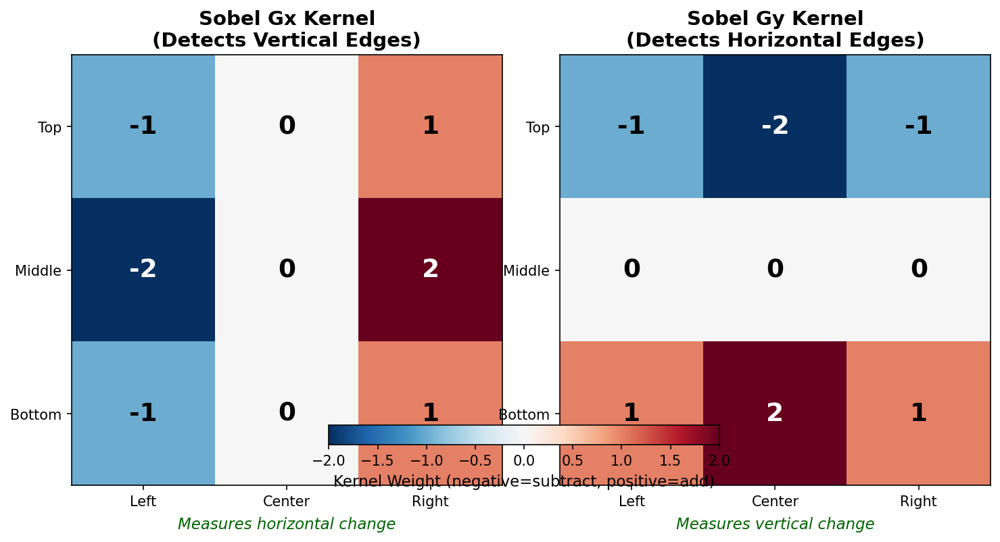
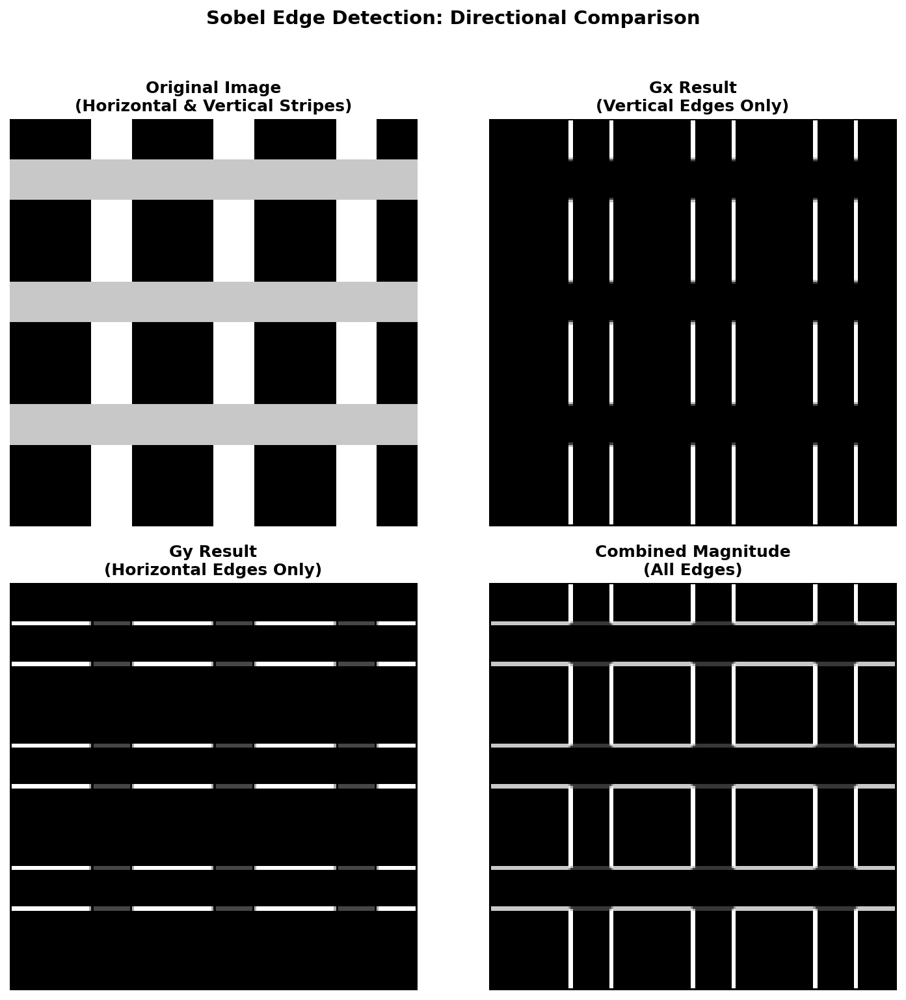

.. _module-3-4-2-edge-detection:

=====================================
3.4.2 - Edge Detection (Sobel Operator)
=====================================

:Duration: 20-25 minutes
:Level: Beginner
:Prerequisites: Module 1.1 (Pixel Basics), Module 3.4.1 (Convolution)

Overview
========

Edge detection is one of the most fundamental operations in image processing
and computer vision. Edges represent boundaries between different regions in
an image, where pixel intensity changes rapidly. In this exercise, you will
learn how to detect edges using the Sobel operator, a classic gradient-based
approach that remains widely used today.

**Learning Objectives**

By completing this module, you will:

* Understand what edges are and why detecting them is useful
* Learn how the Sobel operator uses gradient kernels to find edges
* Apply convolution with 3x3 kernels to compute directional gradients
* Create edge-detected images using pure NumPy operations

Quick Start: See Edge Detection in Action
=========================================

Let's begin by seeing edge detection work on a simple test image. Run the
following code to detect edges in shapes we create procedurally:

.. code-block:: python
   :caption: Simple edge detection with Sobel operator
   :linenos:

   import numpy as np
   from PIL import Image

   # Create a test image with geometric shapes (256x256 grayscale)
   height, width = 256, 256
   image = np.zeros((height, width), dtype=np.float64)

   # Draw a white rectangle and circle
   image[80:180, 60:120] = 255
   center_y, center_x, radius = 128, 180, 40
   y_coords, x_coords = np.ogrid[:height, :width]
   circle_mask = (x_coords - center_x)**2 + (y_coords - center_y)**2 <= radius**2
   image[circle_mask] = 255

   # Define Sobel kernels
   sobel_gx = np.array([[-1, 0, 1], [-2, 0, 2], [-1, 0, 1]])
   sobel_gy = np.array([[-1, -2, -1], [0, 0, 0], [1, 2, 1]])

   # Apply edge detection
   edge_magnitude = np.zeros((height, width), dtype=np.float64)
   for y in range(1, height - 1):
       for x in range(1, width - 1):
           neighborhood = image[y-1:y+2, x-1:x+2]
           gx = np.sum(sobel_gx * neighborhood)
           gy = np.sum(sobel_gy * neighborhood)
           edge_magnitude[y, x] = np.sqrt(gx**2 + gy**2)

   # Normalize and save
   edge_normalized = (255 * edge_magnitude / edge_magnitude.max()).astype(np.uint8)
   Image.fromarray(edge_normalized, mode='L').save('edge_detection_output.png')

.. figure:: edge_detection_output.png
   :width: 400px
   :align: center
   :alt: Edge detection result showing white outlines of a rectangle and circle on black background

   The Sobel operator detects edges as bright lines where intensity changes
   rapidly. Notice how both the rectangle and circle boundaries are clearly
   visible as white outlines.

.. tip::

   Notice how the edges appear as white lines on a black background. The
   brighter the line, the stronger the edge. Areas with uniform intensity
   (inside the shapes or in the background) remain black because there is
   no change to detect.

Core Concepts
=============

Concept 1: What is Edge Detection?
----------------------------------

An **edge** in an image is a location where pixel intensity changes sharply.
Think of edges as the boundaries between different regions: where a white
shape meets a black background, where one color transitions to another, or
where a shadow begins.

Edge detection is fundamental because:

* **Object recognition**: Edges define object shapes and boundaries
* **Feature extraction**: Computer vision algorithms use edges as landmarks
* **Image segmentation**: Edges help separate objects from backgrounds
* **Artistic effects**: Edge detection creates striking outline drawings

Mathematically, we detect edges by computing the **gradient** of the image,
which measures how rapidly pixel values change from one location to another
[GonzalezWoods2018]_.

Concept 2: The Sobel Operator
-----------------------------

The **Sobel operator** detects edges by computing gradients in two directions
using convolution kernels. Named after Irwin Sobel, who developed it in 1968,
it remains one of the most widely used edge detection methods [Sobel1968]_.

The Sobel operator uses two 3x3 kernels:

**Gx (Horizontal Gradient)** - Detects vertical edges:

.. code-block:: text

   [-1  0  1]
   [-2  0  2]
   [-1  0  1]

**Gy (Vertical Gradient)** - Detects horizontal edges:

.. code-block:: text

   [-1 -2 -1]
   [ 0  0  0]
   [ 1  2  1]

   The Sobel kernels visualized with color coding. Negative values (blue)
   are subtracted from positive values (red). Gx measures horizontal change
   to detect vertical edges; Gy measures vertical change to detect
   horizontal edges.

.. important::

   The naming can be confusing: **Gx detects vertical edges** because it
   measures change in the x-direction (horizontal). Similarly, **Gy detects
   horizontal edges** because it measures change in the y-direction (vertical).

Concept 3: Computing Edge Magnitude
-----------------------------------

After computing both gradients, we combine them to get the total edge
strength at each pixel. The **gradient magnitude** uses the Euclidean
distance formula:

.. code-block:: text

   magnitude = sqrt(Gx² + Gy²)

This ensures that edges in any direction are detected equally.

   Comparing gradient directions: The original image has both horizontal
   and vertical stripes. Gx only shows vertical stripe edges, Gy only shows
   horizontal stripe edges, but the combined magnitude captures all edges.

The convolution operation works by sliding the kernel over every pixel in
the image. At each position, we multiply the kernel values with the
corresponding pixel values and sum them up [NumPyDocs]_.

Concept 4: Comparing Edge Detection Operators
---------------------------------------------

The Sobel operator is not the only edge detection method. Three classic
gradient-based operators are commonly compared [MarrHildreth1980]_:

**Roberts Cross** (1965) [Roberts1965]_:
   Uses small 2x2 kernels. Very fast but sensitive to noise because
   it only considers diagonal neighbors.

**Prewitt** (1970) [Prewitt1970]_:
   Uses 3x3 kernels like Sobel but without center weighting.
   All neighbors have equal importance.

**Sobel** (1968) [Sobel1968]_:
   Uses 3x3 kernels with weighted center rows/columns.
   The weights reduce noise sensitivity by giving more importance
   to pixels closer to the center.

.. figure:: operator_comparison.png
   :width: 600px
   :align: center
   :alt: Four-panel comparison of original image, Roberts, Prewitt, and Sobel edge detection

   Comparing edge detection operators on the same test image. Roberts
   produces thinner but noisier edges. Prewitt and Sobel give similar
   results, with Sobel showing slightly smoother edge lines.

.. admonition:: Did You Know?

   The Canny edge detector, developed by John Canny in 1986, is often
   considered the gold standard for edge detection. It uses a multi-stage
   algorithm that includes Gaussian smoothing, gradient computation (often
   using Sobel), non-maximum suppression, and hysteresis thresholding
   [Canny1986]_. While more complex, it produces cleaner edges with fewer
   false positives.

Hands-On Exercises
==================

Exercise 1: Execute and Explore
-------------------------------

*Estimated time: 3-4 minutes*

Run the ``simple_edge_detection.py`` script and examine the output.

.. code-block:: bash

   python simple_edge_detection.py

**Reflection Questions:**

1. Why do the edges appear as white lines while everything else is black?

2. Look at the rectangle edges. Are all four sides equally bright, or do
   some appear stronger than others? Why might this be?

3. The circle's edge curves in all directions. How does the Sobel operator
   handle diagonal edges?

.. dropdown:: Solution and Explanation
   :class: note

   **Answer 1:** Edges appear white because they have high gradient magnitude
   values (strong change in intensity). The normalization step maps the
   highest magnitude to 255 (white) and zero magnitude to 0 (black).

   **Answer 2:** All four sides should be roughly equally bright because
   the rectangle has sharp 90-degree corners. The Sobel operator combines
   Gx and Gy using the Euclidean formula, which treats horizontal and
   vertical edges symmetrically.

   **Answer 3:** Diagonal edges are detected by combining Gx and Gy. Even
   though each kernel only measures one direction, the magnitude formula
   ``sqrt(Gx² + Gy²)`` captures edges at any angle. The circle's curved
   boundary is essentially many diagonal edges at varying angles.

Exercise 2: Modify to Achieve Goals
-----------------------------------

*Estimated time: 3-4 minutes*

Modify the edge detection code to achieve these goals:

**Goal 1:** Detect only vertical edges (ignore horizontal edges)

**Goal 2:** Detect only horizontal edges (ignore vertical edges)

**Goal 3:** Show only strong edges by applying a threshold

.. dropdown:: Hint 1: Detecting only vertical edges
   :class: note

   To detect only vertical edges, use only the Gx kernel and skip Gy.
   Set ``edge_magnitude[y, x] = abs(gx)`` instead of using the magnitude
   formula.

.. dropdown:: Hint 2: Applying a threshold
   :class: note

   After computing edge magnitudes, set weak edges to zero:

   .. code-block:: python

      threshold = 0.3 * edge_magnitude.max()
      edge_magnitude[edge_magnitude < threshold] = 0

.. dropdown:: Complete Solution
   :class: note

   **Goal 1: Vertical edges only**

   .. code-block:: python

      # Only use Gx kernel
      for y in range(1, height - 1):
          for x in range(1, width - 1):
              neighborhood = image[y-1:y+2, x-1:x+2]
              gx = np.sum(sobel_gx * neighborhood)
              edge_magnitude[y, x] = abs(gx)

   **Goal 2: Horizontal edges only**

   .. code-block:: python

      # Only use Gy kernel
      for y in range(1, height - 1):
          for x in range(1, width - 1):
              neighborhood = image[y-1:y+2, x-1:x+2]
              gy = np.sum(sobel_gy * neighborhood)
              edge_magnitude[y, x] = abs(gy)

   **Goal 3: Thresholded edges**

   .. code-block:: python

      # After computing all magnitudes:
      threshold = 0.3 * edge_magnitude.max()
      edge_magnitude[edge_magnitude < threshold] = 0

Exercise 3: Create from Scratch
-------------------------------

*Estimated time: 5-6 minutes*

Now implement Sobel edge detection from scratch. Create your own test image
with a custom pattern and apply the full edge detection pipeline.

**Requirements:**

1. Generate a procedural test image (any pattern you like)
2. Define the Sobel Gx and Gy kernels correctly
3. Apply convolution using nested loops
4. Compute the gradient magnitude
5. Save the result

Use the starter code in ``edge_detection_starter.py``:

.. code-block:: python
   :caption: Starter code for Exercise 3

   import numpy as np
   from PIL import Image

   # Step 1: Create your test image
   height, width = 256, 256
   image = np.zeros((height, width), dtype=np.float64)
   # TODO: Draw your pattern here

   # Step 2: Define Sobel kernels
   sobel_gx = np.array([
       # TODO: Fill in the 3x3 Gx kernel
   ])
   sobel_gy = np.array([
       # TODO: Fill in the 3x3 Gy kernel
   ])

   # Step 3: Apply convolution
   edge_magnitude = np.zeros((height, width), dtype=np.float64)
   for y in range(1, height - 1):
       for x in range(1, width - 1):
           # TODO: Extract neighborhood, compute gradients, compute magnitude
           pass

   # Step 4: Normalize and save
   edge_normalized = (255 * edge_magnitude / edge_magnitude.max()).astype(np.uint8)
   Image.fromarray(edge_normalized, mode='L').save('my_edge_detection.png')

.. dropdown:: Hint: Pattern ideas
   :class: note

   Try creating one of these patterns:

   * A "T" or "L" shaped figure
   * Diagonal stripes
   * Concentric squares
   * A simple letter

   Example for a "T" shape:

   .. code-block:: python

      image[50:70, 80:180] = 255   # Horizontal bar
      image[60:180, 115:145] = 255  # Vertical bar

.. dropdown:: Complete Solution
   :class: note

   .. code-block:: python
      :linenos:

      import numpy as np
      from PIL import Image

      # Create a "T" shape pattern
      height, width = 256, 256
      image = np.zeros((height, width), dtype=np.float64)
      image[50:70, 80:180] = 255   # Horizontal bar
      image[60:180, 115:145] = 255  # Vertical bar
      image[200:230, 200:230] = 200  # Small square for variety

      # Sobel kernels
      sobel_gx = np.array([[-1, 0, 1],
                          [-2, 0, 2],
                          [-1, 0, 1]])
      sobel_gy = np.array([[-1, -2, -1],
                          [ 0,  0,  0],
                          [ 1,  2,  1]])

      # Apply edge detection
      edge_magnitude = np.zeros((height, width), dtype=np.float64)
      for y in range(1, height - 1):
          for x in range(1, width - 1):
              neighborhood = image[y-1:y+2, x-1:x+2]
              gx = np.sum(sobel_gx * neighborhood)
              gy = np.sum(sobel_gy * neighborhood)
              edge_magnitude[y, x] = np.sqrt(gx**2 + gy**2)

      # Normalize and save
      edge_normalized = (255 * edge_magnitude / edge_magnitude.max()).astype(np.uint8)
      Image.fromarray(edge_normalized, mode='L').save('my_edge_detection.png')

   .. figure:: edge_detection_solution.png
      :width: 400px
      :align: center
      :alt: Edge detection result showing outlines of a T shape and small square

      The solution output showing detected edges of the "T" shape pattern.

**Challenge Extension:**

Implement the **Prewitt operator** instead of Sobel and compare the results.
The Prewitt kernels use equal weights instead of the 1-2-1 pattern:

.. code-block:: python

   prewitt_gx = np.array([[-1, 0, 1],
                          [-1, 0, 1],
                          [-1, 0, 1]])
   prewitt_gy = np.array([[-1, -1, -1],
                          [ 0,  0,  0],
                          [ 1,  1,  1]])

Summary
=======

In this exercise, you have learned the fundamentals of edge detection:

**Key Takeaways:**

* Edges are locations where pixel intensity changes rapidly
* The Sobel operator uses two 3x3 kernels (Gx and Gy) to compute gradients
* Gx detects vertical edges; Gy detects horizontal edges
* Gradient magnitude ``sqrt(Gx² + Gy²)`` combines both directions
* Convolution slides the kernel over each pixel, computing weighted sums

**Common Pitfalls to Avoid:**

* Confusing Gx and Gy: Remember that Gx measures horizontal change to find vertical edges
* Forgetting to normalize: Raw gradient values can be very large (over 1000)
* Ignoring boundaries: The 3x3 kernel cannot be centered on edge pixels
* Using wrong data types: Use ``float64`` for intermediate calculations to avoid overflow

References
==========

.. [Sobel1968] Sobel, I. (1968). An isotropic 3x3 image gradient operator.
   Presentation at Stanford Artificial Intelligence Project.

.. [GonzalezWoods2018] Gonzalez, R. C., & Woods, R. E. (2018). *Digital
   Image Processing* (4th ed.). Pearson. ISBN: 978-0-13-335672-4

.. [Roberts1965] Roberts, L. G. (1965). Machine perception of
   three-dimensional solids. In *Optical and Electro-Optical Information
   Processing* (pp. 159-197). MIT Press.

.. [Prewitt1970] Prewitt, J. M. S. (1970). Object enhancement and extraction.
   In B. Lipkin & A. Rosenfeld (Eds.), *Picture Processing and
   Psychopictorics* (pp. 75-149). Academic Press.

.. [MarrHildreth1980] Marr, D., & Hildreth, E. (1980). Theory of edge
   detection. *Proceedings of the Royal Society of London B*, 207(1167),
   187-217. https://doi.org/10.1098/rspb.1980.0020

.. [Canny1986] Canny, J. (1986). A computational approach to edge detection.
   *IEEE Transactions on Pattern Analysis and Machine Intelligence*,
   PAMI-8(6), 679-698. https://doi.org/10.1109/TPAMI.1986.4767851

.. [NumPyDocs] NumPy Developers. (2024). Array manipulation routines.
   *NumPy Documentation*. Retrieved December 7, 2025, from
   https://numpy.org/doc/stable/reference/routines.array-manipulation.html

.. [PillowDocs] Clark, A., et al. (2024). *Pillow: Python Imaging Library*
   (Version 10.x). Python Software Foundation. https://python-pillow.org/
