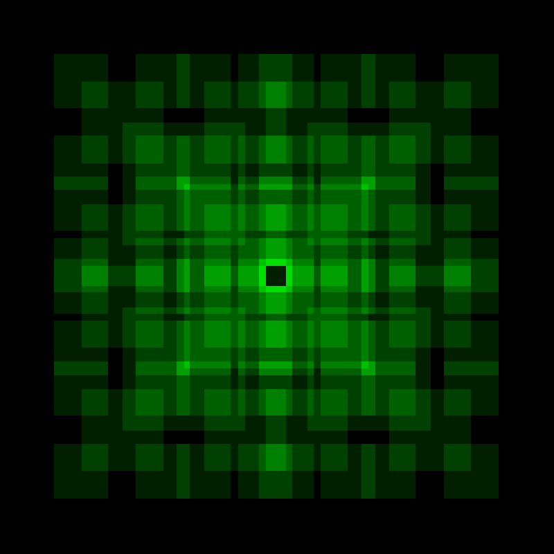
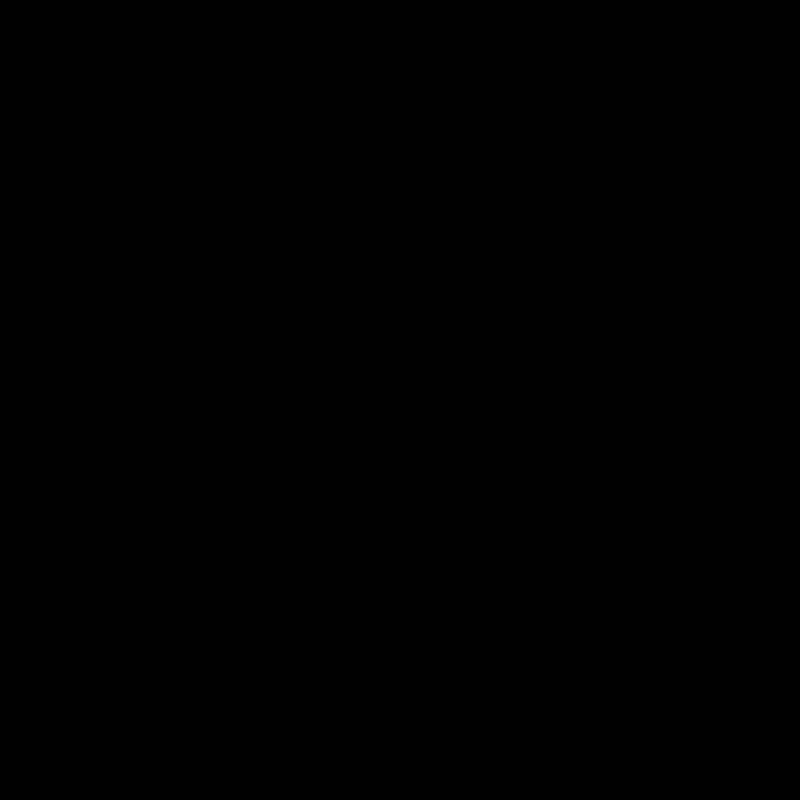
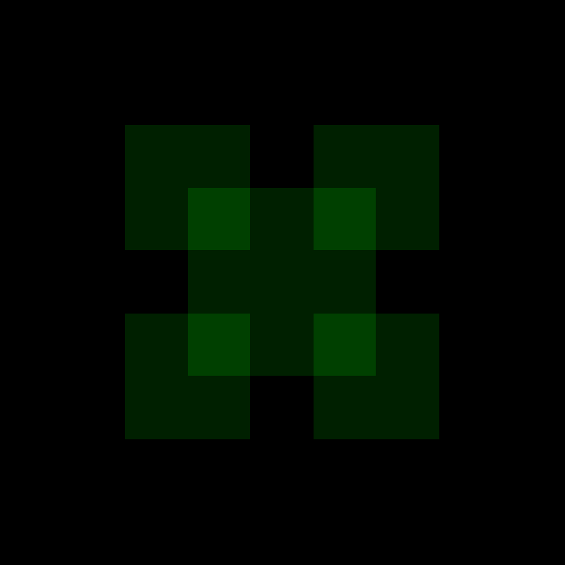
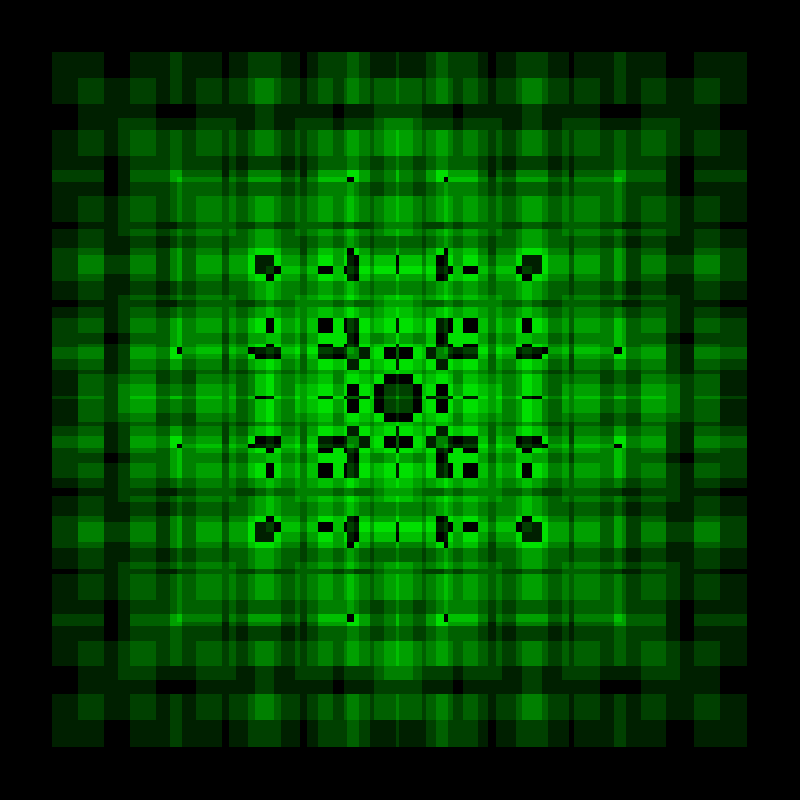

.. _module-4-1-1-fractal-square:

================================
4.1.1 Fractal Square
================================

:Duration: 20-25 minutes
:Level: Beginner-Intermediate

Overview
========

Fractals are geometric patterns that repeat at large and small scales, creating infinitely complex structures from a set of simple rules. In this exercise, you will generate a classic fractal pattern using recursive square subdivision, where each square contains four smaller copies of itself in its corners.

This exercise introduces the fundamental concept of recursion in generative art, demonstrating how a few lines of code can produce visually impressive, self-similar patterns. The fractal square pattern allows us to grasp the concept of recursive functions, which serves as an entry point to understanding recursive algorithms before exploring more complex fractals like the Mandelbrot set.

Learning Objectives
-------------------

By the end of this exercise, you will be able to:

* Understand recursive function structure with base cases and recursive cases
* Apply divide-and-conquer strategy to generate fractal patterns
* Visualize how recursion depth affects pattern complexity
* Create variations of fractal patterns by modifying recursion parameters

.. note:: Implementation Note

   The fractal square implementations in this module are inspired by classical
   fractal geometry references:

   - Mandelbrot, B.B. (1982). *The Fractal Geometry of Nature*, W.H. Freeman — self-similar fractals and fractional dimensions
   - Barnsley, M.F. (1988). *Fractals Everywhere*, Academic Press — Iterated Function Systems for fractal generation
   - Peitgen, H.-O. & Richter, P.H. (1986). *The Beauty of Fractals*, Springer-Verlag — visual fractal construction techniques
   - Peitgen, H.-O., Jurgens, H. & Saupe, D. (1992). *Fractals for the Classroom*, Springer/NCTM — educational fractal exercises [Peitgen1992]_

Quick Start: See It In Action
=============================

Run this code and a pattern of nested green squares appears. Zoom into any corner and the same structure recurs. This is the fractal square, one of the simplest demonstrations of how recursion produces self-similar geometry.

.. code-block:: python
   :caption: fractal_square.py
   :linenos:

   import numpy as np
   from PIL import Image

   def draw_fractal_square(canvas, x_min, x_max, y_min, y_max, depth):
       # Divide the region into a 3x3 grid
       x_third = (x_max - x_min) // 3
       y_third = (y_max - y_min) // 3

       # Locate the center square within the grid
       center_x_start = x_min + x_third
       center_x_end = x_min + 2 * x_third
       center_y_start = y_min + y_third
       center_y_end = y_min + 2 * y_third

       # Fill the center square with green (+32 per recursion level)
       canvas[center_y_start:center_y_end, center_x_start:center_x_end, 1] += 32

       # Recurse into the four corner regions until depth reaches 0
       if depth > 0:
           draw_fractal_square(canvas, x_min, center_x_end, y_min, center_y_end, depth - 1)
           draw_fractal_square(canvas, center_x_start, x_max, y_min, center_y_end, depth - 1)
           draw_fractal_square(canvas, x_min, center_x_end, center_y_start, y_max, depth - 1)
           draw_fractal_square(canvas, center_x_start, x_max, center_y_start, y_max, depth - 1)

   # Create an 800x800 black canvas (3 channels for RGB)
   canvas = np.zeros((800, 800, 3), dtype=np.uint8)

   # Generate fractal with depth=3 (produces 4 levels of detail)
   draw_fractal_square(canvas, 0, 800, 0, 800, 3)

   # Save the result as a PNG image
   image = Image.fromarray(canvas)
   image.save("quickstart_fractal.png")

   Fractal square pattern generated with depth=3, producing 4 levels of detail.

The pattern emerges by applying a simple rule repeatedly. Divide a region into nine parts, fill the center, then repeat the process on the four corners. Each iteration adds more detail, creating the characteristic self-similar structure of fractal geometry.

Core Concepts
=============

Concept 1: What Are Fractals?
-----------------------------

A **fractal** is a geometric shape that exhibits self-similarity at different scales. When you zoom into a fractal, you see smaller copies of the same pattern repeating indefinitely [Mandelbrot1982]_. This property makes fractals fundamentally different from ordinary geometric shapes like circles or triangles.

Fractals appear throughout nature in surprisingly diverse forms:

* **Fern leaves**: Each leaflet resembles the whole fern
* **Coastlines**: Bays contain smaller bays, which contain even smaller bays
* **Lightning bolts**: Branches split into smaller branches
* **Snowflakes**: Six-fold symmetry repeats at microscopic levels [Mandelbrot1982]_

The mathematical study of fractals began with Benoit Mandelbrot's groundbreaking work in 1975 [Mandelbrot1982]_. He coined the term "fractal" from the Latin word *fractus*, meaning broken or fragmented. Fractals occupy a fractional dimension between traditional geometric dimensions. Michael Barnsley [Barnsley1988]_ later developed the Iterated Function System (IFS) approach for generating fractals. Peitgen and Richter [Peitgen1986]_ popularized fractal art through their visualizations.

.. admonition:: Did You Know?

   Recursive geometric patterns like the fractal square appear throughout architecture and visual media. The Infinity Castle in the anime series *Kimetsu no Yaiba* (Demon Slayer) uses similar principles of impossible, self-referential geometry to create a disorienting, labyrinthine environment [KimetsuNoYaiba]_.

Concept 2: Recursion Fundamentals
---------------------------------

**Recursion** is a programming technique where a function calls itself to solve smaller instances of the same problem [Cormen2009]_. Every recursive algorithm has two essential components:

1. **Base Case**: The condition that stops the recursion
2. **Recursive Case**: The part where the function calls itself with modified parameters

Consider our fractal square algorithm:

.. code-block:: python
   :caption: Anatomy of a recursive function
   :linenos:
   :emphasize-lines: 12,15,17-20

   def draw_fractal_square(canvas, x_min, x_max, y_min, y_max, depth):
       # Divide the region into a 3x3 grid
       x_third = (x_max - x_min) // 3
       y_third = (y_max - y_min) // 3

       # Locate the center square within the grid
       center_x_start = x_min + x_third
       center_x_end = x_min + 2 * x_third
       center_y_start = y_min + y_third
       center_y_end = y_min + 2 * y_third

       # Fill the center square with green (+32 per layer)
       canvas[center_y_start:center_y_end, center_x_start:center_x_end, 1] += 32

       # Base case: stop when depth reaches 0
       if depth > 0:
           # Recursive case: apply the same process to each corner
           draw_fractal_square(canvas, x_min, center_x_end, y_min, center_y_end, depth - 1)
           draw_fractal_square(canvas, center_x_start, x_max, y_min, center_y_end, depth - 1)
           draw_fractal_square(canvas, x_min, center_x_end, center_y_start, y_max, depth - 1)
           draw_fractal_square(canvas, center_x_start, x_max, center_y_start, y_max, depth - 1)

* **Line 12**: Fill the center square (the action performed at each level)
* **Line 15**: Base case check using the ``depth`` parameter
* **Lines 17-20**: Four recursive calls, one for each corner region

The ``depth`` parameter acts as a countdown. Each recursive call decrements it by one, and when it reaches zero, the function stops calling itself. This prevents infinite recursion and allows you to control the level of detail in the final image. This scaffolded approach follows educational research on cognitive load [Sweller1988]_ and progressive complexity [Bransford2000]_.

.. figure:: recursion_diagram.png
   :width: 600px
   :align: center
   :alt: Diagram showing how the canvas is divided into a 3x3 grid with the center filled and corners recursively processed

   Fractal square recursive division pattern. The canvas is divided into a 3x3 grid, the center is filled, and the process repeats on each corner.

Concept 3: The Fractal Square Algorithm
---------------------------------------

The fractal square algorithm follows a divide-and-conquer strategy [Cormen2009]_. Here is how it works step by step:

**Step 1: Divide the Region**

The current region is divided into a 3x3 grid of nine equal rectangles. This is accomplished by calculating the boundaries at one-third and two-thirds of the width and height:

.. code-block:: python
   :caption: Grid division calculation

   # Calculate one-third of the region dimensions
   x_third = (x_max - x_min) // 3
   y_third = (y_max - y_min) // 3

   # The center square starts at one-third and ends at two-thirds
   center_x_start = x_min + x_third
   center_x_end = x_min + 2 * x_third
   center_y_start = y_min + y_third
   center_y_end = y_min + 2 * y_third

**Step 2: Fill the Center**

The center rectangle is filled with color. We use the ``+=`` operator instead of ``=`` to create an accumulation effect. Overlapping regions become brighter because color values stack.

.. code-block:: python
   :caption: Color accumulation for depth visualization

   # Add 32 to the green channel (index 1) of every pixel in the center
   # Using += means overlapping regions get brighter with each layer
   canvas[center_y_start:center_y_end, center_x_start:center_x_end, 1] += 32

The value ``32`` is added to the green channel (index 1) of each pixel in the center rectangle. Areas filled by multiple recursion levels accumulate more color, revealing the recursive structure visually. The final NumPy array is converted to an image using Pillow [PillowDocs]_.

**Step 3: Recurse on Corners**

The algorithm then calls itself on each of the four corner regions. These regions overlap with the center, which is what creates the characteristic fractal pattern.

* **Top-left corner**: from ``(x_min, y_min)`` to ``(center_x_end, center_y_end)``
* **Top-right corner**: from ``(center_x_start, y_min)`` to ``(x_max, center_y_end)``
* **Bottom-left corner**: from ``(x_min, center_y_start)`` to ``(center_x_end, y_max)``
* **Bottom-right corner**: from ``(center_x_start, center_y_start)`` to ``(x_max, y_max)``

   Step-by-step construction of the fractal across recursion levels.

.. important::

   The corner regions overlap with the center. This overlap is intentional because it creates the characteristic nested appearance of the fractal. Each corner contains two-thirds of the parent region in each dimension, not just one-third.

Hands-On Exercises
==================

Exercise 1: Execute and Explore
-------------------------------

Run the complete fractal generation script:

.. code-block:: python
   :caption: fractal_square.py
   :linenos:

   import numpy as np
   from PIL import Image

   def draw_fractal_square(canvas, x_min, x_max, y_min, y_max, depth):
       # Divide the region into a 3x3 grid
       x_third = (x_max - x_min) // 3
       y_third = (y_max - y_min) // 3

       # Locate the center square within the grid
       center_x_start = x_min + x_third
       center_x_end = x_min + 2 * x_third
       center_y_start = y_min + y_third
       center_y_end = y_min + 2 * y_third

       # Fill the center square with green (+32 per recursion level)
       canvas[center_y_start:center_y_end, center_x_start:center_x_end, 1] += 32

       # Recurse into the four corner regions until depth reaches 0
       if depth > 0:
           draw_fractal_square(canvas, x_min, center_x_end, y_min, center_y_end, depth - 1)
           draw_fractal_square(canvas, center_x_start, x_max, y_min, center_y_end, depth - 1)
           draw_fractal_square(canvas, x_min, center_x_end, center_y_start, y_max, depth - 1)
           draw_fractal_square(canvas, center_x_start, x_max, center_y_start, y_max, depth - 1)

   # Create an 800x800 black canvas (3 channels for RGB)
   canvas = np.zeros((800, 800, 3), dtype=np.uint8)

   # Generate fractal with depth=3 (produces 4 levels of detail)
   draw_fractal_square(canvas, 0, 800, 0, 800, 3)

   # Save the result as a PNG image
   image = Image.fromarray(canvas)
   image.save("exercise1_fractal.png")

After running the code, answer these reflection questions:

1. How many distinct brightness levels can you observe in the image?
2. What is the relationship between recursion depth and the number of visible squares?
3. Why do some areas appear brighter than others?

.. dropdown:: Answers and Explanation
   :class-title: sd-font-weight-bold

   1. **Brightness levels**: You should observe 4 distinct brightness levels corresponding to depths 0 through 3. The brightest areas are where all four recursion levels overlap.

   2. **Number of squares**: At depth ``n``, the formula for total center squares filled is ``(4^(n+1) - 1) / 3`` (derived from the geometric series sum). At depth 3, this equals 85 center squares filled (though many overlap).

   3. **Brightness variation**: Areas where multiple recursion levels overlap accumulate color. The center of the image has the most overlaps because it falls within the center region of all recursion levels. Each overlap adds 32 to the green channel, so maximum brightness areas have been filled 4 times (32 × 4 = 128).

Exercise 2: Modify Parameters
-----------------------------

Experiment with the fractal by modifying these parameters. Compare the results to understand how each change affects the output.

**Goal 1**: Generate fractals at different recursion depths

Change the depth parameter in the function call:

.. code-block:: python
   :caption: Try different depth values

   # Try each depth value separately (reset canvas between runs)
   draw_fractal_square(canvas, 0, 800, 0, 800, 0)  # Single center square
   draw_fractal_square(canvas, 0, 800, 0, 800, 1)  # Minimal detail
   draw_fractal_square(canvas, 0, 800, 0, 800, 2)  # Moderate detail
   draw_fractal_square(canvas, 0, 800, 0, 800, 3)  # Clear nested structure
   draw_fractal_square(canvas, 0, 800, 0, 800, 4)  # High detail
   draw_fractal_square(canvas, 0, 800, 0, 800, 5)  # Maximum detail

.. figure:: exercise2_depth_0.png
   :width: 300px
   :align: center
   :alt: Fractal square at depth 0 showing a single center square

   Depth 0: single center square

   Depth 1: first level of subdivision

.. figure:: exercise2_depth_2.png
   :width: 300px
   :align: center
   :alt: Fractal square at depth 2 showing emerging nested structure

   Depth 2: emerging nested structure

.. figure:: exercise2_depth_3.png
   :width: 300px
   :align: center
   :alt: Fractal square at depth 3 showing clear self-similar pattern

   Depth 3: clear self-similar pattern

   Depth 4: dense fractal detail

.. figure:: exercise2_depth_5.png
   :width: 300px
   :align: center
   :alt: Fractal square at depth 5 showing maximum detail

   Depth 5: maximum detail

**Goal 2**: Change the color channel

Modify which color channel accumulates:

.. code-block:: python
   :caption: Color channel variations

   # Change which color channel receives the accumulation
   # Green channel (original)
   canvas[center_y_start:center_y_end, center_x_start:center_x_end, 1] += 32

   # Red channel (produces red fractal)
   canvas[center_y_start:center_y_end, center_x_start:center_x_end, 0] += 32

   # Blue channel (produces blue fractal)
   canvas[center_y_start:center_y_end, center_x_start:center_x_end, 2] += 32

   # All three channels at once (produces white/grayscale fractal)
   canvas[center_y_start:center_y_end, center_x_start:center_x_end, :] += 32

.. dropdown:: Hint: Multi-color fractal
   :class-title: sd-font-weight-bold

   To create a multi-color effect, you can add different amounts to different channels:

   .. code-block:: python

      # Mix different amounts across all three channels for a multi-color effect
      canvas[center_y_start:center_y_end, center_x_start:center_x_end, 0] += 20  # Red
      canvas[center_y_start:center_y_end, center_x_start:center_x_end, 1] += 32  # Green
      canvas[center_y_start:center_y_end, center_x_start:center_x_end, 2] += 16  # Blue

**Goal 3**: Change the color increment value

Modify the increment to see how it affects contrast:

.. code-block:: python
   :caption: Different increment values

   # Lower increment creates a subtler, darker pattern
   canvas[center_y_start:center_y_end, center_x_start:center_x_end, 1] += 16

   # Higher increment creates a brighter, higher-contrast pattern
   canvas[center_y_start:center_y_end, center_x_start:center_x_end, 1] += 64

Exercise 3: Create Your Own Fractal
-----------------------------------

Complete the starter code below to implement the fractal square algorithm yourself. The core structure is provided, but you need to fill in the recursive calls for the four corners.

**Requirements**:

* Fill in the four recursive calls with correct boundary parameters
* Each corner should cover a 2/3 by 2/3 region of the parent
* The corners must overlap with the center square

**Starter Code**:

.. code-block:: python
   :caption: square.py (complete the TODO sections)
   :linenos:

   import numpy as np
   from PIL import Image

   # Create an 800x800 black canvas with 3 color channels (RGB)
   canvas = np.zeros((800, 800, 3), dtype=np.uint8)

   def square(canvas, x_min, x_max, y_min, y_max, depth):
       # Calculate the one-third and two-thirds marks along x-axis
       center_x_start = x_min + (x_max - x_min) // 3
       center_x_end = x_min + (x_max - x_min) * 2 // 3
       # Calculate the one-third and two-thirds marks along y-axis
       center_y_start = y_min + (y_max - y_min) // 3
       center_y_end = y_min + (y_max - y_min) * 2 // 3

       # Fill the center square with green color
       canvas[center_y_start:center_y_end, center_x_start:center_x_end, 1] += 32

       if depth > 0:
           # TODO: Add four recursive calls for each corner region
           # Top-left corner: x from x_min to center_x_end, y from y_min to center_y_end
           square(canvas, ..., ..., ..., ..., depth - 1)
           # Top-right corner: x from center_x_start to x_max, y from y_min to center_y_end
           ...
           # Bottom-left corner: x from x_min to center_x_end, y from center_y_start to y_max
           ...
           # Bottom-right corner: x from center_x_start to x_max, y from center_y_start to y_max
           ...

   # Generate the fractal and save as an image
   square(canvas, 0, 800, 0, 800, 3)
   image = Image.fromarray(canvas)
   image.save("exercise3_fractal.png")

.. dropdown:: Hint 1: Corner boundaries
   :class-title: sd-font-weight-bold

   Remember that each corner covers 2/3 of the parent region:

   * **Top-left**: x goes from ``x_min`` to ``center_x_end``, y goes from ``y_min`` to ``center_y_end``
   * **Top-right**: x goes from ``center_x_start`` to ``x_max``, y goes from ``y_min`` to ``center_y_end``

.. dropdown:: Hint 2: Bottom corners
   :class-title: sd-font-weight-bold

   For the bottom corners:

   * **Bottom-left**: x goes from ``x_min`` to ``center_x_end``, y goes from ``center_y_start`` to ``y_max``
   * **Bottom-right**: x goes from ``center_x_start`` to ``x_max``, y goes from ``center_y_start`` to ``y_max``

.. dropdown:: Complete Solution
   :class-title: sd-font-weight-bold

   .. code-block:: python
      :linenos:

      import numpy as np
      from PIL import Image

      # Create an 800x800 black canvas
      canvas = np.zeros((800, 800, 3), dtype=np.uint8)

      def square(canvas, x_min, x_max, y_min, y_max, depth):
          # Calculate grid division points
          center_x_start = x_min + (x_max - x_min) // 3
          center_x_end = x_min + (x_max - x_min) * 2 // 3
          center_y_start = y_min + (y_max - y_min) // 3
          center_y_end = y_min + (y_max - y_min) * 2 // 3

          # Fill center square
          canvas[center_y_start:center_y_end, center_x_start:center_x_end, 1] += 32

          if depth > 0:
              # Each corner covers 2/3 of the parent region
              square(canvas, x_min, center_x_end, y_min, center_y_end, depth - 1)  # Top-left
              square(canvas, x_min, center_x_end, center_y_start, y_max, depth - 1)  # Bottom-left
              square(canvas, center_x_start, x_max, y_min, center_y_end, depth - 1)  # Top-right
              square(canvas, center_x_start, x_max, center_y_start, y_max, depth - 1)  # Bottom-right

      square(canvas, 0, 800, 0, 800, 3)
      image = Image.fromarray(canvas)
      image.save("exercise3_fractal.png")

**Challenge Extension**: Modify the color based on the recursion depth. Use the depth value to create a gradient effect where deeper recursion levels have different colors.

.. dropdown:: Challenge Solution
   :class-title: sd-font-weight-bold

   .. code-block:: python

      def square_with_depth_color(canvas, x_min, x_max, y_min, y_max, depth, max_depth):
          # Calculate grid division points
          center_x_start = x_min + (x_max - x_min) // 3
          center_x_end = x_min + (x_max - x_min) * 2 // 3
          center_y_start = y_min + (y_max - y_min) // 3
          center_y_end = y_min + (y_max - y_min) * 2 // 3

          # Map current recursion level to a color
          # level=0 at the top, level=max_depth at the deepest
          level = max_depth - depth
          red = 32 * level            # Red increases with depth
          green = 255 - 32 * level    # Green decreases with depth
          blue = 128                  # Blue stays constant

          # Fill center with depth-based color, clamping to 255 maximum
          canvas[center_y_start:center_y_end, center_x_start:center_x_end, 0] = np.minimum(canvas[center_y_start:center_y_end, center_x_start:center_x_end, 0] + red, 255)
          canvas[center_y_start:center_y_end, center_x_start:center_x_end, 1] = np.minimum(canvas[center_y_start:center_y_end, center_x_start:center_x_end, 1] + green, 255)
          canvas[center_y_start:center_y_end, center_x_start:center_x_end, 2] = np.minimum(canvas[center_y_start:center_y_end, center_x_start:center_x_end, 2] + blue, 255)

          if depth > 0:
              # Recurse into each corner with decremented depth
              square_with_depth_color(canvas, x_min, center_x_end, y_min, center_y_end, depth - 1, max_depth)
              square_with_depth_color(canvas, x_min, center_x_end, center_y_start, y_max, depth - 1, max_depth)
              square_with_depth_color(canvas, center_x_start, x_max, y_min, center_y_end, depth - 1, max_depth)
              square_with_depth_color(canvas, center_x_start, x_max, center_y_start, y_max, depth - 1, max_depth)

   .. figure:: challenge_output.png
      :width: 400px
      :align: center
      :alt: Fractal square with depth-based color gradient showing red increasing and green decreasing with depth

      Fractal square with depth-based color gradient.

Summary
=======

Key Takeaways
-------------

* **Fractals** are self-similar geometric patterns that repeat at every scale
* **Recursion** is a technique where a function calls itself with modified parameters
* Every recursive algorithm needs a **base case** to prevent infinite loops
* The **depth parameter** controls how many levels of detail the fractal contains
* **Color accumulation** using ``+=`` reveals the recursive structure through brightness
* The fractal square uses a **divide-and-conquer** strategy, processing four overlapping corners

Common Pitfalls
---------------

* **Infinite recursion**: Forgetting the base case or not decrementing the depth parameter
* **Color overflow**: Adding too much to a color channel can exceed 255 and wrap around
* **Wrong corner boundaries**: Each corner must cover 2/3 of the region, not 1/3
* **Array index order**: NumPy arrays use [y, x] ordering, not [x, y] [NumPyDocs]_

References
==========

.. [Mandelbrot1982] Mandelbrot, B. B. (1982). *The Fractal Geometry of Nature*. W. H. Freeman and Company. ISBN: 978-0-7167-1186-5

.. [Barnsley1988] Barnsley, M. F. (1988). *Fractals Everywhere*. Academic Press. ISBN: 978-0-12-079062-9

.. [Peitgen1986] Peitgen, H.-O., & Richter, P. H. (1986). *The Beauty of Fractals: Images of Complex Dynamical Systems*. Springer-Verlag. ISBN: 978-3-540-15851-6

.. [Peitgen1992] Peitgen, H.-O., Jürgens, H., & Saupe, D. (1992). *Fractals for the Classroom: Part One - Introduction to Fractals and Chaos*. Springer-Verlag. ISBN: 978-0-387-97041-8

.. [Cormen2009] Cormen, T. H., Leiserson, C. E., Rivest, R. L., & Stein, C. (2009). *Introduction to Algorithms* (3rd ed.). MIT Press. ISBN: 978-0-262-03384-8

.. [Sweller1988] Sweller, J. (1988). Cognitive load during problem solving: Effects on learning. *Cognitive Science*, 12(2), 257-285. https://doi.org/10.1207/s15516709cog1202_4

.. [Bransford2000] Bransford, J. D., Brown, A. L., & Cocking, R. R. (Eds.). (2000). *How People Learn: Brain, Mind, Experience, and School*. National Academy Press. ISBN: 978-0-309-07036-2

.. [NumPyDocs] NumPy Developers. (2024). NumPy array indexing. *NumPy Documentation*. https://numpy.org/doc/stable/user/basics.indexing.html

.. [PillowDocs] Clark, A., et al. (2024). *Pillow: Python Imaging Library*. Python Software Foundation. https://pillow.readthedocs.io/

.. [KimetsuNoYaiba] Gotouge, K. (2016-2020). *Kimetsu no Yaiba* (Demon Slayer). Shueisha. https://en.wikipedia.org/wiki/Demon_Slayer:_Kimetsu_no_Yaiba
