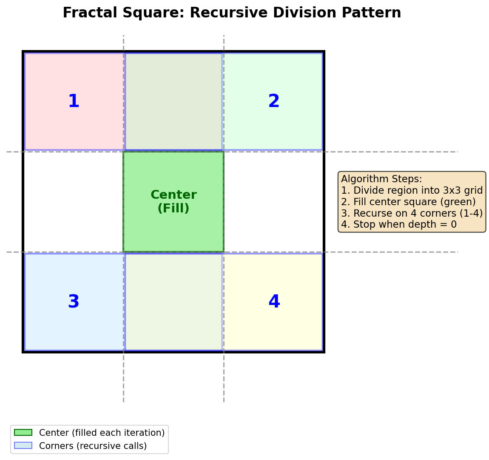
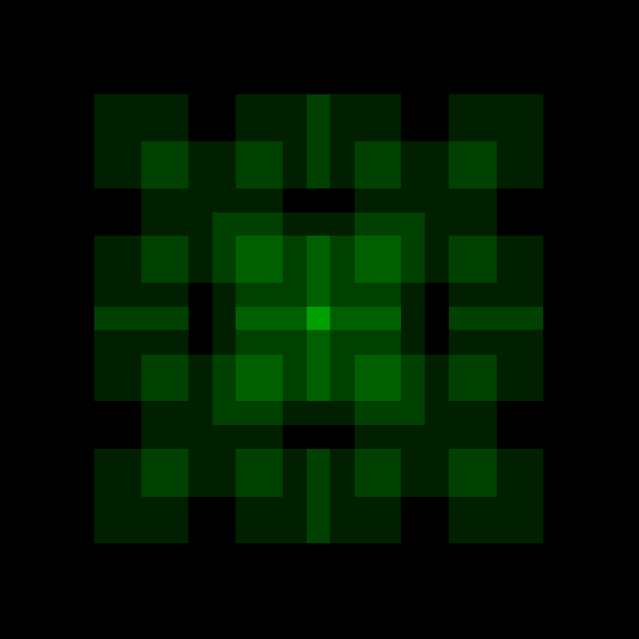

.. _module-4-1-1-fractal-square:

================================
4.1.1 Fractal Square
================================

:Duration: 20-25 minutes
:Level: Beginner-Intermediate
:Prerequisites: Module 1.1 (Array Basics), Module 2.1 (Basic Shapes)

Overview
========

Fractals are geometric patterns that repeat at every scale, creating infinitely complex structures from simple rules. In this exercise, you will generate a classic fractal pattern using recursive square subdivision, where each square contains four smaller copies of itself in its corners.

This exercise introduces the fundamental concept of recursion in generative art, demonstrating how a few lines of code can produce visually striking, self-similar patterns. The fractal square pattern serves as an accessible entry point to understanding recursive algorithms before exploring more complex fractals like the Mandelbrot set.

Learning Objectives
-------------------

By the end of this exercise, you will be able to:

* Understand recursive function structure with base cases and recursive cases
* Apply divide-and-conquer strategy to generate fractal patterns
* Visualize how recursion depth affects pattern complexity
* Create variations of fractal patterns by modifying recursion parameters

Quick Start: See It In Action
=============================

Run this code to generate your first fractal square pattern:

.. code-block:: python
   :caption: Generate a fractal square pattern
   :linenos:

   import numpy as np
   from PIL import Image

   def draw_fractal(canvas, x_min, x_max, y_min, y_max, depth):
       x_third = (x_max - x_min) // 3
       y_third = (y_max - y_min) // 3
       cx1, cx2 = x_min + x_third, x_min + 2 * x_third
       cy1, cy2 = y_min + y_third, y_min + 2 * y_third
       canvas[cy1:cy2, cx1:cx2, 1] += 32
       if depth > 0:
           draw_fractal(canvas, x_min, cx2, y_min, cy2, depth - 1)
           draw_fractal(canvas, cx1, x_max, y_min, cy2, depth - 1)
           draw_fractal(canvas, x_min, cx2, cy1, y_max, depth - 1)
           draw_fractal(canvas, cx1, x_max, cy1, y_max, depth - 1)

   canvas = np.zeros((800, 800, 3), dtype=np.uint8)
   draw_fractal(canvas, 0, 800, 0, 800, 3)
   Image.fromarray(canvas).save("fractal_square.png")

.. figure:: fractal_square.png
   :width: 500px
   :align: center
   :alt: Fractal square pattern showing nested green squares with increasing brightness at intersections

   The resulting fractal square pattern at recursion depth 3. Notice how the overlapping regions appear brighter due to color accumulation.

You just created a fractal. The pattern emerges from a simple rule applied repeatedly: divide a region into nine parts, fill the center, then repeat the process on the four corners. Each iteration adds more detail, creating the characteristic self-similar structure of fractal geometry.

Core Concepts
=============

Concept 1: What Are Fractals?
-----------------------------

A **fractal** is a geometric shape that exhibits self-similarity at different scales. When you zoom into a fractal, you see smaller copies of the same pattern repeating indefinitely [Mandelbrot1982]_. This property makes fractals fundamentally different from ordinary geometric shapes like circles or triangles.

Fractals appear throughout nature in surprisingly diverse forms:

* **Fern leaves**: Each leaflet resembles the whole fern
* **Coastlines**: Bays contain smaller bays, which contain even smaller bays
* **Lightning bolts**: Branches split into smaller branches
* **Snowflakes**: Six-fold symmetry repeats at microscopic levels

The mathematical study of fractals began with Benoit Mandelbrot's groundbreaking work in the 1970s [Mandelbrot1982]_. He coined the term "fractal" from the Latin word *fractus*, meaning broken or fragmented. This captures the essential quality of fractals: they occupy a fractional dimension between traditional geometric dimensions. Later mathematicians like Michael Barnsley [Barnsley1988]_ developed the Iterated Function System (IFS) approach for generating fractals, while Peitgen and Richter [Peitgen1986]_ popularized fractal art through their stunning visualizations.

.. admonition:: Did You Know?

   The fractal square pattern we create in this exercise has been used in architecture and visual media. The Infinity Castle in the anime series *Kimetsu no Yaiba* (Demon Slayer) features this recursive square design, creating a disorienting, infinite visual effect [KimetsuNoYaiba]_.

Concept 2: Recursion Fundamentals
---------------------------------

**Recursion** is a programming technique where a function calls itself to solve smaller instances of the same problem [Cormen2009]_. Every recursive algorithm has two essential components:

1. **Base Case**: The condition that stops the recursion
2. **Recursive Case**: The part where the function calls itself with modified parameters

Consider our fractal square algorithm:

.. code-block:: python
   :caption: Anatomy of a recursive function
   :linenos:
   :emphasize-lines: 7,8,10-13

   def draw_fractal(canvas, x_min, x_max, y_min, y_max, depth):
       # Calculate center region boundaries
       cx1, cx2 = x_min + (x_max - x_min) // 3, x_min + 2 * (x_max - x_min) // 3
       cy1, cy2 = y_min + (y_max - y_min) // 3, y_min + 2 * (y_max - y_min) // 3

       # Fill the center square
       canvas[cy1:cy2, cx1:cx2, 1] += 32

       # Base case: stop when depth reaches 0
       if depth > 0:
           # Recursive case: process the four corners
           draw_fractal(canvas, x_min, cx2, y_min, cy2, depth - 1)  # Top-left
           draw_fractal(canvas, cx1, x_max, y_min, cy2, depth - 1)  # Top-right
           draw_fractal(canvas, x_min, cx2, cy1, y_max, depth - 1)  # Bottom-left
           draw_fractal(canvas, cx1, x_max, cy1, y_max, depth - 1)  # Bottom-right

* **Lines 7-8**: Fill the center square (the action performed at each level)
* **Line 10**: Base case check using the ``depth`` parameter
* **Lines 12-15**: Four recursive calls, one for each corner region

The ``depth`` parameter acts as a countdown. Each recursive call decrements it by one, and when it reaches zero, the function stops calling itself. This prevents infinite recursion and allows you to control the level of detail in the final image. This scaffolded approach to learning recursion aligns with educational research on how people learn complex concepts through progressive complexity [Bransford2000]_.

   Visual representation of the fractal square algorithm. The center (green) is filled, and the four numbered corners are processed recursively. Diagram generated with Claude Code.

Concept 3: The Fractal Square Algorithm
---------------------------------------

The fractal square algorithm follows a divide-and-conquer strategy [Cormen2009]_. Here is how it works step by step:

**Step 1: Divide the Region**

The current region is divided into a 3x3 grid of nine equal rectangles. This is accomplished by calculating the boundaries at one-third and two-thirds of the width and height:

.. code-block:: python
   :caption: Grid division calculation

   x_third = (x_max - x_min) // 3
   y_third = (y_max - y_min) // 3
   center_x_start = x_min + x_third
   center_x_end = x_min + 2 * x_third
   center_y_start = y_min + y_third
   center_y_end = y_min + 2 * y_third

**Step 2: Fill the Center**

The center rectangle is filled with color. We use the ``+=`` operator instead of ``=`` to create an accumulation effect, where overlapping regions become brighter:

.. code-block:: python
   :caption: Color accumulation for depth visualization

   canvas[center_y_start:center_y_end, center_x_start:center_x_end, 1] += 32

The value ``32`` is added to the green channel (index 1) of each pixel in the center rectangle. Areas that are filled multiple times by different recursion levels accumulate more color, visually revealing the recursive structure.

**Step 3: Recurse on Corners**

The algorithm then calls itself on each of the four corner regions. These regions overlap with the center, which is what creates the characteristic fractal pattern:

* **Top-left corner**: from ``(x_min, y_min)`` to ``(center_x_end, center_y_end)``
* **Top-right corner**: from ``(center_x_start, y_min)`` to ``(x_max, center_y_end)``
* **Bottom-left corner**: from ``(x_min, center_y_start)`` to ``(center_x_end, y_max)``
* **Bottom-right corner**: from ``(center_x_start, center_y_start)`` to ``(x_max, y_max)``

.. important::

   The corner regions overlap with the center. This overlap is intentional because it creates the characteristic nested appearance of the fractal. Each corner contains two-thirds of the parent region in each dimension, not just one-third.

Hands-On Exercises
==================

Exercise 1: Execute and Explore
-------------------------------

Run the complete fractal generation script:

.. code-block:: python
   :caption: fractal_square.py
   :linenos:

   import numpy as np
   from PIL import Image

   def draw_fractal_square(canvas, x_min, x_max, y_min, y_max, depth):
       x_third = (x_max - x_min) // 3
       y_third = (y_max - y_min) // 3
       center_x_start = x_min + x_third
       center_x_end = x_min + 2 * x_third
       center_y_start = y_min + y_third
       center_y_end = y_min + 2 * y_third
       canvas[center_y_start:center_y_end, center_x_start:center_x_end, 1] += 32
       if depth > 0:
           draw_fractal_square(canvas, x_min, center_x_end, y_min, center_y_end, depth - 1)
           draw_fractal_square(canvas, center_x_start, x_max, y_min, center_y_end, depth - 1)
           draw_fractal_square(canvas, x_min, center_x_end, center_y_start, y_max, depth - 1)
           draw_fractal_square(canvas, center_x_start, x_max, center_y_start, y_max, depth - 1)

   canvas = np.zeros((800, 800, 3), dtype=np.uint8)
   draw_fractal_square(canvas, 0, 800, 0, 800, 3)
   image = Image.fromarray(canvas)
   image.save("fractal_square.png")

After running the code, answer these reflection questions:

1. How many distinct brightness levels can you observe in the image?
2. What is the relationship between recursion depth and the number of visible squares?
3. Why do some areas appear brighter than others?

.. dropdown:: Answers and Explanation
   :class-title: sd-font-weight-bold

   1. **Brightness levels**: You should observe 4 distinct brightness levels corresponding to depths 0 through 3. The brightest areas are where all four recursion levels overlap.

   2. **Number of squares**: At depth ``n``, the formula for total center squares filled is ``(4^(n+1) - 1) / 3``. At depth 3, this equals 85 center squares filled (though many overlap).

   3. **Brightness variation**: Areas where multiple recursion levels overlap accumulate color. The center of the image has the most overlaps because it falls within the center region of all recursion levels. Each overlap adds 32 to the green channel, so maximum brightness areas have been filled 4 times (32 × 4 = 128).

Exercise 2: Modify Parameters
-----------------------------

Experiment with the fractal by modifying these parameters. Compare the results to understand how each change affects the output.

**Goal 1**: Generate fractals at different recursion depths

Change the depth parameter in the function call:

.. code-block:: python
   :caption: Try different depth values

   # Try each of these values and save separate images
   draw_fractal_square(canvas, 0, 800, 0, 800, 1)  # Minimal detail
   draw_fractal_square(canvas, 0, 800, 0, 800, 2)  # More detail
   draw_fractal_square(canvas, 0, 800, 0, 800, 5)  # Maximum detail

.. figure:: fractal_depth_1.png
   :width: 300px
   :align: center
   :alt: Fractal square at depth 1 showing minimal pattern

   Depth 1: Basic pattern with limited recursion

   Depth 2: More visible nested structure

.. figure:: fractal_depth_4.png
   :width: 300px
   :align: center
   :alt: Fractal square at depth 4 showing high detail

   Depth 4: Dense, highly detailed fractal pattern

**Goal 2**: Change the color channel

Modify which color channel accumulates:

.. code-block:: python
   :caption: Color channel variations

   # Original (green)
   canvas[cy1:cy2, cx1:cx2, 1] += 32

   # Red channel
   canvas[cy1:cy2, cx1:cx2, 0] += 32

   # Blue channel
   canvas[cy1:cy2, cx1:cx2, 2] += 32

   # All channels (grayscale effect)
   canvas[cy1:cy2, cx1:cx2, :] += 32

.. dropdown:: Hint: Multi-color fractal
   :class-title: sd-font-weight-bold

   To create a multi-color effect, you can add different amounts to different channels:

   .. code-block:: python

      canvas[cy1:cy2, cx1:cx2, 0] += 20  # Red
      canvas[cy1:cy2, cx1:cx2, 1] += 32  # Green
      canvas[cy1:cy2, cx1:cx2, 2] += 16  # Blue

**Goal 3**: Change the color increment value

Modify the increment to see how it affects contrast:

.. code-block:: python
   :caption: Different increment values

   # Low increment (subtle effect)
   canvas[cy1:cy2, cx1:cx2, 1] += 16

   # High increment (high contrast)
   canvas[cy1:cy2, cx1:cx2, 1] += 64

Exercise 3: Create Your Own Fractal
-----------------------------------

Complete the starter code below to implement the fractal square algorithm yourself. The core structure is provided, but you need to fill in the recursive calls for the four corners.

**Requirements**:

* Fill in the four recursive calls with correct boundary parameters
* Each corner should cover a 2/3 by 2/3 region of the parent
* The corners must overlap with the center square

**Starter Code**:

.. code-block:: python
   :caption: square.py (complete the TODO sections)
   :linenos:

   import numpy as np
   from PIL import Image

   canvas = np.zeros((800, 800, 3), dtype=np.uint8)

   def square(canvas, x_min, x_max, y_min, y_max, depth):
       # Calculate grid boundaries
       b = x_min + (x_max - x_min) // 3
       c = x_min + (x_max - x_min) * 2 // 3
       d = y_min + (y_max - y_min) // 3
       e = y_min + (y_max - y_min) * 2 // 3

       # Fill center square
       canvas[d:e, b:c, 1] += 32

       if depth > 0:
           # TODO: Complete the four recursive calls
           # Top-left corner: x from x_min to c, y from y_min to e
           square(canvas, ..., ..., ..., ..., depth - 1)
           # Top-right corner: ...
           ...
           # Bottom-left corner: ...
           ...
           # Bottom-right corner: ...
           ...

   square(canvas, 0, 800, 0, 800, 3)
   image = Image.fromarray(canvas)
   image.save("my_fractal.png")

.. dropdown:: Hint 1: Corner boundaries
   :class-title: sd-font-weight-bold

   Remember that each corner covers 2/3 of the parent region:

   * **Top-left**: x goes from ``x_min`` to ``c``, y goes from ``y_min`` to ``e``
   * **Top-right**: x goes from ``b`` to ``x_max``, y goes from ``y_min`` to ``e``

.. dropdown:: Hint 2: Bottom corners
   :class-title: sd-font-weight-bold

   For the bottom corners:

   * **Bottom-left**: x goes from ``x_min`` to ``c``, y goes from ``d`` to ``y_max``
   * **Bottom-right**: x goes from ``b`` to ``x_max``, y goes from ``d`` to ``y_max``

.. dropdown:: Complete Solution
   :class-title: sd-font-weight-bold

   .. code-block:: python
      :linenos:

      import numpy as np
      from PIL import Image

      canvas = np.zeros((800, 800, 3), dtype=np.uint8)

      def square(canvas, x_min, x_max, y_min, y_max, depth):
          b = x_min + (x_max - x_min) // 3
          c = x_min + (x_max - x_min) * 2 // 3
          d = y_min + (y_max - y_min) // 3
          e = y_min + (y_max - y_min) * 2 // 3
          canvas[d:e, b:c, 1] += 32
          if depth > 0:
              square(canvas, x_min, c, y_min, e, depth - 1)  # Top-left
              square(canvas, x_min, c, d, y_max, depth - 1)  # Bottom-left
              square(canvas, b, x_max, y_min, e, depth - 1)  # Top-right
              square(canvas, b, x_max, d, y_max, depth - 1)  # Bottom-right

      square(canvas, 0, 800, 0, 800, 3)
      image = Image.fromarray(canvas)
      image.save("my_fractal.png")

**Challenge Extension**: Modify the color based on the recursion depth. Use the depth value to create a gradient effect where deeper recursion levels have different colors:

.. dropdown:: Challenge Solution
   :class-title: sd-font-weight-bold

   .. code-block:: python

      def square_with_depth_color(canvas, x_min, x_max, y_min, y_max, depth, max_depth):
          b = x_min + (x_max - x_min) // 3
          c = x_min + (x_max - x_min) * 2 // 3
          d = y_min + (y_max - y_min) // 3
          e = y_min + (y_max - y_min) * 2 // 3

          # Color varies based on current depth
          level = max_depth - depth
          red = 32 * level
          green = 255 - 32 * level
          blue = 128

          canvas[d:e, b:c, 0] = np.minimum(canvas[d:e, b:c, 0] + red, 255)
          canvas[d:e, b:c, 1] = np.minimum(canvas[d:e, b:c, 1] + green, 255)
          canvas[d:e, b:c, 2] = np.minimum(canvas[d:e, b:c, 2] + blue, 255)

          if depth > 0:
              square_with_depth_color(canvas, x_min, c, y_min, e, depth - 1, max_depth)
              square_with_depth_color(canvas, x_min, c, d, y_max, depth - 1, max_depth)
              square_with_depth_color(canvas, b, x_max, y_min, e, depth - 1, max_depth)
              square_with_depth_color(canvas, b, x_max, d, y_max, depth - 1, max_depth)

   .. figure:: challenge_output.png
      :width: 400px
      :align: center
      :alt: Fractal square with depth-based color gradient showing red increasing and green decreasing with depth

      Fractal square with depth-based coloring. Red increases with depth while green decreases, creating a gradient effect.

Summary
=======

Key Takeaways
-------------

* **Fractals** are self-similar geometric patterns that repeat at every scale
* **Recursion** is a technique where a function calls itself with modified parameters
* Every recursive algorithm needs a **base case** to prevent infinite loops
* The **depth parameter** controls how many levels of detail the fractal contains
* **Color accumulation** using ``+=`` reveals the recursive structure through brightness
* The fractal square uses a **divide-and-conquer** strategy, processing four overlapping corners

Common Pitfalls
---------------

* **Infinite recursion**: Forgetting the base case or not decrementing the depth parameter
* **Color overflow**: Adding too much to a color channel can exceed 255 and wrap around
* **Wrong corner boundaries**: Each corner must cover 2/3 of the region, not 1/3
* **Array index order**: NumPy arrays use [y, x] ordering, not [x, y]

Connection to Future Learning
-----------------------------

This exercise establishes foundations for more advanced fractal topics:

* **Module 4.1.2 Dragon Curve**: Recursive line-based fractals with rotation
* **Module 4.1.3 Mandelbrot Set**: Fractals defined by complex number iteration
* **Module 4.2.1 Fractal Trees**: Natural-looking recursive branching patterns
* **Module 4.3 L-Systems**: Grammar-based recursive pattern generation

References
==========

.. [Mandelbrot1982] Mandelbrot, B. B. (1982). *The Fractal Geometry of Nature*. W. H. Freeman and Company. ISBN: 978-0-7167-1186-5

.. [Barnsley1988] Barnsley, M. F. (1988). *Fractals Everywhere*. Academic Press. ISBN: 978-0-12-079062-3

.. [Peitgen1986] Peitgen, H.-O., & Richter, P. H. (1986). *The Beauty of Fractals: Images of Complex Dynamical Systems*. Springer-Verlag. ISBN: 978-3-540-15851-8

.. [Cormen2009] Cormen, T. H., Leiserson, C. E., Rivest, R. L., & Stein, C. (2009). *Introduction to Algorithms* (3rd ed.). MIT Press. ISBN: 978-0-262-03384-8

.. [Sweller1988] Sweller, J. (1988). Cognitive load during problem solving: Effects on learning. *Cognitive Science*, 12(2), 257-285. https://doi.org/10.1207/s15516709cog1202_4

.. [Bransford2000] Bransford, J. D., Brown, A. L., & Cocking, R. R. (Eds.). (2000). *How People Learn: Brain, Mind, Experience, and School*. National Academy Press. ISBN: 978-0-309-07036-2

.. [NumPyDocs] NumPy Developers. (2024). NumPy array indexing. *NumPy Documentation*. https://numpy.org/doc/stable/user/basics.indexing.html

.. [PillowDocs] Clark, A., et al. (2024). *Pillow: Python Imaging Library* (Version 10.2.0). Python Software Foundation. https://pillow.readthedocs.io/

.. [KimetsuNoYaiba] Gotouge, K. (2016-2020). *Kimetsu no Yaiba* (Demon Slayer). Shueisha. https://en.wikipedia.org/wiki/Demon_Slayer:_Kimetsu_no_Yaiba
