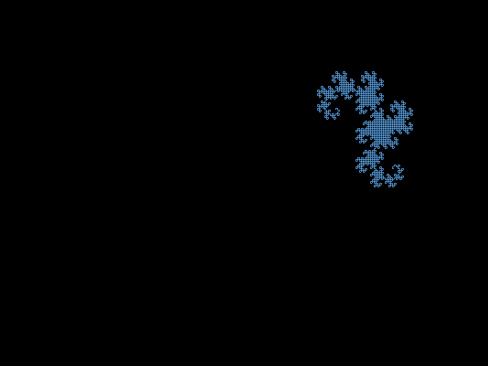
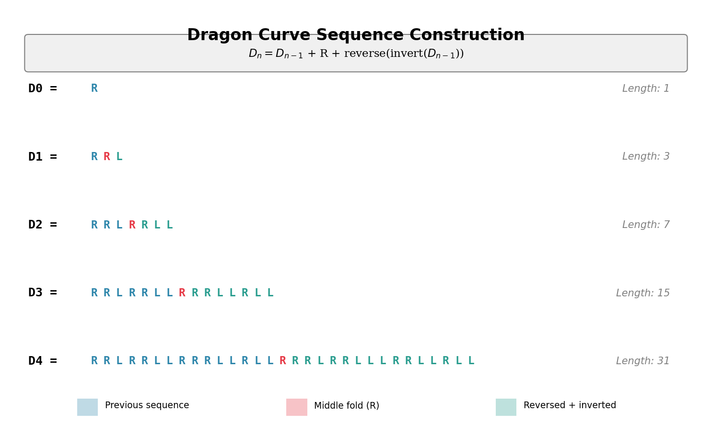
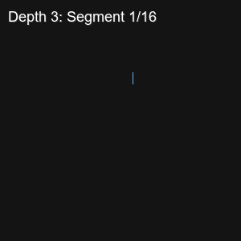
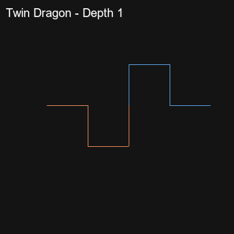
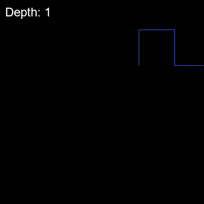
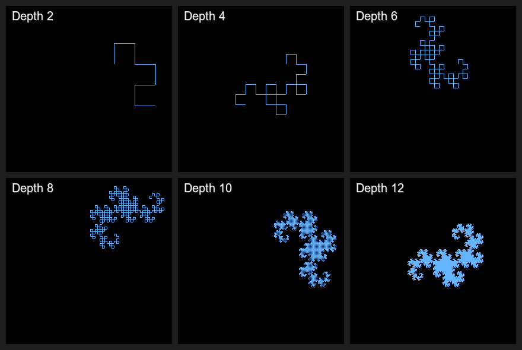

.. _module-4-1-2-dragon-curve:

=====================================
4.1.2 - Dragon Curve
=====================================

:Duration: 20-25 minutes
:Level: Intermediate

Overview
========

In this exercise, you will create the **Heighway dragon curve**, one of the most
elegant fractals discovered in the 20th century. Named after NASA physicist
John Heighway who first investigated it in 1966, the dragon curve emerges from
repeatedly folding a strip of paper in half, then unfolding so each fold opens
to 90 degrees [Gardner1967]_.

The curve never crosses itself, tiles the plane when combined with copies, and
exhibits **self-similarity** at every scale. By the end of this exercise, you
will understand and implement the recursive algorithm that generates this
intricate fractal using turtle graphics rendering.

Learning Objectives
-------------------

By completing this exercise, you will be able to:

1. **Understand** the paper-folding metaphor and its connection to recursive sequences
2. **Implement** the dragon curve generation algorithm using L/R turn sequences
3. **Visualize** fractals at multiple iteration depths using turtle graphics
4. **Analyze** self-similarity and fractal dimension in mathematical patterns

Quick Start: See the Dragon Emerge
==================================

Let's begin by seeing what we're creating. Run the following code to generate
a dragon curve at depth 10 (equivalent to folding a paper strip 10 times):

   The Heighway dragon curve at iteration depth 10, containing 2,047 line segments.
   Notice how the curve never crosses itself and exhibits dragon-like symmetry.

.. code-block:: python
   :caption: dragon_curve.py - Generate the Heighway dragon curve
   :linenos:

   import numpy as np
   from PIL import Image

   # Direction constants for turtle graphics
   LEFT, UP, RIGHT, DOWN = range(4)

   def turn_left(direction):
       return (direction + 3) % 4

   def turn_right(direction):
       return (direction + 1) % 4

   def generate_dragon_sequence(initial_turn, depth):
       """Generate the L/R turn sequence recursively."""
       if depth == 0:
           return initial_turn
       else:
           previous = generate_dragon_sequence(initial_turn, depth - 1)
           inverted = ''.join(['L' if c == 'R' else 'R' for c in previous[::-1]])
           return previous + 'R' + inverted

   # Generate sequence for depth 10
   sequence = generate_dragon_sequence('R', 10)
   print(f"Sequence length: {len(sequence)} turns")

You have just generated a sequence of 2,047 turn instructions that, when followed
like a turtle drawing path, create the dragon curve you see above. The magic lies
in how such a simple recursive rule produces such intricate beauty.

:download:`Download dragon_curve.py <dragon_curve.py>`

Core Concepts
=============

Concept 1: The Paper Folding Metaphor
-------------------------------------

The dragon curve has an intuitive physical interpretation. Imagine a long strip
of paper that you fold in half repeatedly, always folding in the same direction
(say, right-over-left). After making several folds, unfold the paper so that
each crease opens to exactly 90 degrees [Davis1970]_.

.. admonition:: Try It Yourself

   Take a strip of paper and fold it in half 4 times, always folding the right
   side over the left. Then carefully unfold it, making each fold a 90-degree
   angle. The resulting shape is the dragon curve at depth 4.

The sequence of left and right turns at each fold point follows a precise pattern:

.. list-table:: Dragon Curve Sequence Growth
   :widths: 15 35 15
   :header-rows: 1

   * - Depth
     - Turn Sequence
     - Length
   * - 0
     - R
     - 1
   * - 1
     - R **R** L
     - 3
   * - 2
     - RRL **R** RLL
     - 7
   * - 3
     - RRLRRLL **R** RRLRLL
     - 15
   * - 4
     - RRLRRLLRRRLLRLL **R** RRLRRLLRRRLLRLL
     - 31

The pattern follows a simple rule: each iteration takes the previous sequence,
adds an 'R' in the middle (the new fold point), and appends the previous sequence
reversed and inverted (L becomes R, R becomes L).

Concept 2: The Recursive Algorithm
----------------------------------

The mathematical definition of the dragon curve sequence is elegantly recursive:

   Visual representation of the recursive sequence construction. Diagram generated with Claude - Opus 4.5.

.. math::

   D_0 = R

   D_n = D_{n-1} + R + \text{reverse}(\text{invert}(D_{n-1}))

Where **invert** swaps all L's and R's, and **reverse** reads the sequence backward.

Here is the Python implementation:

.. code-block:: python
   :caption: Recursive sequence generation
   :linenos:
   :emphasize-lines: 8-10

   def invert_sequence(sequence):
       """Swap all L's and R's."""
       return ''.join(['L' if char == 'R' else 'R' for char in sequence])

   def generate_dragon_sequence(initial_turn, depth):
       """Generate dragon curve sequence recursively."""
       if depth == 0:
           return initial_turn
       else:
           previous = generate_dragon_sequence(initial_turn, depth - 1)
           second_half = invert_sequence(previous[::-1])  # reversed and inverted
           return previous + 'R' + second_half

**Lines 8-10** are the heart of the algorithm:

1. Get the sequence from the previous depth (recursive call)
2. Create the second half by reversing and inverting the previous sequence
3. Combine them with 'R' in the middle (the fold point)

.. important::

   The sequence length follows the formula :math:`2^{n+1} - 1` where :math:`n` is
   the depth. At depth 10, this gives :math:`2^{11} - 1 = 2047` turn instructions.

Concept 3: Turtle Graphics Rendering
------------------------------------

The turn sequence tells us *how* to move, but we need a rendering system to
actually draw the curve. We use a **turtle graphics** approach where an imaginary
turtle starts at a position, faces a direction, and follows instructions:

.. figure:: turtle_graphics_visual.png
   :width: 600px
   :align: center
   :alt: Diagram showing the four cardinal directions and how turn operations work

   The turtle graphics direction system and turn operations. Diagram generated with Claude - Opus 4.5.

- **Forward**: Move one step in the current direction and draw a line
- **L (Left)**: Turn 90 degrees counter-clockwise
- **R (Right)**: Turn 90 degrees clockwise

.. code-block:: python
   :caption: Turtle graphics rendering on a NumPy canvas
   :linenos:

   def move_forward(canvas, position, step_size, direction, color):
       """Draw a line segment in the current direction."""
       x, y = position

       if direction == RIGHT:
           canvas[y, x:x + step_size] = color
           return (x + step_size, y)
       elif direction == LEFT:
           canvas[y, x - step_size:x] = color
           return (x - step_size, y)
       elif direction == UP:
           canvas[y - step_size:y, x] = color
           return (x, y - step_size)
       elif direction == DOWN:
           canvas[y:y + step_size, x] = color
           return (x, y + step_size)

   def draw_dragon_curve(canvas, sequence, start_pos, step_size, direction, color):
       """Render the dragon curve using turtle graphics."""
       position = start_pos
       for turn in sequence:
           position = move_forward(canvas, position, step_size, direction, color)
           if turn == 'R':
               direction = turn_right(direction)
           else:
               direction = turn_left(direction)
       position = move_forward(canvas, position, step_size, direction, color)

The algorithm alternates between drawing forward and turning. Each segment of
the curve is drawn on the NumPy array by setting pixel values along a row
(horizontal movement) or column (vertical movement).

.. admonition:: Did You Know?

   The dragon curve was popularized by Martin Gardner in his "Mathematical Games"
   column in Scientific American in 1967 [Gardner1967]_. It became a symbol of
   the emerging field of fractal geometry, which Benoit Mandelbrot would
   formalize in the 1970s and 80s [Mandelbrot1982]_.

Hands-On Exercises
==================

Exercise 1: Execute and Explore
-------------------------------

Run the complete ``dragon_curve.py`` script and observe the output.

.. admonition:: Reflection Questions
   :class: tip

   After running the script, consider these questions:

   1. What shape does the dragon curve remind you of? Can you see why it's called
      a "dragon" curve?

   2. Look at the output: *"Dragon curve depth 10: 2047 turns"*. Why is this
      number :math:`2^{11} - 1`?

   3. The curve appears to have **bilateral symmetry**. Can you identify the
      axis of symmetry? Hint: Find the middle 'R' in the sequence.

.. dropdown:: Answers and Explanation

   1. The curve resembles a dragon's body curling upon itself, with the head
      and tail meeting at the starting point. The curves and counter-curves
      create a breathing, organic appearance.

   2. Each iteration doubles the number of segments and adds one more (the
      middle fold). Starting with 1 segment: :math:`1 \to 3 \to 7 \to 15 \to ...`
      follows :math:`2^{n+1} - 1`.

   3. The curve has approximate bilateral symmetry around the middle fold point.
      If you trace from the start to the middle 'R', then from the end backward
      to the middle, you'll find mirror-image paths (with L/R swapped).

Exercise 2: Modify Parameters
-----------------------------

Modify the ``dragon_curve.py`` script to achieve the following goals:

.. admonition:: Goal 1: Fire Dragon
   :class: tip

   Change the color from light blue to create a "fire dragon" using warm colors
   (red, orange, or yellow gradient).

   Modify the ``dragon_color`` variable near line 190.

.. admonition:: Goal 2: Compare Depths
   :class: tip

   Generate the dragon curve at depth 8 and depth 12. Observe how the complexity
   and detail changes. You may need to adjust ``step_size`` and ``start_position``
   to fit higher depths on the canvas.

.. admonition:: Goal 3: Direction Change
   :class: tip

   Change the starting direction from ``UP`` to ``RIGHT`` or ``DOWN``. How does
   this affect the final orientation of the dragon?

.. dropdown:: Solutions

   **Goal 1 - Fire Dragon:**

   .. code-block:: python

      # Replace the color definition:
      dragon_color = (255, 100, 50)  # Orange-red fire color

      # Or create a gradient effect by modifying the draw function
      # to change color based on segment number

   **Goal 2 - Depth Comparison:**

   .. code-block:: python

      # For depth 8 (less detail, larger steps):
      depth = 8
      step_size = 5

      # For depth 12 (more detail, smaller steps):
      depth = 12
      step_size = 2
      start_position = (580, 150)  # Adjust to fit

   **Goal 3 - Direction Change:**

   .. code-block:: python

      # Changing start_direction rotates the entire curve:
      start_direction = RIGHT  # Curve will be rotated 90 degrees clockwise
      start_direction = DOWN   # Curve will be rotated 180 degrees

   The starting direction simply rotates the entire curve without changing
   its shape.

Exercise 3: Re-code the Sequence Generator
------------------------------------------

Now it's your turn to implement the dragon curve sequence generator from scratch.
Complete the TODO sections in the starter code below:

.. code-block:: python
   :caption: Starter code - Complete the TODOs
   :linenos:

   def invert_sequence(sequence):
       """Swap all L's and R's in the sequence."""
       # TODO: Implement this function
       # Hint: Use a list comprehension with a conditional
       pass

   def generate_dragon_sequence(initial_turn, depth):
       """Generate the dragon curve turn sequence recursively."""
       # Base case
       if depth == 0:
           # TODO: What should we return for depth 0?
           pass
       else:
           # Recursive case
           # TODO: Step 1 - Get the sequence from depth-1
           previous = None  # Fix this

           # TODO: Step 2 - Reverse and invert the previous sequence
           # Hint: Use previous[::-1] to reverse, then invert
           second_half = None  # Fix this

           # TODO: Step 3 - Combine with 'R' in the middle
           return None  # Fix this

   # Test your implementation
   test_seq = generate_dragon_sequence('R', 3)
   print(f"Depth 3 sequence: {test_seq}")
   print(f"Expected: RRLRRLLRRRLRLLL")

.. dropdown:: Hint: invert_sequence

   The invert function needs to create a new string where every 'L' becomes 'R'
   and every 'R' becomes 'L':

   .. code-block:: python

      return ''.join(['L' if char == 'R' else 'R' for char in sequence])

.. dropdown:: Hint: Base and Recursive Cases

   - **Base case**: When depth is 0, return the initial_turn (just 'R')
   - **Recursive case**: Call the function with depth-1, then combine:
     ``previous + 'R' + inverted_reversed_previous``

.. dropdown:: Complete Solution

   .. code-block:: python
      :linenos:

      def invert_sequence(sequence):
          """Swap all L's and R's in the sequence."""
          return ''.join(['L' if char == 'R' else 'R' for char in sequence])

      def generate_dragon_sequence(initial_turn, depth):
          """Generate the dragon curve turn sequence recursively."""
          if depth == 0:
              return initial_turn
          else:
              previous = generate_dragon_sequence(initial_turn, depth - 1)
              second_half = invert_sequence(previous[::-1])
              return previous + 'R' + second_half

      # Test
      test_seq = generate_dragon_sequence('R', 3)
      print(f"Depth 3 sequence: {test_seq}")
      # Output: RRLRRLLRRRLRLLL

   **Explanation:**

   - Line 3: List comprehension swaps each character
   - Line 8: Base case returns the initial turn
   - Line 10: Recursive call gets the previous depth's sequence
   - Line 11: Reverse with ``[::-1]``, then invert
   - Line 12: Combine: previous + middle fold ('R') + second half

**Expected Output:**

   The expected output when your implementation is correct. The depth 3 dragon
   curve produces the sequence RRLRRLLRRRLRLLL with 16 line segments.

Challenge Extension: Twin Dragons
---------------------------------

The dragon curve has a beautiful property: two dragon curves can tile together
perfectly, creating a "twin dragon" that fills a bounded region of the plane
without overlapping [Knuth1970]_.

.. admonition:: Challenge
   :class: tip

   Modify the code to draw **two dragon curves** starting from the same point
   but facing opposite directions. Use different colors for each curve.

   Hint: Generate the same sequence but start one curve facing UP and the other
   facing DOWN (or LEFT and RIGHT).

.. dropdown:: Twin Dragon Solution

   .. code-block:: python

      # Draw first dragon (blue, facing UP)
      draw_dragon_curve(canvas, sequence, (400, 300), step_size, UP, (100, 180, 255))

      # Draw second dragon (orange, facing DOWN)
      draw_dragon_curve(canvas, sequence, (400, 300), step_size, DOWN, (255, 150, 100))

   The two curves will interlock, demonstrating the space-filling property
   of the dragon curve.

**Expected Output:**

   Twin dragon curves growing through depths 1-10. The blue dragon faces UP while
   the orange dragon faces DOWN, creating an interlocking pattern.

Exploring Depth Progression
===========================

The animated visualization below shows how the dragon curve evolves through
successive iterations. Watch how complexity emerges from the simple folding rule:

   The dragon curve growing from depth 1 to depth 12. Each iteration doubles
   the number of segments and reveals more intricate self-similar detail.

For a side-by-side comparison, examine the depth comparison grid:

   Dragon curves at depths 2, 4, 6, 8, 10, and 12. Notice how the basic shape
   emerges by depth 4, but finer details continue to appear at higher depths.

Summary
=======

Key Takeaways
-------------

In this exercise, you learned:

* The **Heighway dragon curve** emerges from a simple paper-folding process
* The recursive rule: :math:`D_n = D_{n-1} + R + \text{reverse}(\text{invert}(D_{n-1}))`
* The sequence length follows :math:`2^{n+1} - 1` for depth :math:`n`
* **Turtle graphics** interprets the L/R sequence as drawing instructions
* The dragon curve is **self-similar** - each half contains a scaled copy of the whole
* The curve **never crosses itself**, a property that enables plane-tiling

Common Pitfalls
---------------

* **Array bounds errors**: At high depths with large step sizes, the curve may
  extend beyond the canvas. Reduce ``step_size`` or increase canvas dimensions.

* **Forgetting the base case**: Without ``if depth == 0: return initial_turn``,
  the recursion never terminates.

* **Confusing sequence reversal and inversion**: Reversal reads backward
  (``[::-1]``); inversion swaps L and R. Both are needed for the second half.

* **Starting position issues**: The dragon curve grows in unexpected directions.
  Experiment with starting positions to center the final result.

References
==========

.. [Gardner1967] Gardner, M. (1967, March). Mathematical Games: The fantastic
   combinations of John Conway's new solitaire game "life." *Scientific American*,
   216(3), 112-117. [First popular description of the dragon curve]

.. [Davis1970] Davis, C., & Knuth, D. E. (1970). Number representations and
   dragon curves - I, II. *Journal of Recreational Mathematics*, 3(2), 66-81
   and 3(3), 133-149. [Mathematical analysis of dragon curve properties]

.. [Knuth1970] Knuth, D. E. (1970). An analysis of the random dragon curve.
   Unpublished manuscript. [Properties of space-filling twin dragons]

.. [Mandelbrot1982] Mandelbrot, B. B. (1982). *The Fractal Geometry of Nature*.
   W. H. Freeman and Company. ISBN: 978-0-7167-1186-5. [Foundational text on
   fractal geometry]

.. [Prusinkiewicz1990] Prusinkiewicz, P., & Lindenmayer, A. (1990). *The
   Algorithmic Beauty of Plants*. Springer-Verlag. ISBN: 978-0-387-97297-8.
   [L-systems and recursive plant generation]

.. [NumPyDocs] Harris, C. R., Millman, K. J., van der Walt, S. J., et al. (2020).
   Array programming with NumPy. *Nature*, 585, 357-362.
   https://doi.org/10.1038/s41586-020-2649-2 [NumPy documentation reference]

.. [PillowDocs] Clark, A., et al. (2024). *Pillow: Python Imaging Library*
   (Version 10.x) [Computer software]. Python Software Foundation.
   https://python-pillow.org/ [Image processing library]

.. [WikiDragon] Wikipedia contributors. (2024). Dragon curve. *Wikipedia, The
   Free Encyclopedia*. https://en.wikipedia.org/wiki/Dragon_curve [General
   reference with algorithm details and history]
