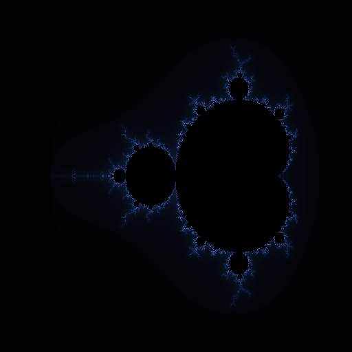
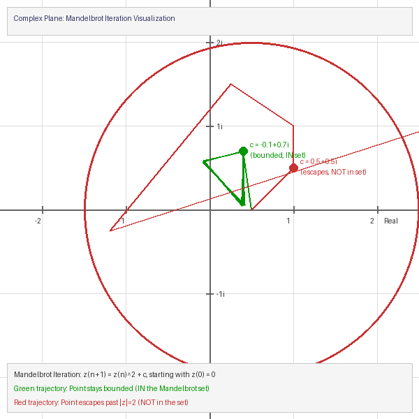
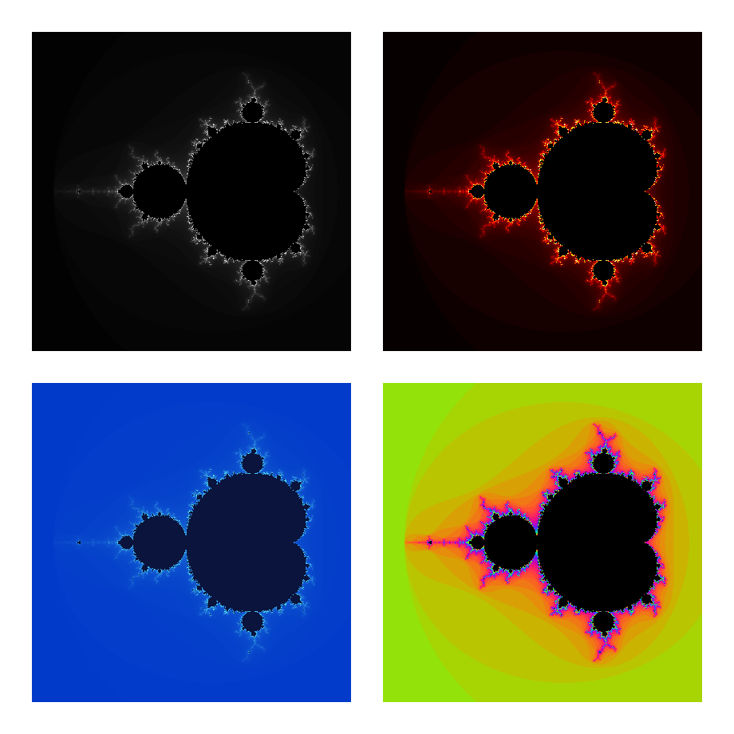

.. _module-4-1-3-mandelbrot:

================================
4.1.3 Mandelbrot Set
================================

:Duration: 25-30 minutes
:Level: Intermediate

Overview
========

The Mandelbrot set is perhaps the most famous fractal in mathematics, revealing infinite complexity from an elegantly simple formula: :math:`z_{n+1} = z_n^2 + c`. Named after mathematician Benoit Mandelbrot, who first visualized it using computers in 1980, this fractal has become an icon of both mathematical beauty and computational art [Mandelbrot1982]_. Its discovery helped launch the popular understanding of chaos theory and fractal geometry [Gleick1987]_.

In this exercise, you will implement the escape-time algorithm to generate stunning Mandelbrot visualizations. You will learn how complex numbers behave under iteration and discover why some points remain bounded forever (belonging to the set) while others spiral off to infinity. This forms the foundation for understanding many other fractal systems, including Julia sets and Newton fractals.

Learning Objectives
-------------------

By the end of this exercise, you will be able to:

* Understand complex number arithmetic and visualize numbers on the complex plane
* Implement the Mandelbrot iteration algorithm using vectorized NumPy operations
* Apply color mapping techniques to transform iteration counts into striking visualizations
* Explore self-similarity by zooming into different regions of the fractal

Quick Start: See It In Action
=============================

Run this code to generate your first Mandelbrot set visualization:

.. code-block:: python
   :caption: Generate the Mandelbrot set
   :linenos:

   import numpy as np
   from PIL import Image

   # Create a grid of complex numbers
   x = np.linspace(-2.5, 1.0, 512)
   y = np.linspace(-1.5, 1.5, 512)
   real, imag = np.meshgrid(x, y)
   c = real + 1j * imag

   # Iterate z = z^2 + c
   z = np.zeros_like(c)
   iterations = np.zeros(c.shape, dtype=np.int32)
   for i in range(100):
       mask = np.abs(z) <= 2
       z[mask] = z[mask]**2 + c[mask]
       iterations[mask] += 1

   # Map to colors and save
   colors = (iterations / 100 * 255).astype(np.uint8)
   Image.fromarray(colors).save('mandelbrot_basic.png')

   The Mandelbrot set rendered with a blue color gradient. The black region is the set itself, where points never escape. The colored regions show how quickly points escape, with darker colors indicating more iterations before escape.

The iconic shape emerges: a cardioid-shaped main body connected to circular bulbs, with intricate detail at every boundary. Each pixel represents one complex number, colored according to how many iterations it took to determine whether that point belongs to the Mandelbrot set.

Core Concepts
=============

Concept 1: Complex Numbers and the Complex Plane
------------------------------------------------

A **complex number** has the form :math:`c = a + bi`, where :math:`a` is the real part, :math:`b` is the imaginary part, and :math:`i = \sqrt{-1}` is the imaginary unit [Devaney1989]_. We can visualize complex numbers as points on a 2D plane, where the horizontal axis represents the real part and the vertical axis represents the imaginary part.

   The complex plane showing the escape boundary (``|z| = 2`` circle) and two example trajectories. The green path stays bounded (point is IN the set), while the red path escapes (point is NOT in the set).

In NumPy, we can create arrays of complex numbers easily:

.. code-block:: python
   :caption: Creating a grid of complex numbers with NumPy
   :linenos:

   import numpy as np

   # Create 1D arrays for real and imaginary values
   real_values = np.linspace(-2.5, 1.0, 512)   # Real axis: -2.5 to 1.0
   imag_values = np.linspace(-1.5, 1.5, 512)   # Imaginary axis: -1.5 to 1.5

   # Create 2D grids
   real_grid, imag_grid = np.meshgrid(real_values, imag_values)

   # Combine into complex numbers: c = real + imaginary * i
   c = real_grid + 1j * imag_grid  # 1j is Python's imaginary unit

   print(f"Shape: {c.shape}")         # (512, 512)
   print(f"Top-left corner: {c[0,0]}") # (-2.5-1.5j)

.. important::

   Each pixel in our image corresponds to one complex number. The entire image is a "window" into the complex plane. By changing the ranges in ``np.linspace()``, you can zoom into different regions of the plane.

Concept 2: The Mandelbrot Iteration Algorithm
---------------------------------------------

The Mandelbrot set is defined by a deceptively simple iteration formula [Mandelbrot1982]_:

.. math::

   z_{n+1} = z_n^2 + c

Starting with :math:`z_0 = 0`, we repeatedly apply this formula. For each complex number :math:`c`, we ask: does the sequence :math:`z_0, z_1, z_2, ...` stay bounded, or does it escape to infinity?

* **If the sequence stays bounded** (``|z|`` never exceeds 2), then :math:`c` belongs to the Mandelbrot set
* **If the sequence escapes** (``|z| > 2`` at some iteration), then :math:`c` is outside the set

.. note::

   Mathematically, once ``|z| > 2``, the sequence is guaranteed to escape to infinity. This is why we use 2 as our escape threshold.

Here is the core algorithm with detailed annotations:

.. code-block:: python
   :caption: The Mandelbrot iteration algorithm explained
   :linenos:
   :emphasize-lines: 10,12,15

   # For a single point c, track the iteration
   c = complex(-0.5, 0.5)  # Example point
   z = 0                    # Always start at z_0 = 0
   max_iterations = 100

   for n in range(max_iterations):
       z = z**2 + c         # Apply the formula

       # Check escape condition
       if abs(z) > 2:       # |z| > 2 means this point escapes
           print(f"Point escaped after {n} iterations")
           break
   else:
       # Loop completed without break - point never escaped
       print("Point is IN the Mandelbrot set")

The algorithm's power comes from tracking the **iteration count** when a point escapes. Points that escape quickly get low counts, while points near the boundary take many iterations to escape. This creates the beautiful gradient patterns we see in Mandelbrot visualizations.

.. admonition:: Did You Know?

   The boundary of the Mandelbrot set has infinite length but encloses a finite area of approximately 1.5065 square units [Ewing1992]_. This seemingly paradoxical property is characteristic of fractal geometry.

Concept 3: Escape Time and Color Mapping
----------------------------------------

The **escape time algorithm** records how many iterations each point takes before escaping. Points inside the set never escape and receive the maximum iteration count [Peitgen1986]_. This iteration count data becomes our raw material for visualization.

Different color mapping techniques produce dramatically different visual effects from the same mathematical data:

   The same Mandelbrot set data rendered with four different color schemes. Top-left: Grayscale. Top-right: Fire (red/orange/yellow). Bottom-left: Ocean (blue/cyan). Bottom-right: Rainbow (cyclic colors). The mathematical content is identical; only the interpretation changes.

.. code-block:: python
   :caption: Applying a custom color gradient to iteration counts
   :linenos:

   # iteration_count is our 2D array of escape times
   # Normalize to 0-1 range
   normalized = iteration_count / max_iterations

   # Create RGB image
   image = np.zeros((height, width, 3), dtype=np.uint8)

   # Apply gradient: dark blue -> light blue -> white
   mask_outside = iteration_count < max_iterations
   image[mask_outside, 0] = (normalized[mask_outside] * 80).astype(np.uint8)   # Red
   image[mask_outside, 1] = (normalized[mask_outside] * 150).astype(np.uint8)  # Green
   image[mask_outside, 2] = (normalized[mask_outside] * 255).astype(np.uint8)  # Blue

   # Points inside the set: black
   image[~mask_outside] = [0, 0, 0]

.. tip::

   For more visually striking results, use cyclic color mappings (like sine waves) that create bands of color. This emphasizes the fractal detail at the boundary of the set.

Hands-On Exercises
==================

Exercise 1: Execute and Explore
-------------------------------

Run the main Mandelbrot script and observe the output:

.. code-block:: bash

   python mandelbrot_set.py

Then answer these reflection questions:

1. Which region of the image has the darkest colors? What does this indicate about those points?
2. Look at the boundary between the black region and the colored region. What do you notice about the level of detail there?
3. The main body of the set looks like a heart shape (cardioid). Why do you think this specific shape emerges from such a simple formula?
4. What do you predict would happen if you increased ``max_iterations`` from 100 to 500?

.. dropdown:: Solution & Explanation
   :class-title: sd-font-weight-bold

   **Answers:**

   1. The **darkest colors** appear right outside the black Mandelbrot set, particularly along its boundary. These points take many iterations to escape, meaning they are "almost" in the set. The darkness indicates high iteration counts.

   2. The **boundary** has the most intricate detail. This is where the fractal nature is most apparent. No matter how much you zoom in, you will always find more detail at the boundary. This is the hallmark of fractals.

   3. The **cardioid shape** emerges because of how complex number squaring works geometrically. Squaring a complex number doubles its angle and squares its magnitude. The points that stay bounded under repeated squaring form this characteristic shape.

   4. Increasing ``max_iterations`` to 500 would:

      * Reveal more detail at the boundary (more color gradations)
      * Make computation slower (5x more iterations)
      * Not change the black region much (points inside still never escape)
      * Show subtle details that were previously too fine to detect

Exercise 2: Modify Parameters
-----------------------------

Modify the ``mandelbrot_set.py`` script to achieve these goals:

**Goal 1**: Zoom into the "Seahorse Valley" region centered at (-0.745, 0.113)

**Goal 2**: Change the color scheme from blue gradient to a "fire" colormap (red/orange/yellow)

**Goal 3**: Increase the resolution to 1024x1024 pixels

.. dropdown:: Hint for Goal 1
   :class-title: sd-font-weight-bold

   Change the viewing window parameters. To zoom into a specific point, make the x and y ranges smaller and centered on that point:

   .. code-block:: python

      x_min, x_max = -0.8, -0.7    # Narrow x range around -0.745
      y_min, y_max = 0.05, 0.15     # Narrow y range around 0.113

.. dropdown:: Hint for Goal 2
   :class-title: sd-font-weight-bold

   Modify the color mapping section. For a fire gradient, increase red first, then add green:

   .. code-block:: python

      # Fire gradient
      image[mask, 0] = (normalized[mask] * 255).astype(np.uint8)       # Red: full
      image[mask, 1] = (normalized[mask] * 150).astype(np.uint8)       # Green: partial
      image[mask, 2] = (normalized[mask] * 50).astype(np.uint8)        # Blue: minimal

.. dropdown:: Complete Solution
   :class-title: sd-font-weight-bold

   .. code-block:: python
      :caption: Modified mandelbrot_set.py with all three goals achieved
      :linenos:

      import numpy as np
      from PIL import Image

      # GOAL 3: Increased resolution
      width = 1024
      height = 1024

      # GOAL 1: Zoom into Seahorse Valley
      x_min, x_max = -0.8, -0.69
      y_min, y_max = 0.05, 0.16

      max_iterations = 200  # More iterations for zoomed view

      # Create complex grid
      real = np.linspace(x_min, x_max, width)
      imag = np.linspace(y_min, y_max, height)
      real_grid, imag_grid = np.meshgrid(real, imag)
      c = real_grid + 1j * imag_grid

      # Iterate
      z = np.zeros_like(c, dtype=np.complex128)
      iteration_count = np.zeros(c.shape, dtype=np.int32)
      for i in range(max_iterations):
          still_bounded = np.abs(z) <= 2
          z[still_bounded] = z[still_bounded]**2 + c[still_bounded]
          iteration_count[still_bounded] += 1

      # GOAL 2: Fire colormap
      normalized = iteration_count / max_iterations
      image = np.zeros((height, width, 3), dtype=np.uint8)
      mask = iteration_count < max_iterations

      image[mask, 0] = (normalized[mask] * 255).astype(np.uint8)  # Red
      image[mask, 1] = (normalized[mask] * 150).astype(np.uint8)  # Green
      image[mask, 2] = (normalized[mask] * 30).astype(np.uint8)   # Blue

      Image.fromarray(image).save('mandelbrot_seahorse_fire.png')

Exercise 3: Create a Zoom Function
----------------------------------

Create a reusable function that generates Mandelbrot images at any zoom level and location. Your function should:

**Requirements:**

1. Accept parameters for center point (x, y), zoom level, and image size
2. Calculate the appropriate viewing window from the zoom level
3. Return an RGB image array

**Starter Code:**

.. code-block:: python
   :caption: Starter code for zoom function
   :linenos:

   import numpy as np
   from PIL import Image

   def mandelbrot_zoom(center_x, center_y, zoom_level, size=512, max_iter=200):
       """
       Generate a Mandelbrot image at the specified location and zoom.

       Parameters:
           center_x, center_y: Center point in the complex plane
           zoom_level: Magnification factor (1 = full view, 10 = 10x zoom)
           size: Image dimensions (square)
           max_iter: Maximum iterations

       Returns:
           np.ndarray: RGB image array
       """
       # TODO: Calculate x_min, x_max, y_min, y_max from center and zoom

       # TODO: Create complex grid

       # TODO: Run iteration algorithm

       # TODO: Apply color mapping

       # TODO: Return image array
       pass

   # Test your function
   if __name__ == '__main__':
       # Generate zoomed image
       image = mandelbrot_zoom(-0.745, 0.113, zoom_level=50)
       Image.fromarray(image).save('my_zoom.png')
       print("Zoomed image saved!")

.. dropdown:: Hint: Calculating the viewing window
   :class-title: sd-font-weight-bold

   The base viewing window spans about 3.5 units horizontally and 3.0 units vertically. To zoom in by a factor of N, divide these ranges by N:

   .. code-block:: python

      base_width = 3.5
      base_height = 3.0
      x_range = base_width / zoom_level
      y_range = base_height / zoom_level

      x_min = center_x - x_range / 2
      x_max = center_x + x_range / 2

.. dropdown:: Complete Solution
   :class-title: sd-font-weight-bold

   .. code-block:: python
      :caption: Complete zoom function implementation
      :linenos:

      import numpy as np
      from PIL import Image

      def mandelbrot_zoom(center_x, center_y, zoom_level, size=512, max_iter=200):
          """Generate a Mandelbrot image at the specified location and zoom."""

          # Calculate viewing window
          x_range = 3.5 / zoom_level
          y_range = 3.0 / zoom_level
          x_min = center_x - x_range / 2
          x_max = center_x + x_range / 2
          y_min = center_y - y_range / 2
          y_max = center_y + y_range / 2

          # Create complex grid
          real = np.linspace(x_min, x_max, size)
          imag = np.linspace(y_min, y_max, size)
          real_grid, imag_grid = np.meshgrid(real, imag)
          c = real_grid + 1j * imag_grid

          # Iterate
          z = np.zeros_like(c, dtype=np.complex128)
          iterations = np.zeros(c.shape, dtype=np.int32)
          for i in range(max_iter):
              mask = np.abs(z) <= 2
              z[mask] = z[mask]**2 + c[mask]
              iterations[mask] += 1

          # Color mapping (rainbow)
          image = np.zeros((size, size, 3), dtype=np.uint8)
          norm = iterations / max_iter
          outside = iterations < max_iter

          image[outside, 0] = (128 + 127*np.sin(norm[outside]*10)).astype(np.uint8)
          image[outside, 1] = (128 + 127*np.sin(norm[outside]*10+2)).astype(np.uint8)
          image[outside, 2] = (128 + 127*np.sin(norm[outside]*10+4)).astype(np.uint8)

          return image

      if __name__ == '__main__':
          image = mandelbrot_zoom(-0.745, 0.113, zoom_level=50)
          Image.fromarray(image).save('my_zoom.png')
          print("Zoomed image saved!")

Challenge Extension: Create Zoom Animation
------------------------------------------

Using your zoom function, create an animated GIF that zooms into an interesting region of the Mandelbrot set.

.. code-block:: python
   :caption: Starter code for zoom animation
   :linenos:

   import imageio

   frames = []
   target_x, target_y = -0.745, 0.113  # Seahorse valley

   for i in range(60):
       zoom = 1.2 ** i  # Exponential zoom
       print(f"Generating frame {i+1}/60 at {zoom:.1f}x zoom...")
       frame = mandelbrot_zoom(target_x, target_y, zoom, size=256, max_iter=150)
       frames.append(frame)

   imageio.mimsave('mandelbrot_zoom.gif', frames, fps=15)
   print("Animation saved as mandelbrot_zoom.gif")

Summary
=======

Key Takeaways
-------------

* The **Mandelbrot set** is defined by the iteration :math:`z = z^2 + c`, where points that stay bounded belong to the set
* **Complex numbers** can be visualized on a 2D plane, with real and imaginary axes corresponding to x and y coordinates
* The **escape time algorithm** tracks how many iterations until ``|z| > 2``, creating the data for visualization
* **Color mapping** transforms iteration counts into visual representations, with many possible artistic interpretations

Common Pitfalls
---------------

* **Forgetting dtype=complex128**: When creating the z array, use ``dtype=np.complex128`` to avoid precision errors
* **Using loops instead of vectorization**: Always use NumPy masks (``z[mask]``) rather than Python loops for performance
* **Not increasing iterations when zooming**: Deeper zooms reveal more detail, which requires more iterations to resolve

These common errors align with cognitive load principles [Sweller2019]_: breaking down complex algorithms into smaller steps helps learners avoid overload [Mayer2020]_.

Next Steps
----------

Continue to :doc:`../../4.1.4_julia_sets/README` to explore Julia sets, which use the same iteration formula but with a fixed value of c for all points. You will discover how Mandelbrot and Julia sets are mathematically connected.

References
==========

.. [Mandelbrot1982] Mandelbrot, B. B. (1982). *The Fractal Geometry of Nature*. W.H. Freeman and Company. ISBN: 978-0-7167-1186-5

.. [Peitgen1986] Peitgen, H.-O., & Richter, P. H. (1986). *The Beauty of Fractals: Images of Complex Dynamical Systems*. Springer-Verlag. https://doi.org/10.1007/978-3-642-61717-1

.. [Devaney1989] Devaney, R. L. (1989). *An Introduction to Chaotic Dynamical Systems* (2nd ed.). Addison-Wesley. ISBN: 978-0-8133-4085-2

.. [Gleick1987] Gleick, J. (1987). *Chaos: Making a New Science*. Viking Press. ISBN: 978-0-14-009250-9

.. [Ewing1992] Ewing, J. H., & Schober, G. (1992). The area of the Mandelbrot set. *Numerische Mathematik*, 61(1), 59-72. https://doi.org/10.1007/BF01385497

.. [Harris2020] Harris, C. R., et al. (2020). Array programming with NumPy. *Nature*, 585, 357-362. https://doi.org/10.1038/s41586-020-2649-2

.. [Mayer2020] Mayer, R. E. (2020). *Multimedia Learning* (3rd ed.). Cambridge University Press. https://doi.org/10.1017/9781316941355

.. [Sweller2019] Sweller, J., van Merriënboer, J. J. G., & Paas, F. (2019). Cognitive architecture and instructional design: 20 years later. *Educational Psychology Review*, 31, 261-292. https://doi.org/10.1007/s10648-019-09465-5
