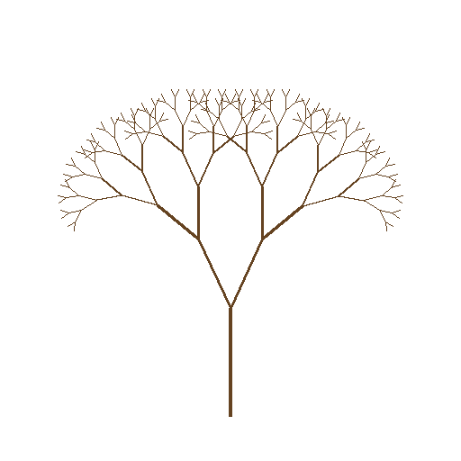
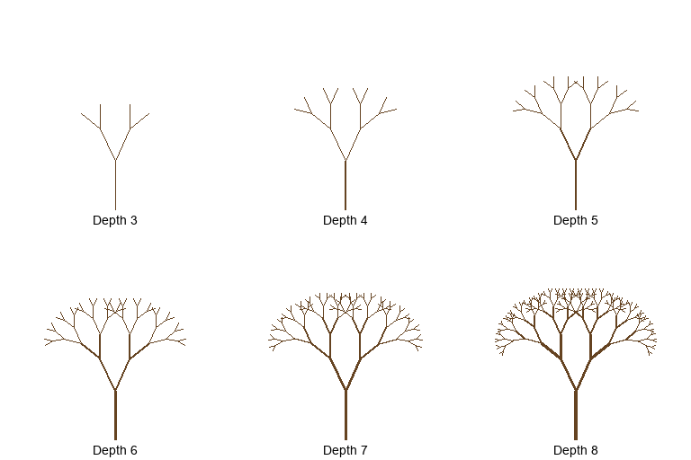
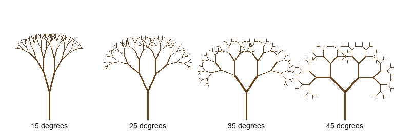
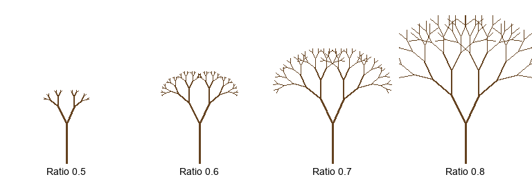
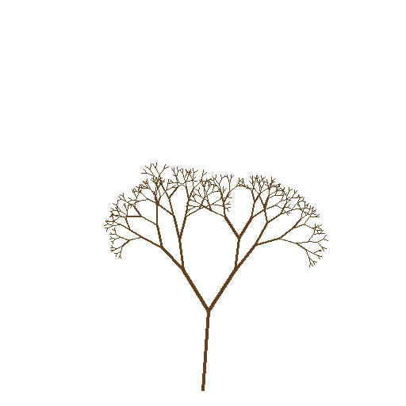

.. _module-4-2-1-fractal-trees:

=====================================
4.2.1 - Fractal Trees
=====================================

:Duration: 20-25 minutes
:Level: Intermediate
:Prerequisites: Module 2.1.1 (Lines), Module 4.1 (Classical Fractals)

Overview
========

Trees are nature's most elegant example of fractal geometry. From the trunk to the smallest twig, trees exhibit self-similarity: each branch looks like a miniature version of the whole tree. In this exercise, you will use recursion to generate fractal trees, learning how simple rules can produce complex, organic-looking structures.

**Learning Objectives**

By completing this module, you will:

* Understand how recursive functions create self-similar visual patterns
* Implement branching algorithms with angle and length parameters
* Control fractal depth to balance visual detail and computational performance
* Add organic variation through randomness for natural-looking results

Quick Start: Your First Fractal Tree
=====================================

Let's start by creating a beautiful fractal tree. Run this code:

.. code-block:: python
   :caption: Create a fractal tree in seconds
   :linenos:

   import math
   from PIL import Image, ImageDraw

   def draw_branch(draw, x, y, length, angle, depth):
       if depth == 0:
           return
       end_x = x + length * math.sin(angle)
       end_y = y - length * math.cos(angle)
       draw.line([(x, y), (end_x, end_y)], fill=(101, 67, 33), width=max(1, depth//2))
       new_length = length * 0.7
       draw_branch(draw, end_x, end_y, new_length, angle - math.radians(25), depth - 1)
       draw_branch(draw, end_x, end_y, new_length, angle + math.radians(25), depth - 1)

   image = Image.new('RGB', (512, 512), 'white')
   draw = ImageDraw.Draw(image)
   draw_branch(draw, 256, 462, 120, 0, 8)
   image.save('fractal_tree.png')

   A fractal tree generated with depth 8, branch angle of 25 degrees, and length ratio of 0.7.

.. tip::

   The tree is drawn from bottom to top. Each branch splits into two smaller branches, creating the characteristic fractal pattern. Notice how the thickness of branches decreases as they get smaller.

Core Concept 1: Recursion in Nature
====================================

Natural trees grow through a process of branching. A stem divides into smaller branches, which divide into even smaller branches, and so on. This self-similar structure is a hallmark of fractals.

The mathematical definition of self-similarity is simple: a pattern that looks the same at different scales. When you zoom in on a branch of a tree, you see something that resembles the whole tree. This property makes recursion the perfect tool for modeling tree growth.

**Why Trees Are Fractal**

Trees evolved fractal branching because it efficiently distributes resources:

* Maximizes exposure to sunlight for photosynthesis
* Distributes water and nutrients throughout the organism
* Provides structural stability while minimizing material use

The Japanese scientist Hisao Honda was among the first to mathematically model tree branching patterns, showing that simple parameters could capture the essential geometry of real trees [Honda1971]_.

.. admonition:: Did You Know?

   The mathematician Benoit Mandelbrot, who coined the term "fractal," specifically pointed to trees as a prime example of fractal geometry in nature. In his influential book *The Fractal Geometry of Nature*, he wrote extensively about how branching patterns in plants follow self-similar rules [Mandelbrot1982]_.

Core Concept 2: The Recursive Algorithm
=======================================

Our fractal tree algorithm works by drawing one branch and then calling itself to draw two smaller branches. This is recursion in action.

**The Function Structure**

Every recursive function needs two things:

1. **Base case**: A condition that stops the recursion
2. **Recursive case**: The function calling itself with modified parameters

.. code-block:: python
   :caption: Anatomy of the recursive draw_branch function
   :linenos:
   :emphasize-lines: 2,3,13,15

   def draw_branch(draw, x, y, length, angle, depth, branch_angle, length_ratio):
       # Base case: stop when depth reaches 0
       if depth == 0:
           return

       # Calculate endpoint using polar coordinates
       end_x = x + length * math.sin(angle)
       end_y = y - length * math.cos(angle)

       # Draw this branch
       draw.line([(x, y), (end_x, end_y)], fill=(101, 67, 33), width=max(1, depth//2))

       # Recursive case: draw two child branches
       new_length = length * length_ratio
       draw_branch(draw, end_x, end_y, new_length, angle - branch_angle, depth - 1, ...)
       draw_branch(draw, end_x, end_y, new_length, angle + branch_angle, depth - 1, ...)

**Understanding the Coordinate System**

In image coordinates, the origin (0, 0) is at the top-left corner, and y increases downward. Since we want our tree to grow upward, we subtract when calculating the y-coordinate:

* ``end_x = x + length * sin(angle)`` moves horizontally based on the angle
* ``end_y = y - length * cos(angle)`` moves upward (subtracting because y increases down)

The angle is measured from vertical (0 = straight up), using radians.

.. note::

   Converting degrees to radians: ``radians = degrees * (pi / 180)`` or use ``math.radians(degrees)``. In this module, we use 25 degrees (approximately 0.436 radians) as the default branch angle.

Core Concept 3: Parameters and Variation
=========================================

Three parameters control the appearance of our fractal tree:

**Recursion Depth**

The depth determines how many levels of branching occur. A depth of 8 creates 255 branches (2^8 - 1 total). Increasing depth adds more detail but also exponentially increases the number of branches.

   Effect of recursion depth on tree complexity. Diagram generated with Claude - Opus 4.5.

**Branch Angle**

The branch angle controls how wide the tree spreads. Small angles create narrow, pine-like trees. Large angles create spreading, oak-like trees.

   Effect of branch angle on tree shape. Diagram generated with Claude - Opus 4.5.

**Length Ratio**

The length ratio determines how much smaller each generation of branches becomes. A ratio of 0.7 means each branch is 70% the length of its parent. Lower ratios create sparser trees; higher ratios create denser ones.

   Effect of length ratio on tree density. Diagram generated with Claude - Opus 4.5.

**Branch Count Formula**

For a symmetric binary tree with depth *d*, the total number of branches is:

.. math::

   \text{branches} = 2^d - 1

This exponential growth is why deep trees require significant computation.

Hands-On Exercises
==================

Now apply what you have learned with three progressively challenging exercises.

Exercise 1: Execute and Explore
-------------------------------

Run the :download:`fractal_tree.py <fractal_tree.py>` script and observe the output. Then answer these reflection questions:

**Reflection Questions:**

1. How many total branches are in a depth-8 tree?
2. Why do we subtract in the line ``end_y = y - length * cos(angle)`` instead of adding?
3. What would happen if the ``length_ratio`` were greater than 1.0?
4. What is the base case in the recursion, and what would happen without it?

.. dropdown:: Solutions

   **1. How many branches in depth-8?**

   A depth-8 tree has 2^8 - 1 = 255 branches. This is a geometric series: 1 + 2 + 4 + 8 + 16 + 32 + 64 + 128 = 255.

   **2. Why subtract for end_y?**

   In image coordinates, (0, 0) is the top-left corner and y increases downward. Since we want the tree to grow upward, we subtract from y to move up. The trunk starts near the bottom (y = 462) and grows toward smaller y values.

   **3. What if length_ratio > 1.0?**

   Each child branch would be longer than its parent. The tree would grow infinitely (or until hitting the recursion limit) because branches never shrink to zero. Python would eventually raise a RecursionError.

   **4. Base case purpose**

   The base case ``if depth == 0: return`` stops the recursion. Without it, the function would call itself forever, causing a stack overflow crash. Every recursive function needs a condition that eventually stops the recursion.

Exercise 2: Modify Parameters
-----------------------------

Modify the script parameters to create different tree styles. Try to achieve each of these goals:

**Goals:**

1. Create a "weeping willow" style tree with drooping branches
2. Create a "pine tree" with a narrow, upright silhouette
3. Create a tree that fills exactly 3/4 of the canvas height
4. Try to create a tree with exactly 12 branches (hint: think about powers of 2)

.. dropdown:: Hints

   **Goal 1 (Weeping Willow):** Use larger branch angles or start with a downward angle. Try ``branch_angle = math.radians(50)`` or change the starting angle.

   **Goal 2 (Pine Tree):** Use small branch angles, around 10-15 degrees. This keeps branches close to the trunk.

   **Goal 3 (3/4 Canvas):** Calculate the total height a tree reaches. With ratio 0.7, total height approximates trunk_length * (1 / (1 - 0.7)) = trunk * 3.33. For 3/4 of 512 = 384 pixels, set trunk_length around 115.

   **Goal 4 (12 Branches):** This is a trick question! Symmetric binary trees can only have 2^n - 1 branches (1, 3, 7, 15, 31...). 12 is not achievable with this algorithm. The closest values are 7 (depth 3) or 15 (depth 4).

.. dropdown:: Solutions

   **Goal 1: Weeping Willow**

   .. code-block:: python

      # Use a large angle and possibly negative starting angle
      branch_angle = math.radians(55)
      # Or start with angle pointing slightly downward
      start_angle = math.radians(15)  # Lean to one side

   **Goal 2: Pine Tree**

   .. code-block:: python

      branch_angle = math.radians(12)  # Narrow spread
      depth = 9  # More branching levels

   **Goal 3: 3/4 Canvas Height**

   .. code-block:: python

      # Total height = trunk / (1 - ratio) for infinite series
      # For 3/4 of 512 = 384 pixels with ratio 0.7:
      trunk_length = 115  # Approximately 115 pixels

   **Goal 4: 12 Branches**

   Impossible with symmetric binary branching! The number of branches follows 2^d - 1, which only produces 1, 3, 7, 15, 31... You would need asymmetric branching or branch pruning to get exactly 12.

Exercise 3: Re-code from Scratch
--------------------------------

Build your own fractal tree generator starting from the skeleton code.

**Part A: Complete the Implementation**

Open :download:`fractal_tree_starter.py <fractal_tree_starter.py>` and implement the ``draw_branch`` function. The TODO comments guide you through each step:

1. Check the base case (depth == 0)
2. Calculate the endpoint using trigonometry
3. Draw the line from start to end
4. Calculate the new length for child branches
5. Recursively call the function for left and right branches

.. dropdown:: Complete Solution

   .. code-block:: python
      :linenos:

      def draw_branch(draw, x, y, length, angle, depth, branch_angle, length_ratio):
          # Step 1: Base case
          if depth == 0:
              return

          # Step 2: Calculate endpoint
          end_x = x + length * math.sin(angle)
          end_y = y - length * math.cos(angle)

          # Step 3: Draw this branch
          thickness = max(1, depth // 2)
          brown = (101, 67, 33)
          draw.line([(x, y), (end_x, end_y)], fill=brown, width=thickness)

          # Step 4: Calculate new length
          new_length = length * length_ratio

          # Step 5: Recursive calls for child branches
          draw_branch(draw, end_x, end_y, new_length, angle - branch_angle,
                      depth - 1, branch_angle, length_ratio)
          draw_branch(draw, end_x, end_y, new_length, angle + branch_angle,
                      depth - 1, branch_angle, length_ratio)

**Part B: Challenge Extension**

Add natural variation to make the tree look more organic:

* Add random variation to branch angles (plus or minus 10 degrees)
* Add random variation to length ratio (plus or minus 0.1)
* Optional: Add a probability that sometimes skips a branch entirely

   A fractal tree with random angle and length variation looks more natural.

.. dropdown:: Challenge Solution

   .. code-block:: python
      :linenos:

      import random

      def draw_branch_natural(draw, x, y, length, angle, depth, branch_angle, length_ratio):
          if depth == 0 or length < 2:
              return

          # Add random variation
          actual_angle = angle + random.uniform(-0.17, 0.17)  # About 10 degrees
          actual_ratio = length_ratio + random.uniform(-0.1, 0.1)
          actual_ratio = max(0.4, min(0.9, actual_ratio))  # Keep in valid range

          # Occasionally skip a branch (10% chance)
          if random.random() < 0.1:
              return

          end_x = x + length * math.sin(actual_angle)
          end_y = y - length * math.cos(actual_angle)

          thickness = max(1, depth // 2)
          draw.line([(x, y), (end_x, end_y)], fill=(101, 67, 33), width=thickness)

          new_length = length * actual_ratio
          draw_branch_natural(draw, end_x, end_y, new_length, angle - branch_angle,
                              depth - 1, branch_angle, length_ratio)
          draw_branch_natural(draw, end_x, end_y, new_length, angle + branch_angle,
                              depth - 1, branch_angle, length_ratio)

Summary
=======

In this exercise, you learned how to create fractal trees using recursion.

**Key Takeaways:**

* Fractal trees use self-similarity: each branch looks like a smaller version of the whole tree
* Recursive functions need a base case (depth == 0) and recursive calls
* Three parameters control tree appearance: depth, branch angle, and length ratio
* The number of branches grows exponentially: 2^d - 1 for depth d
* Adding randomness creates more natural, organic-looking trees

**Common Pitfalls:**

* Forgetting the base case causes infinite recursion and crashes
* Using degrees instead of radians in trigonometric functions
* Deep recursion (depth > 10) may hit Python's recursion limit
* Large branch angles can cause branches to overlap or point downward

References
==========

.. [Mandelbrot1982] Mandelbrot, B. B. (1982). *The Fractal Geometry of Nature*. W. H. Freeman. ISBN: 978-0716711865.

.. [Prusinkiewicz1990] Prusinkiewicz, P., & Lindenmayer, A. (1990). *The Algorithmic Beauty of Plants*. Springer-Verlag. http://algorithmicbotany.org/papers/abop/abop.pdf

.. [Shiffman2012] Shiffman, D. (2012). *The Nature of Code*, Chapter 8: Fractals. https://natureofcode.com/book/chapter-8-fractals/

.. [Honda1971] Honda, H. (1971). Description of the form of trees by the parameters of the tree-like body. *Journal of Theoretical Biology*, 31(2), 331-338.

.. [Barnsley1988] Barnsley, M. F. (1988). *Fractals Everywhere*. Academic Press. ISBN: 978-0120790623.

.. [Sweller1988] Sweller, J. (1988). Cognitive load during problem solving: Effects on learning. *Cognitive Science*, 12(2), 257-285.

.. [Resnick2017] Resnick, M. (2017). *Lifelong Kindergarten: Cultivating Creativity through Projects, Passion, Peers, and Play*. MIT Press.

.. [PillowDocs] Clark, A., et al. (2024). *Pillow (PIL Fork) Documentation*. https://pillow.readthedocs.io/

.. [NumPyDocs] NumPy Developers. (2024). *NumPy Trigonometric Functions*. https://numpy.org/doc/

.. [Pearson2011] Pearson, M. (2011). *Generative Art: A Practical Guide Using Processing*. Manning Publications.
