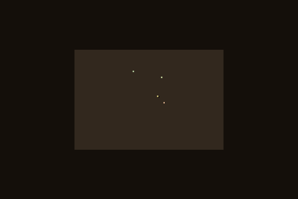
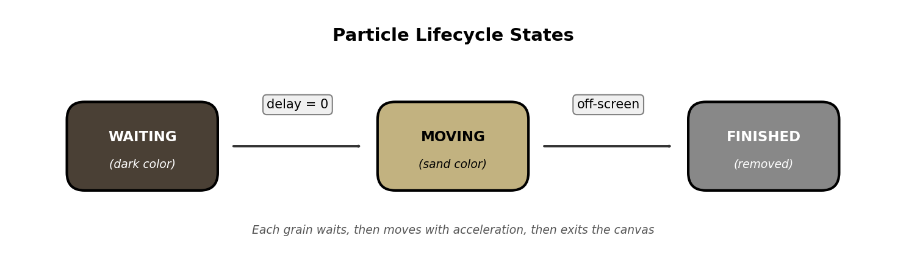
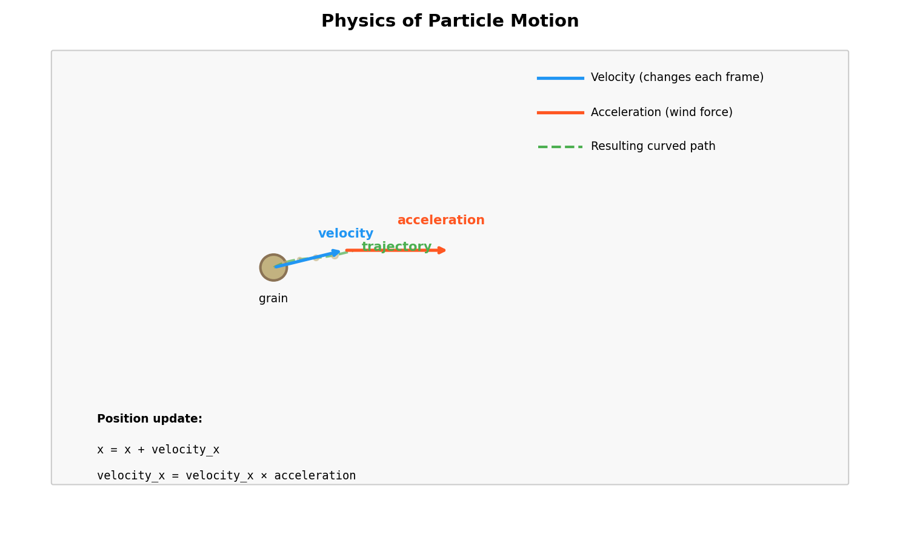
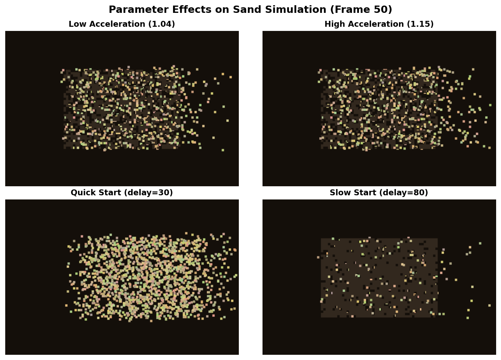

.. _module-5-1-1-sand-simulation:

=====================================
5.1.1 Sand Simulation
=====================================

:Duration: 18-22 minutes
:Level: Intermediate
:Prerequisites: Module 1.1.1 (Arrays and Images)

.. contents:: In This Exercise
   :local:
   :depth: 2

Overview
========

Have you ever watched sand blow across a desert, each grain moving independently yet creating a mesmerizing collective pattern? In this exercise, you will build a **particle system** that simulates this exact phenomenon. By the end, you will understand how simple physics rules applied to thousands of independent agents can create complex, natural-looking motion.

Particle systems are one of the most versatile tools in generative art and visual effects. First developed for the "Genesis sequence" in Star Trek II: The Wrath of Khan, they now power everything from fire and smoke in video games to flocking birds in nature documentaries [Reeves1983]_.

**Learning Objectives**

By completing this exercise, you will:

* Understand particle systems as collections of independent agents with state
* Implement physics-based motion using position, velocity, and acceleration
* Use randomness (Gaussian distribution) to create natural timing variations
* Generate frame-by-frame animations and export them as animated GIFs

Quick Start: Watch the Sand Blow Away
=====================================

Let's start by running the simulation and seeing the result. Save this code as ``sand_simulation.py`` and run it:

.. code-block:: python
   :caption: Minimal sand simulation example

   import random
   import numpy as np
   from PIL import Image
   import imageio.v2 as imageio

   # Create 500 particles at the center
   particles = []
   for _ in range(500):
       particles.append({
           'x': 150 + random.randint(0, 100),
           'y': 100 + random.randint(0, 100),
           'vx': random.uniform(-1, 2),
           'vy': random.uniform(-0.5, 0.5),
           'delay': random.randint(0, 60)
       })

   frames = []
   for frame in range(80):
       img = np.zeros((200, 300, 3), dtype=np.uint8)
       for p in particles:
           if p['delay'] > 0:
               p['delay'] -= 1
               color = (50, 40, 30)  # Waiting: dark
           else:
               p['x'] += p['vx']
               p['y'] += p['vy']
               p['vx'] *= 1.05  # Accelerate
               color = (194, 178, 128)  # Moving: sand color
           x, y = int(p['x']), int(p['y'])
           if 0 <= x < 297 and 0 <= y < 197:
               img[y:y+3, x:x+3] = color
       frames.append(img)

   imageio.mimsave('quick_sand.gif', frames, fps=24)

After running this code, open ``quick_sand.gif`` to see the animation.

   Full sand simulation with 6,700 grains accelerating rightward

.. tip::

   Notice how the grains start dark and motionless, then turn beige and accelerate as they begin moving. This creates the illusion of sand being swept away by wind.

Core Concepts
=============

What Are Particle Systems?
--------------------------

A **particle system** is a technique for simulating fuzzy phenomena by managing large collections of small, independent objects called particles. Each particle has its own state (position, velocity, color) and follows simple rules that govern its behavior.

The key components of any particle system are:

1. **Particles**: Individual agents with properties like position, velocity, and lifetime
2. **Emitter**: The source that creates new particles (in our case, a rectangular region)
3. **Update Rules**: Physics equations that modify each particle every frame
4. **Renderer**: Code that draws each particle to the canvas

   Particle lifecycle states. Diagram generated with Claude Code.

In our sand simulation, each grain progresses through three states:

* **WAITING**: The grain is stationary, colored dark, counting down its delay timer
* **MOVING**: The grain is active, colored beige, accelerating to the right
* **FINISHED**: The grain has exited the canvas and is removed from rendering

.. admonition:: Did You Know?

   William Reeves invented particle systems in 1982 at Lucasfilm to create the fiery "Genesis Effect" in Star Trek II. His paper described particles as having position, velocity, color, and age, all concepts we use today [Reeves1983]_.

Physics of Motion
-----------------

Our particles move according to simple physics: **position changes by velocity, and velocity changes by acceleration**. This is called Euler integration, one of the simplest methods for simulating motion.

The core physics equations are:

.. code-block:: text

   position_new = position + velocity
   velocity_new = velocity × acceleration

In code, this translates to:

.. code-block:: python
   :linenos:
   :emphasize-lines: 6,9

   def update(self):
       # Update position using velocity
       self.x += self.velocity_x
       self.y += self.velocity_y

       # Accelerate rightward (wind effect)
       if self.velocity_x < 1.0:
           self.velocity_x += 0.2  # Redirect leftward motion
       else:
           self.velocity_x *= self.acceleration  # Speed up exponentially

**Line 6-10** show the key physics: particles start with random velocities (some moving left, some right), but the acceleration gradually redirects them all rightward. Once moving right, they accelerate exponentially, creating the "blown away" effect.

   Velocity and acceleration vectors determine particle trajectory. Diagram generated with Claude Code.

.. important::

   We use **float** values for position and velocity, then convert to **int** only when drawing. This allows smooth sub-pixel movement that looks natural.

Creating Natural Variation with Randomness
------------------------------------------

Real sand does not move in perfect unison. To create natural-looking motion, we introduce **randomness** at several levels:

1. **Delay Distribution**: Each grain waits a random time before moving

   .. code-block:: python

      self.delay = max(0, int(random.gauss(50, 15)))

   This uses a **Gaussian (normal) distribution** centered at 50 frames with a standard deviation of 15. Most grains start moving around frame 50, but some start early (frame 20) and some late (frame 80).

2. **Initial Velocity Variation**: Grains start with slightly different speeds

   .. code-block:: python

      self.velocity_x = random.uniform(-1.5, 1.5)
      self.velocity_y = random.uniform(-0.3, 0.3)

3. **Color Variation**: Each grain has a slightly different shade of beige

   .. code-block:: python

      self.color = (
          base[0] + random.randint(-30, 30),
          base[1] + random.randint(-30, 30),
          base[2] + random.randint(-20, 20)
      )

   Different parameter values create distinct visual effects

.. note::

   The Gaussian distribution is ideal for natural phenomena because it clusters values around a mean while allowing occasional outliers, just like real-world variation.

The Complete Implementation
===========================

Here is the full, annotated simulation code. Study how the pieces fit together:

.. literalinclude:: sand_simulation.py
   :language: python
   :linenos:
   :caption: sand_simulation.py - Complete particle system implementation

**Key sections explained:**

* **Lines 1-14**: Configuration parameters that control the simulation
* **Lines 17-75**: The ``SandGrain`` class that represents each particle
* **Lines 78-96**: Helper functions to create and draw particles
* **Lines 99-122**: The main simulation loop that generates frames

Hands-On Exercises
==================

Exercise 1: Execute and Observe
-------------------------------

Run the complete simulation and observe the output carefully.

.. admonition:: Task

   Execute ``sand_simulation.py`` and open ``sand_animation.gif`` in an image viewer. Watch the animation several times, paying attention to the details.

**Reflection Questions:**

1. Why do the grains not all start moving at the same time? What visual effect does this create?

2. Follow a single grain with your eyes. Does it travel in a straight line, or does it curve? What causes this?

3. Watch grains as they move further right. Do they speed up, slow down, or maintain constant speed?

4. Check the console output. How many grains does the simulation create?

.. dropdown:: Solutions and Explanations
   :class: note

   **Answer 1:** Grains have randomly distributed delays (Gaussian around 50 frames). This creates a natural "peeling away" effect where sand gradually reveals the background, much like wind uncovering buried objects.

   **Answer 2:** Grains curve slightly because they have both horizontal and vertical velocity components. The vertical component (velocity_y) causes slight upward or downward drift, simulating turbulent air.

   **Answer 3:** Grains accelerate as they move right. The acceleration multiplier (1.08) compounds each frame, causing exponential speedup. This simulates particles being pushed by increasingly strong wind.

   **Answer 4:** The default configuration creates approximately 6,700 grains. The exact count is (300÷3) × (200÷3) = 100 × 67 = 6,700 grains.

Exercise 2: Modify Parameters
-----------------------------

Experiment with different parameter values to understand how they affect the simulation.

.. admonition:: Task

   Modify ``sand_simulation.py`` to achieve each of the following goals. Make one change at a time and observe the results.

**Goals:**

1. Make the sand blow **LEFT** instead of right
2. Make the sand **FALL DOWN** like gravity instead of blowing sideways
3. Make all grains start moving **within 20 frames** instead of 50
4. Create a **"sunset" color palette** with reds and oranges instead of beige

.. dropdown:: Hints
   :class: tip

   * Goal 1: The acceleration direction determines wind direction. What happens if acceleration is less than 1?
   * Goal 2: Gravity affects the Y axis, not X. Which velocity component should accelerate?
   * Goal 3: The delay is set using ``random.gauss(50, 15)``. What values would create faster starts?
   * Goal 4: Look at the ``SAND_BASE`` color and the ``color`` calculation in ``__init__``.

.. dropdown:: Solutions
   :class: note

   **Goal 1 - Wind blowing left:**

   .. code-block:: python

      # Change the acceleration logic in update():
      if self.velocity_x > -1.0:
          self.velocity_x -= 0.2  # Redirect rightward motion to left
      else:
          self.velocity_x *= 1.08  # Continue accelerating left

      # Also change the finish condition:
      if self.x <= 0 or ...  # Exit on left edge

   **Goal 2 - Gravity falling down:**

   .. code-block:: python

      # In update(), accelerate Y instead of X:
      self.y += self.velocity_y
      self.velocity_y += 0.3  # Constant downward acceleration (gravity)

      # Keep X velocity constant (no wind):
      self.x += self.velocity_x

      # Change finish condition:
      if self.y >= HEIGHT or ...

   **Goal 3 - Quick start (within 20 frames):**

   .. code-block:: python

      # In __init__:
      self.delay = max(0, int(random.gauss(10, 5)))  # Was (50, 15)

   **Goal 4 - Sunset palette:**

   .. code-block:: python

      # Change SAND_BASE to orange:
      SAND_BASE = (255, 120, 50)  # Orange base

      # Modify color variation in __init__:
      self.color = (
          random.randint(200, 255),  # Red (high)
          random.randint(50, 150),   # Green (medium-low)
          random.randint(0, 50)      # Blue (low)
      )

Exercise 3: Build Your Own Particle System
------------------------------------------

Now create your own particle effect from scratch using the starter template.

.. admonition:: Task

   Using ``sand_simulation_starter.py`` as your base, implement ONE of the following particle effects:

   * **Rain Drops**: Particles spawn at the top, fall straight down with slight horizontal drift, and disappear at the bottom
   * **Rising Bubbles**: Particles spawn at the bottom, float upward with a gentle side-to-side wiggle
   * **Confetti Burst**: Particles spawn at the center, explode outward in all directions, then slow down due to friction

**Requirements:**

* At least 100 particles
* Particles should have appropriate colors for your effect
* Animation should be at least 60 frames
* Particles must be removed when they exit the canvas

.. dropdown:: Hints
   :class: tip

   **Rain Hints:**

   * Spawn along the full width of the canvas at y=0
   * velocity_y should be positive (moving down), around 3-5
   * velocity_x should be small, around -0.5 to 0.5
   * Color: light blue shades like (150, 200, 255)

   **Bubbles Hints:**

   * Spawn along the full width at y=HEIGHT
   * velocity_y should be negative (moving up), around -1 to -3
   * Add sine wave to x position for wiggle: ``self.x += math.sin(frame * 0.2) * 0.5``
   * Color: light cyan like (150, 220, 255)

   **Confetti Hints:**

   * Spawn all particles at (WIDTH/2, HEIGHT/2)
   * Use ``random.uniform(-5, 5)`` for both velocity components
   * Apply friction: ``velocity *= 0.98`` each frame
   * Color: random bright colors using ``random.randint(100, 255)`` for each channel

.. dropdown:: Complete Solutions
   :class: note

   **Rain Solution:**

   .. code-block:: python

      class Particle:
          def __init__(self, x, y):
              self.x = float(x)
              self.y = float(y)
              self.is_active = True
              self.velocity_x = random.uniform(-0.3, 0.3)
              self.velocity_y = random.uniform(3, 5)
              self.color = (
                  random.randint(150, 200),
                  random.randint(200, 230),
                  255
              )

          def update(self):
              if not self.is_active:
                  return
              self.x += self.velocity_x
              self.y += self.velocity_y
              if self.y > HEIGHT:
                  self.is_active = False

      def create_particles(count, spawn_mode='top'):
          particles = []
          for _ in range(count):
              x = random.randint(0, WIDTH)
              y = random.randint(-50, 0)  # Start above canvas
              particles.append(Particle(x, y))
          return particles

   **Bubbles Solution:**

   .. code-block:: python

      import math

      class Particle:
          def __init__(self, x, y):
              self.x = float(x)
              self.y = float(y)
              self.is_active = True
              self.velocity_y = random.uniform(-2, -1)
              self.phase = random.uniform(0, 6.28)  # Random start phase
              self.age = 0
              self.color = (
                  random.randint(100, 150),
                  random.randint(200, 230),
                  255
              )

          def update(self):
              if not self.is_active:
                  return
              self.age += 1
              self.x += math.sin(self.age * 0.1 + self.phase) * 0.5
              self.y += self.velocity_y
              if self.y < 0:
                  self.is_active = False

   **Confetti Solution:**

   .. code-block:: python

      class Particle:
          def __init__(self, x, y):
              self.x = float(x)
              self.y = float(y)
              self.is_active = True
              angle = random.uniform(0, 6.28)
              speed = random.uniform(3, 8)
              self.velocity_x = math.cos(angle) * speed
              self.velocity_y = math.sin(angle) * speed
              self.color = (
                  random.randint(100, 255),
                  random.randint(100, 255),
                  random.randint(100, 255)
              )

          def update(self):
              if not self.is_active:
                  return
              self.x += self.velocity_x
              self.y += self.velocity_y
              self.velocity_x *= 0.98  # Friction
              self.velocity_y *= 0.98
              self.velocity_y += 0.1  # Slight gravity
              if self.x < 0 or self.x > WIDTH or self.y > HEIGHT:
                  self.is_active = False

.. admonition:: Challenge Extension

   After completing one effect, try combining multiple particle systems! For example, create fireworks by spawning a "rocket" particle that rises, then at its peak, spawns 50 confetti particles that explode outward.

Summary
=======

You have now built a complete particle system from scratch. This technique forms the foundation for countless visual effects, from realistic physics simulations to abstract generative art.

**Key Takeaways:**

* **Particle systems** manage collections of independent agents, each with position, velocity, and state
* **Simple physics rules** (position += velocity, velocity *= acceleration) create complex emergent behavior
* **Randomness** using Gaussian distribution creates natural variation in timing and appearance
* **Animations** are sequences of frames, each one updating particle positions and rendering to an array

**Common Pitfalls to Avoid:**

* **Forgetting bounds checking**: Particles that go off-screen should be marked as finished, otherwise they consume memory and processing time forever
* **Using integers for position**: Always use float for smooth motion, converting to int only when drawing pixels
* **Too many particles**: Each particle requires computation every frame. Start with hundreds, not thousands, until you understand performance

**Looking Ahead**

In the next exercise, :doc:`../../../5.1.2_vortex/vortex/README`, you will learn how to create circular motion and vortex effects by applying rotational forces to particles.

References
==========

.. [Reeves1983] Reeves, W. T. (1983). Particle systems: A technique for modeling a class of fuzzy objects. *ACM SIGGRAPH Computer Graphics*, 17(3), 359-375. https://doi.org/10.1145/964967.801167

.. [Shiffman2012] Shiffman, D. (2012). *The Nature of Code*, Chapter 4: Particle Systems. https://natureofcode.com/book/chapter-4-particle-systems/

.. [Sims1990] Sims, K. (1990). Particle animation and rendering using data parallel computation. *ACM SIGGRAPH Computer Graphics*, 24(4), 405-413.

.. [Reynolds1987] Reynolds, C. W. (1987). Flocks, herds and schools: A distributed behavioral model. *ACM SIGGRAPH Computer Graphics*, 21(4), 25-34.

.. [Pearson2011] Pearson, M. (2011). *Generative Art: A Practical Guide Using Processing*. Manning Publications. ISBN: 978-1935182627

.. [NumPyDocs] Harris, C. R., et al. (2020). Array programming with NumPy. *Nature*, 585, 357-362. https://doi.org/10.1038/s41586-020-2649-2

.. [imageio] Klein, A., et al. (2024). *imageio: Python library for reading and writing image data*. https://imageio.readthedocs.io/

.. [Burden2015] Burden, R. L., & Faires, J. D. (2015). *Numerical Analysis* (10th ed.). Cengage Learning. Chapter 5: Initial-Value Problems for Ordinary Differential Equations.
