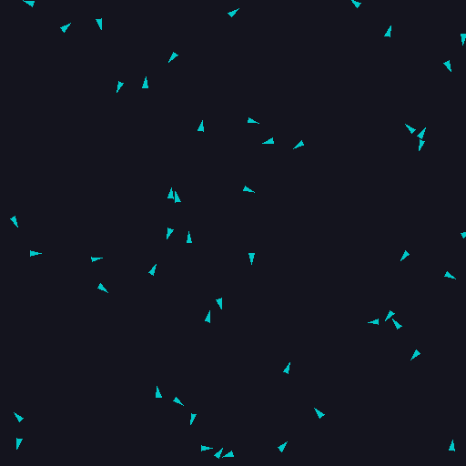
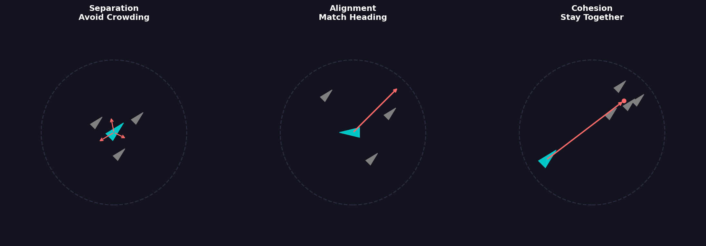
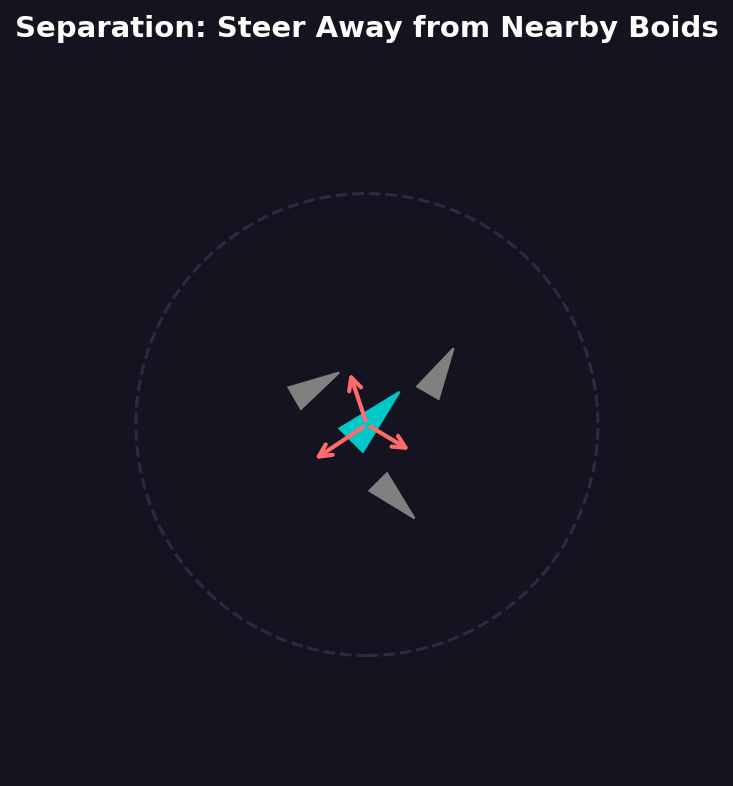
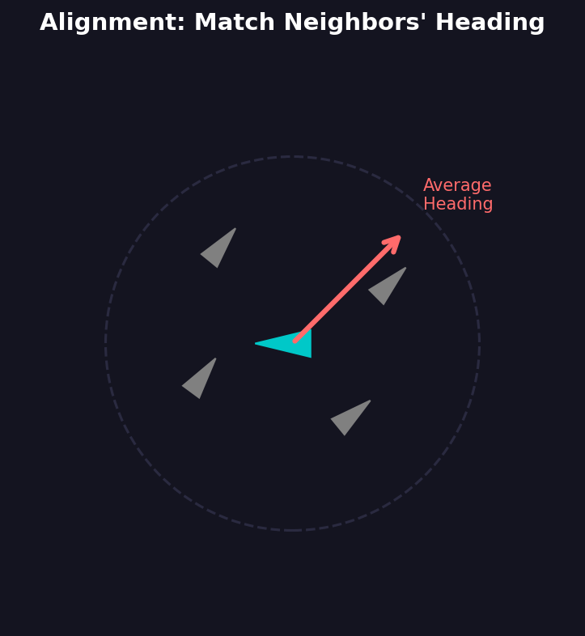
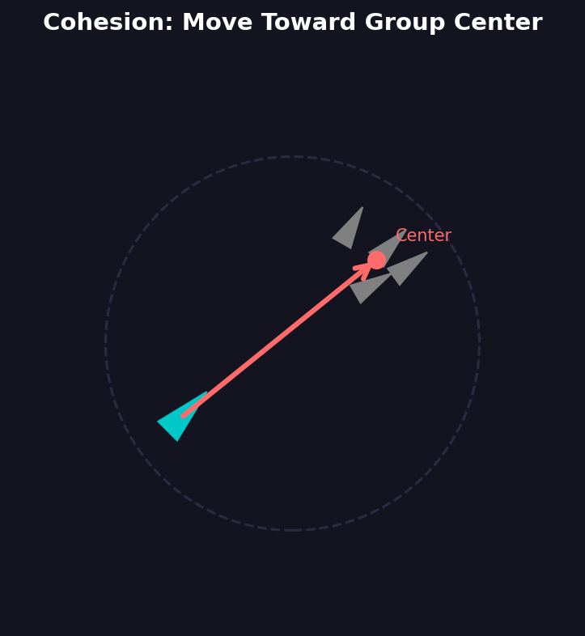

==========================================
5.2.1: Boids Flocking Simulation
==========================================

:Duration: 20-25 minutes
:Level: Intermediate

Overview
========

The boids algorithm, created by Craig Reynolds in 1987, demonstrates one of the most fascinating phenomena in computational systems: **emergent behavior**. Complex, lifelike patterns arise from just three simple rules.

In this exercise, you will implement a boids simulation that recreates the mesmerizing movement of bird flocks and fish schools. You will discover how local interactions between individuals produce global patterns that appear intelligent and coordinated.

   Boids simulation showing emergent flocking behavior from three simple rules

**Learning Objectives**

By completing this exercise, you will:

* Understand how emergent behavior arises from simple local rules
* Implement the three fundamental boids rules: separation, alignment, and cohesion
* Create animated visualizations using NumPy and Pillow
* Explore parameter tuning to achieve different collective behaviors

Quick Start: See the Flock in Action
====================================

Run this simulation to see boids forming natural-looking flocks:

.. code-block:: python
   :caption: Minimal boids simulation
   :linenos:

   import numpy as np
   from PIL import Image, ImageDraw
   import imageio

   # Create 30 boids with random positions and velocities
   positions = np.random.rand(30, 2) * 400
   velocities = (np.random.rand(30, 2) - 0.5) * 4

   frames = []
   for _ in range(150):
       # Create frame
       img = Image.new('RGB', (400, 400), (20, 20, 30))
       draw = ImageDraw.Draw(img)

       # Draw each boid as a small circle
       for x, y in positions:
           draw.ellipse([x-3, y-3, x+3, y+3], fill=(0, 200, 200))

       frames.append(np.array(img))

       # Simple update: move toward average position (cohesion only)
       center = positions.mean(axis=0)
       positions += (center - positions) * 0.01 + velocities * 0.5
       positions = positions % 400  # Wrap at edges

   imageio.mimsave('simple_flock.gif', frames, fps=20)

.. tip::

   This simplified example shows only the cohesion rule. The full boids algorithm combines three rules for realistic flocking behavior.

Core Concepts
=============

What Are Boids?
---------------

The term **boids**  refers to bird-like objects that follow simple behavioral rules. Craig Reynolds introduced this algorithm to create realistic animations of flocking birds for computer graphics [Reynolds1987]_.

The key insight of the boids algorithm is that complex group behavior does not require complex individual behavior. Each boid only needs to:

1. Know the positions and velocities of nearby neighbors
2. Apply three simple steering rules
3. Update its own position and velocity

From these local interactions, global patterns emerge naturally. No boid knows the overall flock shape or movement direction. The collective behavior is **self-organizing** [Camazine2001]_.

.. admonition:: Did You Know?

   Reynolds' boids paper, presented at SIGGRAPH 1987, has become a landmark of behavioral animation and Artificial Life research. The algorithm has since been used in countless films, video games, and scientific simulations, including Batman Returns (1992) and The Lion King (1994).

The Three Rules of Flocking
---------------------------

Every boid follows three steering behaviors that determine its acceleration at each time step:

   The three boids rules: Separation, Alignment, and Cohesion. Diagram generated with Claude - Opus 4.5.

**Rule 1: Separation**

Boids steer away from neighbors that are too close. This prevents collisions and overcrowding.

   Separation: Each boid steers away from neighbors within its personal space. Diagram generated with Claude - Opus 4.5.

.. code-block:: python
   :caption: Separation force calculation

   # For each nearby neighbor that's too close
   if distance < personal_space:
       # Create a force pointing away from the neighbor
       away_vector = my_position - neighbor_position
       separation_force += away_vector / distance  # Stronger when closer

**Rule 2: Alignment**

Boids match the velocity (direction and speed) of nearby neighbors. This creates coordinated movement.

   Alignment: Each boid steers to match the average heading of nearby neighbors. Diagram generated with Claude - Opus 4.5.

.. code-block:: python
   :caption: Alignment force calculation

   # Calculate average velocity of all neighbors
   average_velocity = sum(neighbor_velocities) / num_neighbors

   # Steer toward that average
   alignment_force = average_velocity - my_velocity

**Rule 3: Cohesion**

Boids steer toward the center of mass of nearby neighbors. This keeps the flock together.

   Cohesion: Each boid steers toward the average position of nearby neighbors. Diagram generated with Claude - Opus 4.5.

.. code-block:: python
   :caption: Cohesion force calculation

   # Calculate center of nearby neighbors
   center_of_mass = sum(neighbor_positions) / num_neighbors

   # Steer toward that center
   cohesion_force = center_of_mass - my_position

Implementation Strategy
-----------------------

The boids algorithm updates all agents simultaneously at each time step:

.. code-block:: text

   For each frame:
       1. For each boid, find all neighbors within perception radius
       2. Calculate separation, alignment, and cohesion forces
       3. Combine forces with adjustable weights
       4. Update velocity (apply acceleration, limit speed)
       5. Update position (move, wrap at edges)
       6. Render the frame

**Key Parameters**

The behavior of the flock depends on several tunable parameters:

.. list-table::
   :header-rows: 1
   :widths: 30 15 55

   * - Parameter
     - Typical Value
     - Effect
   * - ``perception_radius``
     - 50 pixels
     - How far each boid can "see" neighbors
   * - ``separation_weight``
     - 1.5
     - Strength of collision avoidance
   * - ``alignment_weight``
     - 1.0
     - Strength of velocity matching
   * - ``cohesion_weight``
     - 1.0
     - Strength of flock cohesion
   * - ``max_speed``
     - 4 pixels/frame
     - Maximum velocity magnitude

.. important::

   The balance between these weights dramatically affects flock behavior. High separation creates scattered, nervous flocks. High cohesion creates tight, ball-like groups. High alignment creates streams of parallel motion.

Real-World Applications
-----------------------

This algorithm demonstrates principles used throughout computational systems:

* **Robotics**: Swarm robots coordinate using similar local rules [Brambilla2013]_
* **Game AI**: Non-player characters use steering behaviors for natural movement [Reynolds1999]_
* **Biology**: Scientists model fish schools and bird flocks to understand animal behavior [Vicsek2012]_

Hands-On Exercises
==================

Exercise 1: Execute and Explore
-------------------------------

Run the full boids simulation and observe the emergent behavior.

:download:`Download boids.py <boids.py>`

**Tasks:**

1. Run ``boids.py`` in the exercise directory
2. Watch the generated ``boids_simulation.gif``
3. Observe how boids that start randomly gradually form organized groups

**Reflection Questions:**

.. dropdown:: Question 1: Why do the boids form groups?

   The boids form groups because of the **cohesion** rule. Each boid steers toward the average position of its neighbors, which pulls scattered boids together over time. Once groups form, the alignment rule keeps them moving in the same direction.

.. dropdown:: Question 2: What happens when two groups meet?

   When two groups come within each other's perception radius, they begin to influence each other. The cohesion rule pulls them together, and alignment causes them to match velocities. Groups often merge into larger flocks, or pass through each other if moving in different directions.

.. dropdown:: Question 3: Why do boids at the edge behave differently?

   Edge boids have neighbors on only one side, so cohesion pulls them inward. Interior boids are pulled equally from all sides and maintain their position within the flock. This creates a natural flock boundary without explicit boundary rules.

Exercise 2: Modify Rule Weights
-------------------------------

Explore how different parameter combinations change flock behavior.

**Tasks:**

Open ``boids.py`` and find the configuration section. Modify the weights and observe the results:

**Experiment 1: Separation Dominant**

.. code-block:: python

   SEPARATION_WEIGHT = 3.0
   ALIGNMENT_WEIGHT = 0.5
   COHESION_WEIGHT = 0.5

.. dropdown:: What to expect

   Boids maintain large distances from each other. The flock spreads out and becomes diffuse. Individual boids move more independently.

**Experiment 2: Alignment Dominant**

.. code-block:: python

   SEPARATION_WEIGHT = 0.5
   ALIGNMENT_WEIGHT = 3.0
   COHESION_WEIGHT = 0.5

.. dropdown:: What to expect

   Boids move in parallel streams or lanes. The flock elongates in the direction of movement. Groups may split but each subgroup maintains coordinated direction.

**Experiment 3: Cohesion Dominant**

.. code-block:: python

   SEPARATION_WEIGHT = 0.5
   ALIGNMENT_WEIGHT = 0.5
   COHESION_WEIGHT = 3.0

.. dropdown:: What to expect

   Boids cluster into tight, ball-like formations. The flock compresses and may oscillate as boids overshoot the center. Movement becomes more chaotic within groups.

Exercise 3: Add Obstacle Avoidance
----------------------------------

Extend the algorithm by adding a fourth rule: obstacle avoidance.

**Goal:**

Implement a function that makes boids steer away from a circular obstacle in the center of the canvas.

**Requirements:**

1. Boids within 1.5x the obstacle radius should steer away
2. The avoidance force should be stronger when closer to the obstacle
3. The force should point directly away from the obstacle center

**Starter Code:**

:download:`Download boids_starter.py <boids_starter.py>`

Open ``boids_starter.py`` and find the ``obstacle_avoidance`` function with TODO markers.

.. dropdown:: Hint 1: Distance Calculation

   Calculate distance from each boid to the obstacle center:

   .. code-block:: python

      obstacle_center = np.array([OBSTACLE_X, OBSTACLE_Y])
      direction = positions[i] - obstacle_center
      distance = np.sqrt(np.sum(direction ** 2))

.. dropdown:: Hint 2: Avoidance Force

   The avoidance force should point away from the obstacle and be stronger when closer:

   .. code-block:: python

      if distance < OBSTACLE_RADIUS * 1.5 and distance > 0:
          # Normalize direction and scale by inverse distance
          force = direction / distance  # Unit vector away
          strength = (OBSTACLE_RADIUS * 1.5 - distance) / distance
          steering[i] = force * strength

.. dropdown:: Complete Solution

   .. code-block:: python

      def obstacle_avoidance(positions):
          """Steer away from the central obstacle."""
          steering = np.zeros_like(positions)
          obstacle_center = np.array([OBSTACLE_X, OBSTACLE_Y])

          for i in range(len(positions)):
              direction = positions[i] - obstacle_center
              distance = np.sqrt(np.sum(direction ** 2))

              # Avoid if within 1.5x obstacle radius
              if distance < OBSTACLE_RADIUS * 1.5 and distance > 0:
                  # Force pointing away, stronger when closer
                  normalized = direction / distance
                  strength = (OBSTACLE_RADIUS * 1.5 - distance) / distance
                  steering[i] = normalized * strength

          return steering

.. figure:: boids_obstacle.gif
   :width: 500px
   :align: center
   :alt: Boids avoiding a circular obstacle in the center of the canvas

   Obstacle avoidance in action: Boids steer around the central obstacle (dark red circle) while maintaining flocking behavior.

**Challenge Extension:**

Add a **predator** that boids flee from. The predator moves slowly toward the nearest boid, while all boids within a large radius steer away from it.

.. figure:: boids_predator.gif
   :width: 500px
   :align: center
   :alt: Boids fleeing from a red predator that chases the nearest boid

   Boids with predator behavior: The red predator chases the nearest boid while all boids within the fear radius (shown as circle) flee in the opposite direction.

Summary
=======

**Key Takeaways**

* **Emergent behavior** arises when complex global patterns result from simple local rules
* The boids algorithm uses three rules: **separation** (avoid crowding), **alignment** (match heading), and **cohesion** (stay together)
* Each boid only needs information about nearby neighbors within its perception radius
* Parameter tuning (weights) dramatically affects collective behavior
* The algorithm is highly extensible with additional rules like obstacle avoidance

**Common Pitfalls**

* **Forgetting to limit forces**: Without maximum force limits, boids can accelerate wildly
* **Not handling edge cases**: When a boid has no neighbors, avoid division by zero
* **Ignoring edge wrapping**: Use modulo operations to wrap positions at canvas boundaries
* **Unbalanced weights**: Start with equal weights and adjust incrementally

References
==========

.. [Reynolds1987] Reynolds, C. W. (1987). Flocks, herds and schools: A distributed behavioral model. *ACM SIGGRAPH Computer Graphics*, 21(4), 25-34. https://doi.org/10.1145/37402.37406 [Original boids paper that introduced the algorithm]

.. [Reynolds1999] Reynolds, C. W. (1999). Steering behaviors for autonomous characters. In *Proceedings of Game Developers Conference 1999* (pp. 763-782). https://www.red3d.com/cwr/steer/ [Practical implementation guide for games]

.. [Camazine2001] Camazine, S., Deneubourg, J. L., Franks, N. R., Sneyd, J., Theraulaz, G., & Bonabeau, E. (2001). *Self-Organization in Biological Systems*. Princeton University Press. [Comprehensive theory of biological self-organization]

.. [Vicsek2012] Vicsek, T., & Zafeiris, A. (2012). Collective motion. *Physics Reports*, 517(3-4), 71-140. https://doi.org/10.1016/j.physrep.2012.03.004 [Physics perspective on collective motion]

.. [Brambilla2013] Brambilla, M., Ferrante, E., Birattari, M., & Dorigo, M. (2013). Swarm robotics: A review from the swarm engineering perspective. *Swarm Intelligence*, 7(1), 1-41. https://doi.org/10.1007/s11721-012-0075-2 [Applications in robotics]

.. [Shiffman2012] Shiffman, D. (2012). *The Nature of Code*. Self-published. https://natureofcode.com/ [Excellent pedagogical resource for creative coding and simulation]

.. [NumPy2024] NumPy Developers. (2024). NumPy documentation: Broadcasting. https://numpy.org/doc/stable/user/basics.broadcasting.html [Technical reference for vectorized operations]
