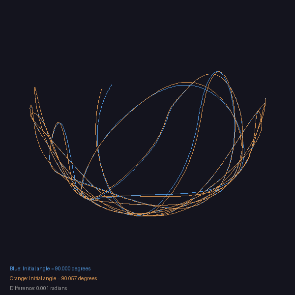

.. _module-5-3-3-double-pendulum:

===================================
5.3.3 Double Pendulum Chaos
===================================

:Duration: 25 minutes
:Level: Intermediate

Overview
========

The double pendulum is one of the simplest physical systems that exhibits *chaotic behavior*. While a single pendulum swings predictably back and forth, adding just one more segment creates a system whose motion becomes wildly unpredictable over time. This exercise explores how deterministic physics can produce seemingly random results, a phenomenon known as deterministic chaos.

Chaos theory emerged in the 1960s when meteorologist Edward Lorenz discovered that tiny differences in initial conditions could lead to completely different weather outcomes [Lorenz1963]_. The double pendulum provides an accessible demonstration of this principle: two pendulums started with angles differing by less than a tenth of a degree will eventually follow completely different paths.

In this exercise, you will simulate the double pendulum using numerical integration, visualize its chaotic motion, and explore how sensitive the system is to initial conditions. The mathematical techniques you learn here apply to many other chaotic systems, from weather prediction to orbital mechanics.

Learning Objectives
-------------------

By the end of this exercise, you will be able to:

* Understand the physics of coupled pendulum systems and how coupling creates complex behavior
* Implement numerical integration using the Runge-Kutta 4th order (RK4) method
* Visualize chaotic behavior and demonstrate sensitivity to initial conditions
* Create animated simulations of complex dynamical systems using NumPy and PIL

Quick Start: See It In Action
=============================

Run the double pendulum simulation to see chaos in action:

.. code-block:: python

   python double_pendulum.py

This generates three output files:

* ``double_pendulum.gif``: Animation showing the pendulum's chaotic motion
* ``double_pendulum_frame.png``: A single frame showing the trajectory
* ``chaos_comparison.png``: Two pendulums with slightly different starting positions

.. figure:: double_pendulum.gif
   :width: 500px
   :align: center
   :alt: Animation of a double pendulum showing chaotic swinging motion with a trailing path

   The double pendulum traces an unpredictable path through space. Notice how the second bob (blue) moves erratically even though the physics are completely deterministic.

.. tip::

   Watch the second pendulum bob carefully. Despite following the same physical laws throughout, its behavior appears random and never exactly repeats.

Core Concepts
=============

Double Pendulum Physics
-----------------------

A double pendulum consists of two pendulum segments connected end-to-end. The first pendulum hangs from a fixed pivot point, and the second pendulum hangs from the end of the first. Each segment has a length (L1 and L2), a mass (m1 and m2), and an angle from vertical (theta1 and theta2).

The motion of each pendulum affects the other. When the first pendulum swings, it drags the second with it. When the second pendulum swings, its momentum pulls on the first. This *coupling* between the pendulums is what creates the complex, chaotic behavior.

   Two double pendulums started with initial angles differing by only 0.001 radians (about 0.06 degrees). After 15 seconds, their paths have diverged completely. This demonstrates the hallmark of chaos: extreme sensitivity to initial conditions. Diagram generated with Claude - Opus 4.5.

The equations of motion for a double pendulum come from Lagrangian mechanics [Goldstein2002]_. While the full derivation involves calculus of variations, the key insight is that angular acceleration of each pendulum depends on:

* The current angles (theta1 and theta2)
* The current angular velocities (omega1 and omega2)
* The physical constants (lengths, masses, gravity)

.. code-block:: python

   def compute_accelerations(theta1, omega1, theta2, omega2):
       """
       Calculate angular accelerations from current state.
       The coupling shows in how each acceleration depends on BOTH angles.
       """
       delta_theta = theta1 - theta2

       # Common denominator showing the coupling
       denominator = 2 * m1 + m2 - m2 * np.cos(2 * delta_theta)

       # Angular acceleration of first pendulum
       alpha1 = (-g * (2 * m1 + m2) * np.sin(theta1)
                 - m2 * g * np.sin(theta1 - 2 * theta2)
                 - 2 * np.sin(delta_theta) * m2
                 * (omega2**2 * L2 + omega1**2 * L1 * np.cos(delta_theta))
                 ) / (L1 * denominator)

       # Angular acceleration of second pendulum
       alpha2 = (2 * np.sin(delta_theta)
                 * (omega1**2 * L1 * (m1 + m2)
                    + g * (m1 + m2) * np.cos(theta1)
                    + omega2**2 * L2 * m2 * np.cos(delta_theta))
                 ) / (L2 * denominator)

       return alpha1, alpha2

.. important::

   The equations look complicated, but the key point is simple: **each acceleration depends on both angles**. This coupling is what makes the system chaotic. Without it, you would have two independent pendulums swinging predictably.

Chaos and Sensitivity to Initial Conditions
-------------------------------------------

What does it mean for a system to be *chaotic*? Chaos does not mean randomness. The double pendulum follows deterministic physical laws with no randomness involved. Given exact initial conditions, the motion is completely determined.

Chaos means something more subtle: *extreme sensitivity to initial conditions*. Two systems starting with nearly identical states will eventually diverge exponentially. This is often called the "butterfly effect" after Lorenz's famous observation that a butterfly flapping its wings could theoretically influence weather patterns weeks later [Lorenz1963]_.

For the double pendulum, even the tiniest difference in starting angle, perhaps the width of a single atom, will eventually lead to completely different motion. This makes long-term prediction impossible in practice, even though the physics are perfectly deterministic.

.. admonition:: Did You Know?

   The rate at which nearby trajectories diverge is measured by the *Lyapunov exponent*. Positive Lyapunov exponents indicate chaos. The double pendulum has been experimentally measured to have positive Lyapunov exponents, confirming its chaotic nature [Shinbrot1992]_.

.. code-block:: python

   # Demonstrate sensitivity: tiny change, huge difference
   epsilon = 0.001  # Just 0.001 radians (0.06 degrees)

   # First simulation
   x1a, y1a, x2a, y2a = run_simulation(theta1=np.pi/2, ...)

   # Second simulation with epsilon difference
   x1b, y1b, x2b, y2b = run_simulation(theta1=np.pi/2 + epsilon, ...)

   # After enough time, the trajectories look completely different!

Numerical Integration with RK4
------------------------------

Because the double pendulum equations cannot be solved analytically, we must use *numerical integration* to simulate the motion. The basic idea is to take small time steps, computing the state at each step based on the previous state.

The simplest approach is Euler's method: ``new_state = old_state + derivative * dt``. However, this accumulates errors quickly and is unsuitable for chaotic systems where small errors grow exponentially.

The Runge-Kutta 4th order method (RK4) is far more accurate [Press2007]_. Instead of sampling the derivative once per step, RK4 samples it four times and combines them with carefully chosen weights:

.. code-block:: python

   def rk4_step(theta1, omega1, theta2, omega2, dt):
       """
       One step of Runge-Kutta 4th order integration.
       More accurate than Euler because it samples the
       derivative at multiple points within each time step.
       """
       def derivatives(th1, w1, th2, w2):
           a1, a2 = compute_accelerations(th1, w1, th2, w2)
           return w1, a1, w2, a2

       # Four derivative evaluations at different points
       k1 = derivatives(theta1, omega1, theta2, omega2)

       k2 = derivatives(theta1 + k1[0]*dt/2, omega1 + k1[1]*dt/2,
                        theta2 + k1[2]*dt/2, omega2 + k1[3]*dt/2)

       k3 = derivatives(theta1 + k2[0]*dt/2, omega1 + k2[1]*dt/2,
                        theta2 + k2[2]*dt/2, omega2 + k2[3]*dt/2)

       k4 = derivatives(theta1 + k3[0]*dt, omega1 + k3[1]*dt,
                        theta2 + k3[2]*dt, omega2 + k3[3]*dt)

       # Weighted average of all four derivatives
       theta1_new = theta1 + (k1[0] + 2*k2[0] + 2*k3[0] + k4[0]) * dt / 6
       omega1_new = omega1 + (k1[1] + 2*k2[1] + 2*k3[1] + k4[1]) * dt / 6
       theta2_new = theta2 + (k1[2] + 2*k2[2] + 2*k3[2] + k4[2]) * dt / 6
       omega2_new = omega2 + (k1[3] + 2*k2[3] + 2*k3[3] + k4[3]) * dt / 6

       return theta1_new, omega1_new, theta2_new, omega2_new

.. note::

   RK4 is accurate enough for most purposes, but for very long simulations of chaotic systems, even RK4 will eventually diverge from the "true" trajectory due to accumulated floating-point errors. This is another manifestation of chaos: numerical errors behave like tiny perturbations to initial conditions.

Hands-On Exercises
==================

Exercise 1: Execute and Explore
-------------------------------

Run the provided simulation and observe the chaotic behavior.

.. code-block:: python

   # Navigate to the exercise directory and run:
   python double_pendulum.py

This script contains the complete implementation. Study the code and then answer the reflection questions below.

**Download the Scripts**

:download:`double_pendulum.py <double_pendulum.py>` - Complete implementation

:download:`double_pendulum_starter.py <double_pendulum_starter.py>` - Starter template for Exercise 3

**Reflection Questions**

1. Watch the animation several times. Does the motion ever exactly repeat? Why or why not?

2. Look at the ``chaos_comparison.png`` image. The two trajectories started with angles differing by only 0.001 radians. At what point do they begin to noticeably diverge?

3. In the equations of motion, what terms show that the two pendulums are coupled (each affects the other)?

4. Why do you think chaos makes long-term weather prediction so difficult?

.. dropdown:: Reflection Solutions
   :class-title: sd-font-weight-bold

   **Question 1**: The motion never exactly repeats because the system is chaotic. While it may come close to previous configurations, tiny differences will be amplified over time, leading to different subsequent behavior. This is called non-periodicity.

   **Question 2**: In the provided simulation, the trajectories typically begin to visibly diverge after about 3-5 seconds. The divergence grows exponentially, so by 15 seconds they are completely different.

   **Question 3**: The coupling appears in the ``denominator`` term which contains ``cos(2 * delta_theta)``, and in the acceleration equations where terms like ``omega2**2 * L2`` appear in alpha1 and ``omega1**2 * L1`` appears in alpha2.

   **Question 4**: Weather is governed by nonlinear equations similar to the double pendulum. Small measurement errors in current conditions grow exponentially, making forecasts unreliable beyond about 10-14 days.

Exercise 2: Modify Parameters
-----------------------------

Experiment with different physical parameters to see how they affect the chaotic motion.

**Goal 1**: Change the initial angles

Modify the initial conditions at the top of the script:

.. code-block:: python

   # Try different starting positions
   theta1_init = np.pi / 4      # 45 degrees instead of 90
   theta2_init = np.pi          # 180 degrees (pointing down)

**Goal 2**: Modify the pendulum lengths

Make the pendulums have different lengths:

.. code-block:: python

   L1 = 1.5        # Longer first pendulum
   L2 = 0.5        # Shorter second pendulum

**Goal 3**: Adjust the masses

Change the mass ratio between the two bobs:

.. code-block:: python

   m1 = 2.0        # Heavier first mass
   m2 = 0.5        # Lighter second mass

.. dropdown:: Solutions
   :class-title: sd-font-weight-bold

   **Goal 1 Solution**:

   .. code-block:: python

      theta1_init = np.pi / 4      # 45 degrees
      theta2_init = np.pi          # 180 degrees

   With theta2 starting at pi, the second pendulum initially points straight down. This is unstable and it will quickly swing around, creating dramatic motion.

   **Goal 2 Solution**:

   .. code-block:: python

      L1 = 1.5        # 1.5 meters
      L2 = 0.5        # 0.5 meters

   The shorter second pendulum oscillates much faster. The trajectory pattern becomes more compact since the second bob cannot reach as far.

   **Goal 3 Solution**:

   .. code-block:: python

      m1 = 2.0        # 2 kg
      m2 = 0.5        # 0.5 kg

   With a heavier first mass, the second pendulum has less influence on the first. The first pendulum swings more smoothly while the second bob moves erratically.

Exercise 3: Create Your Own Variation
-------------------------------------

Build on the concepts by implementing your own version or extending the simulation.

**Challenge Option A**: Implement the physics yourself

Use the starter code to implement the equations of motion and RK4 integration from scratch:

.. code-block:: python

   python double_pendulum_starter.py

The starter code provides the simulation loop and visualization. Your task is to implement:

1. ``compute_accelerations()``: The physics equations
2. ``rk4_step()``: The numerical integration

**Challenge Option B**: Add damping (friction)

Real pendulums lose energy due to friction. Modify the simulation to include damping:

.. code-block:: python

   # Add a damping coefficient
   damping = 0.05  # Energy loss rate

   # In compute_accelerations, add damping terms:
   alpha1 = alpha1 - damping * omega1
   alpha2 = alpha2 - damping * omega2

Observe how the pendulum gradually loses energy and eventually comes to rest.

**Challenge Option C**: Triple pendulum

Add a third pendulum segment! This requires:

* New parameters: L3, m3, theta3_init, omega3_init
* Extended equations of motion (more complex coupling)
* Updated visualization to draw three segments

.. dropdown:: Hints for Challenge A
   :class-title: sd-font-weight-bold

   The equations of motion follow this pattern:

   1. Calculate ``delta_theta = theta1 - theta2``
   2. Calculate the denominator: ``2*m1 + m2 - m2*cos(2*delta_theta)``
   3. Build the numerators using the formulas from the Core Concepts section
   4. Divide to get angular accelerations

   For RK4, remember the pattern:
   * k1 uses current state
   * k2 uses state + k1*dt/2
   * k3 uses state + k2*dt/2
   * k4 uses state + k3*dt
   * Final update uses (k1 + 2*k2 + 2*k3 + k4)/6 * dt

.. dropdown:: Complete Solution for Challenge B (Damping)
   :class-title: sd-font-weight-bold

   Add this modification to the ``compute_accelerations`` function:

   .. code-block:: python

      # Damping coefficient (adjust to see different effects)
      damping = 0.1

      def compute_accelerations(theta1, omega1, theta2, omega2):
          """Compute accelerations with damping."""
          delta_theta = theta1 - theta2
          denominator = 2 * m1 + m2 - m2 * np.cos(2 * delta_theta)

          # Original acceleration calculations...
          numerator1 = (-g * (2 * m1 + m2) * np.sin(theta1)
                        - m2 * g * np.sin(theta1 - 2 * theta2)
                        - 2 * np.sin(delta_theta) * m2
                        * (omega2**2 * L2 + omega1**2 * L1 * np.cos(delta_theta)))
          alpha1 = numerator1 / (L1 * denominator)

          numerator2 = (2 * np.sin(delta_theta)
                        * (omega1**2 * L1 * (m1 + m2)
                           + g * (m1 + m2) * np.cos(theta1)
                           + omega2**2 * L2 * m2 * np.cos(delta_theta)))
          alpha2 = numerator2 / (L2 * denominator)

          # Add damping: opposes motion, proportional to velocity
          alpha1 = alpha1 - damping * omega1
          alpha2 = alpha2 - damping * omega2

          return alpha1, alpha2

   **Explanation**:

   * The damping term ``-damping * omega`` creates a force opposing the current motion
   * Higher damping values cause faster energy loss
   * With damping = 0.1, the pendulum typically settles within 30-60 seconds
   * The chaotic behavior is still present but energy gradually decreases

Summary
=======

Key Takeaways
-------------

* **Chaos is deterministic unpredictability**: The double pendulum follows precise physical laws, yet its long-term behavior is unpredictable due to extreme sensitivity to initial conditions.

* **Coupling creates complexity**: The interaction between the two pendulum segments transforms a simple system into a complex one. Each segment influences the other.

* **Numerical integration is essential**: Since chaotic systems cannot be solved analytically, we must use numerical methods like RK4 to simulate their behavior.

* **Visualization reveals patterns**: While individual trajectories are unpredictable, visualizing many trajectories or trajectory trails reveals the underlying structure of chaotic systems.

Common Pitfalls to Avoid
------------------------

* **Using Euler integration**: Simple Euler integration is too inaccurate for chaotic systems. The errors grow exponentially and quickly dominate the solution. Always use RK4 or better.

* **Expecting exact reproducibility**: Due to floating-point arithmetic, running the same simulation on different computers may produce different results after enough time. This is not a bug but a manifestation of chaos.

* **Confusing chaos with randomness**: Chaos is not random. Given exact initial conditions and infinite precision, the motion is completely determined. The unpredictability comes from our inability to measure initial conditions perfectly.

Connection to Future Learning
-----------------------------

The concepts in this exercise appear throughout physics and computer science:

* **Weather and climate modeling** uses similar numerical integration for atmospheric equations
* **N-body gravitational simulations** (Module 5.3.2) face similar challenges with chaotic orbits
* **Neural networks** can exhibit chaotic dynamics during training
* **Generative art** often uses chaotic systems to create organic, unpredictable patterns

References
==========

.. [Lorenz1963] Lorenz, E. N. (1963). Deterministic nonperiodic flow. *Journal of the Atmospheric Sciences*, 20(2), 130-141. https://doi.org/10.1175/1520-0469(1963)020<0130:DNF>2.0.CO;2

.. [Goldstein2002] Goldstein, H., Poole, C. P., & Safko, J. L. (2002). *Classical Mechanics* (3rd ed.). Addison Wesley. ISBN: 978-0201657029

.. [Strogatz2014] Strogatz, S. H. (2014). *Nonlinear Dynamics and Chaos: With Applications to Physics, Biology, Chemistry, and Engineering* (2nd ed.). Westview Press. ISBN: 978-0813349107

.. [Shinbrot1992] Shinbrot, T., Grebogi, C., Wisdom, J., & Yorke, J. A. (1992). Chaos in a double pendulum. *American Journal of Physics*, 60(6), 491-499. https://doi.org/10.1119/1.16860

.. [Press2007] Press, W. H., Teukolsky, S. A., Vetterling, W. T., & Flannery, B. P. (2007). *Numerical Recipes: The Art of Scientific Computing* (3rd ed.). Cambridge University Press. ISBN: 978-0521880688

.. [Hairer1993] Hairer, E., Norsett, S. P., & Wanner, G. (1993). *Solving Ordinary Differential Equations I: Nonstiff Problems* (2nd ed.). Springer-Verlag. ISBN: 978-3540566700

.. [Levien1993] Levien, R. B., & Tan, S. M. (1993). Double pendulum: An experiment in chaos. *American Journal of Physics*, 61(11), 1038-1044. https://doi.org/10.1119/1.17335

.. [NumPyDocs] Harris, C. R., et al. (2020). Array programming with NumPy. *Nature*, 585(7825), 357-362. https://doi.org/10.1038/s41586-020-2649-2

.. [PILDocs] Clark, A., et al. (2024). *Pillow (PIL Fork) Documentation*. Retrieved from https://pillow.readthedocs.io/

.. [Sweller2011] Sweller, J. (2011). Cognitive load theory. In J. Mestre & B. Ross (Eds.), *The Psychology of Learning and Motivation* (Vol. 55, pp. 37-76). Academic Press. https://doi.org/10.1016/B978-0-12-387691-1.00002-8
