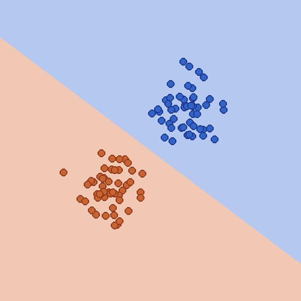
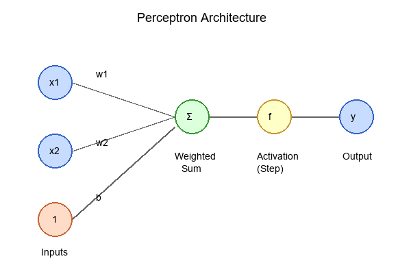
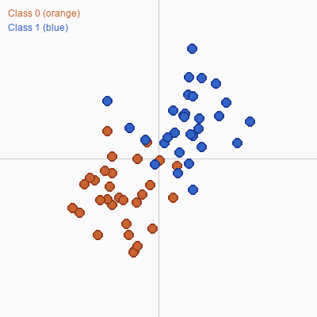
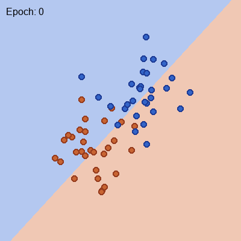
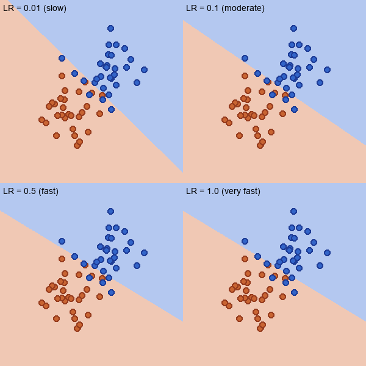

.. _module-9-1-1-perceptron-scratch:

================================
9.1.1 Perceptron from Scratch
================================

:Duration: 35-40 minutes
:Level: Intermediate

Overview
========

The perceptron is the simplest neural network, yet it contains all the fundamental concepts that power modern deep learning. In this exercise, you will build a working perceptron classifier using only NumPy, learning how neural networks learn from data by adjusting weights to minimize errors.

Frank Rosenblatt introduced the perceptron in 1958 as a computational model inspired by biological neurons [Rosenblatt1958]_. Despite its simplicity, the perceptron sparked the field of artificial intelligence and remains the foundation for understanding more complex neural networks. By implementing one from scratch, you will develop intuition for how neural networks learn that no amount of reading about pre-built frameworks can provide.

Learning Objectives
-------------------

By the end of this exercise, you will be able to:

* Understand perceptron architecture with inputs, weights, bias, and activation
* Implement the forward pass to compute predictions from inputs
* Apply the perceptron learning rule to update weights based on errors
* Visualize decision boundaries learned by the perceptron

Quick Start: See It In Action
=============================

Run this code to train a perceptron and visualize its learned decision boundary:

.. code-block:: python
   :caption: Train a perceptron classifier
   :linenos:

   import numpy as np

   np.random.seed(42)

   class Perceptron:
       def __init__(self, input_size, learning_rate=0.1):
           self.weights = np.random.randn(input_size) * 0.01
           self.bias = 0.0
           self.learning_rate = learning_rate

       def forward(self, x):
           weighted_sum = np.dot(self.weights, x) + self.bias
           return 1 if weighted_sum >= 0 else 0

       def train(self, X, y, epochs=100):
           for epoch in range(epochs):
               for i in range(len(X)):
                   y_pred = self.forward(X[i])
                   error = y[i] - y_pred
                   if error != 0:
                       self.weights += self.learning_rate * error * X[i]
                       self.bias += self.learning_rate * error

   # Generate linearly separable data
   class_0 = np.random.randn(50, 2) * 0.5 + [-1, -1]
   class_1 = np.random.randn(50, 2) * 0.5 + [1, 1]
   X = np.vstack([class_0, class_1])
   y = np.array([0] * 50 + [1] * 50)

   # Train the perceptron
   perceptron = Perceptron(input_size=2)
   perceptron.train(X, y, epochs=100)
   print(f"Learned weights: {perceptron.weights}")

   The trained perceptron divides the feature space into two regions. Orange points (Class 0) cluster in the lower-left, while blue points (Class 1) cluster in the upper-right. The decision boundary is where the perceptron transitions from predicting 0 to predicting 1.

The perceptron learns by adjusting its weights whenever it makes an error. After training, the weights define a linear boundary that separates the two classes. This simple learning rule is remarkably powerful for linearly separable data.

Core Concepts
=============

Concept 1: What is a Perceptron?
--------------------------------

A **perceptron** is the simplest possible neural network, consisting of just one artificial neuron. It was inspired by biological neurons in the brain, which receive signals from other neurons, combine them, and produce an output signal [McCulloch1943]_.

The perceptron takes multiple numerical inputs, multiplies each by a corresponding weight, adds them together with a bias term, and applies an activation function to produce a binary output (0 or 1). Mathematically:

.. code-block:: text

   output = step(w1*x1 + w2*x2 + ... + wn*xn + b)

Where:

* **x1, x2, ..., xn** are the input features
* **w1, w2, ..., wn** are the weights (learned from data)
* **b** is the bias term (also learned)
* **step(z)** is the step function: returns 1 if z >= 0, else 0

   The perceptron architecture. Inputs are multiplied by weights, summed with a bias, then passed through a step activation function to produce binary output.

The weights determine how much each input contributes to the output. A large positive weight means that input strongly influences the output toward 1, while a large negative weight pushes it toward 0. The bias acts like a threshold, shifting when the perceptron fires.

.. admonition:: Did You Know?

   In 1969, Minsky and Papert proved that a single perceptron cannot learn the XOR function [Minsky1969]_. This limitation contributed to the first "AI winter" when funding for neural network research dried up. It took multi-layer networks (with hidden layers) to overcome this limitation, but those required new training algorithms like backpropagation.

Concept 2: The Forward Pass
---------------------------

The **forward pass** is how the perceptron makes predictions. Given an input, it computes the weighted sum of inputs plus bias, then applies the step activation function to produce output.

.. code-block:: python
   :caption: Forward pass implementation
   :linenos:
   :emphasize-lines: 6,9

   def forward(self, x):
       """
       Compute the perceptron output for input x.
       """
       # Step 1: Compute weighted sum (dot product + bias)
       weighted_sum = np.dot(self.weights, x) + self.bias

       # Step 2: Apply step activation function
       if weighted_sum >= 0:
           return 1
       else:
           return 0

**Line 6** computes the weighted sum using NumPy's dot product. This is the linear combination of inputs and weights: w1*x1 + w2*x2 + ... + b.

**Line 9** applies the step function. If the weighted sum is non-negative, the perceptron outputs 1 (predicts Class 1). Otherwise, it outputs 0 (predicts Class 0).

The forward pass is essentially drawing a line through the feature space. Points on one side of the line are Class 0; points on the other side are Class 1. The weights determine the slope of this line, and the bias determines where it crosses.

   Linearly separable data. The perceptron can learn to separate these two clusters with a straight line (decision boundary).

Concept 3: Learning from Errors
-------------------------------

The perceptron learns through the **perceptron learning rule**, one of the earliest machine learning algorithms [Rosenblatt1958]_. The key insight is simple: if the prediction is wrong, adjust the weights to make it less wrong next time.

.. code-block:: python
   :caption: Perceptron learning rule
   :linenos:
   :emphasize-lines: 10,11

   def train(self, X, y, epochs=100):
       for epoch in range(epochs):
           for i in range(len(X)):
               # Make prediction
               y_pred = self.forward(X[i])

               # Calculate error
               error = y[i] - y_pred  # +1, 0, or -1

               # Update if wrong
               if error != 0:
                   self.weights = self.weights + self.learning_rate * error * X[i]
                   self.bias = self.bias + self.learning_rate * error

The learning rule states:

* **If prediction is correct** (error = 0): do nothing
* **If predicted 0 but should be 1** (error = +1): increase weights in direction of input
* **If predicted 1 but should be 0** (error = -1): decrease weights in direction of input

The **learning rate** controls how much the weights change on each update. A larger learning rate means bigger steps (faster learning but potentially unstable), while a smaller rate means smaller, more cautious updates.

   Watch the decision boundary evolve during training. Initially random, it gradually rotates to separate the two classes correctly.

**Convergence Theorem**: If the data is linearly separable, the perceptron learning rule is guaranteed to find a separating boundary in a finite number of steps [Haykin2009]_. This result, formally proven by Albert Novikoff in 1962, was one of the first convergence proofs in machine learning.

Hands-On Exercises
==================

Exercise 1: Execute and Explore
-------------------------------

Download and run the perceptron implementation to observe its behavior.

:download:`Download simple_perceptron.py <simple_perceptron.py>`

After running the code, answer these reflection questions:

1. How many epochs did it take to converge (reach zero errors)?
2. What do the final weights and bias represent geometrically?
3. If you run the training again with a different random seed, do you get the same weights?

.. dropdown:: Answers and Explanation
   :class-title: sd-font-weight-bold

   1. **Epochs to converge**: With seed 42 and this data, the perceptron typically converges in 1-3 epochs. The data is well-separated, making it an easy classification problem.

   2. **Geometric interpretation**: The weights [w1, w2] define the normal vector to the decision boundary line. The equation w1*x1 + w2*x2 + b = 0 describes a line in 2D space. Points where this sum is positive are Class 1; points where it is negative are Class 0.

   3. **Different runs**: With different random seeds (for weight initialization), you will get different final weights. There are infinitely many valid decision boundaries for linearly separable data. The perceptron finds one that works, but not necessarily the same one each time.

Exercise 2: Modify Parameters
-----------------------------

Experiment with the learning rate to understand its effect on training.

**Goal 1**: Test different learning rates

.. code-block:: python
   :caption: Try different learning rates

   # Very slow learning
   p1 = Perceptron(input_size=2, learning_rate=0.01)
   h1 = p1.train(X, y, epochs=50)
   print(f"LR=0.01: {len(h1)} epochs, errors={h1}")

   # Moderate learning
   p2 = Perceptron(input_size=2, learning_rate=0.1)
   h2 = p2.train(X, y, epochs=50)
   print(f"LR=0.1: {len(h2)} epochs")

   # Fast learning
   p3 = Perceptron(input_size=2, learning_rate=1.0)
   h3 = p3.train(X, y, epochs=50)
   print(f"LR=1.0: {len(h3)} epochs")

   Comparison of decision boundaries learned with different learning rates. All eventually converge for linearly separable data, but the number of epochs varies.

**Goal 2**: Modify the data distribution

Try changing the cluster centers to make the problem harder:

.. code-block:: python
   :caption: Closer clusters (harder problem)

   # Closer clusters - harder to separate
   class_0 = np.random.randn(50, 2) * 0.5 + [-0.5, -0.5]
   class_1 = np.random.randn(50, 2) * 0.5 + [0.5, 0.5]

Observe how the number of training epochs changes when the clusters are closer together.

.. dropdown:: Hints and Solutions
   :class-title: sd-font-weight-bold

   **Observations**:

   * **Small learning rate (0.01)**: More epochs needed, but stable convergence
   * **Moderate learning rate (0.1)**: Good balance of speed and stability
   * **Large learning rate (1.0)**: Fewer epochs but can overshoot (not visible for this simple problem)
   * **Closer clusters**: More epochs needed because data points are closer to the boundary

Exercise 3: Create Your Own
---------------------------

Complete the starter code to implement your own perceptron from scratch.

:download:`Download perceptron_starter.py <perceptron_starter.py>`

**Your tasks**:

1. Complete ``__init__`` to initialize weights, bias, and learning rate
2. Complete ``forward`` to compute predictions using the step function
3. Complete ``train`` to update weights using the perceptron learning rule

.. dropdown:: Hint 1: Initialization
   :class-title: sd-font-weight-bold

   For ``__init__``:

   .. code-block:: python

      self.weights = np.random.randn(input_size) * 0.01
      self.bias = 0.0
      self.learning_rate = learning_rate

.. dropdown:: Hint 2: Forward Pass
   :class-title: sd-font-weight-bold

   For ``forward``:

   .. code-block:: python

      weighted_sum = np.dot(self.weights, x) + self.bias
      if weighted_sum >= 0:
          return 1
      else:
          return 0

.. dropdown:: Hint 3: Training Loop
   :class-title: sd-font-weight-bold

   For ``train``:

   .. code-block:: python

      y_pred = self.forward(X[i])
      error = y[i] - y_pred
      if error != 0:
          self.weights = self.weights + self.learning_rate * error * X[i]
          self.bias = self.bias + self.learning_rate * error
          errors += 1

.. dropdown:: Complete Solution
   :class-title: sd-font-weight-bold

   :download:`Download perceptron_solution.py <perceptron_solution.py>`

   .. code-block:: python
      :linenos:

      import numpy as np

      class Perceptron:
          def __init__(self, input_size, learning_rate=0.1):
              self.weights = np.random.randn(input_size) * 0.01
              self.bias = 0.0
              self.learning_rate = learning_rate

          def forward(self, x):
              weighted_sum = np.dot(self.weights, x) + self.bias
              return 1 if weighted_sum >= 0 else 0

          def train(self, X, y, epochs=100):
              for epoch in range(epochs):
                  errors = 0
                  for i in range(len(X)):
                      y_pred = self.forward(X[i])
                      error = y[i] - y_pred
                      if error != 0:
                          self.weights += self.learning_rate * error * X[i]
                          self.bias += self.learning_rate * error
                          errors += 1
                  if errors == 0:
                      print(f"Converged in {epoch + 1} epochs")
                      return
              print(f"Training completed after {epochs} epochs")

Creative Challenge: Geometric Art with Perceptrons
--------------------------------------------------

Now that you understand how perceptrons create decision boundaries, use multiple perceptrons to create abstract geometric art. Each perceptron divides the canvas with a linear boundary, and combining several creates Mondrian-like compositions.

   Geometric art generated by 4 perceptrons. Each perceptron creates a linear boundary, resulting in 2^4 = 16 distinct regions with unique colors.

**Your Goal**: Create this image using multiple perceptrons. Try to figure it out yourself before looking at the hints.

.. dropdown:: Hint 1: The Core Idea
   :class-title: sd-font-weight-bold

   Each perceptron outputs 0 or 1 for any point. With 4 perceptrons, each pixel
   gets a 4-bit "signature" (0000 to 1111), creating 16 unique regions. Each
   region gets a different color.

.. dropdown:: Hint 2: Getting Started
   :class-title: sd-font-weight-bold

   1. Create a simple Perceptron class with random weights (no training needed)
   2. Create 4 perceptrons: ``perceptrons = [Perceptron(2) for _ in range(4)]``
   3. For each pixel, compute its signature by calling ``forward()`` on each perceptron

.. dropdown:: Hint 3: Computing the Signature
   :class-title: sd-font-weight-bold

   .. code-block:: python

      # For each pixel at (x, y), normalize to range (-2, 2)
      point = np.array([(x - 200) / 100, (y - 200) / 100])

      # Compute binary signature: sum of 2^i * perceptron_i(point)
      signature = sum(p.forward(point) * (2 ** i)
                      for i, p in enumerate(perceptrons))

.. dropdown:: Hint 4: Assigning Colors
   :class-title: sd-font-weight-bold

   Create a color palette with 16 colors (one per region):

   .. code-block:: python

      colors = [[80 + 140 * ((i * 23 % 16) % 4) // 3,
                 80 + 140 * (((i * 23 % 16) // 2) % 4) // 3,
                 80 + 140 * (((i * 23 % 16) // 4) % 4) // 3]
                for i in range(16)]

:download:`Download Solution <geometric_art_solution.py>`

**Experiments to try**:

* Change the number of perceptrons (3-6 work well)
* Modify the seed for different compositions
* Create your own color palette
* Add gradients within regions based on distance to boundaries

Summary
=======

Key Takeaways
-------------

* A **perceptron** is a single artificial neuron that computes a weighted sum of inputs, adds a bias, and applies a step activation function
* The **forward pass** transforms inputs to outputs: y = step(w dot x + b)
* The **perceptron learning rule** updates weights when predictions are wrong: w = w + lr * error * x
* Perceptrons can only learn **linearly separable** patterns (they cannot solve XOR)
* The **decision boundary** is a hyperplane in the input space defined by the weights and bias
* **Convergence is guaranteed** for linearly separable data in finite time

Common Pitfalls
---------------

* **Not normalizing data**: Large input values can cause learning instability
* **Learning rate too high**: Can cause oscillation and prevent convergence
* **Learning rate too low**: Training takes many epochs
* **Non-linearly separable data**: Perceptron will never converge; need multi-layer networks
* **Forgetting bias term**: The bias allows the decision boundary to shift from the origin

References
==========

.. [Rosenblatt1958] Rosenblatt, F. (1958). The perceptron: A probabilistic model for information storage and organization in the brain. *Psychological Review*, 65(6), 386-408. https://doi.org/10.1037/h0042519 (`PDF <https://www.ling.upenn.edu/courses/cogs501/Rosenblatt1958.pdf>`_)

.. [McCulloch1943] McCulloch, W. S., & Pitts, W. (1943). A logical calculus of the ideas immanent in nervous activity. *Bulletin of Mathematical Biophysics*, 5(4), 115-133. https://doi.org/10.1007/BF02478259

.. [Minsky1969] Minsky, M., & Papert, S. (1969). *Perceptrons: An Introduction to Computational Geometry*. MIT Press. ISBN: 978-0-262-63022-1

.. [Haykin2009] Haykin, S. (2009). *Neural Networks and Learning Machines* (3rd ed.). Pearson. ISBN: 978-0-13-147139-9

.. [Goodfellow2016a] Goodfellow, I., Bengio, Y., & Courville, A. (2016). *Deep Learning*. MIT Press. ISBN: 978-0-262-03561-3. https://www.deeplearningbook.org/

.. [LeCun2015a] LeCun, Y., Bengio, Y., & Hinton, G. (2015). Deep learning. *Nature*, 521(7553), 436-444. https://doi.org/10.1038/nature14539

.. [NumPyDocs911] NumPy Developers. (2024). NumPy linear algebra (numpy.dot). *NumPy Documentation*. https://numpy.org/doc/stable/reference/generated/numpy.dot.html

.. [PillowDocs911] Clark, A., et al. (2024). *Pillow: Python Imaging Library* (Version 10.2.0). Python Software Foundation. https://pillow.readthedocs.io/
