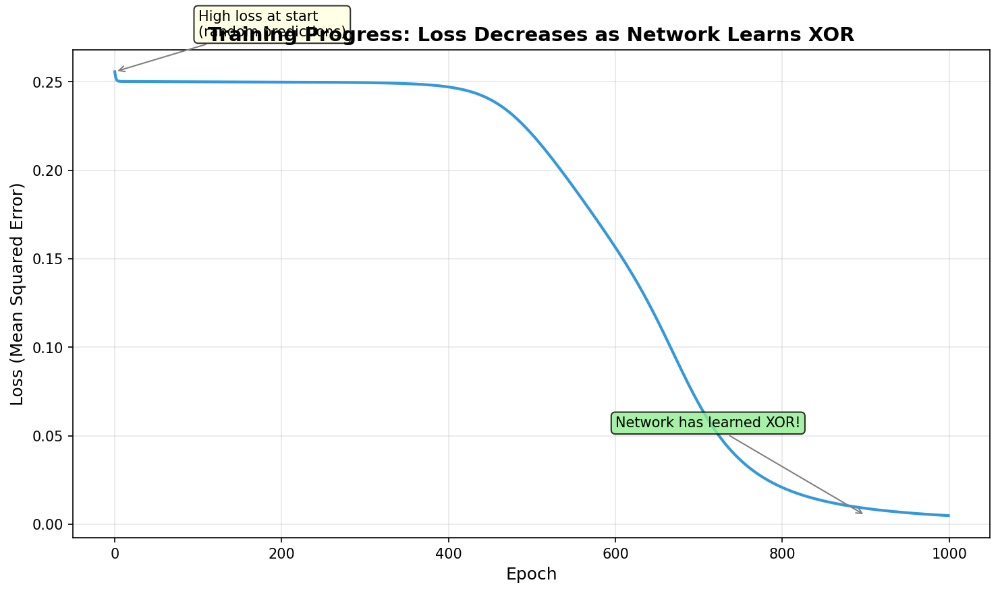
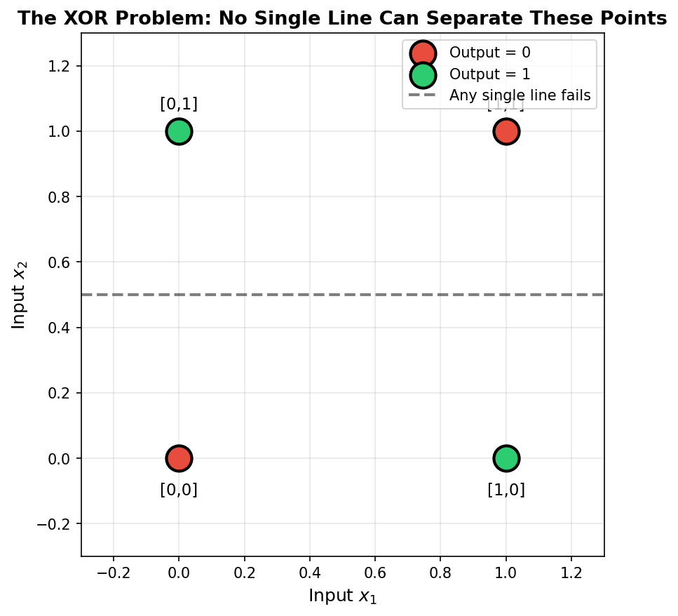
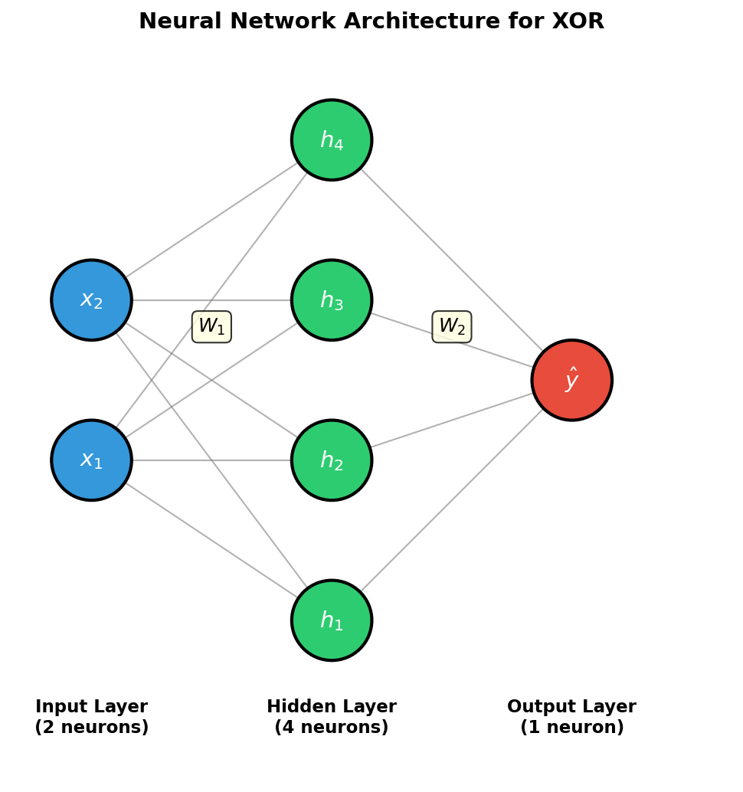
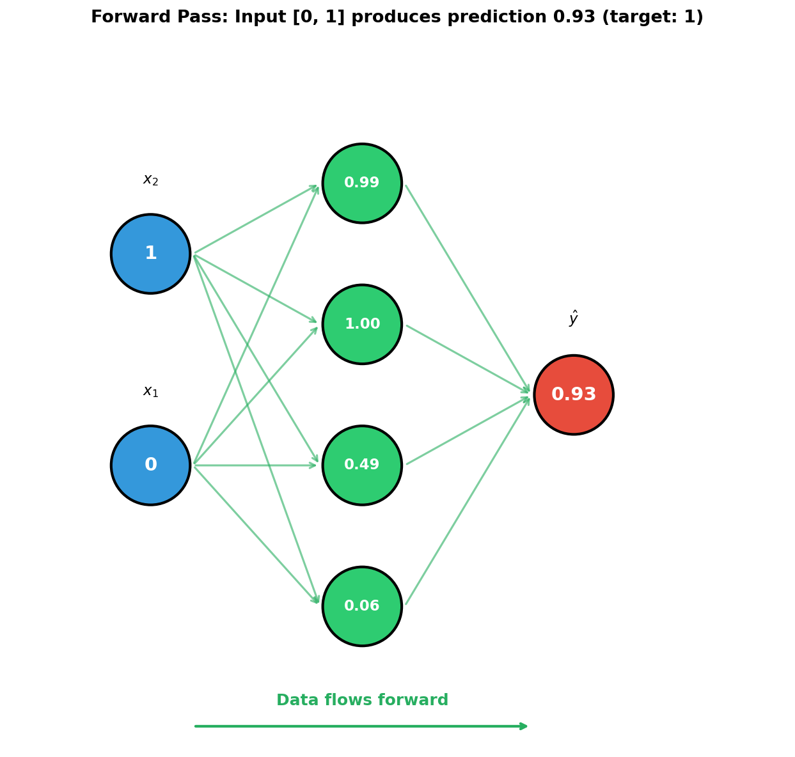
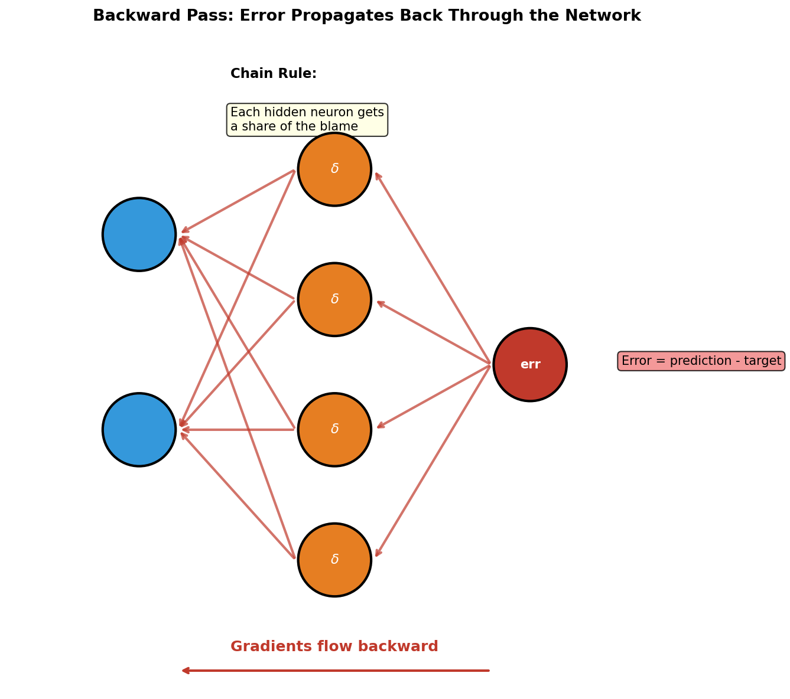

.. _module-9-1-2-backpropagation:

=====================================
9.1.2 - Backpropagation Visualization
=====================================

:Duration: 35-40 minutes
:Level: Intermediate

Overview
========

How does a neural network learn? The answer lies in **backpropagation**, the algorithm that enables neural networks to improve their predictions by adjusting their internal weights. While the mathematics can seem daunting, the core idea is elegantly simple: measure the error, then trace backward through the network to find out how much each weight contributed to that error.

In this exercise, you will visualize the complete flow of information through a neural network, both forward (making predictions) and backward (learning from mistakes). By seeing gradients flow through the network layer by layer, you will develop an intuitive understanding of how neural networks learn.

Backpropagation was independently discovered multiple times, with roots in control theory and optimization. However, the landmark 1986 paper by Rumelhart, Hinton, and Williams demonstrated its power for training multi-layer networks and helped revive the field of neural networks after the "AI winter" of the 1970s [Rumelhart1986]_.

Learning Objectives
-------------------

By the end of this exercise, you will be able to:

* Explain why XOR requires a hidden layer (non-linear separability)
* Understand how data flows forward through a neural network
* Visualize how error gradients propagate backward using the chain rule
* Complete a basic backpropagation implementation

Quick Start: See It In Action
=============================

Run this script to watch a neural network learn XOR:

:download:`Download simple_xor_train.py <simple_xor_train.py>`

.. code-block:: python
   :caption: simple_xor_train.py - Train a network to solve XOR
   :linenos:

   import numpy as np

   # XOR dataset: outputs 1 when inputs differ
   X = np.array([[0, 0], [0, 1], [1, 0], [1, 1]])
   y = np.array([[0], [1], [1], [0]])

   def sigmoid(z):
       return 1 / (1 + np.exp(-z))

   # Network: 2 inputs -> 4 hidden -> 1 output
   np.random.seed(42)
   W1 = np.random.randn(2, 4) * 0.5
   W2 = np.random.randn(4, 1) * 0.5

   for epoch in range(2001):
       # Forward pass
       a1 = sigmoid(X @ W1)
       a2 = sigmoid(a1 @ W2)

       # Backward pass (backpropagation)
       dz2 = a2 - y
       dW2 = a1.T @ dz2 / 4
       dz1 = (dz2 @ W2.T) * (a1 * (1 - a1))
       dW1 = X.T @ dz1 / 4

       # Update weights
       W2 -= 1.0 * dW2
       W1 -= 1.0 * dW1

   print("Final predictions:")
   for i in range(4):
       print(f"  Input {X[i]} -> {a2[i,0]:.3f} (target: {y[i,0]})")

**Expected output:**

.. code-block:: text

   Final predictions:
     Input [0 0] -> 0.017 (target: 0)
     Input [0 1] -> 0.985 (target: 1)
     Input [1 0] -> 0.985 (target: 1)
     Input [1 1] -> 0.013 (target: 0)

The network successfully learns XOR! Predictions close to 0 for matching inputs, close to 1 for differing inputs. This happens through repeated cycles of **forward propagation** (making predictions) and **backpropagation** (adjusting weights based on errors).

   The loss decreases as the network learns. Notice the rapid drop around epoch 600-800 when the network "figures out" XOR.

The XOR Problem
===============

In the previous exercise, you built a perceptron that could classify points separated by a single line. But what happens when no single line can separate the data?

**The XOR problem** is the classic example. XOR (exclusive or) outputs 1 when its inputs are *different*, and 0 when they are the *same*:

.. list-table:: XOR Truth Table
   :header-rows: 1
   :widths: 15 15 15

   * - Input 1
     - Input 2
     - Output
   * - 0
     - 0
     - 0 (same)
   * - 0
     - 1
     - 1 (different)
   * - 1
     - 0
     - 1 (different)
   * - 1
     - 1
     - 0 (same)

When we plot these points, we see the problem:

   The XOR problem: red points (output 0) and green points (output 1) cannot be separated by any single line. A perceptron cannot solve this!

This limitation was famously highlighted by Minsky and Papert in 1969, contributing to the first "AI winter" [MinskyPapert1969]_. The solution? **Add a hidden layer** and use **backpropagation** to train it.

Core Concepts
=============

Concept 1: Network Architecture
-------------------------------

To solve XOR, we need a network with a **hidden layer**. This layer can learn to create intermediate representations that make the problem linearly separable.

   Our XOR network: 2 inputs, 4 hidden neurons, 1 output. Each arrow represents a learnable weight.

The hidden layer transforms the 2D input into a 4D representation where XOR becomes solvable. Think of it as the network learning to "re-arrange" the data points.

Concept 2: Forward Pass
-----------------------

The **forward pass** computes predictions by passing data through each layer:

1. **Input to Hidden**: Multiply inputs by weights, apply sigmoid activation
2. **Hidden to Output**: Multiply hidden activations by weights, apply sigmoid

.. code-block:: python
   :caption: Forward pass step by step
   :linenos:

   # Hidden layer: z1 = X @ W1, then activation
   z1 = X @ W1          # Linear combination
   a1 = sigmoid(z1)     # Squash to (0, 1)

   # Output layer: z2 = a1 @ W2, then activation
   z2 = a1 @ W2         # Linear combination
   a2 = sigmoid(z2)     # Final prediction

   Forward pass for input [0, 1]. The hidden neurons compute intermediate values, and the output approaches 1.0 (correct for XOR).

Concept 3: Backward Pass (Backpropagation)
------------------------------------------

When predictions are wrong, we need to adjust weights. But which weights caused the error? **Backpropagation** answers this by tracing the error backward through the network.

The key insight is the **chain rule**: if the output error depends on hidden neurons, and hidden neurons depend on input weights, then output error depends on input weights through this chain.

.. code-block:: python
   :caption: Backward pass - computing gradients
   :linenos:

   # Step 1: Error at output
   dz2 = a2 - y                          # How wrong is our prediction?

   # Step 2: Gradient for output weights
   dW2 = a1.T @ dz2 / 4                  # How much did W2 contribute?

   # Step 3: Error flows back to hidden layer (chain rule!)
   dz1 = (dz2 @ W2.T) * (a1 * (1 - a1))  # Share of blame for hidden neurons

   # Step 4: Gradient for input weights
   dW1 = X.T @ dz1 / 4                   # How much did W1 contribute?

   Backward pass: error starts at the output and propagates left. Each hidden neuron receives a "share of the blame" proportional to its contribution.

Finally, we update weights in the direction that reduces error:

.. code-block:: python

   W1 = W1 - learning_rate * dW1
   W2 = W2 - learning_rate * dW2

The **learning rate** controls step size. Too large = unstable; too small = slow learning.

.. admonition:: Did You Know?

   The term "backpropagation" is short for "backward propagation of errors." The algorithm efficiently computes gradients by reusing intermediate calculations, making it practical to train networks with many layers [Nielsen2015]_.

Hands-On Exercises
==================

Exercise 1: Execute and Observe
-------------------------------

Run ``simple_xor_train.py`` and observe the output.

**Verification Questions:**

1. At epoch 0, what are the predictions? Are they close to 0.5 (random guessing)?
2. At which epoch does the loss drop significantly?
3. Change ``np.random.seed(42)`` to ``np.random.seed(123)``. Does the network still learn XOR?

.. dropdown:: Answers
   :class-title: sd-font-weight-bold

   1. **Epoch 0 predictions**: Around [0.45, 0.43, 0.43, 0.41] - close to 0.5, confirming the network starts with random predictions.

   2. **Significant loss drop**: Around epochs 600-800. This is when the network "discovers" a good solution. Before this, it may be stuck in a poor local region.

   3. **Different seed**: Yes! The network will learn XOR regardless of initialization, though the exact path may differ. This demonstrates that backpropagation reliably finds solutions for this problem.

Exercise 2: Experiment with Parameters
--------------------------------------

Modify the training to understand how parameters affect learning.

**Goal 1: Learning Rate**

Change the learning rate and observe the effect:

.. code-block:: python

   # Try these values one at a time:
   learning_rate = 0.1   # Slow but stable
   learning_rate = 1.0   # Balanced (original)
   learning_rate = 5.0   # Fast but potentially unstable

**Goal 2: Hidden Layer Size**

Modify the network architecture:

.. code-block:: python

   # Try 2 hidden neurons (minimum for XOR)
   W1 = np.random.randn(2, 2) * 0.5
   W2 = np.random.randn(2, 1) * 0.5

   # Try 8 hidden neurons (excess capacity)
   W1 = np.random.randn(2, 8) * 0.5
   W2 = np.random.randn(8, 1) * 0.5

.. dropdown:: What to Observe
   :class-title: sd-font-weight-bold

   **Learning Rate Effects:**

   * **0.1**: Loss decreases very slowly. May need 5000+ epochs to converge.
   * **1.0**: Good balance. Converges in ~1000-2000 epochs.
   * **5.0**: May oscillate or diverge. Loss jumps erratically.

   **Hidden Layer Size:**

   * **2 neurons**: Minimum needed for XOR. May converge slower or fail with some initializations.
   * **4 neurons**: Comfortable capacity. Reliable convergence.
   * **8 neurons**: Converges quickly but uses more parameters than necessary.

Exercise 3: Complete the Backward Pass
--------------------------------------

Now test your understanding by completing the backward pass yourself.

:download:`Download backprop_starter.py <backprop_starter.py>`

The forward pass is complete. Your task is to fill in the **5 TODOs** in the backward pass section:

1. Compute output error: ``dz2 = a2 - y``
2. Compute gradient for W2
3. Compute hidden layer error using chain rule
4. Compute gradient for W1
5. Update both W1 and W2

.. dropdown:: Hint 1: Output Error
   :class-title: sd-font-weight-bold

   The output error is simply prediction minus target:

   .. code-block:: python

      dz2 = a2 - y

.. dropdown:: Hint 2: Gradient for W2
   :class-title: sd-font-weight-bold

   The gradient for W2 measures how much each hidden neuron contributed to the error:

   .. code-block:: python

      dW2 = a1.T @ dz2 / 4  # Divide by 4 samples

.. dropdown:: Hint 3: Chain Rule for Hidden Layer
   :class-title: sd-font-weight-bold

   Error flows backward through W2, then through the sigmoid derivative:

   .. code-block:: python

      # Error flowing back through W2
      da1 = dz2 @ W2.T

      # Through sigmoid derivative: sigmoid'(z) = sigmoid(z) * (1 - sigmoid(z)) = a1 * (1 - a1)
      dz1 = da1 * (a1 * (1 - a1))

      # Combined:
      dz1 = (dz2 @ W2.T) * (a1 * (1 - a1))

.. dropdown:: Complete Solution
   :class-title: sd-font-weight-bold

   .. code-block:: python

      # TODO 1: Output error
      dz2 = a2 - y

      # TODO 2: Gradient for W2
      dW2 = a1.T @ dz2 / 4

      # TODO 3: Hidden layer error
      dz1 = (dz2 @ W2.T) * (a1 * (1 - a1))

      # TODO 4: Gradient for W1
      dW1 = X.T @ dz1 / 4

      # TODO 5: Weight updates
      W1 -= learning_rate * dW1
      W2 -= learning_rate * dW2

Summary
=======

Key Takeaways
-------------

* **XOR requires hidden layers** because it is not linearly separable
* **Forward pass** computes predictions by flowing data through layers
* **Backward pass** computes gradients by flowing error backward (chain rule)
* **Gradients tell us how to adjust weights** to reduce error
* **Learning rate** controls step size - balance speed vs stability

Common Pitfalls
---------------

* **Learning rate too high**: Loss oscillates or explodes. Try 10x smaller.
* **Learning rate too low**: Training is painfully slow. Try 10x larger.
* **Not storing activations**: Backward pass needs forward pass values.
* **Matrix dimension errors**: Use ``X.T @ dz`` for weight gradients.

References
==========

.. [Rumelhart1986] Rumelhart, D. E., Hinton, G. E., & Williams, R. J. (1986). Learning representations by back-propagating errors. *Nature*, 323(6088), 533-536. https://doi.org/10.1038/323533a0

.. [MinskyPapert1969] Minsky, M., & Papert, S. A. (1969). *Perceptrons: An Introduction to Computational Geometry*. MIT Press.

.. [Goodfellow2016] Goodfellow, I., Bengio, Y., & Courville, A. (2016). *Deep Learning*. MIT Press. https://www.deeplearningbook.org/

.. [Nielsen2015] Nielsen, M. A. (2015). *Neural Networks and Deep Learning*. Determination Press. http://neuralnetworksanddeeplearning.com/

.. [3Blue1Brown] Sanderson, G. (2017). But what is a neural network? *3Blue1Brown* [Video series]. https://www.youtube.com/watch?v=aircAruvnKk
