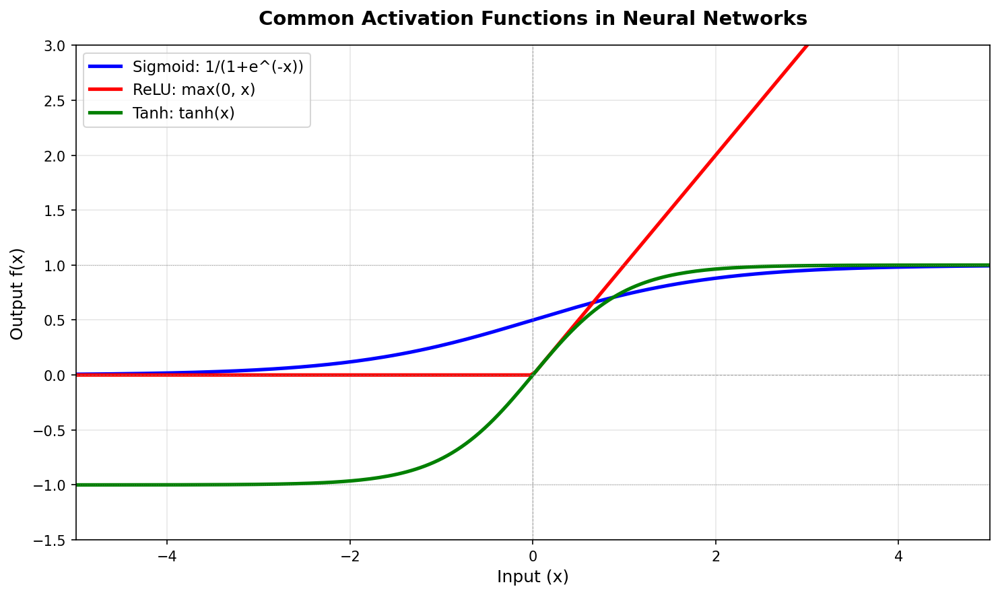
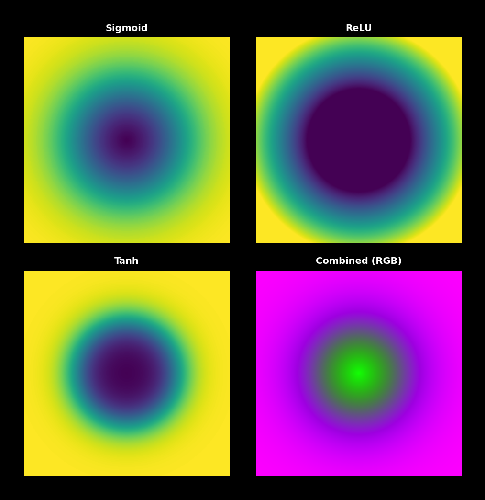
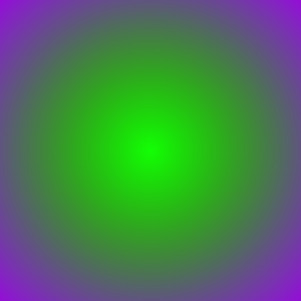
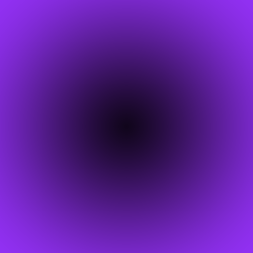
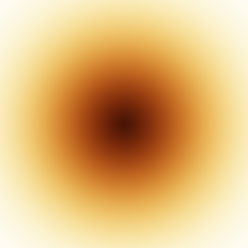

.. _module-9-1-3-activation-functions-art:

================================
9.1.3 Activation Functions Art
================================

:Duration: 30-35 minutes
:Level: Intermediate

Overview
========

Activation functions are the mathematical heart of neural networks, introducing the non-linearity that allows deep learning models to learn complex patterns. In this exercise, you will explore these fundamental functions by creating artistic visualizations that reveal their mathematical "personality."

By mapping activation functions across a 2D coordinate grid, we transform abstract mathematical formulas into beautiful, organic patterns. This visual approach provides deep intuition for how functions like sigmoid, ReLU, and tanh shape the information flowing through neural networks.

Learning Objectives
-------------------

By the end of this exercise, you will be able to:

* Implement common activation functions (sigmoid, ReLU, tanh) from scratch using NumPy
* Understand why non-linearity is essential for neural network learning
* Create artistic visualizations by applying mathematical functions to coordinate grids
* Compare activation functions visually to understand their distinct properties

Quick Start: See It In Action
=============================

Run this code to generate your first activation function art:

.. code-block:: python
   :caption: Generate activation function art
   :linenos:

   import numpy as np
   from PIL import Image

   def sigmoid(x):
       return 1.0 / (1.0 + np.exp(-x))

   def relu(x):
       return np.maximum(0, x)

   def tanh_activation(x):
       return np.tanh(x)

   # Create coordinate grid
   x = np.linspace(-5, 5, 512)
   y = np.linspace(-5, 5, 512)
   X, Y = np.meshgrid(x, y)
   distance = np.sqrt(X**2 + Y**2)

   # Apply activations to create RGB channels
   red = sigmoid(distance - 2.5) * 255
   green = relu(3 - distance) / 3 * 255
   blue = (tanh_activation(distance - 2) + 1) / 2 * 255

   # Combine and save
   image = np.stack([red, green, blue], axis=-1).astype(np.uint8)
   Image.fromarray(image).save("activation_art.png")

.. figure:: activation_art.png
   :width: 500px
   :align: center
   :alt: Colorful radial pattern showing combined sigmoid, ReLU, and tanh activation functions creating magenta, green, and purple zones

   Activation function art: three mathematical functions create distinct color channels that combine visually. 

The beauty of this pattern emerges from combining three different activation functions, each contributing a unique visual signature. Notice how the ReLU creates a sharp circular boundary (green center), while sigmoid and tanh produce smooth, organic transitions. The purple transition zone between green and magenta occurs where all three channels have moderate values.

Core Concepts
=============

Concept 1: What Are Activation Functions?
-----------------------------------------

In neural networks, each neuron computes a weighted sum of its inputs, then applies an **activation function** to determine its output. Without this activation function, the entire neural network would collapse into a simple linear transformation, regardless of how many layers it has [Goodfellow2016]_.

Consider what happens without activation functions:

.. code-block:: python
   :caption: Why non-linearity matters

   # Without activation, stacking layers is pointless
   # Layer 1: y1 = W1 * x + b1
   # Layer 2: y2 = W2 * y1 + b2
   # Combined: y2 = W2 * (W1 * x + b1) + b2
   #              = (W2 * W1) * x + (W2 * b1 + b2)
   #              = W_combined * x + b_combined  # Still just linear!

The key insight is that **linear transformations compose into linear transformations**. No matter how deep the network, without non-linearity, it can only learn linear relationships. Activation functions break this limitation, allowing networks to approximate any continuous function [Cybenko1989]_.

.. admonition:: Did You Know?

   The Universal Approximation Theorem proves that a neural network with a single hidden layer and a non-linear activation function can approximate any continuous function to arbitrary precision, given enough neurons [Hornik1989]_. This is why activation functions are so fundamental.

The three most important activation functions in modern deep learning are:

1. **Sigmoid**: Squashes values to (0, 1), historically used for probability outputs
2. **ReLU**: Keeps positive values, zeros negatives; dominant in modern networks
3. **Tanh**: Squashes values to (-1, 1), zero-centered variant of sigmoid

Concept 2: The Mathematics of Non-Linearity
-------------------------------------------

Each activation function has a distinct mathematical formula that determines its behavior. Let us examine each one:

**Sigmoid Function**

.. code-block:: python
   :caption: Sigmoid implementation

   def sigmoid(x):
       """
       f(x) = 1 / (1 + e^(-x))

       Output range: (0, 1)
       Properties: Smooth, differentiable, probability-like
       """
       return 1.0 / (1.0 + np.exp(-x))

The sigmoid function was historically popular because its output resembles a probability (always between 0 and 1). However, it suffers from the "vanishing gradient problem" for very large or small inputs [Hochreiter1998]_.

**ReLU (Rectified Linear Unit)**

.. code-block:: python
   :caption: ReLU implementation

   def relu(x):
       """
       f(x) = max(0, x)

       Output range: [0, infinity)
       Properties: Simple, sparse, computationally efficient
       """
       return np.maximum(0, x)

ReLU significantly advanced deep learning when Nair and Hinton demonstrated that it trains much faster than sigmoid [Nair2010]_. Its simplicity (just a threshold at zero) makes it computationally efficient, and the "sparsity" it creates (many neurons output exactly zero) has regularization benefits [Glorot2011]_.

**Tanh (Hyperbolic Tangent)**

.. code-block:: python
   :caption: Tanh implementation

   def tanh_activation(x):
       """
       f(x) = (e^x - e^(-x)) / (e^x + e^(-x))

       Output range: (-1, 1)
       Properties: Zero-centered, symmetric, smooth
       """
       return np.tanh(x)

Tanh is similar to sigmoid but outputs values between -1 and 1. Being "zero-centered" means that its outputs can be both positive and negative, which can help with learning dynamics in some architectures [LeCun2015]_.

   Mathematical comparison of activation functions. Notice how sigmoid and tanh are smooth S-curves while ReLU has a sharp corner at x=0. The ReLU extends upward without bound, while sigmoid and tanh saturate.

Concept 3: Visualizing Activation Functions as Art
--------------------------------------------------

To transform activation functions into art, we use a simple but powerful technique: apply the function to every point on a 2D coordinate grid, then map the result to color values.

**Step 1: Create a Coordinate Grid**

NumPy's ``meshgrid`` creates matrices where each element contains its x or y coordinate:

.. code-block:: python
   :caption: Creating a coordinate grid

   import numpy as np

   x = np.linspace(-5, 5, 512)  # 512 values from -5 to 5
   y = np.linspace(-5, 5, 512)
   X, Y = np.meshgrid(x, y)

   # X[i,j] = x-coordinate of pixel (i,j)
   # Y[i,j] = y-coordinate of pixel (i,j)

**Step 2: Calculate Input Values**

We can use various transformations of coordinates as input. A common choice is the distance from the center:

.. code-block:: python
   :caption: Distance-based input

   distance = np.sqrt(X**2 + Y**2)  # Euclidean distance from origin

Other interesting inputs include:
- ``X + Y``: Diagonal gradient
- ``np.sin(X) + np.cos(Y)``: Wave patterns
- ``X * Y``: Hyperbolic patterns

**Step 3: Apply Activation and Map to Color**

.. code-block:: python
   :caption: Activation to color mapping

   # Sigmoid naturally outputs 0-1, perfect for color
   values = sigmoid(distance - 2.5)
   color_channel = (values * 255).astype(np.uint8)

The shift by 2.5 centers the sigmoid transition at a distance of 2.5 units from the origin, creating a visible ring pattern.

   Individual activation function patterns and their combination. Each function creates a distinct visual signature when applied to radial distance.

.. important::

   The artistic differences between activation functions directly reflect their mathematical properties. ReLU creates sharp boundaries because of its discontinuous derivative at zero. Sigmoid and tanh create smooth transitions because they are infinitely differentiable.

Hands-On Exercises
==================

These exercises follow a progressive approach: first execute and observe, then modify parameters, and finally create your own implementation.

Exercise 1: Execute and Explore
-------------------------------

Download and run the complete activation art generation script:

:download:`Download activation_functions_art.py <activation_functions_art.py>`

After running the script, you should see ``activation_art.png`` generated in your working directory showing the colorful radial pattern from the Quick Start section.

Answer these reflection questions:

1. Why does the green channel (ReLU) create a sharp circular boundary, while the red (sigmoid) and blue (tanh) channels create smooth transitions?
2. What would happen if you replaced ``distance - 2.5`` with just ``distance`` in the sigmoid calculation?
3. Which activation function creates the most visually striking pattern when viewed in isolation?

.. dropdown:: Answers and Explanation
   :class-title: sd-font-weight-bold

   1. **Sharp vs smooth boundaries**: ReLU has a discontinuous derivative at x=0, creating an abrupt transition from 0 to positive values. Sigmoid and tanh are smooth (infinitely differentiable) functions, so their transitions are gradual. This mathematical property directly manifests as visual sharpness.

   2. **Removing the offset**: Without the ``- 2.5`` offset, the sigmoid transition would occur at distance=0 (the center), and most of the image would be saturated near 1 (bright red). The offset shifts the transition zone outward to create a visible ring.

   3. **Visual impact**: This is subjective, but many find ReLU most striking because of its clean geometric boundary. The sharp circle contrasts strongly with the smooth organic feel of sigmoid and tanh.

Exercise 2: Modify Parameters
-----------------------------

Experiment with the activation art by modifying these parameters. Each goal explores a different aspect of the visualization.

**Goal 1**: Change the coordinate range

Modify the ``linspace`` range to zoom in or out. Using ``-2 to 2`` zooms in to show more detail of the center region.

   Expected output: Zooming in to range (-2, 2) reveals more detail of the green ReLU center and purple transition zone.

**Goal 2**: Use different input patterns

Replace the radial distance with other coordinate transformations:

.. code-block:: python
   :caption: Alternative input patterns

   # Diagonal gradient
   input_values = X + Y

   # Wave pattern
   input_values = np.sin(X * 2) + np.cos(Y * 2)

   # Hyperbolic pattern
   input_values = X * Y

.. figure:: exercise2_goal2_waves.png
   :width: 400px
   :align: center
   :alt: Wave pattern activation art showing repeating pink and dark circles in a grid

   Expected output: Using ``sin(X*2) + cos(Y*2)`` as input creates a repeating wave pattern with smooth activation transitions.

**Goal 3**: Create a single-color gradient with multiple activations

Layer multiple activation functions in the same color channel:

.. code-block:: python
   :caption: Layered activations

   # Combine sigmoid at different scales
   layer1 = sigmoid(distance - 1)
   layer2 = sigmoid(distance - 3)
   layer3 = sigmoid(distance - 5)

   combined = (layer1 + layer2 + layer3) / 3 * 255

   Expected output: Layering three sigmoids at different radii (1, 3, 5) creates smooth concentric rings that blend together.

**Goal 4**: Swap color channel assignments

Try different activation-to-channel mappings:

.. code-block:: python
   :caption: Different channel assignments

   # Original
   red = sigmoid(...)
   green = relu(...)
   blue = tanh(...)

   # Alternative 1: ReLU on red (creates hard edge on red channel)
   red = relu(...)
   green = sigmoid(...)
   blue = tanh(...)

   # Alternative 2: All same activation (monochromatic effect)
   red = sigmoid(distance - 1) * 255
   green = sigmoid(distance - 2.5) * 255
   blue = sigmoid(distance - 4) * 255

   Expected output: Using all sigmoid activations with different offsets (1, 2.5, 4) creates a warm sunset-like radial gradient.

Exercise 3: Create Your Own Activation Art
------------------------------------------

Build your own activation function visualization from scratch. The starter code below provides the structure; you need to implement the creative parts.

**Requirements**:

* Implement at least two activation functions
* Use a non-radial input pattern (not just ``sqrt(X**2 + Y**2)``)
* Create visually interesting color mappings

**Starter Code**:

:download:`Download activation_starter.py <activation_starter.py>`

The starter file contains a skeleton with TODO sections. Complete the 5 TODOs to create your own activation art.

.. dropdown:: Hint 1: Wave-based input pattern
   :class-title: sd-font-weight-bold

   Try using trigonometric functions for interesting wave patterns:

   .. code-block:: python

      input_pattern = np.sin(X * 3) * np.cos(Y * 3)

.. dropdown:: Hint 2: Leaky ReLU activation
   :class-title: sd-font-weight-bold

   Leaky ReLU allows small negative values instead of hard zeros:

   .. code-block:: python

      def leaky_relu(x, alpha=0.1):
          return np.where(x > 0, x, alpha * x)

.. dropdown:: Complete Solution
   :class-title: sd-font-weight-bold

   .. code-block:: python
      :linenos:

      import numpy as np
      from PIL import Image

      def sigmoid(x):
          return 1.0 / (1.0 + np.exp(-x))

      def leaky_relu(x, alpha=0.1):
          return np.where(x > 0, x, alpha * x)

      # Create coordinate grid
      width, height = 512, 512
      x = np.linspace(-5, 5, width)
      y = np.linspace(-5, 5, height)
      X, Y = np.meshgrid(x, y)

      # Wave-based input pattern
      waves = np.sin(X * 3) * np.cos(Y * 3)

      # Apply activations for color channels
      red = sigmoid(waves * 2) * 255
      green = (np.tanh(waves) + 1) / 2 * 200
      blue = np.abs(leaky_relu(waves)) * 100

      # Combine and save
      image = np.zeros((height, width, 3), dtype=np.uint8)
      image[:, :, 0] = np.clip(red, 0, 255).astype(np.uint8)
      image[:, :, 1] = np.clip(green, 0, 255).astype(np.uint8)
      image[:, :, 2] = np.clip(blue, 0, 255).astype(np.uint8)

      Image.fromarray(image).save('my_activation_art.png')
      print("Saved my_activation_art.png")

Challenge Extension: Aurora Borealis
-------------------------------------

Create an artistic "aurora borealis" (northern lights) effect using activation functions. The goal is to produce flowing, wave-like green bands against a dark background, mimicking the natural phenomenon.

   Target output: Flowing green aurora bands with smooth transitions, darker at top and bottom.

**Your task**: Create this effect using:

* Multiple overlapping sine waves for the flowing pattern
* Sigmoid or softplus activations for smooth color transitions
* A vertical gradient to fade the aurora toward the edges

.. dropdown:: Hint 1: Creating wave patterns
   :class-title: sd-font-weight-bold

   Combine multiple sine waves at different frequencies to create organic movement:

   .. code-block:: python

      wave1 = np.sin(X * 1.5 + Y * 2)
      wave2 = np.sin(X * 0.8 - Y * 1.2) * 0.5
      combined = wave1 + wave2

.. dropdown:: Hint 2: Vertical fading
   :class-title: sd-font-weight-bold

   Use sigmoid on the Y coordinate to create a vertical gradient:

   .. code-block:: python

      # Brighter in middle, darker at top/bottom
      vertical_fade = sigmoid((Y + 1) * 2)

.. dropdown:: Hint 3: Aurora colors
   :class-title: sd-font-weight-bold

   Green dominates aurora, with hints of blue. Keep red low:

   .. code-block:: python

      green = sigmoid(combined_wave * 2) * vertical_fade * 255
      blue = softplus(combined_wave) / 3 * vertical_fade * 200
      red = sigmoid(combined_wave - 1) * vertical_fade * 100

Summary
=======

Key Takeaways
-------------

* **Activation functions** introduce non-linearity, enabling neural networks to learn complex patterns
* **Sigmoid** squashes values to (0, 1), creating smooth transitions; historically popular but prone to vanishing gradients
* **ReLU** keeps positive values and zeros negatives; computationally simple and creates sparse representations
* **Tanh** squashes values to (-1, 1), providing zero-centered outputs
* **Mathematical properties become visual**: smooth functions create soft gradients, sharp functions create hard edges
* **Coordinate grids** allow us to visualize functions by mapping x,y positions to colors

Common Pitfalls
---------------

* **Overflow in sigmoid**: Large negative inputs to ``exp(-x)`` can cause numerical overflow; use ``np.clip`` or the numerically stable version: ``np.where(x >= 0, 1/(1 + np.exp(-x)), np.exp(x)/(1 + np.exp(x)))``
* **ReLU output scaling**: Unlike sigmoid/tanh, ReLU has no upper bound; always normalize or clip before converting to image values
* **Color channel order**: NumPy arrays use RGB order, but some libraries use BGR; always verify your color channels
* **Grid resolution vs coordinate range**: Higher resolution shows more detail but does not change the pattern; wider coordinate range shows more of the pattern

References
==========

.. [Goodfellow2016] Goodfellow, I., Bengio, Y., & Courville, A. (2016). *Deep Learning*. MIT Press. ISBN: 978-0-262-03561-3. [Comprehensive deep learning textbook covering activation functions in Chapter 6]

.. [LeCun2015] LeCun, Y., Bengio, Y., & Hinton, G. (2015). Deep learning. *Nature*, 521(7553), 436-444. https://doi.org/10.1038/nature14539 [Seminal overview of deep learning by the field's pioneers]

.. [Nair2010] Nair, V., & Hinton, G. E. (2010). Rectified linear units improve restricted Boltzmann machines. In *Proceedings of the 27th International Conference on Machine Learning* (pp. 807-814). [The paper that introduced ReLU to mainstream deep learning]

.. [Glorot2011] Glorot, X., Bordes, A., & Bengio, Y. (2011). Deep sparse rectifier neural networks. In *Proceedings of the 14th International Conference on Artificial Intelligence and Statistics* (pp. 315-323). JMLR. [Analyzed sparsity and regularization benefits of ReLU activation]

.. [Cybenko1989] Cybenko, G. (1989). Approximation by superpositions of a sigmoidal function. *Mathematics of Control, Signals and Systems*, 2(4), 303-314. [Original universal approximation theorem for sigmoid networks]

.. [Hornik1989] Hornik, K., Stinchcombe, M., & White, H. (1989). Multilayer feedforward networks are universal approximators. *Neural Networks*, 2(5), 359-366. https://doi.org/10.1016/0893-6080(89)90020-8 [Extended universal approximation to general activation functions]

.. [Hochreiter1998] Hochreiter, S. (1998). The vanishing gradient problem during learning recurrent neural nets and problem solutions. *International Journal of Uncertainty, Fuzziness and Knowledge-Based Systems*, 6(02), 107-116. [Analysis of sigmoid's vanishing gradient problem]

.. [Sitzmann2020] Sitzmann, V., Martel, J. N., Bergman, A. W., Lindell, D. B., & Wetzstein, G. (2020). Implicit neural representations with periodic activation functions. *Advances in Neural Information Processing Systems*, 33. [Explores sinusoidal activation functions for novel applications]

.. [NumPyDocs] NumPy Developers. (2024). NumPy array indexing. *NumPy Documentation*. https://numpy.org/doc/stable/user/basics.indexing.html [Official NumPy documentation]

.. [PillowDocs] Clark, A., et al. (2024). *Pillow: Python Imaging Library* (Version 10.2.0). Python Software Foundation. https://pillow.readthedocs.io/ [Official Pillow documentation]
