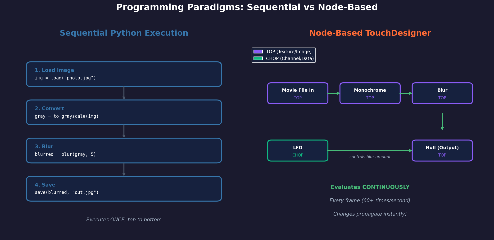
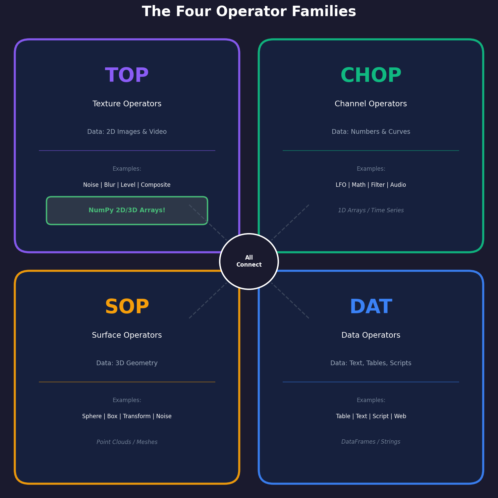
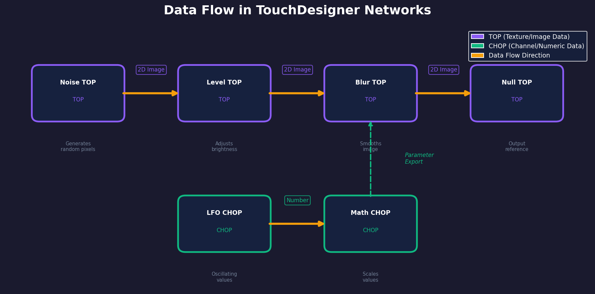
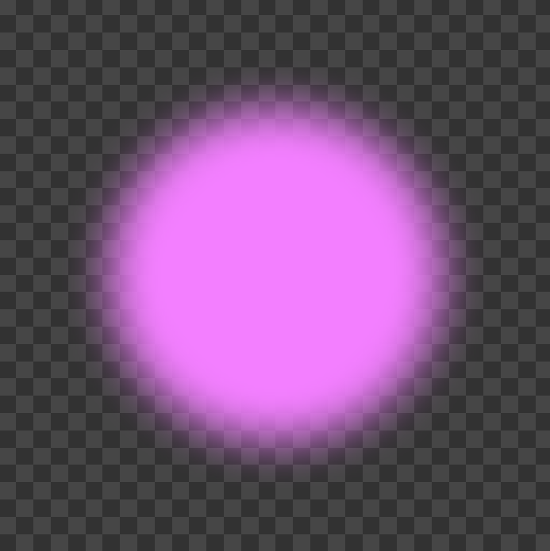
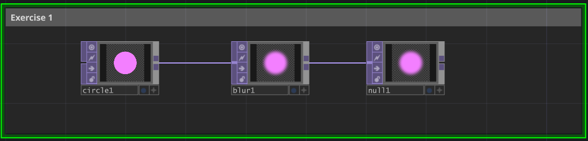
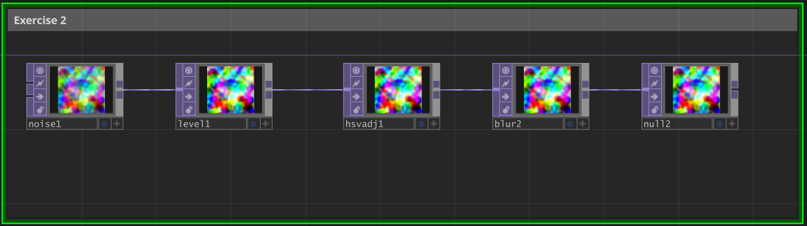
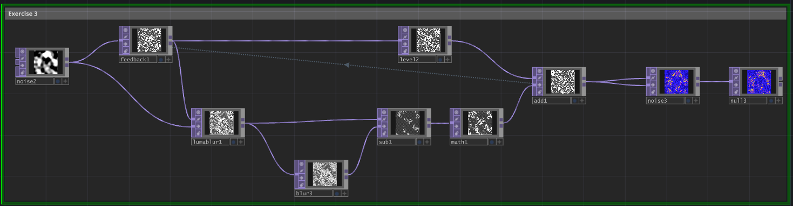

=====================================
10.1.1 - Node Networks
=====================================

:Duration: 35-40 minutes
:Level: Intermediate (requires Modules 0-9)
:Software: TouchDesigner 2025.31310, Python 3.11

Overview
========

Real-time creative tools organize visual computation differently from Python scripts. You have spent Modules 1-9 mastering NumPy arrays, writing Python scripts that process images line by line, and running code that executes once from top to bottom. But what happens when you need your visuals to respond instantly to changing inputs - a live camera feed, audio from a DJ set, or sensor data from a physical installation?

This is where **node-based visual programming** enters the picture. Tools like TouchDesigner, Max/MSP, and Unreal Blueprints use a fundamentally different paradigm: instead of writing sequential code, you build networks of connected nodes that continuously evaluate in real-time.

In this exercise, you will understand why this paradigm exists, learn TouchDesigner's four operator families, and discover how your NumPy knowledge directly transfers to this new environment.

**Learning Objectives**

By completing this exercise, you will:

* Understand the node-based visual programming paradigm and how it differs from sequential Python code
* Identify the four TouchDesigner operator families (TOP, CHOP, SOP, DAT) and their primary purposes
* Explain the concept of "cooking" and real-time evaluation in node networks
* Create a simple multi-node network and observe real-time data flow

Quick Start: See Node Networks in Action
=========================================

Before diving into theory, let's see what node networks can create. Below is a self-organizing feedback system built with just 10 TouchDesigner nodes:

.. figure:: exercise-3-gif.gif
   :width: 60%
   :align: center
   :alt: Animated patterns resembling cellular growth and division with organic, self-organizing behavior

   A feedback loop creating organic cellular patterns. Each frame feeds back into the next, producing continuous evolution without any manual intervention. This is what "always running" looks like.

**What's happening here?**

This network uses **temporal recursion**. The output of one frame becomes the input for the next. Edge detection finds boundaries, amplification strengthens them, and dampening prevents explosion. The system continuously evolves, creating mesmerizing organic structures that resemble cell division.

Unlike a Python script that runs once and stops, this network runs at 60+ frames per second, indefinitely. Change a single parameter (like blur amount), and the pattern instantly responds. This is the power of node-based programming.

You will build this exact network in Exercise 3. First, let's understand the concepts that make it possible.

Core Concept 1: The Node-Based Paradigm
========================================

Why Nodes Instead of Scripts?
^^^^^^^^^^^^^^^^^^^^^^^^^^^^^

Consider a typical image processing pipeline in Python:

.. code-block:: python
   :caption: Sequential Python execution
   :linenos:

   # This code runs ONCE, from top to bottom
   import numpy as np
   from scipy.ndimage import gaussian_filter

   # Step 1: Load or generate image
   noise = np.random.rand(512, 512)

   # Step 2: Adjust brightness
   adjusted = noise * 0.5 + 0.25

   # Step 3: Apply blur
   blurred = gaussian_filter(adjusted, sigma=2)

   # Step 4: Save result
   save_image(blurred, "output.png")

This code executes **once**, top to bottom. If you want to change the blur amount, you must:

1. Edit the code
2. Save the file
3. Re-run the script
4. Wait for execution to complete

In a live performance or interactive installation, this workflow is far too slow.

The Node-Based Alternative
^^^^^^^^^^^^^^^^^^^^^^^^^^

In TouchDesigner, the same pipeline becomes a **network of connected nodes**:

   Left: Python code executes once, top to bottom. Right: TouchDesigner nodes evaluate continuously, with data flowing through connections. The network never stops running. Diagram generated with Claude - Opus 4.5.

Key differences:

.. list-table:: Python Scripts vs Node Networks
   :header-rows: 1
   :widths: 40 30 30

   * - Aspect
     - Python Script
     - Node Network
   * - Execution
     - Runs once, then stops
     - Runs continuously (60+ fps)
   * - Changing parameters
     - Edit code, save, re-run
     - Adjust slider, instant update
   * - Data flow
     - Variables pass between lines
     - Wires connect outputs to inputs
   * - Mental model
     - Recipe with steps
     - Living, breathing system

.. admonition:: Key Insight

   Think of nodes as **functions that never stop running**. Each node constantly watches its inputs, and whenever something changes, it immediately recalculates its output. The entire network is alive.

The NumPy Connection
^^^^^^^^^^^^^^^^^^^^

Here is the good news: your NumPy knowledge transfers directly to TouchDesigner.

.. list-table:: NumPy to TouchDesigner Mapping
   :header-rows: 1
   :widths: 50 50

   * - NumPy Concept
     - TouchDesigner Equivalent
   * - 2D array (H x W)
     - TOP (grayscale image)
   * - 3D array (H x W x 3)
     - TOP (RGB image)
   * - Array operation (np.blur)
     - Operator (Blur TOP)
   * - Variable assignment
     - Wire connection
   * - Function call
     - Node in network

When you see a TOP (Texture Operator) in TouchDesigner, think: "This is my NumPy array, and it updates every frame."

Core Concept 2: The Four Operator Families
===========================================

TouchDesigner organizes all operations into four distinct families, each handling a different type of data. Understanding these families is essential for building effective networks.

   The four operator families in TouchDesigner. TOPs handle images (most familiar from your NumPy work), CHOPs handle numbers and animation, SOPs handle 3D geometry, and DATs handle text and tables. Diagram generated with Claude - Opus 4.5.

TOP: Texture Operators
^^^^^^^^^^^^^^^^^^^^^^

**Data Type**: 2D images, video, textures (your NumPy arrays!)

TOPs are the most familiar operators coming from NumPy. They process pixel data - exactly what you have been doing with image arrays. Common TOPs include:

- **Noise TOP**: Generates procedural noise (like ``np.random.rand()``)
- **Level TOP**: Adjusts brightness and contrast (like array math)
- **Blur TOP**: Applies Gaussian blur (like ``gaussian_filter()``)
- **Composite TOP**: Combines multiple images (like array stacking)
- **Null TOP**: Creates a reference point (like storing in a variable)

.. tip::

   If you want to process images in TouchDesigner, you will use TOPs. Your entire Module 1-9 knowledge maps here.

CHOP: Channel Operators
^^^^^^^^^^^^^^^^^^^^^^^

**Data Type**: Numbers, curves, audio samples (1D arrays)

CHOPs handle numeric data that changes over time. Think of them as 1D NumPy arrays that animate. Common CHOPs include:

- **LFO CHOP**: Low-frequency oscillator (sine, triangle, square waves)
- **Math CHOP**: Arithmetic operations on values
- **Filter CHOP**: Smoothing and filtering
- **Audio In CHOP**: Live audio input
- **Timer CHOP**: Timing and sequencing

CHOPs are often used to **control parameters** in TOPs. For example, an LFO CHOP can drive the blur amount in a Blur TOP, creating pulsing visuals.

SOP: Surface Operators
^^^^^^^^^^^^^^^^^^^^^^

**Data Type**: 3D geometry, meshes, point clouds

SOPs handle three-dimensional data - vertices, polygons, and surfaces. If you have worked with 3D point arrays in NumPy, SOPs are the equivalent. Common SOPs include:

- **Sphere SOP**: Creates a sphere primitive
- **Transform SOP**: Moves, rotates, scales geometry
- **Noise SOP**: Displaces vertices with noise
- **Particle SOP**: Particle systems

We will explore SOPs in depth in Module 10.2 when we recreate 3D simulations.

DAT: Data Operators
^^^^^^^^^^^^^^^^^^^

**Data Type**: Text, tables, scripts

DATs handle textual and tabular data. They are also where Python scripting lives in TouchDesigner. Common DATs include:

- **Table DAT**: Spreadsheet-like data storage
- **Text DAT**: Plain text content
- **Script DAT**: Python code that runs in TD
- **Web DAT**: Fetch data from URLs

DATs bridge TouchDesigner with external data sources and enable Python integration (which you will explore in Module 10.1.2).

.. admonition:: Did You Know?

   The color of operator nodes in TouchDesigner indicates their family: purple for TOPs, green for CHOPs, light blue for SOPs, and pinky-purple for DATs. This color coding helps you quickly understand what type of data flows through each part of your network (Derivative Inc., 2024).

Core Concept 3: Real-Time Cooking and Data Flow
================================================

What is "Cooking"?
^^^^^^^^^^^^^^^^^^

In TouchDesigner terminology, **cooking** refers to the process of evaluating a node and computing its output. Unlike Python where code runs once and stops, TouchDesigner networks **cook continuously** - typically 60 times per second or more.

When a node "cooks", it:

1. Reads its input connections
2. Applies its operation
3. Outputs the result
4. Immediately becomes available to downstream nodes

This happens **every frame**, creating the real-time responsiveness that makes TouchDesigner powerful for live visuals.

.. note::

   **Technical Detail: Pull-Based Cooking**

   TouchDesigner actually uses a "pull-based" cooking system for efficiency. Nodes only cook when something is interested in their output - such as a viewer displaying the node, a downstream node requesting data, or a parameter referencing the node's value. This means unused branches of your network consume minimal resources. For beginners, thinking of the network as "always running" is a useful mental model; as you advance, understanding pull-based cooking helps with optimization.

   Data flows through the network continuously. Numbers indicate cooking order: source nodes cook first, then downstream nodes follow. CHOPs can feed parameters to TOPs via "parameter exports." Diagram generated with Claude - Opus 4.5.

Understanding Dependencies
^^^^^^^^^^^^^^^^^^^^^^^^^^

Nodes cook in **dependency order**. A node cannot cook until all its inputs have cooked. This creates a directed acyclic graph (DAG) of dependencies:

1. **Source nodes** cook first (nodes with no inputs, like Noise TOP)
2. **Processing nodes** cook next (nodes that transform data)
3. **Output nodes** cook last (nodes that render or export)

If you change a parameter on a source node, that change **propagates downstream** through the entire network, causing all dependent nodes to re-cook. This cascade happens so fast (within milliseconds) that it appears instantaneous to the viewer.

Static vs Continuous: A Key Difference
^^^^^^^^^^^^^^^^^^^^^^^^^^^^^^^^^^^^^^

Consider this Python code:

.. code-block:: python
   :caption: Python variables do not auto-update
   :linenos:

   parameter = 0.5
   result = image * parameter  # Calculates ONCE

   parameter = 0.8  # Changed!
   # But 'result' is still the old value!
   # You must recalculate: result = image * parameter

In Python, changing ``parameter`` does not magically update ``result``. You must explicitly recalculate.

In TouchDesigner, the equivalent connection **always reflects the current value**:

::

   Math CHOP (outputs 0.5) --> Level TOP (uses 0.5 for brightness)

   Change Math CHOP to 0.8 --> Level TOP IMMEDIATELY shows 0.8 brightness

   No manual intervention needed!

This automatic propagation is what makes node-based programming so powerful for interactive and real-time applications.

.. important::

   The shift from "run once" to "always running" is the most significant mental adjustment when moving from Python scripting to node-based programming. Everything is live, always.

Hands-On Exercises
------------------

Now that you understand the concepts, let us build some networks. These exercises require TouchDesigner installed on your computer.

Exercise 1: Glowing Orb (3 nodes)
^^^^^^^^^^^^^^^^^^^^^^^^^^^^^^^^^^

**Goal**: Create a soft, glowing circular light using only 3 nodes. This exercise demonstrates how simple node chains can produce visually impressive results.

   The final result: a beautiful soft glowing orb created with just 3 nodes. The glow effect is achieved by heavily blurring a solid circle.

**Node Chain**

   The complete 3-node network. Notice how data flows left to right: the circle is generated, then blurred to create the glow effect.

**Step-by-Step Instructions**:

1. Open TouchDesigner (a new project starts automatically)
2. Press **Tab** to open the OP Create dialog, go to **TOP** tab, and click **Circle**
3. In Circle TOP parameters, change:

   - **Radius**: 0.3
   - **Fill Color**: Any bright color (e.g., pink: 0.95, 0.50, 1.0)

4. Press **Tab**, go to TOP, and create a **Blur TOP**
5. Connect Circle TOP's output (right edge) to Blur TOP's input (left edge)
6. In Blur TOP parameters, change:

   - **Filter Size**: 50

7. Press **Tab**, go to TOP, and create a **Null TOP**
8. Connect Blur TOP's output to Null TOP's input

.. admonition:: Download TouchDesigner Project

   :download:`Download Exercise Solutions (.toe file) <exercise-1-2-3-soultions.toe>`

   Open this file in TouchDesigner to see the completed network for all three exercises.

.. dropdown:: Reflection Questions

   1. How did the output change when you adjusted the Blur TOP's Filter Size?
   2. Did you need to click "run" or "execute" to see changes?
   3. What happens if you change the Circle TOP's color while looking at the Null TOP?
   4. How does this real-time feedback compare to running Python scripts?

Exercise 2: Animated Color Flow (5 nodes)
^^^^^^^^^^^^^^^^^^^^^^^^^^^^^^^^^^^^^^^^^

**Goal**: Create an animated, color-shifting noise pattern using a 4-node processing chain. This exercise demonstrates how parameter expressions can create dynamic, evolving visuals.

.. figure:: exercise-2-gif.gif
   :width: 60%
   :align: center
   :alt: Animated colorful noise pattern with smooth color transitions

   The final result: animated noise with continuously shifting hues. The colors cycle automatically through the spectrum, creating hypnotic, flowing patterns.

**Node Chain**

   The complete 4-node network. Notice how each node processes and transforms the data flowing through the chain.

**Step-by-Step Instructions**:

1. Press **Tab**, go to TOP, and create a **Noise TOP**
2. In Noise TOP parameters, change:

   - **Period**: 2

3. Press **Tab**, go to TOP, and create a **Level TOP**
4. Connect Noise TOP's output to Level TOP's input
5. In Level TOP parameters, change:

   - **Contrast**: 1.5

6. Press **Tab**, go to TOP, and create an **HSV Adjust TOP**
7. Connect Level TOP's output to HSV Adjust TOP's input
8. In HSV Adjust TOP parameters:

   - Find the **Hue Offset** parameter
   - Click the small **"+"** icon next to it (or right-click → Expression)
   - Enter this expression: ``absTime.seconds * 0.1``
   - This makes the hue shift automatically over time

9. Press **Tab**, go to TOP, and create a **Blur TOP**
10. Connect HSV Adjust TOP's output to Blur TOP's input
11. In Blur TOP parameters, change:

    - **Filter Size**: 7

12. Press **Tab**, go to TOP, and create a **Null TOP**
13. Connect Blur TOP's output to Null TOP's input

You now have: ``Noise → Level → HSV Adjust → Blur → Null``

.. admonition:: Download TouchDesigner Project

   :download:`Download Exercise Solutions (.toe file) <exercise-1-2-3-soultions.toe>`

   Open this file in TouchDesigner to see the completed network for all three exercises.

.. dropdown:: What Each Node Does

   **Noise TOP**: Generates procedural Simplex noise patterns (like ``np.random.rand()`` but with smooth, continuous values)

   **Level TOP**: Increases contrast to make the noise patterns more defined (like ``(array - 0.5) * 1.5 + 0.5``)

   **HSV Adjust TOP**: Shifts the hue continuously using the ``absTime.seconds * 0.1`` expression. This converts grayscale noise into animated rainbow colors by rotating through the hue spectrum.

   **Blur TOP**: Softens the edges and creates smooth color transitions (like ``gaussian_filter()``)

   **Key observation**: The expression ``absTime.seconds * 0.1`` creates animation without any external control. The ``absTime.seconds`` variable continuously increases, so the hue offset cycles through 0-360 degrees, creating the color-shifting effect. This is similar to using a time variable in Python animations, but it happens automatically in real-time!

.. dropdown:: Understanding the Expression

   **What is** ``absTime.seconds * 0.1``?

   - ``absTime.seconds``: Built-in TouchDesigner variable that tracks elapsed time in seconds
   - ``* 0.1``: Multiplier that slows down the color cycling (one full color cycle takes 36 seconds)

   **Try modifying the expression**:

   - ``absTime.seconds * 0.5`` → Faster color cycling
   - ``absTime.seconds * 0.05`` → Slower, more meditative cycling
   - ``sin(absTime.seconds) * 180`` → Hue oscillates back and forth instead of rotating continuously

Exercise 3: Exploding Cells with Feedback Loop (10 nodes)
^^^^^^^^^^^^^^^^^^^^^^^^^^^^^^^^^^^^^^^^^^^^^^^^^^^^^^^^^^

**Goal**: Create a self-organizing feedback system that generates organic, cell-like patterns. This exercise introduces feedback loops, temporal recursion, and multi-path data flow - the most complex network you will build yet.

.. figure:: exercise-3-gif.gif
   :width: 60%
   :align: center
   :alt: Animated patterns resembling cellular growth and division with organic, self-organizing behavior

   The final result: self-organizing patterns that resemble cellular growth and division. The feedback loop creates temporal recursion, with each frame influencing the next, producing mesmerizing organic structures.

**Node Structure**

   The complete 10-node network. Notice the feedback loop (Add → Feedback), the branching paths (Feedback splits to LumaBlur and Level), and the edge detection branch (LumaBlur → Blur → Subtract).

**Step-by-Step Instructions**:

.. dropdown:: Part A: Build the Noise Source (Steps 1-2)

   1. Press **Tab**, go to TOP, create a **Noise TOP** (this will be noise1)
   2. In Noise TOP parameters, change:

      - **Period**: [PLACEHOLDER]
      - Other parameters: [PLACEHOLDER - fill in non-default values]

.. dropdown:: Part B: Create the Feedback Loop (Steps 3-5)

   3. Press **Tab**, go to TOP, create a **Feedback TOP**
   4. Connect: Noise1 output → Feedback input
   5. In Feedback TOP parameters:

      - **Target TOP**: ``add1`` (IMPORTANT: This creates the feedback loop - type exactly "add1")
      - Other parameters: [PLACEHOLDER - fill in non-default values]

   .. note::

      The Target TOP parameter tells Feedback where to get its recirculated data. Since we will create an operator named "add1" later, the loop will complete: Add → Feedback → ... → Add.

.. dropdown:: Part C: Build the Edge Detection Branch (Steps 6-18)

   6. Press **Tab**, go to TOP, create a **LumaBlur TOP**
   7. Connect: Feedback output → LumaBlur input
   8. In LumaBlur TOP parameters, change:

      - **Blur Size**: [PLACEHOLDER]
      - Other parameters: [PLACEHOLDER - fill in non-default values]

   9. Press **Tab**, go to TOP, create a **Blur TOP**
   10. Connect: LumaBlur output → Blur input
   11. In Blur TOP parameters, change:

       - **Filter Size**: [PLACEHOLDER]
       - Other parameters: [PLACEHOLDER - fill in non-default values]

   12. Press **Tab**, go to TOP, create a **Subtract TOP**
   13. Connect: LumaBlur output → Subtract input (1st input, top connector)
   14. Connect: Blur output → Subtract input (2nd input, bottom connector)
   15. In Subtract TOP parameters (if any non-default): [PLACEHOLDER]

   16. Press **Tab**, go to TOP, create a **Math TOP**
   17. Connect: Subtract output → Math input
   18. In Math TOP parameters, change:

       - **Operation**: [PLACEHOLDER]
       - **Multiply**: [PLACEHOLDER]
       - Other parameters: [PLACEHOLDER - fill in non-default values]

.. dropdown:: Part D: Build the Level Branch and Addition (Steps 19-26)

   19. Press **Tab**, go to TOP, create a **Level TOP**
   20. Connect: Feedback output → Level input (Feedback now splits to both LumaBlur and Level)
   21. In Level TOP parameters, change:

       - **Brightness**: [PLACEHOLDER]
       - **Contrast**: [PLACEHOLDER]
       - Other parameters: [PLACEHOLDER - fill in non-default values]

   22. Press **Tab**, go to TOP, create an **Add TOP**
   23. Rename this operator to **add1** (right-click → Rename, or press F2)
   24. Connect: Math output → Add input (1st input, top connector)
   25. Connect: Level output → Add input (2nd input, bottom connector)
   26. In Add TOP parameters (if any non-default): [PLACEHOLDER]

.. dropdown:: Part E: Complete the Output Chain (Steps 27-31)

   27. Press **Tab**, go to TOP, create a **Noise TOP** (this will be noise2, a second Noise operator)
   28. Connect: Add output → Noise2 input (Add outputs to both Noise2 inputs)
   29. In Noise2 TOP parameters, change:

       - **Period**: [PLACEHOLDER]
       - **Amplitude**: [PLACEHOLDER]
       - Other parameters: [PLACEHOLDER - fill in non-default values]

   30. Press **Tab**, go to TOP, create a **Null TOP**
   31. Connect: Noise2 output → Null input

   At this point, your feedback loop is complete! The network should start generating organic patterns automatically.

.. admonition:: Download TouchDesigner Project

   :download:`Download Exercise Solutions (.toe file) <exercise-1-2-3-soultions.toe>`

   Open this file in TouchDesigner to see the completed network for all three exercises. The feedback loop network is complex - studying the actual .toe file can help you understand the connections better.

.. dropdown:: Understanding the Feedback Loop

   **What is a Feedback TOP?**

   The Feedback TOP stores the previous frame and makes it available as input to the current frame. This creates **temporal recursion** - each frame depends on the one before it.

   **How Target TOP Works:**

   When you set Target TOP to "add1", Feedback watches the Add operator and stores its output. On the next frame, Feedback outputs that stored frame, which flows through the network, eventually reaching Add again, which feeds back into Feedback. The loop continues indefinitely.

   **NumPy Analogy:**

   This is like writing:

   .. code-block:: python

      frame = initial_noise
      while True:
          frame = process(frame)  # Each iteration uses previous result
          display(frame)

   Except in TouchDesigner, this happens automatically at 60+ fps without explicit loops!

.. dropdown:: Why This Creates Cells

   **The Edge Detection Mechanism:**

   - **LumaBlur** creates a smoothed version of the feedback
   - **Blur** creates an even more smoothed version
   - **Subtract** computes the difference: `LumaBlur - Blur`
   - This difference highlights edges (areas of rapid change)

   **The Amplification and Recirculation:**

   - **Math** amplifies these edges
   - **Level** dampens the feedback to prevent explosion
   - **Add** combines amplified edges with dampened feedback
   - **Noise2** adds randomness to prevent static patterns
   - **Feedback** recirculates the result

   **Why Cells Emerge:**

   This process is similar to **reaction-diffusion systems** (Turing patterns) where local activation and lateral inhibition create self-organizing patterns. The feedback loop acts as the temporal component, allowing patterns to evolve and stabilize into cell-like structures.

   **References:**

   - Turing, A. M. (1952). The chemical basis of morphogenesis. *Philosophical Transactions of the Royal Society of London B*, 237(641), 37-72.
   - Related to Module 1.2.3 (Reaction-Diffusion) and Module 1.2.2 (Cellular Automata)

.. dropdown:: Multi-Input Operators

   **Subtract TOP (2 inputs):**

   Takes two image inputs and computes: `Output = Input1 - Input2`

   In NumPy: ``result = array1 - array2``

   **Add TOP (2 inputs):**

   Takes two image inputs and computes: `Output = Input1 + Input2`

   In NumPy: ``result = array1 + array2``

   **Noise2 (2 inputs from same source):**

   When you connect the same output (Add) to both inputs of Noise2, it uses that image as a mask or modulator. This makes the noise react to the feedback pattern, creating organic variations.

.. dropdown:: The Role of Each Node

   **Detailed Breakdown:**

   1. **Noise1**: Provides initial random seed to start the feedback loop
   2. **Feedback**: Stores previous frame, creates temporal recursion (memory)
   3. **LumaBlur**: Creates smoothed version for comparison (diffusion component)
   4. **Blur**: Creates very smooth version for edge detection
   5. **Subtract**: Detects edges by finding difference between smooth levels
   6. **Math**: Amplifies edge information (reaction component)
   7. **Level**: Dampens feedback to prevent runaway explosion (inhibition)
   8. **Add**: Combines edges with dampened feedback (integration)
   9. **Noise2**: Adds randomness to prevent static equilibrium
   10. **Null**: Final output reference point (display node)

   **Feedback Loop Cycle:**

   ``Add → Feedback (stores) → Level (dampens) → Add (loop completes)``

   This cycle runs 60 times per second, creating continuously evolving patterns.

.. dropdown:: Challenge Extensions

   **Experiment with these modifications:**

   1. **Adjust Feedback Mix** (in Feedback TOP parameters):
      - Higher values (>0.9) → more persistent patterns, slower evolution
      - Lower values (<0.5) → faster evolution, more chaotic

   2. **Change LumaBlur/Blur Sizes**:
      - Larger blur → larger cells
      - Smaller blur → finer, more detailed structures

   3. **Modify Math Multiply Value**:
      - Higher multiply → stronger edge amplification, more defined cells
      - Lower multiply → softer, more organic shapes

   4. **Add CHOP Control to Feedback Mix**:
      - LFO → Math CHOP → Feedback Mix parameter
      - Creates breathing, pulsing cellular patterns

   5. **Try Different Noise Types in Noise2**:
      - Perlin, Simplex, Cubic → different organic textures
      - White noise → more chaotic variations

   6. **Add Color**:
      - Insert an HSV Adjust TOP after Noise2
      - Animate the Hue Offset (like Exercise 2): ``absTime.seconds * 0.1``

   **Advanced Challenge:**

   Can you create a second feedback loop in parallel and composite them together? What happens when two reaction-diffusion systems interact?

Summary
-------

Key Takeaways
^^^^^^^^^^^^^

1. **Node-based programming** is a paradigm where operations are visual nodes connected by wires, continuously evaluating in real-time

2. **TouchDesigner has four operator families**:

   - **TOP** (Texture): Images and video - your NumPy arrays!
   - **CHOP** (Channel): Numbers and animation
   - **SOP** (Surface): 3D geometry
   - **DAT** (Data): Text, tables, and scripts

3. **Cooking** is TouchDesigner's continuous evaluation process - networks run 60+ times per second, instantly reflecting parameter changes

4. **Data flow** follows dependencies - upstream changes automatically propagate downstream

5. **Your NumPy knowledge transfers directly** - TOPs process image arrays just like you have been doing, but in real-time

Common Pitfalls
^^^^^^^^^^^^^^^

.. warning::

   - **Thinking in "run once" mode**: Remember, TD networks never stop. If something looks wrong, the issue is in the current state of the network, not in "running it again."

   - **Ignoring operator families**: Connecting a TOP output to a CHOP input will not work - they handle different data types. Watch the colors!

   - **Over-complicating early networks**: Start simple. A 3-node chain is enough to understand the paradigm before building complex systems.

References
----------

.. [Derivative2024] Derivative Inc. (2024). *TouchDesigner Documentation*. Retrieved from https://derivative.ca/UserGuide [Official reference for all TouchDesigner concepts and operators]

.. [ReasFry2014] Reas, C., & Fry, B. (2014). *Processing: A Programming Handbook for Visual Designers and Artists* (2nd ed.). MIT Press. [Foundational text on visual programming for creative applications]

.. [Burnett1994] Burnett, M. M., & Baker, M. J. (1994). A classification system for visual programming languages. *Journal of Visual Languages and Computing*, 5(3), 287-300. [Academic framework for understanding visual programming]

.. [GreenPetre1996] Green, T. R. G., & Petre, M. (1996). Usability analysis of visual programming environments: A 'cognitive dimensions' framework. *Journal of Visual Languages and Computing*, 7(2), 131-174. [Cognitive analysis of node-based interfaces]

.. [Shneiderman1983] Shneiderman, B. (1983). Direct manipulation: A step beyond programming languages. *Computer*, 16(8), 57-69. [Seminal paper on direct manipulation interfaces]

.. [Myers1990] Myers, B. A. (1990). Taxonomies of visual programming and program visualization. *Journal of Visual Languages and Computing*, 1(1), 97-123. [Classification of visual programming approaches]

.. [Hils1992] Hils, D. D. (1992). Visual languages and computing survey: Data flow visual programming languages. *Journal of Visual Languages and Computing*, 3(1), 69-101. [Survey of dataflow programming paradigms]

.. [WikipediaDataflow] Wikipedia contributors. (2024). Dataflow programming. *Wikipedia*. Retrieved from https://en.wikipedia.org/wiki/Dataflow_programming [Accessible overview of dataflow concepts]
