.. _module-12-1-2-dcgan-art:

================================
12.1.2 DCGAN Art
================================

:Duration: 35-40 minutes
:Level: Intermediate-Advanced

Overview
========

Deep Convolutional Generative Adversarial Networks (DCGANs) represent a major advancement in neural network-based image generation. Introduced by Radford et al. in 2015 [Radford2015]_, DCGANs apply convolutional neural network architectures to the GAN framework, enabling the generation of high-quality images that exhibit coherent spatial structure.

In this exercise, you will explore how DCGANs generate abstract art patterns from random noise vectors. The patterns are learned from procedural art similar to what you created in earlier modules, demonstrating how neural networks can learn to replicate and extend generative techniques. This creates a compelling narrative: we started by writing algorithms to generate patterns, and now we teach neural networks to generate similar patterns autonomously.

Learning Objectives
-------------------

By the end of this exercise, you will be able to:

* Understand why convolutional architectures improve image generation over fully-connected networks
* Analyze the Generator and Discriminator architecture components of a DCGAN
* Generate novel abstract art by sampling from the learned latent space
* Explore latent space interpolation to create smooth transitions between generated images

.. figure:: dcgan_fabric_animation.gif
   :width: 450px
   :align: center
   :alt: DCGAN generating diverse African fabric patterns through latent space interpolation

   **Trained DCGAN generating African fabric patterns.** 

Quick Start: See It In Action
=============================

Run this code to generate abstract art using a pre-trained DCGAN:

.. code-block:: python
   :caption: Generate abstract art with DCGAN
   :linenos:

   import torch
   from dcgan_model import Generator, LATENT_DIM
   import matplotlib.pyplot as plt

   # Load pre-trained generator
   generator = Generator()
   generator.load_state_dict(torch.load('generator_weights.pth', map_location='cpu'))
   generator.eval()

   # Generate 4 random art pieces
   z = torch.randn(4, LATENT_DIM, 1, 1)
   with torch.no_grad():
       images = generator(z)

   # Display the generated art
   images = (images + 1) / 2  # Convert from [-1,1] to [0,1]
   fig, axes = plt.subplots(1, 4, figsize=(12, 3))
   for i, ax in enumerate(axes):
       ax.imshow(images[i].permute(1, 2, 0).numpy())
       ax.axis('off')
   plt.savefig('quick_start_output.png', dpi=150)
   plt.show()

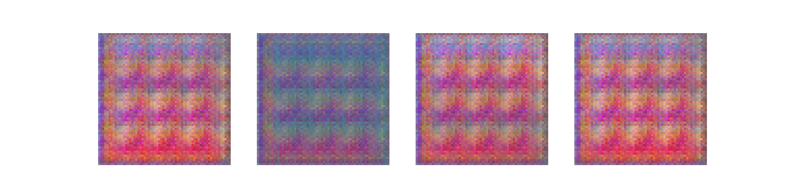

   Four unique patterns from random latent vectors.

The generator transforms 100-dimensional random noise vectors into 64x64 pixel RGB images. The patterns exhibit smooth gradients, geometric shapes, and color harmonies learned from procedural art training data.

Core Concepts
=============

Concept 1: From Fully-Connected to Convolutional
-------------------------------------------------

Traditional GANs using fully-connected (dense) layers struggle to generate coherent images because they treat each pixel independently. Consider a 64x64 RGB image: that is 12,288 values that a fully-connected network must generate without any understanding of spatial relationships.

Convolutional Neural Networks (CNNs) solve this problem by exploiting the spatial structure of images [LeCun2015]_. Key insights that make CNNs effective for image generation include:

1. **Local connectivity**: Each neuron only connects to a small region (receptive field), learning local patterns
2. **Weight sharing**: The same filter is applied across the entire image, learning translation-invariant features
3. **Hierarchical features**: Lower layers detect edges and textures; higher layers combine these into complex patterns

.. admonition:: Did You Know?

   The term "deep" in DCGAN refers to multiple convolutional layers stacked together. The original DCGAN paper demonstrated that depth matters: networks with 4-5 layers produced significantly better results than shallower architectures, achieving a balance between capacity and training stability [Radford2015]_.

DCGANs apply these principles to both the generator (which uses *transposed* convolutions to upsample) and the discriminator (which uses standard convolutions to downsample).

Concept 2: DCGAN Architecture
-----------------------------

The DCGAN architecture consists of two competing networks: a **Generator** that creates images from noise, and a **Discriminator** that distinguishes real images from generated ones [Goodfellow2014]_.

**Generator Architecture**

The generator transforms a latent vector into an image through a series of transposed convolutional layers:

.. code-block:: python
   :caption: Generator network structure
   :linenos:
   :emphasize-lines: 9,13,17,21

   class Generator(nn.Module):
       def __init__(self, latent_dim=100, img_channels=3, feature_maps=64):
           super().__init__()
           self.network = nn.Sequential(
               # Input: 100x1x1 latent vector
               # Layer 1: 100 -> 4x4x512
               nn.ConvTranspose2d(latent_dim, feature_maps*8, 4, 1, 0),
               nn.BatchNorm2d(feature_maps * 8),
               nn.ReLU(True),

               # Layer 2: 4x4x512 -> 8x8x256
               nn.ConvTranspose2d(feature_maps*8, feature_maps*4, 4, 2, 1),
               nn.BatchNorm2d(feature_maps * 4),
               nn.ReLU(True),

               # Layer 3: 8x8x256 -> 16x16x128
               nn.ConvTranspose2d(feature_maps*4, feature_maps*2, 4, 2, 1),
               nn.BatchNorm2d(feature_maps * 2),
               nn.ReLU(True),

               # Layer 4: 16x16x128 -> 32x32x64
               nn.ConvTranspose2d(feature_maps*2, feature_maps, 4, 2, 1),
               nn.BatchNorm2d(feature_maps),
               nn.ReLU(True),

               # Layer 5: 32x32x64 -> 64x64x3 (output)
               nn.ConvTranspose2d(feature_maps, img_channels, 4, 2, 1),
               nn.Tanh()  # Output in [-1, 1]
           )

* **Lines 7-9**: First layer expands the latent vector to a 4x4 spatial grid with 512 channels
* **Lines 11-23**: Each subsequent layer doubles the spatial resolution while halving the channels
* **Line 26**: Final layer produces a 3-channel RGB image with Tanh activation

**Discriminator Architecture**

The discriminator mirrors the generator, using strided convolutions to downsample:

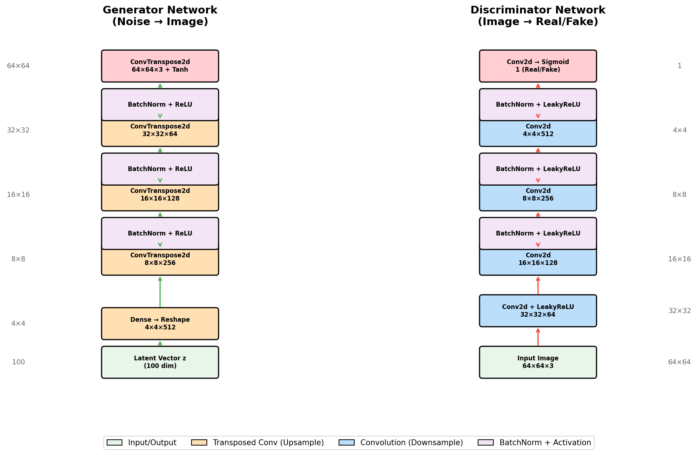

   DCGAN architecture: Generator upsamples latent vector to 64x64 image; Discriminator downsamples to real/fake classification.

**Key Architectural Guidelines** from the DCGAN paper [Radford2015]_:

1. Replace pooling with strided convolutions (discriminator) and transposed convolutions (generator)
2. Use Batch Normalization [Ioffe2015]_ in both networks (except discriminator input and generator output)
3. Use ReLU in the generator (except output layer which uses Tanh)
4. Use LeakyReLU in the discriminator to prevent sparse gradients

Concept 3: Latent Space and Art Generation
------------------------------------------

The **latent space** is the 100-dimensional space from which the generator samples input vectors. Each point in this space corresponds to a unique generated image, and nearby points produce visually similar images.

This property enables powerful creative applications:

**Interpolation**: By smoothly transitioning between two latent vectors, we can morph one image into another:

.. code-block:: python
   :caption: Linear interpolation between latent vectors
   :linenos:

   def interpolate(z1, z2, steps=10):
       """Generate images along a path between two latent points."""
       images = []
       for t in range(steps):
           alpha = t / (steps - 1)
           z = (1 - alpha) * z1 + alpha * z2  # Linear interpolation
           z = z.view(1, 100, 1, 1)
           img = generator(z)
           images.append(img)
       return images

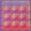

   Latent space interpolation: smooth transitions between generated patterns reveal the continuous nature of the learned representation.

**Semantic Directions**: Research has shown that certain directions in latent space correspond to meaningful visual attributes [Radford2015]_. For example, in face-generating DCGANs, one direction might control whether a person is wearing glasses.

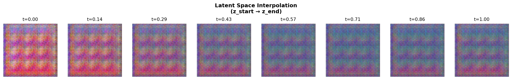

   Linear interpolation path through latent space showing smooth pattern transitions.

.. admonition:: Did You Know?

   The concept of a "latent space" is fundamental to many generative models, not just GANs. Variational Autoencoders (VAEs) [Kingma2014]_ and diffusion models also use latent representations, though they organize and sample from these spaces differently. Understanding latent spaces in DCGANs provides a foundation for these more advanced architectures.

Hands-On Exercises
==================

The exercises below follow a progressive scaffolding approach [Bransford2000]_, moving from observation (Execute) to experimentation (Modify) to application (Train).

Exercise 1: Observe DCGAN Generation
-------------------------------------

Run the pre-trained generator to observe how DCGANs create abstract art from random noise vectors.

Run the :download:`exercise1_observe.py <exercise1_observe.py>` script to generate a 4x4 grid of abstract art samples:

.. code-block:: bash

   python exercise1_observe.py

The script will load the pre-trained generator and create 16 unique abstract art patterns.

**Expected Output**:

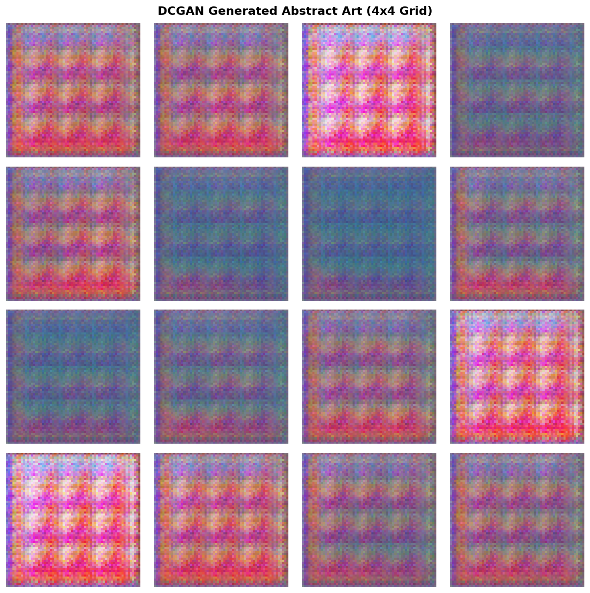

   Generated abstract art grid (4x4). Your output will look similar with different random patterns due to the random seed.

**Reflection Questions**:

1. How does the latent vector size (100 dimensions) affect the diversity of generated art?
2. What common visual patterns do you observe across samples?
3. Why does the generator use Tanh activation in the output layer?

.. dropdown:: Discussion
   :class-title: sd-font-weight-bold

   **Question 1**: The 100-dimensional latent space provides enough capacity for the generator to learn diverse patterns. Smaller dimensions (like 50) would limit variety, while larger dimensions (like 200) would increase training difficulty without much benefit.

   **Question 2**: You should observe smooth color gradients, geometric shapes (circles, stripes), and harmonious color palettes. These reflect the procedural patterns in the training dataset.

   **Question 3**: Tanh outputs values in [-1, 1], matching the normalized range of training images. This bounded output prevents extreme pixel values and ensures stable gradients during training [Goodfellow2016]_.

Exercise 2: Explore Parameters
-------------------------------

Experiment with generation parameters and explore latent space interpolation.

Run the :download:`exercise2_explore.py <exercise2_explore.py>` script to explore different generation options:

.. code-block:: bash

   python exercise2_explore.py

The script demonstrates two explorations:

1. **Larger Grid**: Generates a 6x6 grid (36 samples) to see more variation
2. **Latent Interpolation**: Creates smooth transitions between two random latent vectors

**Expected Outputs**:

.. figure:: exercise2_grid_6x6.png
   :width: 700px
   :align: center
   :alt: 6x6 grid of generated abstract art patterns

   6x6 grid showing greater variety in generated patterns.

.. figure:: exercise2_interpolation.png
   :width: 700px
   :align: center
   :alt: 8-step interpolation between two abstract patterns

   Latent space interpolation showing smooth transition between two patterns (8 steps).

**Try These Modifications**:

1. Change the random seed to generate different sample sets
2. Modify grid size (try 8x8 or 10x10)
3. Increase interpolation steps to 16 or 32 for smoother transitions
4. Compare linear interpolation at different points in latent space

.. dropdown:: Tips
   :class-title: sd-font-weight-bold

   * **Memory**: When generating many images, the script uses ``torch.no_grad()`` to save memory
   * **Interpolation smoothness**: More steps create smoother transitions but take longer to generate
   * **Random seeds**: Different seeds explore different regions of the latent space

Exercise 3: Train on African Fabric Patterns
---------------------------------------------

Train a DCGAN from scratch on African fabric patterns from Kaggle. This exercise demonstrates the complete training process from dataset preparation through 100 epochs of adversarial training, culminating in AI-generated textile designs inspired by traditional African patterns.

**What you'll learn:**

* How to prepare real-world image datasets for GAN training
* Understanding GAN training dynamics through loss curves and checkpoints
* Observing the progressive refinement of generated patterns over 100 epochs
* Interpreting training instability and adversarial learning

**Time commitment**:
* Dataset setup: 5-10 minutes (one-time)
* Training: 20-30 minutes on GPU (RTX 5070Ti or similar), 60-90 minutes on CPU
* Observation and analysis: 10 minutes

.. admonition:: Prerequisites
   :class: note

   This exercise requires downloading a dataset from Kaggle (free account needed). If you prefer to skip dataset setup, you can observe the pre-generated results shown below and proceed to the Challenge Extensions.

**Training Dataset Preview**

The model learns from 1,059 African fabric images. Below is a sample of the training data alongside the generated output:

.. list-table::
   :widths: 50 50

   * - .. figure:: training_samples_grid.png
          :width: 100%
          :alt: Nine sample African fabric patterns from the training dataset

          **Training Samples** (9 of 1,059 images)

     - .. figure:: dcgan_fabric_animation.gif
          :width: 100%
          :alt: DCGAN generating fabric patterns through latent interpolation

          **Generated Output** (trained model)

Notice how the generated patterns capture the geometric motifs, vibrant colors, and repeating structures characteristic of the training data while producing novel combinations.

.. dropdown:: Dataset Setup: Downloading and Preprocessing African Fabric Images
   :class-title: sd-font-weight-bold
   :collapse:

   This exercise uses the African Fabric dataset from Kaggle, which contains vibrant textile patterns with geometric and cultural motifs.

   **Step 1: Download the Dataset**

   1. Visit the Kaggle dataset page: https://www.kaggle.com/datasets/mikuns/african-fabric
   2. Click "Download" (requires free Kaggle account)
   3. Extract the downloaded ZIP file to: ``african_fabric_dataset/`` inside this module directory

   **Expected directory structure**:

   .. code-block:: text

      12.1.2_dcgan_art/
      ├── african_fabric_dataset/
      │   ├── image_001.jpg
      │   ├── image_002.jpg
      │   └── ... (additional images)
      ├── exercise3_train.py
      └── README.rst

   **Step 2: Preprocess the Dataset**

   Run the :download:`preprocess_african_fabric.py <preprocess_african_fabric.py>` script to resize and prepare images:

   .. code-block:: bash

      python preprocess_african_fabric.py

   This script will:

   * Resize images to 64×64 pixels (DCGAN input requirement)
   * Convert to RGB format
   * Save preprocessed images to ``african_fabric_processed/``
   * Display dataset statistics (total images, dimensions)

   **Expected output**:

   .. code-block:: text

      Found 1059 images in african_fabric_dataset
      Processed 50 images...
      Processed 100 images...
      ...
      Preprocessing complete!
      Total images processed: 1059
      Output directory: african_fabric_processed
      Image dimensions: 64×64 RGB

   **Quick Check**: Verify ``african_fabric_processed/`` contains PNG files:

   .. code-block:: bash

      # Windows PowerShell
      (Get-ChildItem african_fabric_processed\*.png).Count

      # Linux/Mac
      ls african_fabric_processed/*.png | wc -l

   You should see ~1059 files.

   .. admonition:: Note
      :class: note

      The preprocessing step is crucial because DCGAN requires fixed-size inputs. The original African fabric images may have varying dimensions.

.. dropdown:: Training Configuration and Execution
   :class-title: sd-font-weight-bold

   Run the :download:`exercise3_train.py <exercise3_train.py>` script after completing dataset setup:

   **Training hyperparameters:**

   * Epochs: 100 (extended training for higher quality)
   * Batch size: 64
   * Learning rate: 0.0002 (both Generator and Discriminator)
   * Optimizer: Adam with β₁=0.5, β₂=0.999
   * Loss function: Binary Cross-Entropy (BCE)
   * Dataset: 1059 African fabric patterns (preprocessed to 64×64 RGB)

   **How to Run**:

   .. code-block:: bash

      python exercise3_train.py

   The script will:

   1. Load the African fabric dataset from ``african_fabric_processed/``
   2. Initialize Generator and Discriminator networks
   3. Train for 100 epochs with progress updates printed every epoch
   4. Save checkpoints at epochs **10, 30, 50, 70, and 100**
   5. Generate training loss plots
   6. Save final trained model as ``exercise3_generator.pth``

   **Expected terminal output (excerpt)**:

   .. code-block:: text

      ============================================================
      Exercise 3: Train DCGAN on African Fabric Patterns
      ============================================================
      Device: cuda
      Epochs: 100
      Batch size: 64

      Dataset: 1059 African fabric images
      Batches per epoch: 17

      Starting training...

      Epoch [1/100] | D Loss: 1.0472 | G Loss: 9.4884
      Epoch [2/100] | D Loss: 2.2676 | G Loss: 16.7600
      Epoch [3/100] | D Loss: 1.4497 | G Loss: 18.4135
      ...
      Epoch [30/100] | D Loss: 1.5704 | G Loss: 3.6112
        Saved exercise3_epoch_30.png
      ...
      Epoch [69/100] | D Loss: 2.0228 | G Loss: 11.1783
      Epoch [70/100] | D Loss: 0.3824 | G Loss: 6.0750
        Saved exercise3_epoch_70.png
      ...
      Epoch [100/100] | D Loss: 0.3726 | G Loss: 8.0730
        Saved exercise3_epoch_100.png

      Generator saved to exercise3_generator.pth
      Saved exercise3_training_progress.png
      Saved exercise3_final_samples.png

      Training complete!

   **What to observe during training:**

   * **Loss oscillation**: Both G and D losses will fluctuate significantly (this is normal!)
   * **Occasional spikes**: You may see sudden jumps (e.g., D Loss: 2.56, G Loss: 11.18) - expected in GAN training
   * **No clear convergence**: Unlike supervised learning, GAN losses don't smoothly decrease to zero
   * **Checkpoint saves**: Images saved at epochs 10, 30, 50, 70, 100 for quality comparison

   **Training time estimates:**

   * GPU (NVIDIA RTX 5070Ti): ~20-30 minutes
   * GPU (NVIDIA GTX 1060 or similar): ~40-60 minutes
   * CPU (Intel i7/i9): ~60-90 minutes

   .. admonition:: Tip: Monitoring Training
      :class: tip

      You can stop training early with Ctrl+C and still examine the checkpoint images generated so far. The script saves progress incrementally, so you won't lose work if you interrupt it.

Training Results: Observing GAN Learning Over 100 Epochs
~~~~~~~~~~~~~~~~~~~~~~~~~~~~~~~~~~~~~~~~~~~~~~~~~~~~~~~~~

The training process generates multiple outputs that demonstrate how the DCGAN progressively learns to generate African fabric-style patterns. Below, we examine the training dynamics and visual evolution across 100 epochs.

**1. Training Dynamics: Loss Curves**

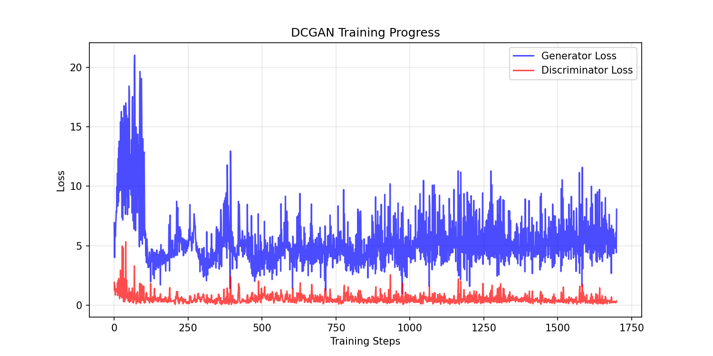

   Generator (blue) vs Discriminator (red) losses over 100 epochs. Oscillation indicates healthy adversarial training.

---

**2. Visual Progression: Generated Samples Across Training**

Watch how the Generator learns over 100 epochs. Each checkpoint shows a 4×4 grid of generated patterns.

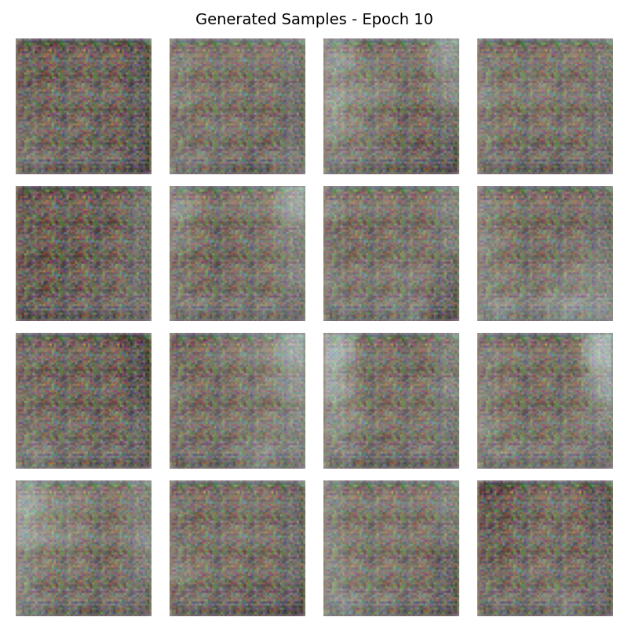

   **Epoch 10** — Noisy attempts with basic colors and rough shapes. The network is starting to learn what "fabric" looks like.

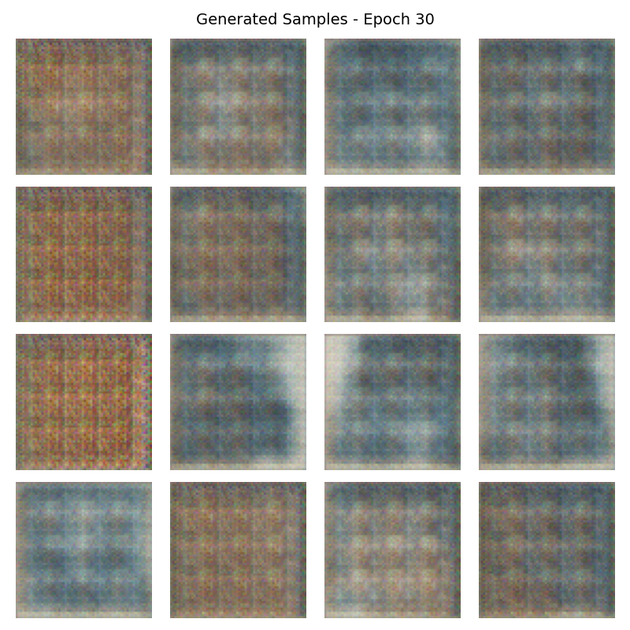

   **Epoch 30** — Geometric elements emerge: stripes, bands, and blocky shapes reminiscent of Kente cloth.

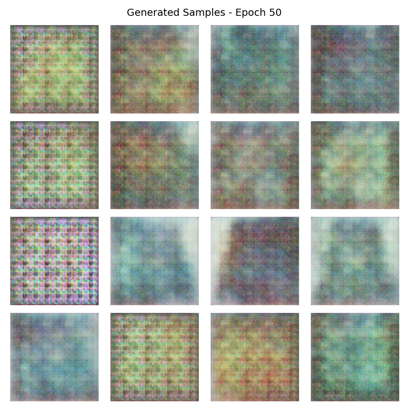

   **Epoch 50** — Well-defined patterns with clear stripes, borders, and symmetrical arrangements.

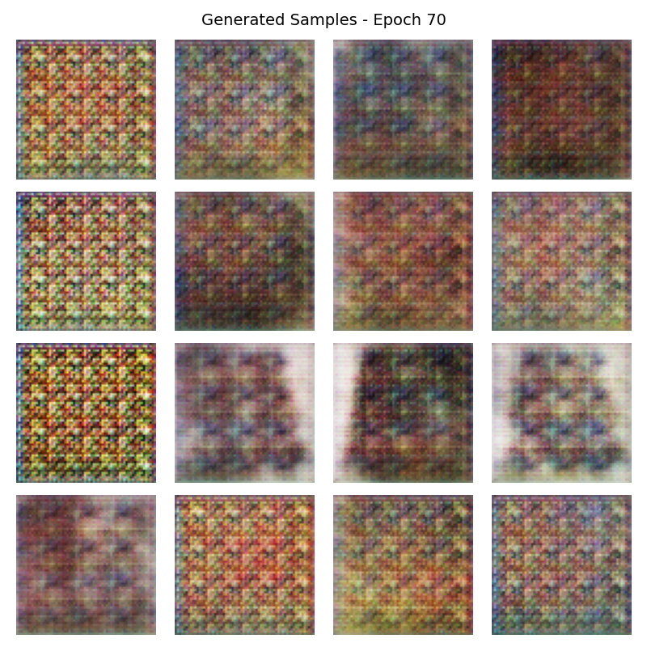

   **Epoch 70** — Intricate designs with sharp color boundaries and complex motif arrangements.

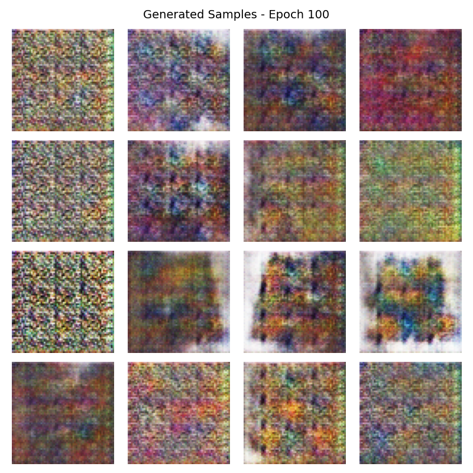

   **Epoch 100** — Diverse, fabric-like patterns with rich geometric detail. Bold colors, clean edges, and unique variations in each sample.

---

**3. Final Sample Grid**

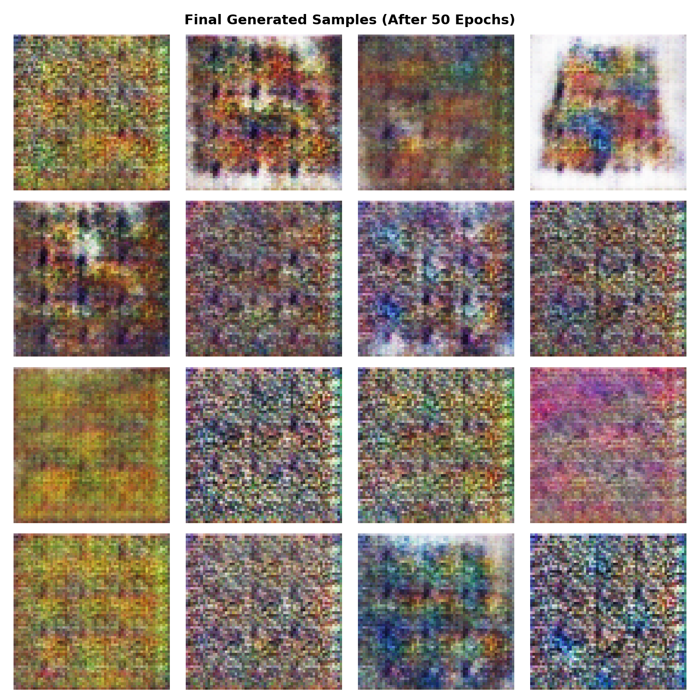

   16 patterns from the trained Generator, each from a unique noise vector.

---

**4. Latent Space Interpolation Animation**

.. figure:: dcgan_fabric_animation.gif
   :width: 525px
   :align: center
   :alt: Animated latent space interpolation showing smooth transitions between generated African fabric patterns

   **Smooth transitions through latent space.** 

.. admonition:: Try It Yourself
   :class: tip

   Generate your own animation using the trained model:

   .. code-block:: bash

      python generate_animation.py

   This creates an animated GIF showing your trained Generator exploring latent space. You can modify the script to change the number of keypoints, frame rate, or random seed to create different animations.

.. dropdown:: Troubleshooting Common Issues
   :class-title: sd-font-weight-bold

   **Issue 1: "Dataset directory not found!"**

   **Cause**: The ``african_fabric_processed/`` directory doesn't exist or is empty.

   **Solution**:

   1. Verify you completed Step 2 (Preprocessing) from the Dataset Setup section
   2. Check that ``african_fabric_processed/`` contains ~1059 PNG files
   3. If the directory is empty, re-run ``preprocess_african_fabric.py``

   ---

   **Issue 2: Training is very slow (>2 hours)**

   **Cause**: Training on CPU instead of GPU.

   **Solution**:

   * Verify GPU availability: Open Python and run:

     .. code-block:: python

        import torch
        print(torch.cuda.is_available())  # Should print True if GPU detected

   * Install CUDA-enabled PyTorch if False (see https://pytorch.org/get-started/locally/)
   * Alternatively, reduce epochs to 50 for faster CPU training (still produces good results)

   ---

   **Issue 3: Loss values look very different from example**

   **Cause**: GAN training is inherently stochastic. Different random seeds produce different loss trajectories.

   **Solution**:

   * Check the **generated images**, not just loss values—visual quality is the true metric
   * As long as both G and D losses fluctuate (rather than one staying at 0), training is likely healthy
   * Occasional spikes (e.g., D Loss > 2.0) are normal and don't indicate failure

   ---

   **Issue 4: Generated images are all noise (even after 50+ epochs)**

   **Possible causes**:

   * Dataset loading issue (model trained on corrupted/wrong data)
   * Numerical instability (rare with default hyperparameters)

   **Solution**:

   1. Verify dataset integrity: Open a few images in ``african_fabric_processed/`` manually—they should be 64×64 color images of fabrics
   2. Check terminal output shows correct batch count (should be 17 batches per epoch for 1059 images)
   3. Try restarting training from scratch (delete ``exercise3_generator.pth`` if it exists)

   ---

   **Issue 5: Out of memory error (CUDA OOM)**

   **Cause**: Batch size too large for GPU memory.

   **Solution**:

   * Edit ``exercise3_train.py`` and reduce ``BATCH_SIZE`` from 64 to 32 or 16
   * This will slow training slightly but use less memory
   * Training quality is not significantly affected by smaller batches

   ---

   **Issue 6: "ModuleNotFoundError: No module named 'dcgan_model'"**

   **Cause**: The ``dcgan_model.py`` file is missing or not in the same directory.

   **Solution**:

   * Verify ``dcgan_model.py`` exists in ``12.1.2_dcgan_art/`` directory
   * Run training script from the correct directory:

     .. code-block:: bash

        cd content/Module_12_generative_ai_models/12.1_generative_adversarial_networks/12.1.2_dcgan_art
        python exercise3_train.py

Implementation Note
~~~~~~~~~~~~~~~~~~~

The DCGAN implementation in this module is adapted from the official PyTorch DCGAN tutorial [PyTorchDCGAN]_, which implements the architecture described in Radford et al. (2015) [Radford2015]_. The code has been simplified for educational purposes and modified to generate abstract art rather than faces.

**Original Source**: https://pytorch.org/tutorials/beginner/dcgan_faces_tutorial.html

**License**: BSD-3-Clause (PyTorch)

**Educational Adaptations**:

- Simplified training loop for clarity
- Abstract art dataset instead of celebrity faces
- Reduced model complexity for faster training on CPU
- Extensive inline comments for learning

.. dropdown:: Challenge Extensions
   :class-title: sd-font-weight-bold

   Now that you've trained a DCGAN and observed its learning progression, try these advanced experiments:

   **1. Hyperparameter Exploration**

   * **Learning rate sensitivity**: Change ``LEARNING_RATE`` in ``exercise3_train.py`` to 0.0001 or 0.0005 and compare results
   * **Batch size effects**: Reduce ``BATCH_SIZE`` to 32 or increase to 128 (if GPU memory allows)
   * **Deeper networks**: Modify ``dcgan_model.py`` to add extra convolutional layers
   * **Hypothesis**: Which hyperparameter has the greatest impact on pattern quality? Keep training logs to compare.

   **2. Extended Training**

   * Train for 200 epochs and observe if quality continues improving after epoch 100
   * **Hypothesis**: Does the Generator reach a quality plateau, or does it keep refining details indefinitely?

   **3. Dataset Mixing**

   * Download another textile dataset (e.g., batik, ikat, or Scottish tartan patterns)
   * Mix both datasets in ``african_fabric_processed/`` (50/50 split)
   * Train and observe: Does the Generator blend styles, or does it mode-collapse to one style?

   **4. Latent Space Interpolation**

   * Use the saved ``exercise3_generator.pth`` to create smooth transitions between two fabric patterns
   * Modify ``exercise2_explore.py`` to load your trained model instead of the pre-trained one
   * Create an interpolation GIF showing morphing between patterns

   **5. Conditional Generation (Advanced)**

   * Research conditional GANs (cGANs) that allow specifying desired attributes (e.g., "horizontal stripes" vs "geometric blocks")
   * Implement a simple conditioning mechanism using one-hot encoded labels
   * **This requires significant model architecture changes—consider it a multi-day project**

   **6. Transfer Learning**

   * Start with the pre-trained Generator from this exercise (``exercise3_generator.pth``)
   * Fine-tune it on a **different but related** dataset (e.g., modern abstract patterns)
   * Compare quality vs. training from scratch: Does transfer learning speed up convergence?

.. admonition:: Cultural Context: African Textile Patterns
   :class: note

   African textiles carry deep cultural significance, with patterns representing social status, spiritual beliefs, and historical events. By training a GAN on these patterns, we're exploring how AI can learn and generate variations of culturally meaningful designs.

   **Ethical considerations**:

   - Generated patterns are AI interpretations, not authentic cultural artifacts
   - This exercise is for educational purposes to understand generative models
   - Respect the cultural origins when discussing or sharing generated designs

   For deeper understanding of African textile traditions, see Picton (1995) [Picton1995]_ and Clarke (2019) [Clarke2019]_.

Summary
=======

Key Takeaways
-------------

* **Convolutional architectures** preserve spatial structure in images, making them far superior to fully-connected networks for image generation
* The **Generator** uses transposed convolutions to progressively upsample from a small feature map to the final image
* The **Discriminator** uses strided convolutions to downsample images to a real/fake classification
* **Batch Normalization** and specific activation functions (ReLU, LeakyReLU, Tanh) are critical for stable training
* The **latent space** is a learned representation where nearby points produce similar images
* **Interpolation** through latent space creates smooth transitions between generated images

Common Pitfalls
---------------

* **Mode collapse**: The generator produces limited variety of outputs. Address by adjusting learning rates or using techniques like minibatch discrimination
* **Checkerboard artifacts**: Caused by transposed convolutions [Odena2016]_. Can be reduced by using resize-convolution instead or changing kernel/stride ratios
* **Training instability**: GAN training can be unstable. Monitor both generator and discriminator losses; if one dominates, adjust learning rates
* **Wrong output range**: Forgetting to apply Tanh (output) or normalize inputs to [-1, 1] causes training to diverge
* **Dimension mismatches**: Ensure input latent vectors have shape ``(batch, latent_dim, 1, 1)`` not ``(batch, latent_dim)``

References
==========

.. [Radford2015] Radford, A., Metz, L., & Chintala, S. (2015). Unsupervised Representation Learning with Deep Convolutional Generative Adversarial Networks. *arXiv preprint*. https://arxiv.org/abs/1511.06434

.. [PyTorchDCGAN] PyTorch Contributors. (2024). DCGAN Tutorial. *PyTorch Tutorials*. https://docs.pytorch.org/tutorials/beginner/dcgan_faces_tutorial.html

.. [Goodfellow2014] Goodfellow, I., Pouget-Abadie, J., Mirza, M., Xu, B., Warde-Farley, D., Ozair, S., Courville, A., & Bengio, Y. (2014). Generative Adversarial Nets. *Advances in Neural Information Processing Systems*, 27.

.. [LeCun2015] LeCun, Y., Bengio, Y., & Hinton, G. (2015). Deep learning. *Nature*, 521(7553), 436-444. https://doi.org/10.1038/nature14539

.. [Goodfellow2016] Goodfellow, I., Bengio, Y., & Courville, A. (2016). *Deep Learning*. MIT Press. https://www.deeplearningbook.org/

.. [Kingma2014] Kingma, D. P., & Welling, M. (2014). Auto-Encoding Variational Bayes. In *Proceedings of the 2nd International Conference on Learning Representations (ICLR 2014)*. https://arxiv.org/abs/1312.6114

.. [Ioffe2015] Ioffe, S., & Szegedy, C. (2015). Batch Normalization: Accelerating Deep Network Training by Reducing Internal Covariate Shift. *Proceedings of ICML*.

.. [Odena2016] Odena, A., Dumoulin, V., & Olah, C. (2016). Deconvolution and Checkerboard Artifacts. *Distill*. https://distill.pub/2016/deconv-checkerboard/

.. [PyTorchDocs] PyTorch Contributors. (2024). PyTorch Documentation. https://docs.pytorch.org/docs/stable/

.. [Bransford2000] Bransford, J. D., Brown, A. L., & Cocking, R. R. (Eds.). (2000). *How People Learn: Brain, Mind, Experience, and School*. National Academy Press.

.. [Picton1995] Picton, J. (1995). Technology, tradition and lurex: Some comments on textile history and design in West Africa. In J. B. Eicher (Ed.), *Dress and Ethnicity* (pp. 13-52). Berg Publishers.

.. [Clarke2019] Clarke, D. (2019). *African Textiles: The Karun Thakar Collection*. Prestel Publishing. ISBN: 978-3-7913-8528-9
