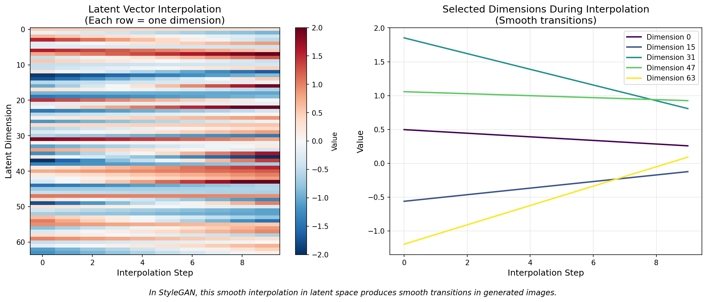
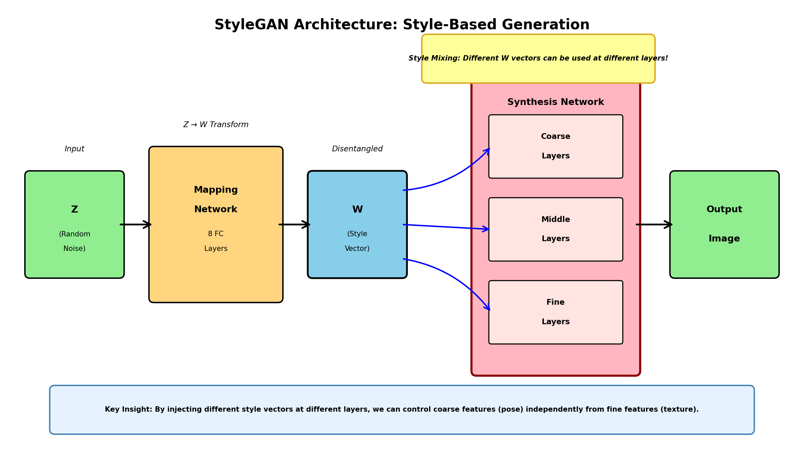
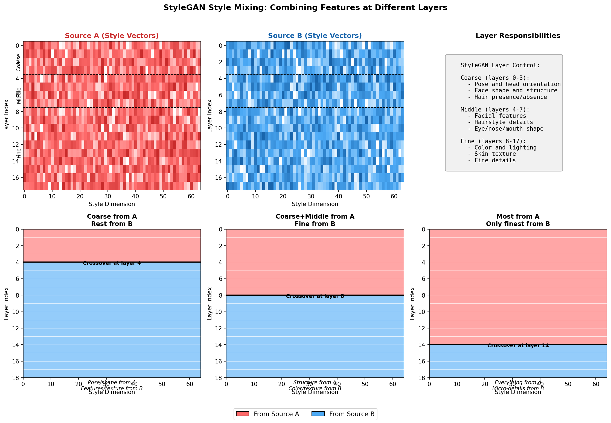
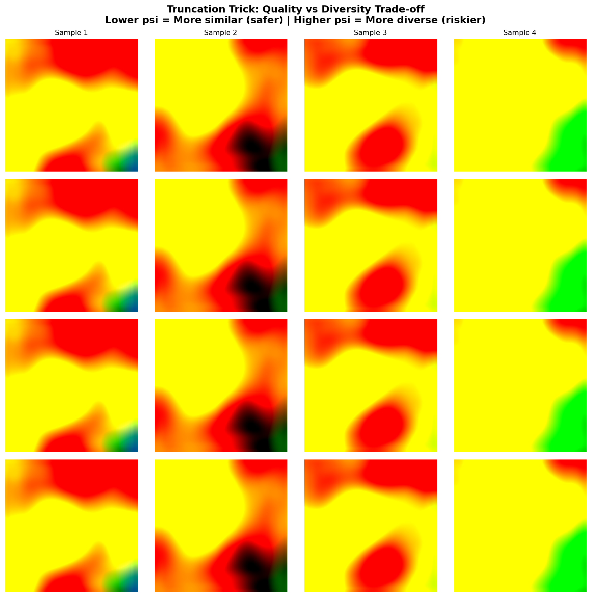
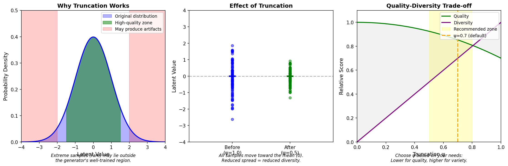
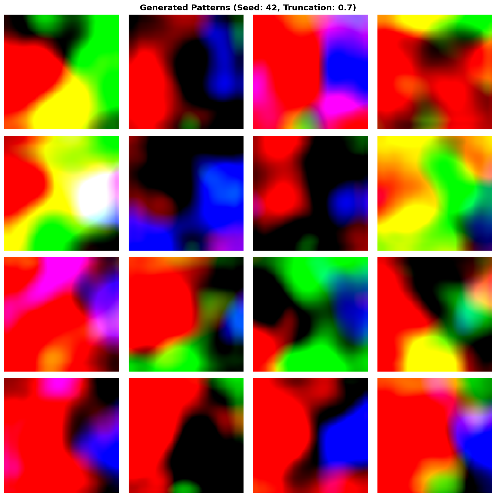
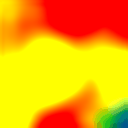

.. _module-12-1-3-stylegan-exploration:

=====================================
12.1.3 StyleGAN Exploration
=====================================

:Duration: 35-40 minutes + 10-12 hours (optional Exercise 3)
:Level: Advanced

Overview
========

StyleGAN represents one of the most significant breakthroughs in generative AI, introducing unprecedented control over what features appear in generated images. Unlike traditional GANs where the entire output is determined by a single random vector, StyleGAN allows you to independently control different aspects of the image: from pose and face shape to fine details like skin texture and hair color.

In this exercise, you will explore the key concepts that make StyleGAN revolutionary through simulation-based learning. Rather than requiring GPU resources and large model downloads, we use educational code to demonstrate how latent space navigation, style mixing, and truncation work. These fundamental concepts transfer directly to working with real StyleGAN models and other generative systems.

**Learning Objectives**

By completing this module, you will:

* Understand StyleGAN's style-based architecture and why it enables fine-grained control
* Explore latent space concepts through simulation and visualization
* Apply the truncation trick to balance diversity versus quality in generation
* Create style mixing visualizations showing how features from different sources combine

.. list-table::
   :widths: 50 50

   * - .. figure:: ../12.1.2_dcgan_art/training_samples_grid.png
          :width: 100%
          :alt: Nine sample African fabric patterns from the training dataset

          **Training Data** (9 of 1,059 images)

     - .. figure:: stylegan_demo.gif
          :width: 100%
          :alt: StyleGAN generating fabric patterns through latent space walk

          **Generated Output** (StyleGAN2)

Quick Start: See Latent Space in Action
=======================================

Before diving into theory, let us see the core concept that makes StyleGAN work: smooth navigation through latent space. Run this code to visualize how two random latent vectors interpolate:

.. code-block:: python
   :caption: Visualizing latent space interpolation
   :linenos:

   import numpy as np
   import matplotlib.pyplot as plt

   # Sample two random latent vectors (like StyleGAN's input)
   np.random.seed(42)
   vector_a = np.random.randn(64)  # Start point in latent space
   vector_b = np.random.randn(64)  # End point in latent space

   # Interpolate between them (10 steps from A to B)
   steps = 10
   alphas = np.linspace(0, 1, steps)
   interpolated = np.array([(1 - a) * vector_a + a * vector_b for a in alphas])

   # Visualize the smooth transition
   plt.figure(figsize=(10, 4))
   plt.imshow(interpolated.T, aspect='auto', cmap='RdBu_r')
   plt.xlabel('Interpolation Step')
   plt.ylabel('Latent Dimension')
   plt.title('Smooth Transition in Latent Space')
   plt.colorbar(label='Value')
   plt.savefig('latent_interpolation.png', dpi=150)

   Interpolation steps from Vector A (left) to Vector B (right).

**What you're seeing:** Each row in the heatmap represents one dimension of the latent vector (64 dimensions total). Each column is a step in the interpolation from Vector A (left) to Vector B (right). Colors show the value at each point (red = positive, blue = negative).

**Why this matters:** In a real StyleGAN, this smooth mathematical transition would produce a video of one face gradually morphing into another face. The smoothness you see in this heatmap translates directly to smooth visual transitions in generated images.

The key insight is that **smooth changes in latent space produce smooth changes in the output**. This property, called the latent space's "continuity," is what enables all of StyleGAN's advanced features.

Core Concepts
=============

Concept 1: The StyleGAN Revolution
----------------------------------

Traditional GANs like DCGAN use a single random vector to generate an entire image. The generator network transforms this vector through many layers, but every aspect of the output (pose, color, texture) is entangled in that single input [Goodfellow2014]_.

**StyleGAN's Key Innovation**: Instead of feeding the latent vector directly to the generator, StyleGAN introduced a **style-based architecture** [Karras2018]_:

1. **Mapping Network**: A random vector ``z`` (from normal distribution) is first transformed into an intermediate latent vector ``w`` through 8 fully-connected layers
2. **Synthesis Network**: The generator creates the image progressively, from 4x4 to 1024x1024 resolution
3. **Style Injection**: At each layer of the synthesis network, the ``w`` vector is used to control the "style" of generation

   StyleGAN architecture: Z to W mapping, then style injection at each synthesis layer.

**Why does this matter?** The intermediate ``w`` space is more "disentangled" than the original ``z`` space. This means different dimensions of ``w`` tend to control different, independent features. When you change one dimension, you modify one aspect of the face (say, age) without affecting others (like pose).

.. admonition:: Did You Know?

   StyleGAN was developed by NVIDIA researchers and first released on arXiv in December 2018. The paper was officially published at CVPR 2019, where it won an Honorable Mention for Best Paper. The generated faces were so realistic that the website "This Person Does Not Exist" (created by engineer Phillip Wang using StyleGAN) went viral in February 2019, sparking widespread discussion about the implications of AI-generated imagery [Karras2018]_.

Concept 2: Latent Space and Disentanglement
-------------------------------------------

The **latent space** is the multidimensional space of possible inputs to a generative model. In StyleGAN, this is a 512-dimensional space where each point corresponds to a potential generated image [White2016]_.

**Understanding Dimensionality**

Imagine a 2D latent space where:
- The x-axis controls hair color (left=blonde, right=black)
- The y-axis controls age (bottom=young, top=old)

In a "disentangled" space, moving along one axis changes only that feature. StyleGAN's mapping network helps achieve this disentanglement in 512 dimensions.

**Interpolation: Walking Through Latent Space**

Linear interpolation between two latent vectors produces intermediate images that smoothly transition between the two "source" images:

.. code-block:: python
   :caption: Linear interpolation formula
   :linenos:

   def interpolate(vector_a, vector_b, alpha):
       """
       Interpolate between two latent vectors.

       Parameters:
           vector_a: Starting point in latent space
           vector_b: Ending point in latent space
           alpha: Interpolation weight (0 = all A, 1 = all B)

       Returns:
           Interpolated vector
       """
       return (1 - alpha) * vector_a + alpha * vector_b

   # Create 10 steps from A to B
   steps = [interpolate(vector_a, vector_b, alpha) for alpha in np.linspace(0, 1, 10)]

When this interpolation is applied to real StyleGAN, the resulting images show smooth transitions: faces gradually morphing from one identity to another, changing expression, age, or other features along the way.

.. note::

   The quality of interpolation depends on the latent space's structure. StyleGAN's mapping network specifically improves this by transforming the simple Gaussian distribution of ``z`` into a more uniform distribution in ``w`` space, reducing the likelihood of passing through "bad" regions during interpolation [Karras2018]_.

Concept 3: Style Mixing and Layer Control
-----------------------------------------

StyleGAN's most powerful feature is **style mixing**: the ability to combine features from different source images by using different style vectors at different layers [Karras2020]_.

**How Layers Control Different Features**

StyleGAN's synthesis network generates images progressively through 18 layers (for 1024x1024 output). Different layer ranges control different aspects:

* **Coarse layers (0-3)**: Overall pose, face shape, head orientation, presence of accessories
* **Middle layers (4-7)**: Facial features, hairstyle, eye shape, nose structure
* **Fine layers (8-17)**: Color, texture, lighting, micro-features, skin details

   Style mixing: combining features from two sources at different layer crossover points.

**Style Mixing in Practice**

To create a hybrid image:

1. Generate style vectors ``w_A`` and ``w_B`` for two different random inputs
2. Choose a crossover point (e.g., layer 4)
3. Use ``w_A`` for layers 0-3 (coarse features)
4. Use ``w_B`` for layers 4-17 (middle and fine features)
5. Result: Image with A's pose/shape but B's features/texture

.. code-block:: python
   :caption: Style mixing simulation
   :linenos:

   def mix_styles(source_a, source_b, crossover_layer):
       """
       Mix styles from two sources at a specified crossover point.

       Layers before crossover use source_a.
       Layers from crossover onwards use source_b.
       """
       num_layers = 18
       mixed = np.zeros((num_layers, 512))

       # Take coarse styles from A
       mixed[:crossover_layer] = source_a[:crossover_layer]

       # Take remaining styles from B
       mixed[crossover_layer:] = source_b[crossover_layer:]

       return mixed

This technique is what enables applications like:

* Transferring hairstyle from one person to another
* Applying the color scheme of one image to the structure of another
* Creating variations of a face with different expressions

Concept 4: The Truncation Trick
-------------------------------

The **truncation trick** is a technique for trading off between diversity and quality in generated images [Karras2018]_.

**The Problem with Rare Samples**

Latent vectors are sampled from a normal distribution. While most samples fall near the mean (the "center" of the distribution), some samples lie in the tails. These "rare" samples may produce lower-quality outputs because the generator saw fewer training examples from these regions.

**The Solution: Move Toward the Mean**

Truncation pulls all latent vectors toward the mean:

.. math::

   w_{truncated} = \bar{w} + \psi \cdot (w - \bar{w})

Where:

* :math:`\bar{w}` is the mean latent vector (average of many samples)
* :math:`\psi` (psi) is the truncation parameter (0 to 1)
* :math:`w` is the original latent vector

   Truncation effect: lower psi clusters vectors near the mean.

**Choosing the Right Truncation Value**

.. list-table:: Truncation Trade-offs
   :widths: 20 40 40
   :header-rows: 1

   * - Psi Value
     - Effect
     - Use Case
   * - 1.0
     - No truncation, full diversity
     - Exploring the full range of possible outputs
   * - 0.7
     - Balanced (recommended default)
     - General-purpose generation
   * - 0.5
     - High quality, moderate diversity
     - When quality is more important than variety
   * - 0.3
     - Highest quality, limited diversity
     - Showcasing capabilities, avoiding artifacts

   Truncation trade-off: quality vs. diversity.

Hands-On Exercises
==================

.. note::

   Exercises 1 and 2 require a pre-trained checkpoint. Download the checkpoint before proceeding:

   1. Download ``model_99.pt`` (~189 MB) from `GitHub Releases <https://github.com/BurakKagan/numpy-to-genAI/releases/tag/stylegan-checkpoint>`_
   2. Create the folder ``models/african_fabrics/`` in this exercise directory
   3. Place the downloaded file in ``models/african_fabrics/model_99.pt``

   Alternatively, complete Exercise 3 (Option B) to train your own model from scratch.

   **About the images shown:** All output images in this module (fabric grids, truncation comparisons, morphing animations) were generated using the pre-trained checkpoint. Conceptual diagrams were created separately for educational purposes.

Setup and Installation
----------------------

This module requires additional dependencies for Exercise 3. Install them using:

.. code-block:: bash

   pip install stylegan2-pytorch torch torchvision

**System Requirements:**

* Python 3.8+
* PyTorch 1.12+ with CUDA support (for training)
* 4GB+ GPU memory (for training; CPU-only works for generation)
* Approximately 500MB disk space for pre-trained checkpoint

**Note:** Exercises 1 and 2 only require NumPy and Matplotlib (already installed). Exercise 3 requires PyTorch and stylegan2-pytorch.

Exercise 1: Generate Your First Patterns (10-15 min)
----------------------------------------------------

In this exercise, you will run StyleGAN2 and see it generate novel African fabric patterns. This is the "Execute" step: run the code, see the output, then experiment.

**Step 1: Run the Generation Script**

Run the :download:`exercise1_generate.py <exercise1_generate.py>` script:

.. code-block:: bash

   python exercise1_generate.py

**Expected Output:**

* File created: ``generated_fabrics_seed42.png`` (4x4 grid of 16 fabric patterns)
* Console output showing model loading and generation progress

   16 generated fabric patterns (seed 42, psi 0.7).

**Step 2: Observe the Results**

Open the generated image. You should see 16 unique African fabric patterns, each with:

* Geometric shapes and motifs
* Vibrant colors (reds, yellows, blues, greens)
* Consistent style (they all "look like" African fabrics)

**Step 3: Change the Seed and Compare**

Open ``exercise1_generate.py`` and change the seed:

.. code-block:: python

   RANDOM_SEED = 100   # Was 42, now 100

Run the script again:

.. code-block:: bash

   python exercise1_generate.py

Now you have two files: ``generated_fabrics_seed42.png`` and ``generated_fabrics_seed100.png``.

**Reflection:**

Compare the two images. Notice that:

* Every pattern is completely different between the two seeds
* Yet both images have the same "African fabric" style
* The model learned the style from 1,059 training images but can generate infinite variations

.. dropdown:: Key Insight
   :class-title: sd-font-weight-bold

   The seed controls which point in the 512-dimensional latent space we sample from. Different seeds = different points = different patterns. But all points in this latent space produce valid fabric patterns because the model learned to map every point to a realistic output.

Exercise 2: Explore Parameters (10-15 min)
------------------------------------------

Now that you have seen StyleGAN generate images, let us explore two key parameters: truncation (quality vs diversity) and latent interpolation (smooth morphing).

Run the :download:`exercise2_explore.py <exercise2_explore.py>` script:

.. code-block:: bash

   python exercise2_explore.py

**Expected Output:**

* File created: ``truncation_comparison.png`` (comparison of 4 truncation values)
* File created: ``fabric_morph.gif`` (animated morphing between patterns)
* File created: ``morph_endpoints.png`` (start and end patterns)

**Part A: Truncation Comparison**

Open ``truncation_comparison.png``. You see the same base samples generated at four different truncation (psi) values:

   Truncation comparison: psi 0.3 to 1.0.

* **psi = 0.3**: Very similar patterns, safe but boring
* **psi = 0.5**: More variety, still high quality
* **psi = 0.7**: Good balance of quality and diversity (default)
* **psi = 1.0**: Maximum diversity, but some patterns may look unusual

.. dropdown:: Why This Happens
   :class-title: sd-font-weight-bold

   Truncation moves all latent vectors toward the mean of the distribution. Lower psi values cluster samples near the center where the model has seen the most training data. This produces more "average" but reliable outputs. Higher psi values allow samples from the edges of the distribution, which can produce surprising results (both good and bad).

**Part B: Morphing Animation**

Open ``fabric_morph.gif`` in a browser or image viewer. You should see a smooth animation of one fabric pattern transforming into another.

   Smooth morphing between two patterns via latent interpolation.

**What to observe:**

* The transition is smooth with no glitches or artifacts
* Every intermediate frame is a valid fabric pattern
* Features blend naturally (colors transition, shapes morph)

.. dropdown:: Why Morphing Works
   :class-title: sd-font-weight-bold

   The animation is created by linear interpolation in latent space:

   .. code-block:: python

      # For each frame, blend between start and end vectors
      interpolated = (1 - alpha) * vector_a + alpha * vector_b

   This simple math produces smooth visual transitions because StyleGAN's latent space is continuous: nearby points produce similar images. The mapping network specifically improves this property by transforming the irregular Z space into the more uniform W space.

**Try This:**

Modify ``exercise2_explore.py`` to explore different combinations:

.. code-block:: python

   # Change seeds for different morphing pairs
   SEED_A = 777    # Try different starting pattern
   SEED_B = 2024   # Try different ending pattern

   # Change truncation values to compare
   TRUNCATION_VALUES = [0.2, 0.4, 0.6, 0.8]

**Reflection Questions:**

1. Which truncation value produces the most visually pleasing results for you?
2. Why do the intermediate frames in the morphing animation look like valid fabric patterns?
3. What would happen if you morphed between two very different seeds (e.g., 1 and 999999)?

Exercise 3: Train and Generate with StyleGAN
--------------------------------------------------------------------

In this exercise, you will work with a real StyleGAN2 implementation to generate African fabric patterns. You have two options:

**Option A: Use Pre-trained Checkpoint (Recommended)**

Skip training and use the provided checkpoint to immediately generate new designs.

**Option B: Train Your Own Model**

Train the StyleGAN2 model from scratch (requires 10-12 hours on GPU).

Step 1: Understanding the Code
^^^^^^^^^^^^^^^^^^^^^^^^^^^^^^

The training and generation code uses **lucidrains/stylegan2-pytorch** [PhilWang2024]_, a simplified educational implementation of StyleGAN2. This implementation focuses on clarity and ease of use while maintaining the core StyleGAN2 architecture.

**Key differences from the simulations:**

* Uses real neural networks (not simplified math)
* Trains on actual image data
* Produces high-quality generated images
* Requires GPU for reasonable training times

.. dropdown:: Option A: Generate Images (Using Pre-trained Checkpoint)
   :class-title: sd-font-weight-bold

   Run the generation script to create new fabric patterns:

   .. code-block:: bash

      python exercise3_generate.py

   **Expected Output:**

   * ``generated_fabrics.png``: 4×4 grid of generated patterns
   * ``fabric_interpolation.png``: Smooth morphing between two patterns
   * Console output showing generation progress

   The generated patterns should capture the style of African fabric designs (geometric shapes, vibrant colors, repeating motifs) while creating novel combinations not present in the original dataset.

.. dropdown:: Option B: Train Your Own Model (10-12 hours on GPU)
   :class-title: sd-font-weight-bold

   If you have a GPU and want to experience the training process:

   .. code-block:: bash

      python exercise3_train.py

   **Training parameters:**

   * Dataset: 1,059 African fabric images (64x64 pixels) from Module 12.1.2
   * Batch size: 8
   * Learning rate: 2e-4
   * Training steps: 10,000 (adjustable)
   * Estimated time: 10-12 hours on modern GPU (RTX 3070/4070 class)

   **What to observe during training:**

   * Initial outputs are pure noise
   * After ~1,000 steps: basic colors and patterns emerge
   * After ~5,000 steps: recognizable fabric patterns appear
   * After ~10,000 steps: high-quality diverse patterns are generated

   **Training Progress Visualization:**

   These sample images were generated during actual training, showing how the model learns:

   .. figure:: training_results/african_fabrics/0-ema.jpg
      :width: 300px
      :align: center
      :alt: Early training output showing random colored patterns

      Checkpoint 0 (Early): Random noise with basic color regions

   .. figure:: training_results/african_fabrics/5-ema.jpg
      :width: 300px
      :align: center
      :alt: Mid-training output showing emerging fabric patterns

      Checkpoint 5 (Mid): Geometric patterns and fabric textures emerge

   .. figure:: training_results/african_fabrics/9-ema.jpg
      :width: 300px
      :align: center
      :alt: Final training output showing high-quality fabric patterns

      Checkpoint 9 (Final): High-quality, diverse fabric designs

   The progression demonstrates how the generator learns to create increasingly realistic patterns while the discriminator becomes better at distinguishing real from fake images.

   **Understanding the Training Script:**

   The training script uses these key components:

   1. **Data loading**: Reads images from the African fabric dataset
   2. **Model initialization**: Creates generator and discriminator networks
   3. **Training loop**: Alternates between training discriminator and generator
   4. **Checkpointing**: Saves model weights every 100 steps
   5. **Loss tracking**: Monitors generator and discriminator losses

   The StyleGAN2 architecture uses:

   * Mapping network: 8 fully-connected layers
   * Synthesis network: Progressive generation from 4x4 to 64x64
   * Style injection: At each synthesis layer
   * Discriminator: Progressive downsampling with residual connections

.. dropdown:: Step 4: Experiment with Parameters
   :class-title: sd-font-weight-bold

   Modify the generation script to explore StyleGAN's capabilities:

   **Truncation variations:**

   .. code-block:: python

      # In exercise3_generate.py, change TRUNCATION value
      TRUNCATION = 1.0   # Maximum diversity
      TRUNCATION = 0.7   # Balanced (default)
      TRUNCATION = 0.5   # Higher quality, less diversity

   **Generating more samples:**

   .. code-block:: python

      # Change NUM_IMAGES to generate different grid sizes
      NUM_IMAGES = 16  # 4x4 grid (default)
      NUM_IMAGES = 25  # 5x5 grid
      NUM_IMAGES = 64  # 8x8 grid

Summary
=======

Key Takeaways
-------------

* **StyleGAN's architecture** separates the random input (Z) from style control (W) through a mapping network, enabling disentangled feature control
* **Latent space interpolation** produces smooth visual transitions because the W space has better geometric properties than the Z space
* **Style mixing** allows combining coarse features (pose, shape) from one source with fine features (texture, color) from another by using different W vectors at different layers
* **The truncation trick** trades off diversity for quality by moving latent vectors toward the mean, reducing the likelihood of artifacts from rare samples
* **Layer-based control** in StyleGAN means that layers 0-3 control coarse features, 4-7 control middle features, and 8-17 control fine details
* These concepts transfer to other generative models, including VAEs and diffusion models

Common Pitfalls
---------------

* **Confusing Z and W space**: Z is the initial random input; W is the transformed, disentangled space. Most advanced operations work in W space.
* **Over-truncation**: Setting psi too low (e.g., 0.2) produces very similar, "average" outputs. Use 0.5-0.7 for a good balance.
* **Ignoring layer ranges**: Different crossover points produce dramatically different results. Experiment to find the right balance for your use case.
* **Expecting perfect disentanglement**: While StyleGAN greatly improves disentanglement, features are not perfectly independent. Changing one feature may still subtly affect others.

References
==========

.. [Karras2018] Karras, T., Laine, S., & Aila, T. (2018). A Style-Based Generator Architecture for Generative Adversarial Networks. *Proceedings of the IEEE/CVF Conference on Computer Vision and Pattern Recognition (CVPR)*, 4401-4410. https://arxiv.org/abs/1812.04948

.. [Karras2020] Karras, T., Laine, S., Aittala, M., Hellsten, J., Lehtinen, J., & Aila, T. (2020). Analyzing and Improving the Image Quality of StyleGAN. *Proceedings of the IEEE/CVF Conference on Computer Vision and Pattern Recognition (CVPR)*, 8110-8119. https://arxiv.org/abs/1912.04958

.. [Goodfellow2014] Goodfellow, I., Pouget-Abadie, J., Mirza, M., Xu, B., Warde-Farley, D., Ozair, S., Courville, A., & Bengio, Y. (2014). Generative Adversarial Networks. *Advances in Neural Information Processing Systems*, 27. https://arxiv.org/abs/1406.2661

.. [White2016] White, T. (2016). Sampling Generative Networks: Notes on a Few Effective Techniques. *arXiv preprint*. https://arxiv.org/abs/1609.04468

.. [Radford2016] Radford, A., Metz, L., & Chintala, S. (2016). Unsupervised Representation Learning with Deep Convolutional Generative Adversarial Networks. *Proceedings of the International Conference on Learning Representations (ICLR 2016)*. https://arxiv.org/abs/1511.06434

.. [PhilWang2024] Wang, P. (2024). *stylegan2-pytorch: Simplest working implementation of Stylegan2*. GitHub repository. https://github.com/lucidrains/stylegan2-pytorch (MIT License)

.. [NumPyDocs] NumPy Developers. (2024). NumPy array manipulation routines. *NumPy Documentation*. https://numpy.org/doc/stable/reference/routines.array-manipulation.html

.. [MatplotlibDocs] Matplotlib Developers. (2024). Matplotlib: Visualization with Python. *Matplotlib Documentation*. https://matplotlib.org/stable/

.. [Sweller1988] Sweller, J. (1988). Cognitive load during problem solving: Effects on learning. *Cognitive Science*, 12(2), 257-285. https://doi.org/10.1207/s15516709cog1202_4
