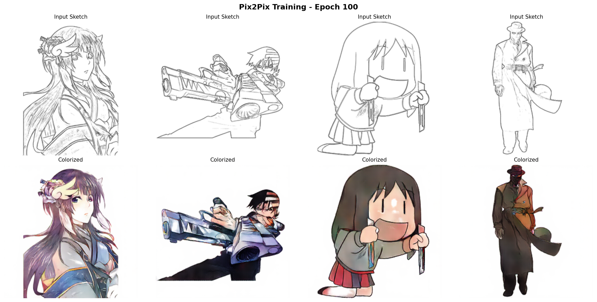
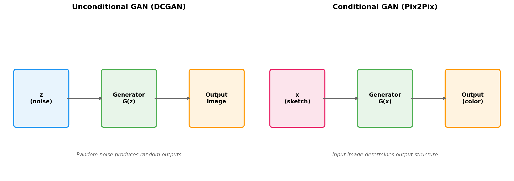
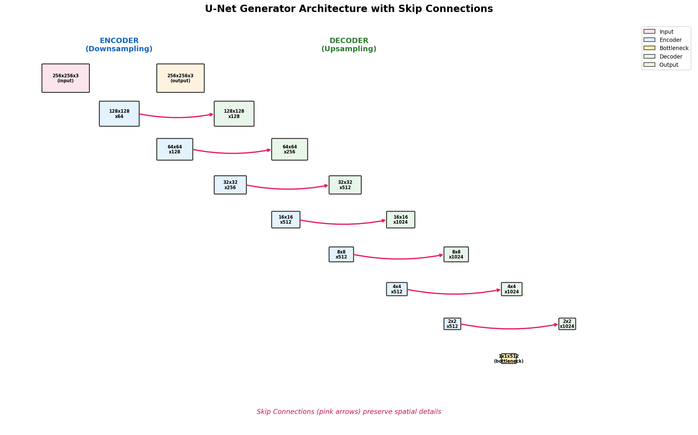
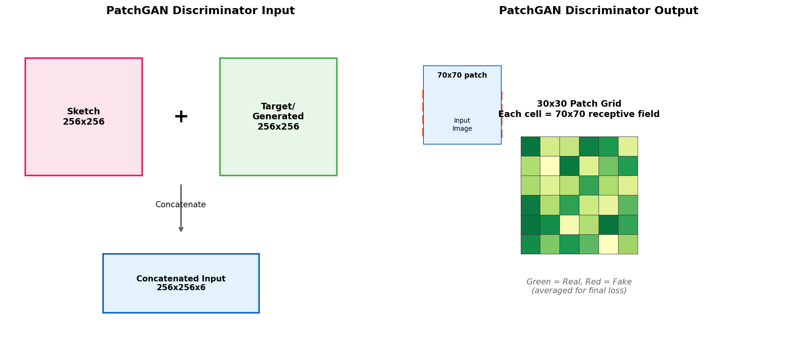
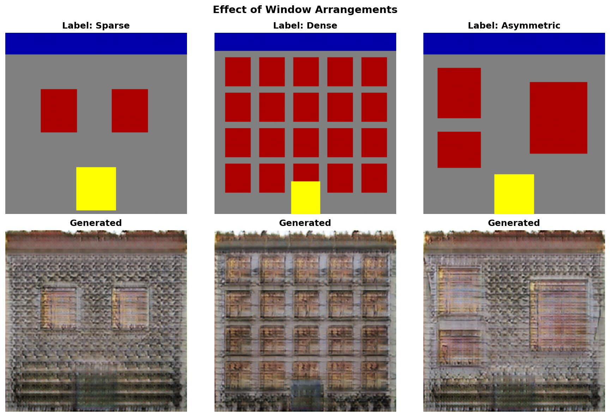
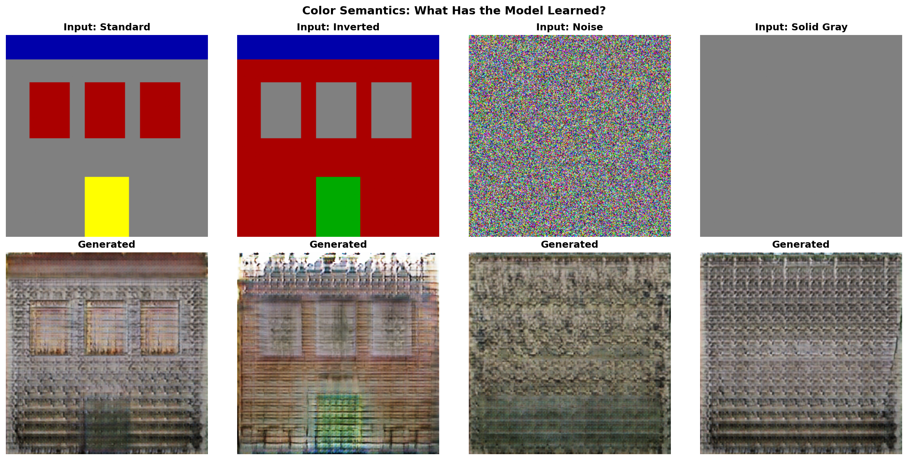

.. _module-12-1-4-pix2pix-applications:

====================================
12.1.4 Pix2Pix Applications
====================================

:Duration: 35-45 minutes
:Level: Intermediate-Advanced

Overview
========

Pix2Pix represents a breakthrough in conditional image-to-image translation, introduced by Isola et al. in 2017 [Isola2017]_. Unlike unconditional GANs (such as DCGAN), which generate images from random noise, Pix2Pix learns to transform input images into output images while preserving spatial structure. This makes it ideal for tasks like colorization, style transfer, and semantic-to-realistic translation.

This module uses a two-model approach to provide both immediate hands-on experience and understanding of the full training pipeline:

* **Exercises 1-2**: Use the official pre-trained ``facades_label2photo`` model to explore semantic-to-realistic translation. This model transforms architectural segmentation labels into photorealistic building facades.

* **Exercise 3**: Train your own Pix2Pix model from scratch on the Anime Sketch Colorization dataset, giving you complete understanding of the training process.

This demonstrates a fundamental principle: **conditional generation allows meaningful, controllable output rather than random generation**. By the end of this module, you will understand both the technical architecture (U-Net + PatchGAN) and the artistic possibilities of learned image translation.

   Anime sketch colorization using Pix2Pix: input sketches (top) transformed to colorized outputs (bottom).

Learning Objectives
-------------------

By the end of this exercise, you will be able to:

* Explain the difference between conditional and unconditional GANs
* Implement and understand the U-Net generator architecture with skip connections
* Describe how PatchGAN discriminators improve local texture quality
* Train a Pix2Pix model on paired image datasets
* Apply image-to-image translation to creative colorization tasks

Quick Start: See It In Action
=============================

First, download the official pre-trained facades model:

.. code-block:: bash

   python download_pretrained.py

Then run the quick-start demo to transform a segmentation label into a building facade:

.. code-block:: python
   :caption: Transform a facade label into a realistic building photo
   :linenos:

   import torch
   from facades_generator import create_facades_generator
   from PIL import Image
   import numpy as np
   import matplotlib.pyplot as plt

   # Load pre-trained facades generator
   generator = create_facades_generator('checkpoints/facades_generator.pth')
   generator.eval()

   # Load and preprocess facade label (CMP Facades from Kaggle)
   label = Image.open('sample_facades/base/cmp_b0001.png').convert('RGB')
   label = label.resize((256, 256))
   label_array = np.array(label).astype(np.float32) / 255.0
   label_tensor = torch.from_numpy((label_array - 0.5) / 0.5).permute(2, 0, 1).unsqueeze(0)

   # Generate realistic facade
   with torch.no_grad():
       facade = generator(label_tensor)

   # Display result
   facade = ((facade.squeeze().permute(1, 2, 0).numpy() + 1) / 2).clip(0, 1)
   plt.imshow(facade)
   plt.axis('off')
   plt.savefig('quick_start_output.png', dpi=150)
   plt.show()

The generator transforms the semantic segmentation label (with colors representing walls, windows, doors, and sky) into a photorealistic building facade.

Core Concepts
=============

Concept 1: Conditional GANs - Beyond Random Generation
------------------------------------------------------

The fundamental difference between Pix2Pix and DCGAN lies in how they generate images:

**Unconditional GAN (DCGAN)**:

.. code-block:: text

   G(z) → image

   Where z is random noise. The output is entirely random.

**Conditional GAN (Pix2Pix)**:

.. code-block:: text

   G(x) → image

   Where x is an input image. The output is conditioned on the input.

   DCGAN (left) generates from noise; Pix2Pix (right) transforms input images. Diagram generated with Claude - Opus 4.5.

The conditioning input fundamentally changes what the generator learns. Instead of learning to create random realistic images, it learns a **mapping function** from one image domain to another. For anime colorization, this means:

* Input domain: Black-and-white line drawings
* Output domain: Colorized anime images
* The generator learns which colors and shading correspond to specific line patterns

.. admonition:: Did You Know?

   The concept of conditional GANs was first introduced by Mirza and Osindero in 2014 [Mirza2014]_, but Pix2Pix extended this to full image-to-image translation with paired training data. This work inspired numerous follow-up methods including CycleGAN [Zhu2017]_ (for unpaired translation), SPADE (for semantic synthesis), and many artistic applications.

Concept 2: U-Net Generator Architecture
---------------------------------------

The Pix2Pix generator uses a **U-Net architecture** rather than the simple decoder used in DCGAN. U-Net was originally developed for biomedical image segmentation [Ronneberger2015]_ and has become essential for image-to-image tasks.

The key innovation is **skip connections** between encoder and decoder layers:

   U-Net encoder-decoder with skip connections (pink) preserving spatial details. Diagram generated with Claude - Opus 4.5.

**Why Skip Connections Matter for Colorization**:

1. **Preserve spatial details**: Without skip connections, fine details like line edges would be lost in the bottleneck
2. **Enable pixel-aligned output**: The colorized output must precisely align with input lines
3. **Gradient flow**: Skip connections help gradients flow during training, preventing vanishing gradients

.. code-block:: python
   :caption: U-Net forward pass with skip connections
   :linenos:
   :emphasize-lines: 12-19

   def forward(self, x):
       # Encoder path - store outputs for skip connections
       d1 = self.down1(x)   # 256→128
       d2 = self.down2(d1)  # 128→64
       d3 = self.down3(d2)  # 64→32
       d4 = self.down4(d3)  # 32→16
       d5 = self.down5(d4)  # 16→8
       d6 = self.down6(d5)  # 8→4
       d7 = self.down7(d6)  # 4→2
       d8 = self.down8(d7)  # 2→1 (bottleneck)

       # Decoder path - concatenate with encoder features
       u1 = self.up1(d8, d7)  # Combine decoder + encoder features
       u2 = self.up2(u1, d6)
       u3 = self.up3(u2, d5)
       u4 = self.up4(u3, d4)
       u5 = self.up5(u4, d3)
       u6 = self.up6(u5, d2)
       u7 = self.up7(u6, d1)

       return self.final(u7)  # 1→256 output

The highlighted lines show how each decoder layer receives both the previous decoder output and the corresponding encoder features via skip connections.

Concept 3: PatchGAN Discriminator
---------------------------------

Instead of classifying an entire image as real or fake, the PatchGAN discriminator classifies each **70x70 pixel patch** independently:

   PatchGAN outputs 30x30 grid of real/fake predictions for 70x70 patches. Diagram generated with Claude - Opus 4.5.

**Advantages of PatchGAN**:

1. **Detail-aware**: Focuses on local texture quality rather than global composition
2. **More training signal**: Multiple loss values per image provide richer gradients
3. **Scale-independent**: Works on any image size
4. **Faster training**: Fewer parameters than full-image discriminator

The discriminator receives **concatenated input**: both the sketch and the target/generated image. This allows it to check if the colorization is appropriate for the given sketch, not just if it looks realistic in isolation.

.. code-block:: python
   :caption: PatchGAN forward pass
   :linenos:

   def forward(self, sketch, target):
       # Concatenate sketch and target along channel dimension
       x = torch.cat([sketch, target], dim=1)  # 3 + 3 = 6 channels

       # Pass through discriminator
       return self.model(x)  # Output: (batch, 1, 30, 30)

Concept 4: Paired Training Data and Loss Functions
--------------------------------------------------

Pix2Pix requires **aligned paired images**: each input sketch must have a corresponding correctly-colored output. The model is trained to minimize two types of loss:

**1. Adversarial Loss (GAN Loss)**:

.. code-block:: text

   L_GAN = E[log D(x, y)] + E[log(1 - D(x, G(x)))]

   Where x = sketch, y = real colored image, G(x) = generated colored image

This encourages the generator to produce realistic-looking colors and textures.

**2. L1 Reconstruction Loss**:

.. code-block:: text

   L_L1 = E[|y - G(x)|]

   Pixel-wise absolute difference between real and generated images

This encourages pixel-level accuracy, ensuring the colorization matches the ground truth.

**Combined Loss**:

.. code-block:: text

   L_total = L_GAN + λ * L_L1

   Where λ = 100 (default) balances the two losses

The L1 loss is crucial for colorization because GAN loss alone would produce realistic but potentially misaligned colors. The L1 loss ensures the colorization follows the ground truth pattern.

.. admonition:: Dataset Source

   This module uses the **Anime Sketch Colorization Pair** dataset from Kaggle [AnimeDataset]_, containing approximately 17,000 paired sketch-color images. The dataset provides perfect white-background sketches ideal for training colorization models.

Hands-On Exercises
==================

The exercises below follow a progressive scaffolding approach, moving from observation (Execute) to experimentation (Modify) to training (Re-code).

Exercise 1: Observe Facade Generation
--------------------------------------

Load the official pre-trained Pix2Pix generator and observe how it transforms architectural segmentation labels into realistic building photographs.

.. admonition:: Setup Required
   :class: note

   Before running this exercise, download the pre-trained model:

   .. code-block:: bash

      python download_pretrained.py

Run the :download:`exercise1_observe.py <exercise1_observe.py>` script:

.. code-block:: bash

   python exercise1_observe.py

The script will:

1. Load the official pre-trained facades generator (54M parameters)
2. Load sample facade labels from ``sample_facades/base/``
3. Generate realistic building facades for each label
4. Display a comparison grid of inputs and outputs

**Expected Output**:

.. figure:: exercise1_output.png
   :width: 600px
   :align: center
   :alt: Grid showing input segmentation labels and their generated facade photos

   Pix2Pix facade generation: top row shows input segmentation labels, bottom row shows generated building photographs.

**Reflection Questions**:

1. How does Pix2Pix generation differ from DCGAN?
2. Why are skip connections essential for facade generation?
3. What happens if you change the label colors?

.. dropdown:: Discussion
   :class-title: sd-font-weight-bold

   **Question 1**: DCGAN generates from random noise ``G(z)``, producing random images each time. Pix2Pix generates from an input image ``G(x)``, so the output is determined by the input. This is **conditional** vs **unconditional** generation.

   **Question 2**: Skip connections preserve spatial details (edges, boundaries between regions) from the encoder. Without them, fine details would be lost in the bottleneck layer (1x1x512), and window positions would not align with the label.

   **Question 3**: The model learned specific color semantics from the CMP Facades dataset: blue for background/sky, gray for walls, red for windows, yellow for doors, green for balconies. Unusual colors will produce unexpected outputs because the model relies on these learned semantic mappings.

Exercise 2: Explore Model Behavior
-----------------------------------

Experiment with different facade label configurations to understand model behavior and limitations.

Run the :download:`exercise2_explore.py <exercise2_explore.py>` script:

.. code-block:: bash

   python exercise2_explore.py

The script explores four variations:

1. **Window arrangements**: How does varying the number and placement of windows affect the output?
2. **Partial labels**: What happens when parts of the facade label are masked or missing?
3. **Color semantics**: Does the model respond correctly to unusual label colors?
4. **Consistency**: Does the same input always produce the same output?

**Expected Outputs**:

The script generates multiple comparison images exploring different aspects of model behavior:

   **Window Arrangements**: Sparse, dense, and asymmetric window layouts produce different architectural styles while maintaining realistic textures.

   Color semantics test: standard colors produce realistic facades; unusual colors reveal learned boundaries.

Additional outputs include:

* ``exercise2_partial.png`` - Partial/incomplete label tests
* ``exercise2_consistency.png`` - Determinism verification (outputs are identical for same input)

**Try These Modifications**:

1. **Design your own facade**: Create a facade label using the color palette (blue=sky, gray=wall, red=window, yellow=door, green=balcony). Save as 256x256 PNG and test generation.

2. **Test unusual architectures**: Create labels with non-standard layouts like windows covering entire floors or doors on upper floors.

3. **Gradient colors**: Try using gradients instead of solid colors. How does the model handle soft boundaries?

.. dropdown:: Tips
   :class-title: sd-font-weight-bold

   * The model is deterministic (no random noise input), so the same label always produces the same facade
   * Window-to-wall ratio affects the generated building style significantly
   * The model has learned typical architectural patterns and may struggle with unusual configurations

.. admonition:: Sample Facades Dataset
   :class: note

   The sample facade labels included in this module are from the CMP Facades dataset [CMPFacades]_. To download additional samples or the full dataset for your experiments, visit:

   https://www.kaggle.com/datasets/adlteam/facade-dataset

   The CMP Facades dataset uses the following color palette for semantic labels:

   * Blue (0, 0, 170): Background/sky
   * Gray (128, 128, 128): Wall
   * Red (170, 0, 0): Window
   * Yellow (255, 255, 0): Door
   * Green (0, 170, 0): Balcony

Exercise 3: Train Your Own Model on Anime Dataset
--------------------------------------------------

Train your own Pix2Pix model from scratch on the Anime Sketch Colorization dataset. This demonstrates the complete training pipeline including dataset preparation, loss computation, and checkpoint visualization.

**What you'll learn**:

* How to prepare paired image datasets
* Understanding GAN + L1 loss dynamics
* Observing training progression through checkpoints
* Practical considerations for training deep generative models

.. admonition:: Prerequisites
   :class: note

   This exercise requires downloading the dataset from Kaggle (free account needed). If you prefer to skip dataset setup, you can observe the pre-generated results and proceed to the Challenge Extensions.

.. dropdown:: Dataset Setup: Downloading Anime Sketch Colorization Pair
   :class-title: sd-font-weight-bold

   **Step 1: Download from Kaggle**

   1. Visit: https://www.kaggle.com/datasets/ktaebum/anime-sketch-colorization-pair
   2. Click "Download" (requires free Kaggle account)
   3. Extract the ZIP file to ``anime_sketch_dataset/`` in this module directory

   **Expected directory structure**:

   .. code-block:: text

      12.1.4_pix2pix_applications/
      ├── anime_sketch_dataset/
      │   └── train/
      │       ├── 0.png
      │       ├── 1.png
      │       └── ... (~17,000 images)
      ├── exercise3_train.py
      └── README.rst

   **Step 2: Preprocess the Dataset**

   Run the :download:`preprocess_anime_sketches.py <preprocess_anime_sketches.py>` script:

   .. code-block:: bash

      python preprocess_anime_sketches.py

   This script:

   * Splits combined images into separate sketch/color pairs
   * Resizes to 256x256 if needed
   * Saves to ``anime_processed/sketches/`` and ``anime_processed/colors/``

   **Expected output**:

   .. code-block:: text

      Found 17769 images to process
      Output directory: anime_processed/

      Processed 500 images...
      Processed 1000 images...
      ...

      Preprocessing complete!
      Total images processed: 17769

      Dataset Verification:
      Sketch images: 17769
      Color images:  17769
      Status: READY for training

   **Quick Check**: Verify the processed dataset:

   .. code-block:: bash

      python preprocess_anime_sketches.py --verify

.. dropdown:: Training Configuration and Execution
   :class-title: sd-font-weight-bold

   Run the :download:`exercise3_train.py <exercise3_train.py>` script after completing dataset setup:

   **Training hyperparameters**:

   +-----------------+-------+-------------------------------------------+
   | Parameter       | Value | Description                               |
   +=================+=======+===========================================+
   | Epochs          | 100   | Full training run                         |
   +-----------------+-------+-------------------------------------------+
   | Batch size      | 4     | Adjust based on GPU memory                |
   +-----------------+-------+-------------------------------------------+
   | Learning rate   | 0.0002| Adam optimizer                            |
   +-----------------+-------+-------------------------------------------+
   | Beta1           | 0.5   | Adam momentum parameter                   |
   +-----------------+-------+-------------------------------------------+
   | Lambda (L1)     | 100   | Weight for reconstruction loss            |
   +-----------------+-------+-------------------------------------------+
   | Image size      | 256   | Input/output resolution                   |
   +-----------------+-------+-------------------------------------------+

   **How to Run**:

   .. code-block:: bash

      python exercise3_train.py

   **Expected terminal output (excerpt)**:

   .. code-block:: text

      ============================================================
      Exercise 3: Train Pix2Pix on Anime Sketch Colorization
      ============================================================

      Device: cuda
      Epochs: 100
      Batch size: 4
      Learning rate: 0.0002
      L1 weight (lambda): 100

      Loading dataset...
      Dataset size: 17769 pairs
      Batches per epoch: 4443

      Initializing models...
      Generator parameters: 54,413,955
      Discriminator parameters: 2,768,705

      Starting training...

      Epoch [1/100] | G Loss: 45.2341 | D Loss: 0.8234
      Epoch [2/100] | G Loss: 38.1245 | D Loss: 0.6521
      ...
      Epoch [10/100] | G Loss: 12.3456 | D Loss: 0.4521
        Saved: exercise3_epoch_10.png
      ...
      Epoch [100/100] | G Loss: 5.1234 | D Loss: 0.3812
        Saved: exercise3_epoch_100.png

      Generator saved to: generator_weights.pth

   .. admonition:: Tip: Monitoring Training
      :class: tip

      You can stop training early with Ctrl+C. The script saves checkpoints at epochs 10, 25, 50, 75, and 100, so you can examine progress even if you stop early. The final generator weights are saved when training completes (or when interrupted).

**Training Results**:

.. figure:: exercise3_training_progress.png
   :width: 600px
   :align: center
   :alt: Training loss curves

   Loss curves over 100 epochs showing Generator (blue) and Discriminator (red) convergence.

   Final colorization results after 100 epochs of training.

.. dropdown:: Training Progression by Epoch
   :class-title: sd-font-weight-bold

   Observe how colorization quality improves across training checkpoints:

   **Epoch 10** - Basic colors emerge, details are blurry:

   .. figure:: exercise3_epoch_10.png
      :width: 700px
      :align: center

   **Epoch 25** - Sharper edges, more consistent colors:

   .. figure:: exercise3_epoch_25.png
      :width: 700px
      :align: center

   **Epoch 50** - Good color accuracy, recognizable anime style:

   .. figure:: exercise3_epoch_50.png
      :width: 700px
      :align: center

   **Epoch 75** - Fine details improve, shading becomes more natural:

   .. figure:: exercise3_epoch_75.png
      :width: 700px
      :align: center

.. dropdown:: Troubleshooting Common Issues
   :class-title: sd-font-weight-bold

   **Issue 1: "Dataset not found"**

   **Cause**: The ``anime_processed/`` directory doesn't exist or is empty.

   **Solution**: Complete the Dataset Setup steps above. Run ``preprocess_anime_sketches.py`` to prepare the data.

   ---

   **Issue 2: Training is very slow**

   **Cause**: Training on CPU instead of GPU.

   **Solution**: Verify GPU is available:

   .. code-block:: python

      import torch
      print(torch.cuda.is_available())  # Should print True

   If False, install CUDA-enabled PyTorch from https://pytorch.org/get-started/locally/

   ---

   **Issue 3: Out of memory (CUDA OOM)**

   **Cause**: Batch size too large for GPU memory.

   **Solution**: Edit ``exercise3_train.py`` and reduce ``BATCH_SIZE`` from 4 to 2 or 1.

   ---

   **Issue 4: Generated images are mostly gray/brown**

   **Cause**: Training instability or dataset issues.

   **Solution**:

   * Verify dataset contains proper sketch-color pairs
   * Check that preprocessing split images correctly
   * Try reducing learning rate to 0.0001

Summary
=======

Key Takeaways
-------------

* **Conditional generation** transforms inputs to outputs rather than generating from noise
* **U-Net architecture** with skip connections preserves spatial details essential for pixel-aligned tasks
* **PatchGAN discriminator** focuses on local texture quality through patch-wise classification
* **Combined loss** (GAN + L1) balances realism with pixel accuracy
* **Paired training data** is required for Pix2Pix; for unpaired data, consider CycleGAN [Zhu2017]_

Common Pitfalls
---------------

* **Forgetting normalization**: Inputs must be normalized to [-1, 1]; output uses Tanh
* **Misaligned pairs**: Training requires perfectly aligned sketch-color pairs
* **Training instability**: GAN training can be unstable; monitor both G and D losses
* **Overfitting**: Small datasets may cause the model to memorize rather than generalize
* **Checkerboard artifacts**: Can appear due to transposed convolutions; use resize-convolution if needed

References
==========

.. [Isola2017] Isola, P., Zhu, J.-Y., Zhou, T., & Efros, A. A. (2017). Image-to-Image Translation with Conditional Adversarial Networks. *Proceedings of the IEEE Conference on Computer Vision and Pattern Recognition (CVPR)*, 1125-1134. https://arxiv.org/abs/1611.07004

.. [Ronneberger2015] Ronneberger, O., Fischer, P., & Brox, T. (2015). U-Net: Convolutional Networks for Biomedical Image Segmentation. *Medical Image Computing and Computer-Assisted Intervention (MICCAI)*, 234-241. https://arxiv.org/abs/1505.04597

.. [Mirza2014] Mirza, M., & Osindero, S. (2014). Conditional Generative Adversarial Nets. *arXiv preprint*. https://arxiv.org/abs/1411.1784

.. [Goodfellow2014] Goodfellow, I., Pouget-Abadie, J., Mirza, M., Xu, B., Warde-Farley, D., Ozair, S., Courville, A., & Bengio, Y. (2014). Generative Adversarial Nets. *Advances in Neural Information Processing Systems*, 27.

.. [Zhu2017] Zhu, J.-Y., Park, T., Isola, P., & Efros, A. A. (2017). Unpaired Image-to-Image Translation using Cycle-Consistent Adversarial Networks. *Proceedings of the IEEE International Conference on Computer Vision (ICCV)*, 2223-2232. https://arxiv.org/abs/1703.10593

.. [AnimeDataset] Kaggle. (2024). Anime Sketch Colorization Pair Dataset. https://www.kaggle.com/datasets/ktaebum/anime-sketch-colorization-pair

.. [CMPFacades] Tylecek, R., & Sara, R. (2013). Spatial Pattern Templates for Recognition of Objects with Regular Structure. *German Conference on Pattern Recognition (GCPR)*. https://cmp.felk.cvut.cz/~tylecr1/facade/

.. [PyTorchDocs] PyTorch Contributors. (2024). PyTorch Documentation. https://pytorch.org/docs/stable/

.. [Bransford2000] Bransford, J. D., Brown, A. L., & Cocking, R. R. (Eds.). (2000). *How People Learn: Brain, Mind, Experience, and School*. National Academy Press.
