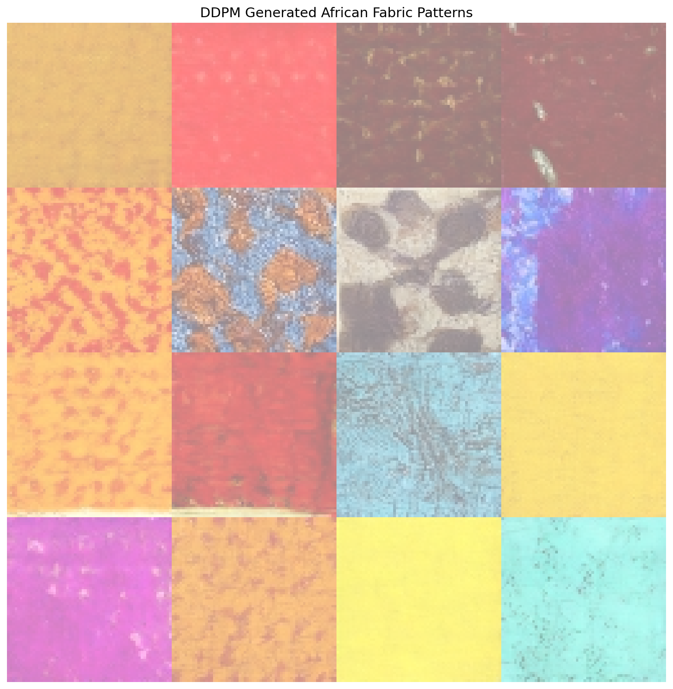
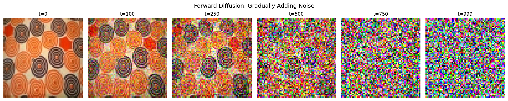
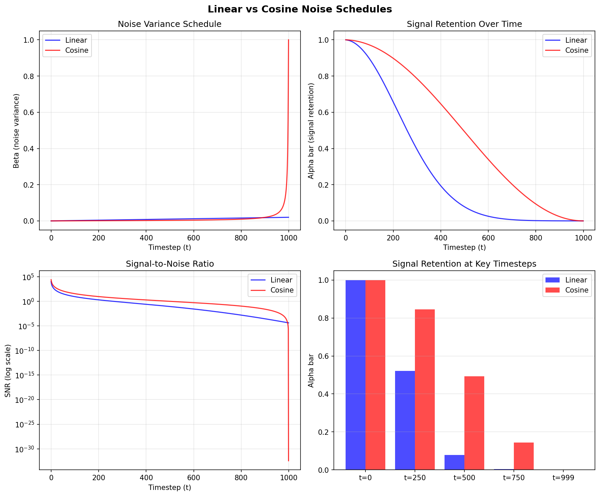
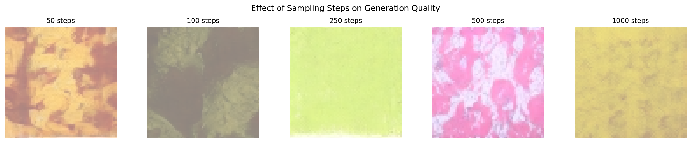
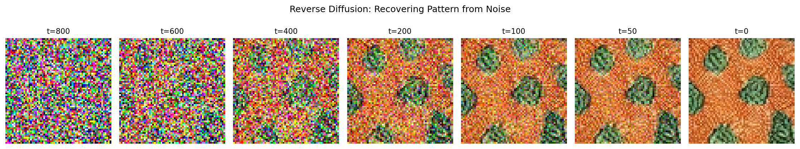

============================================
12.3.1 - DDPM Basics: Denoising Diffusion
============================================

:Duration: 40-50 minutes (core) + 4-6 hours training (Exercise 3)
:Level: Advanced

Overview
========

Denoising Diffusion Probabilistic Models (DDPMs) represent a paradigm shift in generative modeling [Ho2020]_. Unlike GANs, which learn to generate images through adversarial training, diffusion models learn to reverse a gradual noise corruption process. Starting from pure Gaussian noise, the model iteratively denoises to produce coherent images.

In this exercise, we apply DDPM to generate African fabric patterns, the same dataset used in Modules 12.1.2 (DCGAN) and 12.1.3 (StyleGAN). This allows direct comparison of three different generative approaches on identical data.

.. list-table::
   :widths: 50 50

   * - .. figure:: training_samples_grid.png
          :width: 100%
          :alt: Training dataset samples

          **Training Data** (9 of 1,059 images)

     - .. figure:: ddpm_fabric_morph.gif
          :width: 100%
          :alt: DDPM morphing animation showing smooth transitions between generated fabric patterns

          **Generated Animation** (Smooth latent interpolation)

Learning Objectives
-------------------

By the end of this exercise, you will:

1. **Understand the diffusion process**: How noise is added during forward diffusion and removed during reverse diffusion
2. **Implement a U-Net for noise prediction**: The architecture that powers modern diffusion models
3. **Train a DDPM from scratch**: Complete training pipeline on the African fabric dataset
4. **Compare generative approaches**: Evaluate DDPM output against DCGAN and StyleGAN results

Quick Start
===========

Before diving into theory, let us see what diffusion models can generate. This requires a pre-trained model, which you will create in Exercise 3.

.. note::

   **Pre-trained Model Required**

   Exercises 1 and 2 require a trained checkpoint. Either:

   1. Complete Exercise 3 first to train your own model (~4-6 hours), OR
   2. Download pre-trained weights using one of these methods:

      **Option A: GitHub CLI** (if installed)

      .. code-block:: bash

         cd content/Module_12_generative_ai_models/12.3_diffusion_models/12.3.1_ddpm_basics
         mkdir -p models
         gh release download v1.0.0-ddpm-weights -p "ddpm_african_fabrics.pt" -D models/

      **Option B: Direct Download**

      1. Visit: https://github.com/burakkagann/numpy-to-genAI/releases/tag/v1.0.0-ddpm-weights
      2. Download ``ddpm_african_fabrics.pt`` (546 MB)
      3. Place it in the ``models/`` folder

   **Verify installation:**

   .. code-block:: bash

      ls models/ddpm_african_fabrics.pt  # Should show the file

Once you have a trained model, generate fabric patterns:

.. code-block:: python

   from denoising_diffusion_pytorch import Unet, GaussianDiffusion
   import torch

   # Create model architecture
   model = Unet(dim=64, dim_mults=(1, 2, 4, 8), channels=3)

   # Create diffusion process
   diffusion = GaussianDiffusion(
       model, image_size=64, timesteps=1000, sampling_timesteps=250
   )

   # Load checkpoint (contains EMA weights from training)
   checkpoint = torch.load('models/ddpm_african_fabrics.pt', map_location='cpu')
   ema_state = checkpoint['ema']
   state_dict = {k.replace('ema_model.', ''): v
                 for k, v in ema_state.items() if k.startswith('ema_model.')}
   diffusion.load_state_dict(state_dict)
   diffusion.eval()

   # Generate 4 samples from pure noise
   with torch.no_grad():
       samples = diffusion.sample(batch_size=4)

   # samples shape: [4, 3, 64, 64], values in [-1, 1]

   16 fabric patterns generated by DDPM through iterative denoising.

Core Concepts
=============

Concept 1: The Diffusion Revolution
------------------------------------

What makes diffusion models different from GANs? The key insight is elegantly simple: *instead of learning to generate images directly, learn to reverse a corruption process* [SohlDickstein2015]_.

Consider this thought experiment: if you slowly add noise to an image over 1000 steps, eventually you get pure random noise. But what if you could learn to reverse each step? Starting from random noise, you could step backwards to recover a clean image.

**Why this matters:**

- **Stable training**: No adversarial dynamics, just simple MSE loss
- **Mode coverage**: Does not suffer from mode collapse like GANs
- **Quality**: State-of-the-art image quality (used in Stable Diffusion [Rombach2022]_, DALL-E 2 [Ramesh2022]_)
- **Controllability**: Natural framework for conditioning and guidance

.. admonition:: Did You Know?

   The mathematical foundations of diffusion models date back to non-equilibrium thermodynamics in the 1940s [Feller1949]_. The key insight that made them practical for image generation came in 2015 [SohlDickstein2015]_, but it took until 2020 for DDPMs to achieve competitive image quality [Ho2020]_. For detailed annotated implementations, see [LabML2024]_.

**Comparison with GANs**

.. list-table::
   :header-rows: 1
   :widths: 25 37 38

   * - Aspect
     - DDPM
     - GAN (DCGAN/StyleGAN)
   * - Training
     - Stable, simple loss
     - Can be unstable, mode collapse
   * - Sampling
     - Iterative (slower)
     - Single pass (faster)
   * - Quality
     - State-of-the-art
     - Excellent but can have artifacts
   * - Diversity
     - High (full distribution)
     - Can miss modes
   * - Controllability
     - Natural (guidance)
     - Requires conditioning

Concept 2: Forward Diffusion (Adding Noise)
--------------------------------------------

The forward diffusion process gradually corrupts a clean image :math:`x_0` over :math:`T` timesteps by adding Gaussian noise. At each step, we add a small amount of noise controlled by a schedule :math:`\beta_t`:

.. math::

   q(x_t | x_{t-1}) = \mathcal{N}(x_t; \sqrt{1-\beta_t} x_{t-1}, \beta_t I)

A key mathematical property allows us to sample :math:`x_t` directly from :math:`x_0` without iterating through all previous steps:

.. math::

   q(x_t | x_0) = \mathcal{N}(x_t; \sqrt{\bar{\alpha}_t} x_0, (1-\bar{\alpha}_t) I)

where :math:`\bar{\alpha}_t = \prod_{s=1}^{t} (1 - \beta_s)` is the cumulative product of noise retention.

   Forward diffusion from clean image (t=0) to pure noise (t=999).

**The Noise Schedule**

The schedule :math:`\beta_t` controls how quickly noise is added. Two common choices:

- **Linear schedule**: :math:`\beta_t` increases linearly from 0.0001 to 0.02
- **Cosine schedule**: Smoother progression that preserves image information longer [Nichol2021]_

   Linear vs cosine noise schedules. *Diagram generated with Claude - Opus 4.5.*

Concept 3: Reverse Diffusion (Denoising)
-----------------------------------------

The magic of diffusion models happens in the reverse process. We train a neural network :math:`\epsilon_\theta` to predict the noise added at each timestep:

.. math::

   p_\theta(x_{t-1} | x_t) = \mathcal{N}(x_{t-1}; \mu_\theta(x_t, t), \sigma_t^2 I)

where the mean is computed as:

.. math::

   \mu_\theta(x_t, t) = \frac{1}{\sqrt{\alpha_t}} \left( x_t - \frac{\beta_t}{\sqrt{1-\bar{\alpha}_t}} \epsilon_\theta(x_t, t) \right)

The training objective is remarkably simple: mean squared error between predicted and actual noise:

.. math::

   L = \mathbb{E}_{t, x_0, \epsilon} \left[ \| \epsilon - \epsilon_\theta(\sqrt{\bar{\alpha}_t} x_0 + \sqrt{1-\bar{\alpha}_t} \epsilon, t) \|^2 \right]

**U-Net Architecture**

The noise prediction network :math:`\epsilon_\theta` uses a U-Net architecture [Ronneberger2015]_ with several key modifications:

1. **Timestep conditioning**: Sinusoidal embeddings inform the network which noise level to predict
2. **Self-attention** [Vaswani2017]_: Captures global context for coherent pattern generation
3. **Residual connections**: Enable training of deep networks
4. **Group normalization**: More stable than batch normalization for generative tasks

.. code-block:: python

   # Simplified U-Net forward pass
   def forward(self, x, t):
       # Embed timestep using sinusoidal encoding
       t_emb = self.time_embedding(t)

       # Encoder: downsample while increasing channels
       skips = []
       for down_block in self.encoder:
           x = down_block(x, t_emb)
           skips.append(x)

       # Bottleneck with self-attention
       x = self.bottleneck(x, t_emb)

       # Decoder: upsample while using skip connections
       for up_block in self.decoder:
           x = up_block(torch.cat([x, skips.pop()], dim=1), t_emb)

       return self.output_conv(x)  # Predicted noise

Concept 4: Training vs Sampling
--------------------------------

**Training Algorithm**

.. code-block:: text

   Algorithm 1: Training
   ----------------------
   repeat:
       x_0 ~ q(x_0)                        # Sample clean image from dataset
       t ~ Uniform({1,...,T})              # Sample random timestep
       epsilon ~ N(0, I)                   # Sample noise
       x_t = sqrt(alpha_bar_t) * x_0       # Add noise to image
            + sqrt(1 - alpha_bar_t) * epsilon
       L = ||epsilon - model(x_t, t)||^2   # MSE loss
       gradient_step(L)
   until converged

**Sampling Algorithm**

.. code-block:: text

   Algorithm 2: Sampling
   ---------------------
   x_T ~ N(0, I)                           # Start from pure noise
   for t = T, T-1, ..., 1:
       z ~ N(0, I) if t > 1 else z = 0
       epsilon_pred = model(x_t, t)        # Predict noise
       x_{t-1} = (1/sqrt(alpha_t)) *
           (x_t - (beta_t/sqrt(1-alpha_bar_t)) * epsilon_pred)
           + sqrt(beta_t) * z
   return x_0

**DDIM: Faster Sampling**

The standard sampling requires T=1000 steps, which is slow. DDIM (Denoising Diffusion Implicit Models) [Song2020]_ enables sampling with far fewer steps (50-250) while maintaining quality by using a deterministic sampling formula.

Hands-On Exercises
==================

Exercise 1: Generate Fabric Patterns (Execute)
-----------------------------------------------

:download:`Download exercise1_generate.py <exercise1_generate.py>`

**Goal**: Run the pre-trained DDPM to generate African fabric patterns.

**Prerequisites**: Trained model at ``models/ddpm_african_fabrics.pt``

.. code-block:: bash

   python exercise1_generate.py

**What to observe:**

1. Generation takes ~30 seconds (250 DDIM steps)
2. Output shows 16 unique fabric patterns
3. Compare detail and diversity with your DCGAN outputs from Module 12.1.2

   Expected output: 16 unique fabric patterns generated by DDPM.

.. dropdown:: Reflection Questions
   :class-title: sd-font-weight-bold

   1. How do DDPM-generated patterns compare to DCGAN output? Consider:

      - Detail and sharpness
      - Color consistency
      - Pattern coherence

   2. The diffusion model uses 1000 timesteps for training but only 250 for sampling. Why does this work?

   3. What advantages might diffusion models have over GANs for this dataset?

Exercise 2: Explore Diffusion Parameters (Modify)
--------------------------------------------------

:download:`Download exercise2_explore.py <exercise2_explore.py>`

**Goal**: Understand how different parameters affect the generation process.

.. code-block:: bash

   python exercise2_explore.py

This script runs three explorations:

**Part A: Sampling Steps Comparison**

Generates the same pattern with 50, 100, 250, 500, and 1000 sampling steps to show the quality-speed trade-off.

   Quality improves with more steps, but generation time increases.

.. dropdown:: What to Expect
   :class-title: sd-font-weight-bold

   - 50 steps: Fast but may show artifacts
   - 250 steps: Good balance (default)
   - 1000 steps: Best quality, slower

**Part B: Denoising Visualization**

Shows the step-by-step transformation from noise to image (reverse diffusion).

   Reverse diffusion: The model progressively removes noise to reveal the pattern.

**Part C: Forward Diffusion Demo**

Visualizes how noise is progressively added during training.

   Forward diffusion: Clean fabric pattern is gradually corrupted with noise.

.. dropdown:: Suggested Modifications
   :class-title: sd-font-weight-bold

   Try changing these parameters in ``exercise2_explore.py``:

   1. **Different seeds**: Change ``RANDOM_SEED`` to see other patterns
   2. **More capture points**: Add more timesteps to ``capture_timesteps``
   3. **Batch comparison**: Generate multiple images with same steps to see variance

Exercise 3: Train Your Own DDPM (Create)
-----------------------------------------

:download:`Download exercise3_train.py <exercise3_train.py>`

**Goal**: Train a diffusion model from scratch on the African fabric dataset.

**Time required**: 4-6 hours on RTX 5070Ti GPU

**Step 1: Verify Dataset**

The training uses the preprocessed African fabric dataset from Module 12.1.2:

.. code-block:: bash

   python exercise3_train.py --verify

Expected output: "Found 1059 images in dataset"

**Step 2: Start Training**

.. code-block:: bash

   python exercise3_train.py --train

**Training Configuration**:

.. list-table::
   :widths: 30 70

   * - Image Size
     - 64x64 (consistent with DCGAN/StyleGAN)
   * - Batch Size
     - 32
   * - Learning Rate
     - 2e-4 (Adam optimizer)
   * - Training Steps
     - 100,000 (~100 epochs)
   * - Diffusion Timesteps
     - 1000
   * - Model Parameters
     - ~34M (U-Net with attention)

**What to Monitor**:

- Loss should decrease from ~0.5 to ~0.02-0.05
- Sample images saved every 1000 steps in ``training_results/``
- Training is stable; no mode collapse like GANs

**Step 3: Generate from Your Model**

After training completes:

.. code-block:: bash

   python exercise1_generate.py

Your model weights are saved at ``models/ddpm_african_fabrics.pt``.

Training Results: Observing DDPM Learning
~~~~~~~~~~~~~~~~~~~~~~~~~~~~~~~~~~~~~~~~~

.. dropdown:: Training Dynamics and Visual Progression
   :class-title: sd-font-weight-bold

   **Loss Curve**

   .. figure:: training_progress/loss_curve.png
      :width: 700px
      :align: center
      :alt: DDPM training loss over 100,000 steps

      Training loss (MSE) over 100,000 steps. *Diagram generated with Claude - Opus 4.5.*

   **Visual Progression**

   Checkpoints saved every 1,000 steps with 16 sample images each.

   .. figure:: training_results/sample-1.png
      :width: 400px
      :align: center
      :alt: DDPM samples at step 1,000

      Step 1,000: Noisy outputs with random color clusters.

   .. figure:: training_results/sample-3.png
      :width: 400px
      :align: center
      :alt: DDPM samples at step 3,000

      Step 3,000: Colors stabilizing, early spatial coherence.

   .. figure:: training_results/sample-5.png
      :width: 400px
      :align: center
      :alt: DDPM samples at step 5,000

      Step 5,000: Coherent color regions, texture patterns forming.

   .. figure:: training_results/sample-8.png
      :width: 400px
      :align: center
      :alt: DDPM samples at step 8,000

      Step 8,000: Diverse colors, cleaner edges, fabric textures visible.

   .. figure:: training_results/sample-11.png
      :width: 400px
      :align: center
      :alt: DDPM samples at final checkpoint

      Final checkpoint: Clear fabric patterns with rich colors and good diversity.

Final Output Comparison
^^^^^^^^^^^^^^^^^^^^^^^

**Training Data vs Generated Output**

.. list-table::
   :widths: 50 50

   * - .. figure:: training_samples_grid.png
          :width: 100%
          :alt: Training dataset samples

          **Training Data** (9 of 1,059 images)

     - .. figure:: ddpm_fabric_morph.gif
          :width: 100%
          :alt: DDPM morphing animation showing smooth transitions between generated fabric patterns

          **Generated Output** (DDPM Morphing Animation)

.. dropdown:: Troubleshooting Common Issues
   :class-title: sd-font-weight-bold

   **Issue 1: "Model file not found" error**

   **Cause**: The ``models/ddpm_african_fabrics.pt`` file doesn't exist.

   **Solution**:

   1. Complete Exercise 3 training first (takes 4-6 hours on GPU)
   2. Or download pre-trained weights from the GitHub releases page
   3. Verify the file path is correct: ``models/ddpm_african_fabrics.pt``

   ---

   **Issue 2: Training is very slow (>12 hours)**

   **Cause**: Training on CPU instead of GPU.

   **Solution**:

   * Verify GPU availability:

     .. code-block:: python

        import torch
        print(torch.cuda.is_available())  # Should print True

   * Install CUDA-enabled PyTorch if False (see https://pytorch.org/get-started/locally/)
   * Expected time: 4-6 hours on RTX 5070Ti, longer on older GPUs

   ---

   **Issue 3: Out of memory error (CUDA OOM)**

   **Cause**: Batch size too large for GPU memory.

   **Solution**:

   * Edit ``exercise3_train.py`` and reduce ``BATCH_SIZE`` from 32 to 16
   * Reduce ``GRADIENT_ACCUMULATE`` from 2 to 1
   * Training quality is not significantly affected by smaller batches

   ---

   **Issue 4: Generated images are all noise**

   **Possible causes**:

   * Model weights not loaded correctly
   * Training did not complete successfully
   * Wrong checkpoint file loaded

   **Solution**:

   1. Verify the model file exists and has size ~140 MB
   2. Check training completed without errors
   3. Try loading a different checkpoint from ``training_results/model-*.pt``

   ---

   **Issue 5: "denoising-diffusion-pytorch" import error**

   **Cause**: Library not installed.

   **Solution**:

   .. code-block:: bash

      pip install denoising-diffusion-pytorch

   ---

   **Issue 6: Different results than shown in documentation**

   **Cause**: Different random seeds or library versions produce different outputs.

   **Solution**:

   * This is expected - generative models produce varied outputs
   * Set ``RANDOM_SEED`` in the script for reproducibility
   * Visual quality should be similar even if specific patterns differ

.. admonition:: Implementation Note
   :class: note

   This exercise uses the `denoising-diffusion-pytorch <https://github.com/lucidrains/denoising-diffusion-pytorch>`_ library by Phil Wang (lucidrains), released under the MIT License. The library provides a clean, efficient implementation of DDPMs [Ho2020]_ suitable for educational purposes.

   Key modifications for this exercise:

   * Configured for 64x64 RGB images (matching DCGAN/StyleGAN modules)
   * DDIM sampling with 250 steps for faster inference
   * Mixed precision training for GPU memory efficiency
   * Checkpoint saving every 1,000 steps for progress visualization

Summary
=======

**Key Takeaways**

1. **Diffusion models reverse noise corruption**: Start from pure noise, iteratively denoise to generate images
2. **Training is stable**: Simple MSE loss, no adversarial dynamics
3. **U-Net predicts noise**: The network learns to estimate the noise added at each timestep
4. **DDIM enables fast sampling**: Generate quality images with 250 steps instead of 1000

**Common Pitfalls**

.. warning::

   1. **Model not found**: Ensure you complete Exercise 3 or download pre-trained weights
   2. **Out of memory**: Reduce batch size or image size if GPU memory is limited
   3. **Slow training on CPU**: Diffusion models require GPU acceleration
   4. **Different library versions**: Use ``pip install denoising-diffusion-pytorch``

References
==========

.. [Ho2020] Ho, J., Jain, A., & Abbeel, P. (2020). Denoising Diffusion Probabilistic Models. *Advances in Neural Information Processing Systems*, 33, 6840-6851. https://arxiv.org/abs/2006.11239

.. [SohlDickstein2015] Sohl-Dickstein, J., Weiss, E., Maheswaranathan, N., & Ganguli, S. (2015). Deep Unsupervised Learning using Nonequilibrium Thermodynamics. *International Conference on Machine Learning*, 2256-2265.

.. [Nichol2021] Nichol, A. Q., & Dhariwal, P. (2021). Improved Denoising Diffusion Probabilistic Models. *International Conference on Machine Learning*, 8162-8171. https://arxiv.org/abs/2102.09672

.. [Song2020] Song, J., Meng, C., & Ermon, S. (2020). Denoising Diffusion Implicit Models. *International Conference on Learning Representations*. https://arxiv.org/abs/2010.02502

.. [Ronneberger2015] Ronneberger, O., Fischer, P., & Brox, T. (2015). U-Net: Convolutional Networks for Biomedical Image Segmentation. *Medical Image Computing and Computer-Assisted Intervention*, 234-241.

.. [PhilWang2024] Wang, P. (2024). *denoising-diffusion-pytorch: Implementation of Denoising Diffusion Probabilistic Model in Pytorch*. GitHub repository. https://github.com/lucidrains/denoising-diffusion-pytorch (MIT License)

.. [LabML2024] LabML.ai. (2024). DDPM - Denoising Diffusion Probabilistic Models. *LabML Annotated Implementations*. https://nn.labml.ai/diffusion/ddpm/

.. [Feller1949] Feller, W. (1949). On the Theory of Stochastic Processes, with Particular Reference to Applications. *Proceedings of the Berkeley Symposium on Mathematical Statistics and Probability*, 403-432.

.. [Picton1995] Picton, J. (1995). *The Art of African Textiles: Technology, Tradition and Lurex*. Lund Humphries Publishers.

.. [Vaswani2017] Vaswani, A., et al. (2017). Attention Is All You Need. *Advances in Neural Information Processing Systems*, 30. https://arxiv.org/abs/1706.03762

.. [Rombach2022] Rombach, R., Blattmann, A., Lorenz, D., Esser, P., & Ommer, B. (2022). High-Resolution Image Synthesis with Latent Diffusion Models. *IEEE/CVF Conference on Computer Vision and Pattern Recognition (CVPR)*. https://arxiv.org/abs/2112.10752

.. [Ramesh2022] Ramesh, A., Dhariwal, P., Nichol, A., Chu, C., & Chen, M. (2022). Hierarchical Text-Conditional Image Generation with CLIP Latents. *arXiv preprint*. https://arxiv.org/abs/2204.06125
