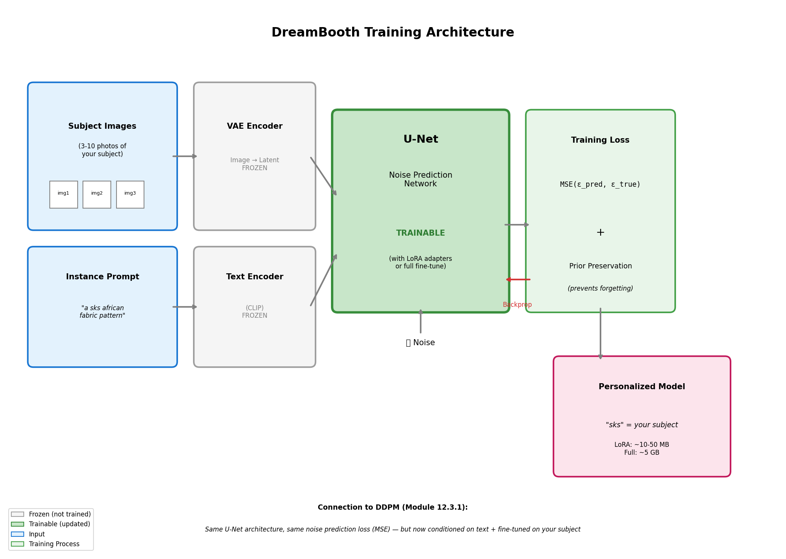
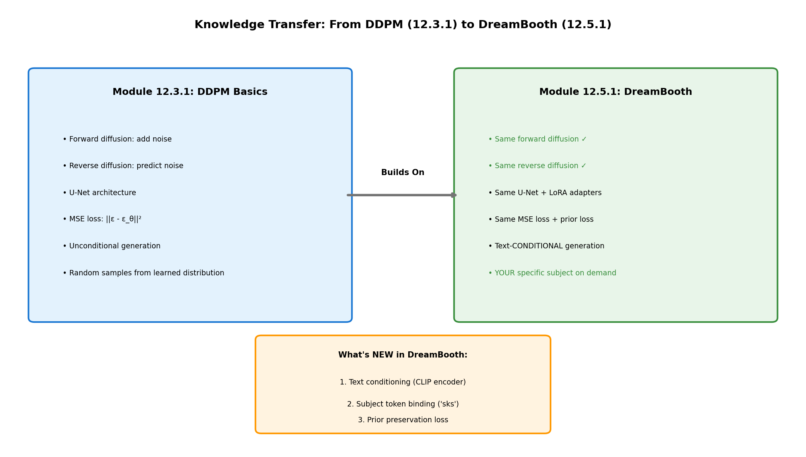
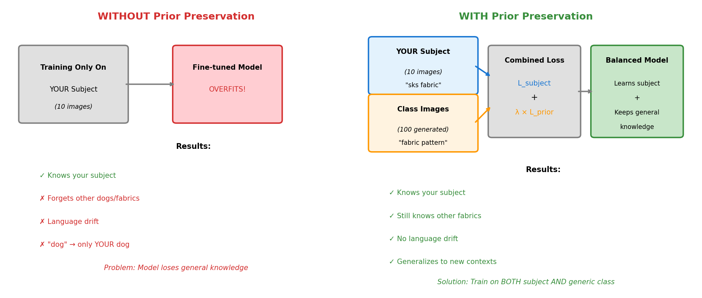
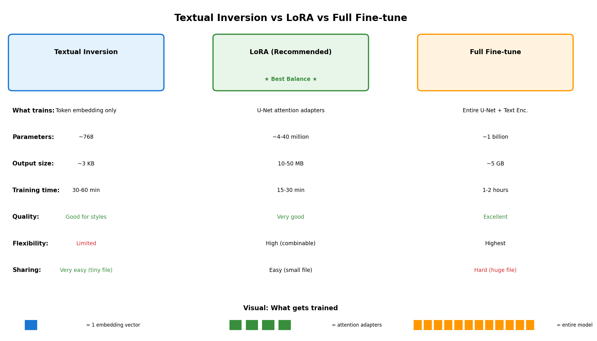

============================================================
12.5.1 - DreamBooth: Personalizing Diffusion Models
============================================================

:Duration: 30-40 minutes (core) + 15-60 minutes (training, optional)
:Level: Advanced
:Prerequisites: Module 12.3.1 (DDPM Basics)

Overview
========

DreamBooth revolutionizes how we personalize generative AI models [Ruiz2022]_. While Module 12.3.1 taught us to generate generic African fabric patterns with DDPM, DreamBooth enables generating *your specific* fabric style in any context you can describe with text. The same U-Net architecture, the same noise prediction objective, but now with text conditioning and subject binding.

This exercise continues our exploration of the African fabric dataset, demonstrating how a pre-trained text-to-image model can learn to associate a unique token ("sks") with specific fabric patterns from just 10 training images.

.. list-table::
   :widths: 50 50

   * - .. figure:: outputs/training_samples_grid.png
          :width: 100%
          :alt: Nine African fabric training samples

          **Training Data** (9 of 10 images)

     - .. figure:: dreambooth_fabric_morph.gif
          :width: 100%
          :alt: DreamBooth morphing through fabric latent space

          **Generated Output** (DreamBooth LoRA)

Learning Objectives
-------------------

By the end of this exercise, you will:

1. **Understand subject-driven fine-tuning**: How DreamBooth binds a unique token to a specific visual concept
2. **Implement prior preservation loss**: Prevent catastrophic forgetting while learning new concepts
3. **Compare training approaches**: Textual Inversion (lightweight) vs LoRA (recommended)
4. **Generate personalized subjects in diverse contexts**: Apply your learned fabric style to fashion, decor, and art

Quick Start
===========

Before diving into theory, let us see what personalized diffusion models can generate.

.. dropdown:: Pre-trained Model Required
   :class-title: sd-font-weight-bold

   Exercises 1 and 2 require trained LoRA weights. Either:

   1. Complete Exercise 3 first to train your own model (15-60 minutes), OR
   2. Download pre-trained weights using one of these methods:

      **Option A: GitHub CLI** (if installed)

      .. code-block:: bash

         cd content/Module_12_generative_ai_models/12.5_personalization_efficiency/12.5.1_dreambooth_personalization
         mkdir -p models/fabric_lora
         gh release download v1.0.0-dreambooth-lora -D models/fabric_lora/

      **Option B: Direct Download**

      1. Visit: https://github.com/burakkagann/Pixels2GenAI/releases/tag/v1.0.0-dreambooth-lora
      2. Download both ``adapter_model.safetensors`` (~3 MB) and ``adapter_config.json``
      3. Place both files in the ``models/fabric_lora/`` folder

   **Verify installation:**

   .. code-block:: bash

      ls models/fabric_lora/adapter_model.safetensors models/fabric_lora/adapter_config.json

Once you have trained or downloaded weights, generate personalized fabric patterns:

.. code-block:: python

   from diffusers import StableDiffusionPipeline
   import torch

   # Load base model with LoRA weights
   pipe = StableDiffusionPipeline.from_pretrained(
       "runwayml/stable-diffusion-v1-5",
       torch_dtype=torch.float16
   ).to("cuda")
   pipe.load_lora_weights("models/fabric_lora")

   # Generate with the learned subject token
   prompt = "a beautiful dress made of sks african fabric pattern, fashion photography"
   image = pipe(prompt, guidance_scale=7.5).images[0]
   image.save("personalized_fabric.png")

The magic token "sks" now represents your specific African fabric style. Any prompt containing "sks african fabric pattern" will generate images with the learned characteristics.

.. figure:: outputs/exercise1_output.png
   :width: 600px
   :align: center
   :alt: DreamBooth-generated African fabric patterns in various contexts

   Personalized fabric in nine different contexts.

Core Concepts
=============

Concept 1: The Personalization Problem
--------------------------------------

Why can't we just prompt "my african fabric pattern" to get our specific design?

Pre-trained text-to-image models like Stable Diffusion understand general concepts ("african fabric", "geometric pattern") but cannot generate YOUR specific fabric style. The model has never seen your unique patterns and has no way to reference them.

**DreamBooth solves this by**:

1. Teaching the model a new "word" (token) that represents your subject
2. Fine-tuning the model so this token triggers generation of your specific visual concept
3. Using prior preservation to maintain the model's general capabilities

   Unique token binding enables subject-specific generation. Diagram generated with Claude - Opus 4.5.

.. admonition:: Did You Know?

   The token "sks" was chosen by the original DreamBooth authors because it is rare in the training data of CLIP (the text encoder) [Ruiz2022]_. Using a rare token prevents interference with existing concepts. Other common choices include "ohwx", "zwx", and "[V]".

Concept 2: Connection to DDPM Basics (Module 12.3.1)
----------------------------------------------------

DreamBooth builds directly on the DDPM concepts you learned in Module 12.3.1:

   DDPM to DreamBooth knowledge transfer. Diagram generated with Claude - Opus 4.5.

**What stays the same:**

- **U-Net architecture**: Same encoder-decoder with skip connections
- **Noise prediction objective**: Still predicting :math:`\epsilon` at each timestep
- **Forward diffusion**: Same noise schedule (:math:`\sqrt{\bar{\alpha}_t} x_0 + \sqrt{1-\bar{\alpha}_t} \epsilon`)
- **Training loss**: MSE between predicted and actual noise

**What's new:**

- **Text conditioning**: CLIP encodes the prompt, cross-attention injects it into U-Net
- **Subject token binding**: The token "sks" becomes associated with your images
- **Prior preservation**: Additional loss term prevents forgetting general concepts

The training objective becomes:

.. math::

   L = \mathbb{E}_{x,c,\epsilon,t} \left[ \| \epsilon - \epsilon_\theta(x_t, t, c) \|^2 \right] + \lambda \cdot L_{prior}

where :math:`c` is the text conditioning (CLIP embedding of the prompt) and :math:`L_{prior}` is the prior preservation loss.

Concept 3: Prior Preservation Loss
----------------------------------

Without prior preservation, fine-tuning on just 10 fabric images would cause **catastrophic forgetting**: the model loses its ability to generate other concepts.

   Prior preservation prevents catastrophic forgetting. Diagram generated with Claude - Opus 4.5.

**How it works:**

1. Generate 100-200 images using the class prompt ("a fabric pattern") with the original model
2. During training, mix your subject images with these generated class images
3. The model learns your specific subject while being reminded of general "fabric patterns"

.. code-block:: python

   # Prior preservation loss computation
   # Instance loss: Learn the specific subject
   instance_loss = F.mse_loss(predicted_noise, noise)

   # Prior loss: Remember general class
   prior_loss = F.mse_loss(predicted_noise_prior, noise_prior)

   # Combined loss
   total_loss = instance_loss + prior_preservation_weight * prior_loss

Concept 4: Textual Inversion vs LoRA
------------------------------------

Two efficient fine-tuning approaches exist, each with trade-offs:

   TI vs LoRA architecture comparison. Diagram generated with Claude - Opus 4.5.

**Textual Inversion** [Gal2022]_

- Trains only the text embedding for a new token
- Output size: ~3 KB
- Training time: 30-60 minutes
- Best for: Styles, artistic concepts
- Limitation: Cannot capture complex subjects well

.. code-block:: python

   # Textual Inversion: Only the embedding is trained
   # Model weights are frozen
   placeholder_token = "<african-fabric>"
   initializer_token = "pattern"
   # Training updates ONLY the embedding for placeholder_token

**LoRA (Low-Rank Adaptation)** [Hu2021]_

- Trains small adapter matrices in attention layers
- Output size: 10-50 MB
- Training time: 15-30 minutes
- Best for: Subjects, objects, specific visual features
- Advantage: Combinable with other LoRAs

.. code-block:: python

   # LoRA: Small matrices A and B adapt attention weights
   # Original weight W remains frozen
   # Adapted output: Wx + (AB)x where rank(AB) << rank(W)

.. list-table:: Training Approach Comparison
   :header-rows: 1
   :widths: 25 35 40

   * - Aspect
     - Textual Inversion
     - LoRA (Recommended)
   * - What trains
     - Token embedding only
     - U-Net attention adapters
   * - Output size
     - ~3 KB
     - ~10-50 MB
   * - Training time
     - 30-60 minutes
     - 15-30 minutes
   * - Quality
     - Good for styles
     - Better for subjects
   * - Flexibility
     - Limited
     - Combinable with other LoRAs

Concept 5: Classifier-Free Guidance
-----------------------------------

During generation, **guidance scale** controls how strongly the model follows your prompt:

.. math::

   \tilde{\epsilon}_\theta(x_t, t, c) = \epsilon_\theta(x_t, t, \emptyset) + s \cdot (\epsilon_\theta(x_t, t, c) - \epsilon_\theta(x_t, t, \emptyset))

where :math:`s` is the guidance scale (typically 7.5):

- **s = 1**: No guidance, unconditional generation
- **s = 7.5**: Default, good balance
- **s > 15**: Very strict adherence, may look artificial

This is why Exercise 2 explores guidance scale effects on your personalized outputs.

Hands-On Exercises
==================

Exercise 1: Generate with Personalized Model (Execute)
------------------------------------------------------

:download:`Download exercise1_generate.py <exercise1_generate.py>`

**Goal**: Generate African fabric patterns in various contexts using a personalized DreamBooth model.

**Prerequisites**: Trained LoRA weights at ``models/fabric_lora/``

.. code-block:: bash

   python exercise1_generate.py

**What to observe:**

1. The "sks" token triggers your specific fabric style
2. The pattern adapts to different contexts (dress, wallpaper, art)
3. Compare with generic "african fabric" prompt (without "sks")

.. figure:: outputs/exercise1_output.png
   :width: 600px
   :align: center
   :alt: Exercise 1 output grid

   Nine generated fabric patterns in varied contexts.

.. dropdown:: Reflection Questions
   :class-title: sd-font-weight-bold

   1. **Connection to DDPM**: How does text conditioning change what the model generates compared to unconditional DDPM from Module 12.3.1?

   2. **Token importance**: What happens if you remove "sks" from the prompt? Try generating "a dress made of african fabric pattern" without the special token.

   3. **Generalization**: The model was trained on only 10 fabric images. How can it generate the pattern on a dress it never saw during training?

Exercise 2: Explore Generation Parameters (Modify)
--------------------------------------------------

:download:`Download exercise2_explore.py <exercise2_explore.py>`

**Goal**: Understand how different parameters affect personalized generation.

.. code-block:: bash

   python exercise2_explore.py

This script runs three explorations:

**Part A: Guidance Scale Comparison**

Generates the same prompt with guidance scales 1.5, 3.0, 7.5, 12.0, and 20.0.

.. figure:: outputs/exercise2_guidance_comparison.png
   :width: 700px
   :align: center
   :alt: Guidance scale comparison

   Guidance scale comparison: 1.5 to 20.0.

.. tip::

   **Try this**: Test guidance values between 5.0-12.0 to find your optimal balance.

**Part B: Style Transfer Grid**

Your learned fabric pattern rendered in 9 artistic styles.

.. figure:: outputs/exercise2_style_grid.png
   :width: 600px
   :align: center
   :alt: Style transfer grid

   Learned pattern applied to nine artistic styles.

.. tip::

   **Try this**: Compare short prompts ("sks fabric") vs detailed prompts, or add ``negative_prompt="blurry, distorted"`` for improved quality.

**Part C: Seed Variation Study**

Same prompt with different random seeds to assess diversity vs consistency.

.. figure:: outputs/exercise2_seed_comparison.png
   :width: 600px
   :align: center
   :alt: Seed variation study

   Seed variation study showing consistency.

.. tip::

   **Try this**: Put your fabric on unusual objects (spacecraft, ancient temple, underwater) to explore context boundaries.

Exercise 3: Train Your Own Personalized Model (Create)
------------------------------------------------------

**Goal**: Train a DreamBooth model from scratch and understand the full training pipeline.

Two training approaches are provided. LoRA is recommended for better quality and faster training.

.. dropdown:: Option A: Textual Inversion (Lightweight)
   :class-title: sd-font-weight-bold

   :download:`Download exercise3a_train_textual_inversion.py <exercise3a_train_textual_inversion.py>`

   - Trains only the token embedding
   - Time: 30-60 minutes
   - Output: ~3 KB embedding file

   .. code-block:: bash

      python exercise3a_train_textual_inversion.py

   **Best for**: Artistic styles and abstract concepts where fine detail is less critical.

.. dropdown:: Option B: LoRA Training (Recommended)
   :class-title: sd-font-weight-bold
   :open:

   :download:`Download exercise3b_train_lora.py <exercise3b_train_lora.py>`

   - Trains attention layer adapters
   - Time: 15-30 minutes on RTX GPU
   - Output: ~10-50 MB LoRA weights

   .. code-block:: bash

      python exercise3b_train_lora.py

   **Best for**: Specific subjects and patterns where detail preservation matters.

.. dropdown:: Step 1: Prepare Training Images
   :class-title: sd-font-weight-bold

   Copy 10 diverse fabric images from Module 12.1.2's dataset:

   .. code-block:: bash

      # Copy selected images to training_images/ folder
      # Choose images with varied colors and patterns

   Both scripts provide:

   - Progress visualization every 100 (LoRA) or 500 (TI) steps
   - Sample generation to monitor quality
   - Loss curves for training dynamics

.. dropdown:: Step 2: Training Configuration
   :class-title: sd-font-weight-bold

   **LoRA Configuration**:

   .. list-table::
      :widths: 30 70

      * - Base Model
        - stable-diffusion-v1-5
      * - Instance Prompt
        - "a sks african fabric pattern"
      * - Class Prompt
        - "a fabric pattern"
      * - LoRA Rank
        - 4
      * - Learning Rate
        - 1e-4
      * - Training Steps
        - 800
      * - Prior Preservation
        - Enabled (100 class images)

.. dropdown:: Step 3: Monitor Training Progress
   :class-title: sd-font-weight-bold

   **Loss Curve**

   .. figure:: outputs/exercise3b_loss_curves.png
      :width: 600px
      :align: center
      :alt: Training loss curves

      Training loss progression over 800 steps.

   **Visual Progression**

   .. figure:: training_progress_lora/step_00100.png
      :width: 400px
      :align: center
      :alt: LoRA training at step 100

      Step 100: Initial pattern emergence.

   .. figure:: training_progress_lora/step_00400.png
      :width: 400px
      :align: center
      :alt: LoRA training at step 400

      Step 400: Clear pattern formation.

   .. figure:: training_progress_lora/step_00700.png
      :width: 400px
      :align: center
      :alt: LoRA training at step 700

      Step 700: Final trained output.

.. dropdown:: Step 4: Compare TI vs LoRA Results
   :class-title: sd-font-weight-bold

   After training both approaches, compare outputs:

   .. figure:: outputs/exercise3_ti_vs_lora.png
      :width: 700px
      :align: center
      :alt: Textual Inversion vs LoRA comparison

      TI vs LoRA generation quality comparison.

.. dropdown:: Step 5: Generate Morphing Animation
   :class-title: sd-font-weight-bold

   After training, showcase your model's capabilities with a smooth morphing animation:

   :download:`Download generate_dreambooth_morph.py <generate_dreambooth_morph.py>`

   .. code-block:: bash

      python generate_dreambooth_morph.py

   This script creates a 15-second GIF demonstrating smooth transitions through the learned
   fabric latent space using SLERP (Spherical Linear Interpolation).

   .. list-table::
      :widths: 50 50

      * - .. figure:: outputs/training_samples_grid.png
             :width: 100%
             :alt: Training samples grid

             **Training Data** (9 of 10 images)

        - .. figure:: dreambooth_fabric_morph.gif
             :width: 100%
             :alt: DreamBooth morphing animation

             **Generated Morph** (LoRA output)

   **Animation Parameters**:

   - **Duration**: 15 seconds
   - **FPS**: 30 (450 total frames)
   - **Keyframes**: 5 distinct patterns with SLERP interpolation
   - **Seamless loop**: Cycles back to starting pattern smoothly

   **Generation time**: ~10-20 minutes on RTX GPU, 1-2 hours on CPU.

.. dropdown:: Troubleshooting Common Issues
   :class-title: sd-font-weight-bold

   **Issue 1: "CUDA out of memory"**

   **Solution**: Reduce batch size or enable gradient checkpointing:

   .. code-block:: python

      TRAIN_BATCH_SIZE = 1  # Reduce from 2
      GRADIENT_ACCUMULATION = 4  # Increase to compensate

   **Issue 2: Generated images don't match training style**

   **Possible causes**: Insufficient training steps, wrong prompts, or overfitting.

   **Solution**:

   - Increase training steps (try 1000-1500 for LoRA)
   - Ensure instance prompt contains the subject token
   - Check that training images are diverse but consistent in style

   **Issue 3: Model generates generic fabrics (not your specific style)**

   **Solution**: Your subject token may not have learned properly.

   - Verify the placeholder token is in the prompt ("sks")
   - Check that LoRA weights loaded correctly
   - Try increasing training steps

   **Issue 4: Training is very slow (>2 hours)**

   **Solution**: Ensure GPU is being used:

   .. code-block:: python

      import torch
      print(f"CUDA available: {torch.cuda.is_available()}")
      print(f"Device: {torch.cuda.get_device_name(0)}")

Summary
=======

**Key Takeaways**

1. **DreamBooth personalizes diffusion models**: Bind a unique token to your specific visual concept
2. **Same architecture as DDPM**: U-Net, noise prediction, but with text conditioning
3. **Prior preservation prevents forgetting**: Mix subject images with class images during training
4. **LoRA is efficient**: Train attention adapters in 15-30 minutes, share 10-50 MB files
5. **Text conditioning enables creativity**: Generate your subject in any context you can describe

**Common Pitfalls**

.. warning::

   1. **Missing subject token**: Always include "sks" (or your chosen token) in generation prompts
   2. **Overfitting**: Too many training steps on few images causes repetitive outputs
   3. **Wrong guidance scale**: Start with 7.5, adjust based on results
   4. **Forgetting prior preservation**: Without it, the model loses general capabilities

**Comparison: DDPM vs DreamBooth**

.. list-table::
   :header-rows: 1
   :widths: 25 35 40

   * - Aspect
     - DDPM (Module 12.3.1)
     - DreamBooth (This Module)
   * - Generation
     - Random samples from learned distribution
     - Specific subject in any context
   * - Control
     - None (unconditional)
     - Full text-based control
   * - Training data
     - 1000+ images
     - 5-10 images
   * - Training time
     - 4-6 hours
     - 15-60 minutes
   * - Output
     - Generic fabric patterns
     - YOUR fabric in infinite contexts

References
==========

.. [Ruiz2022] Ruiz, N., Li, Y., Jampani, V., Pritch, Y., Rubinstein, M., & Aberman, K. (2022). DreamBooth: Fine Tuning Text-to-Image Diffusion Models for Subject-Driven Generation. *arXiv preprint*. https://arxiv.org/abs/2208.12242

.. [Gal2022] Gal, R., Alaluf, Y., Atzmon, Y., Patashnik, O., Bermano, A. H., Chechik, G., & Cohen-Or, D. (2022). An Image is Worth One Word: Personalizing Text-to-Image Generation using Textual Inversion. *arXiv preprint*. https://arxiv.org/abs/2208.01618

.. [Hu2021] Hu, E. J., Shen, Y., Wallis, P., Allen-Zhu, Z., Li, Y., Wang, S., ... & Chen, W. (2021). LoRA: Low-Rank Adaptation of Large Language Models. *arXiv preprint*. https://arxiv.org/abs/2106.09685

.. [Ho2020] Ho, J., Jain, A., & Abbeel, P. (2020). Denoising Diffusion Probabilistic Models. *Advances in Neural Information Processing Systems*, 33, 6840-6851. https://arxiv.org/abs/2006.11239

.. [Rombach2022] Rombach, R., Blattmann, A., Lorenz, D., Esser, P., & Ommer, B. (2022). High-Resolution Image Synthesis with Latent Diffusion Models. *IEEE/CVF Conference on Computer Vision and Pattern Recognition (CVPR)*. https://arxiv.org/abs/2112.10752

.. [HuggingFace2024] Hugging Face. (2024). DreamBooth Training with Diffusers. *Hugging Face Documentation*. https://huggingface.co/docs/diffusers/training/dreambooth

.. [Radford2021] Radford, A., Kim, J. W., Hallacy, C., Ramesh, A., Goh, G., Agarwal, S., ... & Sutskever, I. (2021). Learning Transferable Visual Models From Natural Language Supervision. *International Conference on Machine Learning*, 8748-8763. https://arxiv.org/abs/2103.00020

.. [HoSalimans2022] Ho, J., & Salimans, T. (2022). Classifier-Free Diffusion Guidance. *arXiv preprint*. https://arxiv.org/abs/2207.12598

.. [Vaswani2017] Vaswani, A., et al. (2017). Attention Is All You Need. *Advances in Neural Information Processing Systems*, 30. https://arxiv.org/abs/1706.03762

.. [Picton1995] Picton, J. (1995). *The Art of African Textiles: Technology, Tradition and Lurex*. Lund Humphries Publishers.
