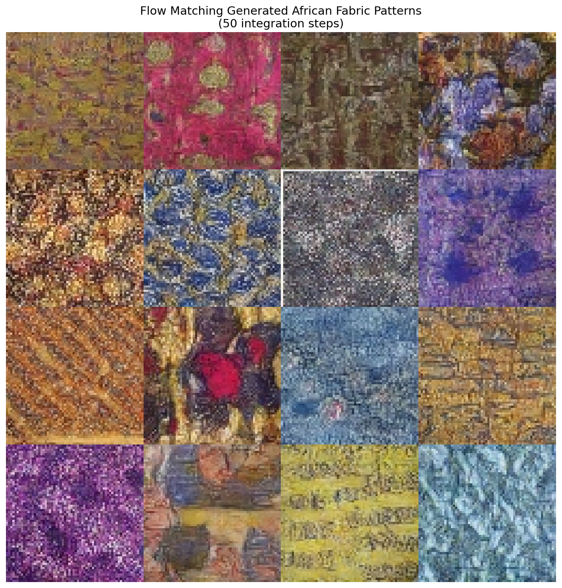
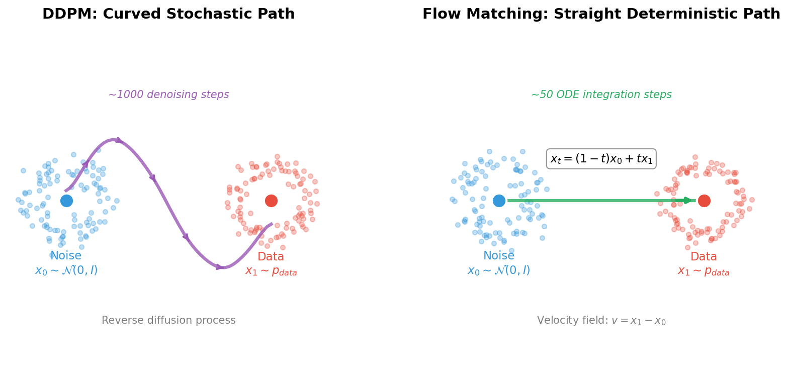
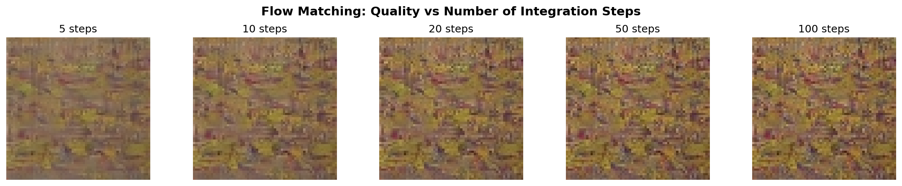
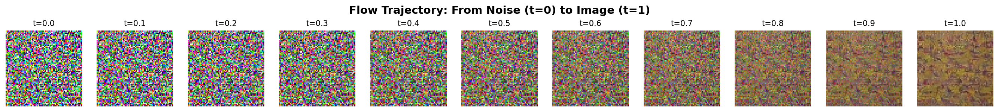
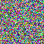
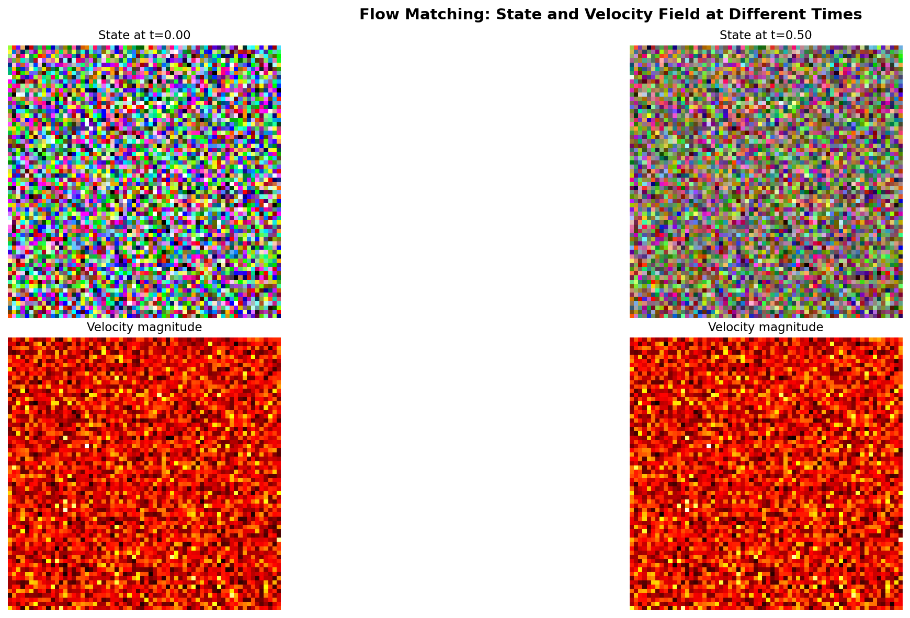

================================================
12.7.1 - Flow Matching: Straight Paths to Generation
================================================

:Duration: 40-50 minutes (core) + 4-8 hours training (Exercise 3)
:Level: Advanced

Overview
========

What if there is a more direct path from noise to images than diffusion's wandering trajectory?

Flow Matching answers this question with an elegant insight: instead of learning to reverse a noisy corruption process like DDPM, we can learn to follow *straight paths* from noise to data [Lipman2023]_. This simple change has profound implications: Flow Matching typically requires only 10-50 integration steps for high-quality generation, compared to 250-1000 steps for diffusion models.

In this exercise, we apply Flow Matching to generate African fabric patterns using the same dataset from Modules 12.1.2 (DCGAN), 12.1.3 (StyleGAN), and 12.3.1 (DDPM). This enables direct comparison of four different generative approaches on identical data.

.. list-table::
   :widths: 50 50

   * - .. figure:: training_samples_grid.png
          :width: 100%
          :alt: Training dataset samples

          **Training Data** (African Fabric Patterns)

     - .. figure:: exercise1_output.png
          :width: 100%
          :alt: Flow Matching generated fabric patterns

          **Generated Output** (50 ODE integration steps)

Learning Objectives
-------------------

By the end of this exercise, you will:

1. **Understand the Flow Matching paradigm**: How learning velocity fields creates more efficient generative models
2. **Implement the Conditional Flow Matching objective**: The simple training loss that makes this approach tractable
3. **Compare with DDPM**: Understand why straight paths require fewer integration steps
4. **Train a Flow Matching model from scratch**: Complete pipeline on the African fabric dataset

Connection to DDPM Basics (12.3.1)
----------------------------------

If you completed Module 12.3.1 (DDPM Basics), you have already learned:

- How diffusion models corrupt images with noise (forward process)
- How neural networks learn to reverse this corruption (reverse process)
- The U-Net architecture for noise prediction
- DDIM for accelerated sampling

Flow Matching builds on these foundations but takes a fundamentally different approach:

.. list-table::
   :header-rows: 1
   :widths: 25 37 38

   * - Aspect
     - DDPM (Module 12.3.1)
     - Flow Matching (This Module)
   * - Training Target
     - Predict noise :math:`\epsilon`
     - Predict velocity :math:`v`
   * - Path Type
     - Curved, stochastic (SDE)
     - Straight, deterministic (ODE)
   * - Sampling Steps
     - 50-1000 steps typical
     - 10-50 steps typical
   * - Forward Process
     - Noise schedule :math:`\beta_t`
     - Linear interpolation
   * - Math Framework
     - Score matching
     - Optimal transport

Quick Start
===========

Before diving into theory, let us see what Flow Matching can generate.

.. note::

   **Model Available**

   The trained model is available at ``models/flow_matching_fabrics.pt``.

   - Training time: ~1.7 hours on RTX 5070Ti GPU
   - Final loss: 0.1979
   - Model size: 19 MB

   If you want to train your own model, see Exercise 3.

Once you have a trained model, generate fabric patterns:

.. code-block:: python

   import torch
   from flow_model import SimpleFlowUNet

   # Load model
   model = SimpleFlowUNet(in_channels=3, base_channels=64)
   checkpoint = torch.load('models/flow_matching_fabrics.pt', map_location='cpu')
   model.load_state_dict(checkpoint['model_state_dict'])
   model.eval()

   # Generate from noise via ODE integration
   x = torch.randn(4, 3, 64, 64)  # Start from noise
   dt = 1.0 / 50                   # 50 integration steps

   with torch.no_grad():
       for i in range(50):
           t = torch.full((4,), i / 50)
           v = model(x, t)          # Get velocity
           x = x + dt * v           # Euler step

   # x now contains generated fabric patterns!

   16 African fabric patterns generated by Flow Matching in just 50 ODE integration steps. Compare with DDPM output from Module 12.3.1 which requires 250+ steps.

Core Concepts
=============

Concept 1: From Diffusion to Flow
---------------------------------

In DDPM, we learned that generative modeling can be framed as reversing a corruption process. We add noise gradually over 1000 steps, then train a network to predict that noise and subtract it.

But consider this: the noise-adding process follows a *curved, stochastic* trajectory through high-dimensional space. Reversing this requires careful step-by-step denoising.

**Flow Matching asks a different question**: What if we could take the *direct route*?

   **Left**: DDPM follows a curved, stochastic trajectory requiring ~1000 denoising steps. **Right**: Flow Matching follows a straight, deterministic path requiring only ~50 ODE integration steps. The linear interpolation formula :math:`x_t = (1-t)x_0 + tx_1` defines the optimal transport path.

The key insight is elegant:

- Define a **straight line** from noise :math:`x_0 \sim \mathcal{N}(0, I)` to data :math:`x_1`
- Train a network to predict the **velocity** along this line
- At inference, follow the velocity field from noise to data

This approach was introduced independently by several groups in 2022-2023 [Lipman2023]_ [Liu2023]_ and has become the foundation for state-of-the-art systems like FLUX.1 [Esser2024]_.

.. admonition:: Did You Know?

   Flow Matching is closely related to *optimal transport theory*, a mathematical framework dating back to Gaspard Monge in 1781 [Villani2009]_. Straight paths correspond to the optimal way to transport mass between distributions!

Concept 2: The Flow Matching Objective
--------------------------------------

The training objective for Flow Matching is remarkably simple. Given a data sample :math:`x_1`:

**Step 1: Sample Noise**

.. math::

   x_0 \sim \mathcal{N}(0, I)

**Step 2: Sample Time**

.. math::

   t \sim \text{Uniform}(0, 1)

**Step 3: Compute Interpolation (Straight Path)**

.. math::

   x_t = (1 - t) \cdot x_0 + t \cdot x_1

This defines a straight line from noise (:math:`t=0`) to data (:math:`t=1`).

**Step 4: Compute Target Velocity**

The velocity along a straight line from :math:`x_0` to :math:`x_1` is simply:

.. math::

   v_{\text{target}} = x_1 - x_0

This is the direction from noise to data!

**Step 5: Train Network to Predict Velocity**

.. math::

   \mathcal{L} = \mathbb{E}_{x_0, x_1, t} \left[ \| v_\theta(x_t, t) - v_{\text{target}} \|^2 \right]

**The complete training loop:**

.. code-block:: python

   def flow_matching_loss(model, x_1):
       batch_size = x_1.shape[0]

       # Sample noise
       x_0 = torch.randn_like(x_1)

       # Sample time
       t = torch.rand(batch_size, 1, 1, 1)

       # Linear interpolation
       x_t = (1 - t) * x_0 + t * x_1

       # Target velocity
       v_target = x_1 - x_0

       # Predict velocity
       v_pred = model(x_t, t.squeeze())

       # MSE loss
       loss = F.mse_loss(v_pred, v_target)
       return loss

Compare this to DDPM's training: no noise schedules :math:`\beta_t`, no cumulative products :math:`\bar{\alpha}_t`, no posterior variance calculations. Just straight lines and MSE loss!

Concept 3: ODE Integration for Sampling
---------------------------------------

Once trained, generating samples involves integrating the learned velocity field from :math:`t=0` to :math:`t=1`. This is an *ordinary differential equation* (ODE):

.. math::

   \frac{dx}{dt} = v_\theta(x, t)

We can solve this using the **Euler method**:

.. math::

   x_{t+\Delta t} = x_t + \Delta t \cdot v_\theta(x_t, t)

Starting from :math:`x_0 \sim \mathcal{N}(0, I)` and taking 50 steps:

.. code-block:: python

   @torch.no_grad()
   def sample_flow(model, num_samples, num_steps=50):
       # Start from noise
       x = torch.randn(num_samples, 3, 64, 64)
       dt = 1.0 / num_steps

       # Integrate ODE
       for i in range(num_steps):
           t = i / num_steps
           v = model(x, t)
           x = x + dt * v

       return x

**Why do straight paths need fewer steps?**

- DDPM's curved trajectory requires careful following of a winding path
- Flow Matching's straight trajectory is easier to integrate accurately
- With 50 Euler steps, we can accurately traverse a straight line
- The same 50 steps would poorly approximate DDPM's complex curve

This is why Flow Matching achieves similar quality with 5-10x fewer steps!

Concept 4: Comparison with DDPM
-------------------------------

Let us directly compare the two approaches on our African fabric dataset:

**Training Comparison**

.. list-table::
   :header-rows: 1

   * - Aspect
     - DDPM
     - Flow Matching
   * - Loss function
     - :math:`\|ε - ε_θ(x_t, t)\|^2`
     - :math:`\|v - v_θ(x_t, t)\|^2`
   * - Target computation
     - Sample noise :math:`ε`, add to image
     - Compute direction :math:`x_1 - x_0`
   * - Time sampling
     - Discrete steps 1...1000
     - Continuous [0, 1]
   * - Noise schedule
     - Required (linear, cosine)
     - Not needed

**Sampling Comparison**

.. list-table::
   :header-rows: 1

   * - Steps
     - DDPM Quality
     - Flow Matching Quality
   * - 10
     - Very poor
     - Usable
   * - 20
     - Poor
     - Good
   * - 50
     - Acceptable
     - Excellent
   * - 250
     - Good (DDIM)
     - Excellent (unnecessary)

**When to Use Each**

- **Use Flow Matching when**: Speed is important, you need fast iteration, deploying to resource-constrained environments
- **Use DDPM when**: You have existing diffusion infrastructure, need classifier-free guidance (though FM supports this too)

Both approaches can use the *same U-Net architecture*, differing only in training objective and sampling procedure.

Hands-On Exercises
==================

Exercise 1: Generate Fabric Patterns (Execute)
----------------------------------------------

:download:`Download exercise1_generate.py <exercise1_generate.py>`

**Goal**: Run the pre-trained Flow Matching model to generate African fabric patterns.

**Prerequisites**: Trained model at ``models/flow_matching_fabrics.pt``

.. code-block:: bash

   python exercise1_generate.py

**What to observe:**

1. Generation uses only 50 steps (compare to DDPM's 250)
2. Output shows 16 unique fabric patterns
3. Compare quality and diversity with your DDPM outputs from Module 12.3.1

   16 unique African fabric patterns generated by Flow Matching with 50 ODE integration steps.

.. dropdown:: Reflection Questions
   :class-title: sd-font-weight-bold

   1. How does the generation speed compare to DDPM (Exercise 1 in Module 12.3.1)?

      - DDPM: ~250 steps needed
      - Flow Matching: ~50 steps needed
      - What is the speedup factor?

   2. Compare the visual quality:

      - Pattern coherence
      - Color saturation
      - Detail sharpness

   3. Why might straight paths lead to faster generation?

Exercise 2: Explore Flow Parameters (Modify)
--------------------------------------------

:download:`Download exercise2_explore.py <exercise2_explore.py>`

**Goal**: Understand how different parameters affect Flow Matching generation.

.. code-block:: bash

   python exercise2_explore.py

This script runs three explorations:

**Part A: Sampling Steps Comparison**

Generates the same pattern with 5, 10, 20, 50, and 100 steps.

   Quality comparison at 5, 10, 20, 50, and 100 integration steps. Flow Matching achieves usable results with as few as 10 steps, and excellent results at 20-50 steps.

.. dropdown:: What to Expect
   :class-title: sd-font-weight-bold

   - 5 steps: May show artifacts but recognizable patterns
   - 10 steps: Good quality for many applications
   - 20-50 steps: Excellent quality
   - 100 steps: Diminishing returns

**Part B: Flow Trajectory Visualization**

Shows the step-by-step transformation from noise to image.

   Straight-line transformation from pure noise (t=0) to fabric pattern (t=1). The transformation is gradual and smooth, following the learned velocity field.

   Animated version showing the continuous transformation from noise to fabric pattern.

**Part C: Velocity Field Visualization**

Visualizes the learned velocity field at different times.

   Velocity field magnitude at t=0.0, 0.25, 0.5, and 0.75. Early in the flow (t near 0), velocities are large as the flow pushes noise toward data. Later (t near 1), velocities decrease as we approach the target distribution.

.. dropdown:: Suggested Modifications
   :class-title: sd-font-weight-bold

   Try these experiments:

   1. **Different seeds**: Change ``RANDOM_SEED`` to see other patterns

   2. **Very low steps**: Try ``step_counts = [1, 2, 3, 5]`` to find the minimum

   3. **Compare integration methods**: Implement midpoint method instead of Euler

Exercise 3: Train Your Own Flow Matching Model (Create)
-------------------------------------------------------

:download:`Download exercise3_train.py <exercise3_train.py>`

**Goal**: Train a Flow Matching model from scratch on the African fabric dataset.

**Time required**: 4-8 hours on RTX 5070Ti GPU

**Step 1: Verify Dataset**

The training uses the preprocessed African fabric dataset from Module 12.1.2:

.. code-block:: bash

   python exercise3_train.py --verify

Expected output: "Found 1059 images"

**Step 2: Start Training**

.. code-block:: bash

   python exercise3_train.py --train

**Training Configuration**:

.. list-table::
   :widths: 30 70

   * - Image Size
     - 64x64 (consistent with DCGAN/StyleGAN/DDPM)
   * - Batch Size
     - 32
   * - Learning Rate
     - 1e-4 (AdamW optimizer)
   * - Training Steps
     - 100,000
   * - Model Parameters
     - 4,662,851 (SimpleFlowUNet)

**What to Monitor**:

- Loss should decrease steadily (no oscillation like GANs)
- Sample images saved every 1000 steps in ``training_results/``
- Training is stable; simpler than DDPM or GAN training

**Step 3: Generate from Your Model**

After training completes:

.. code-block:: bash

   python exercise1_generate.py

Your model weights are saved at ``models/flow_matching_fabrics.pt``.

Training Results: Observing Flow Matching Learning
~~~~~~~~~~~~~~~~~~~~~~~~~~~~~~~~~~~~~~~~~~~~~~~~~~

.. dropdown:: Actual Training Results (Completed)
   :class-title: sd-font-weight-bold
   :open:

   **Training completed successfully!**

   .. list-table::
      :widths: 40 60

      * - Total Steps
        - 100,000
      * - Training Time
        - 1.68 hours (RTX 5070Ti)
      * - Final Loss
        - 0.1979 (started at ~0.29)
      * - Model Size
        - 19 MB
      * - Parameters
        - 4,662,851
      * - Checkpoints Saved
        - 20 (every 5,000 steps)
      * - Sample Images
        - 100 (every 1,000 steps)

.. dropdown:: Training Loss Progression
   :class-title: sd-font-weight-bold
   :open:

   .. figure:: training_results/loss_curve.png
      :width: 600px
      :align: center
      :alt: Flow Matching training loss over 100,000 steps

      Training loss decreased steadily from 0.29 to 0.20 over 100,000 steps (1.68 hours on RTX 5070Ti). Unlike GANs, Flow Matching training is stable without mode collapse or oscillation.

.. dropdown:: Visual Progression During Training
   :class-title: sd-font-weight-bold

   Watch how the model learns to generate fabric patterns over training:

   **Step 1,000** - Early training (mostly noise with hints of structure)

   .. figure:: training_results/sample-1.png
      :width: 400px
      :align: center

   **Step 10,000** - Structure emerging (color patterns visible)

   .. figure:: training_results/sample-10.png
      :width: 400px
      :align: center

   **Step 50,000** - Clear fabric patterns (recognizable designs)

   .. figure:: training_results/sample-50.png
      :width: 400px
      :align: center

   **Step 99,000** - Final quality (sharp, detailed patterns)

   .. figure:: training_results/sample-99.png
      :width: 400px
      :align: center

.. dropdown:: Troubleshooting Common Issues
   :class-title: sd-font-weight-bold

   **Issue 1: "Model file not found" error**

   **Cause**: The ``models/flow_matching_fabrics.pt`` file doesn't exist.

   **Solution**:

   1. Complete Exercise 3 training first (~1.7 hours on RTX 5070Ti GPU)
   2. The trained model should be at ``models/flow_matching_fabrics.pt``

   ---

   **Issue 2: "Dataset not found" error**

   **Cause**: African fabric dataset not at expected location.

   **Solution**:

   1. Complete Module 12.1.2 (DCGAN Art) to create the dataset
   2. Verify path in ``exercise3_train.py`` matches your setup
   3. Expected location: ``content/Module_12_.../12.1.2_dcgan_art/african_fabric_dataset/``

   ---

   **Issue 3: Training is very slow**

   **Cause**: Running on CPU instead of GPU.

   **Solution**:

   * Verify GPU availability:

     .. code-block:: python

        import torch
        print(torch.cuda.is_available())  # Should print True

   * Install CUDA-enabled PyTorch if False

   ---

   **Issue 4: Out of memory error**

   **Cause**: Batch size too large for GPU memory.

   **Solution**:

   * Edit ``exercise3_train.py`` and reduce ``BATCH_SIZE`` from 32 to 16
   * Training quality is not significantly affected

   ---

   **Issue 5: Generated images look noisy**

   **Cause**: Training not complete or model not loaded correctly.

   **Solution**:

   1. Verify training ran for at least 50,000 steps
   2. Check that the correct checkpoint is loaded
   3. Try increasing ``num_steps`` in sampling from 50 to 100

Showcase Animation
==================

A 15-second morphing animation demonstrates the model's capability to generate
diverse fabric patterns through smooth latent space interpolation.

.. figure:: flow_morph.gif
   :width: 300px
   :align: center
   :alt: Flow Matching fabric pattern morphing animation

   Smooth morphing between 5 keyframe patterns using SLERP interpolation in noise
   space. Each frame requires only 50 ODE integration steps, demonstrating Flow
   Matching's efficiency advantage over DDPM (which requires 250+ steps).

To generate the animation:

.. code-block:: bash

   python generate_flow_morph.py

**Animation Parameters**:

.. list-table::
   :widths: 30 70

   * - Duration
     - 15 seconds (seamless loop)
   * - Resolution
     - 256x256 (upscaled from 64x64)
   * - Keyframes
     - 5 distinct patterns
   * - Total Frames
     - 450 (30 FPS)
   * - Sampling Steps
     - 50 per frame (vs DDPM's 250)
   * - Interpolation
     - Spherical Linear (SLERP)

**Comparison with DDPM Animation (Module 12.3.1)**:

The Flow Matching morph animation uses the same SLERP technique as the DDPM
version, but with a key difference: each frame requires only 50 ODE integration
steps instead of 250 DDIM steps. This represents a 5x speedup in generation,
while producing comparable visual quality.

Summary
=======

**Key Takeaways**

1. **Flow Matching learns velocity fields**: Instead of predicting noise like DDPM, we predict the direction from noise to data
2. **Straight paths are efficient**: Linear interpolation enables generation with 10-50 steps instead of 250-1000
3. **Training is simple**: Just MSE loss between predicted and target velocity
4. **Same architecture works**: The U-Net from DDPM can be used for Flow Matching

**Common Pitfalls**

.. warning::

   1. **Using too few steps**: While Flow Matching needs fewer steps than DDPM, using fewer than 10 may produce artifacts
   2. **Forgetting to clamp outputs**: Generated values should be clamped to [-1, 1]
   3. **Incorrect time range**: Time should go from 0 (noise) to 1 (data), not 0 to 1000 like DDPM

**Next Steps**

Flow Matching is the foundation for modern generative systems:

- **FLUX.1**: Black Forest Labs' state-of-the-art text-to-image model [Esser2024]_
- **Stable Diffusion 3**: Incorporates flow matching ideas
- **Rectified Flow** [Liu2023]_: Further straightening for near-single-step generation

References
==========

.. [Lipman2023] Lipman, Y., Chen, R. T. Q., Ben-Hamu, H., Nickel, M., & Le, M. (2023). Flow Matching for Generative Modeling. *International Conference on Learning Representations (ICLR 2023)*. https://arxiv.org/abs/2210.02747

.. [Liu2023] Liu, X., Gong, C., & Liu, Q. (2023). Flow Straight and Fast: Learning to Generate and Transfer Data with Rectified Flow. *International Conference on Learning Representations (ICLR 2023)*. https://arxiv.org/abs/2209.03003

.. [Tong2023] Tong, A., Malkin, N., Huguet, G., Zhang, Y., Rector-Brooks, J., Fatras, K., & Bengio, Y. (2023). Improving and Generalizing Flow-Based Generative Models with Minibatch Optimal Transport. *arXiv preprint*. https://arxiv.org/abs/2302.00482

.. [Ho2020] Ho, J., Jain, A., & Abbeel, P. (2020). Denoising Diffusion Probabilistic Models. *Advances in Neural Information Processing Systems*, 33, 6840-6851. https://arxiv.org/abs/2006.11239

.. [Esser2024] Esser, P., et al. (2024). Scaling Rectified Flow Transformers for High-Resolution Image Synthesis. *arXiv preprint*. https://arxiv.org/abs/2403.03206

.. [Villani2009] Villani, C. (2009). *Optimal Transport: Old and New*. Springer. ISBN: 978-3-540-71049-3

.. [CambridgeMLG2024] Cambridge MLG. (2024). An Introduction to Flow Matching. *Cambridge Machine Learning Group Blog*. https://mlg.eng.cam.ac.uk/blog/2024/01/20/flow-matching.html

.. [MetaFM2024] Meta AI. (2024). *Flow Matching Library*. GitHub repository. https://github.com/facebookresearch/flow_matching (Apache-2.0 License)

.. [torchcfm2023] Tong, A. (2023). *torchcfm: Conditional Flow Matching Library*. GitHub repository. https://github.com/atong01/conditional-flow-matching

.. [Ronneberger2015] Ronneberger, O., Fischer, P., & Brox, T. (2015). U-Net: Convolutional Networks for Biomedical Image Segmentation. *Medical Image Computing and Computer-Assisted Intervention (MICCAI)*, 234-241.
